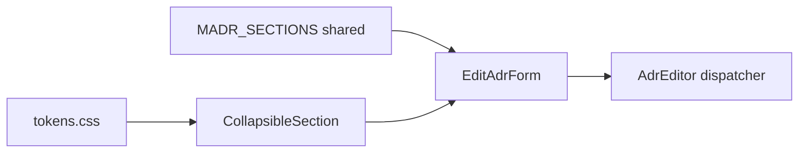
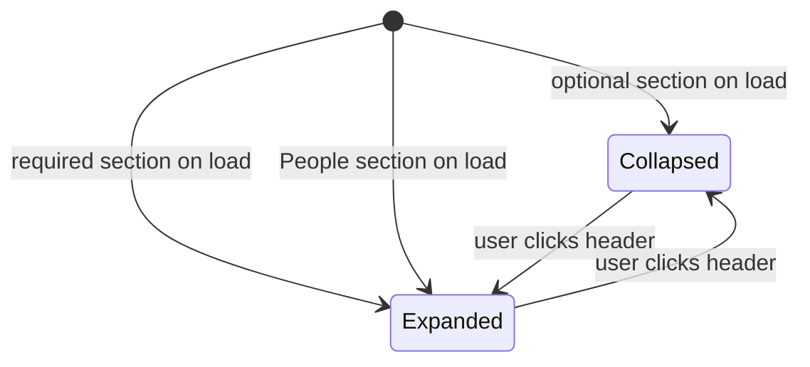

# Design Document — adr-form-collapsible-sections

## Overview

This feature shortens the ADR edit form by replacing the flat list of always-visible fields with collapsible accordion sections. Required MADR sections (Context and Problem Statement, Decision Outcome) default to expanded; all optional sections and the Additional Content field default to collapsed. A teal left-border accent and asterisk in the section title distinguish required sections without badge labels. Tags is moved to the always-visible top metadata block. Decision Makers, Consulted, and Informed are grouped into a collapsible People section.

**Users**: ADR authors using the web UI to create and edit Architecture Decision Records.

**Impact**: Reduces form height from ~1600 px (new ADR) to ~400 px by hiding optional sections. No change to save/load behaviour, API contracts, or data models.

### Goals

- Collapse optional MADR sections and the People group by default, expanding only required sections.
- Communicate required status via teal left border + asterisk (no badge labels).
- Show a one-line content preview in collapsed section headers so authors can scan form state at a glance.
- Move Tags to the top metadata block; restrict People group to Decision Makers, Consulted, Informed.
- Preserve all existing `data-testid` attributes on textarea elements so unchanged E2E selectors continue to function.

### Non-Goals

- `CreateAdrForm` is not touched (it has no MADR section textareas).
- No changes to the API, data model, `MADR_SECTIONS` metadata, or save/load logic.
- Persist collapse state between browser sessions (local storage or URL param).
- Cross-browser accordion polyfills or animations beyond a CSS `transform` on the chevron.

---

## Boundary Commitments

### This Spec Owns

- The `EditAdrForm` component layout: field ordering, grouping, collapsible wrappers.
- The new `CollapsibleSection` presentational component (props contract + rendering).
- CSS rules for `.collapsible-section` (teal border, chevron rotation, hidden body).
- Open/closed state management inside `EditAdrForm` (a `Set<string>` of open section keys).
- Updates to `apps/e2e/tests/adr-lifecycle.spec.ts` where existing assertions break due to layout changes.

### Out of Boundary

- `CreateAdrForm` — no change.
- `MADR_SECTIONS` array in `@adr/shared` — read only; this spec does not modify it.
- API server, `apiClient`, save/load behaviour — unchanged.
- Other E2E specs (`design-system.spec.ts`, `search.spec.ts`, etc.) — verified to not assert on form section layout.

### Allowed Dependencies

- `@adr/shared` (MADR_SECTIONS, AdrSections, MadrSectionMeta) — read-only upstream.
- Existing CSS tokens in `apps/web/src/styles/tokens.css` — consumed, not modified.
- Existing CSS classes (`.field`, `.field__label`, `.field__input`, `.card__body`) — referenced, not renamed.

### Revalidation Triggers

- If `MADR_SECTIONS` adds a new required key, the `EditAdrForm` initial open-state set must be updated.
- If global CSS token names change, `.collapsible-section` styles must be updated.
- If new E2E tests are added that assert label format `"(required)"` / `"(optional)"`, they will need to follow the updated assertion pattern (section header asterisk).

---

## Architecture

### Existing Architecture Analysis

`AdrEditor.tsx` is a self-contained module with three co-located components:
- `AdrEditor` — dispatcher (create vs. edit mode)
- `CreateAdrForm` — new ADR form; no MADR section textareas; **not modified**.
- `EditAdrForm` — full edit form; owns all form state (title, sections, relations, etc.) via `useState`.

The eight MADR textareas are rendered via `MADR_SECTIONS.map()`. The `required` flag is already present on each `MadrSectionMeta` entry. No collapse/expand mechanism exists today.

### Architecture Pattern

Stateless child / stateful parent. `EditAdrForm` owns all collapse state via a `Set<string>`. `CollapsibleSection` is a pure presentational component that receives `isOpen` and `onToggle` — no internal state.



Dependency direction: shared types → CSS tokens → `CollapsibleSection` → `EditAdrForm` → `AdrEditor`. No upward imports.

### Technology Stack

| Layer | Choice | Role in Feature |
|-------|--------|-----------------|
| UI component | React 18 (existing) | `CollapsibleSection` + `EditAdrForm` state |
| State | `useState<ReadonlySet<string>>` | Tracks which sections are open |
| Styling | Plain CSS (existing soft-ui conventions) | `.collapsible-section` accordion styles |

---

## File Structure Plan

### Modified Files

```
apps/web/src/features/adr-editor/
├── AdrEditor.tsx                  ← Main changes: open-state, Tags relocation,
│                                    People group, CollapsibleSection wiring
└── CollapsibleSection.tsx         ← NEW: presentational accordion component

apps/web/src/styles/
└── soft-ui.css                    ← Add .collapsible-section styles

apps/e2e/tests/
└── adr-lifecycle.spec.ts          ← Update: label assertions, expand-before-fill
```

No new directories. No changes to `@adr/shared`, `apps/api`, or other E2E specs.

---

## System Flows

Collapse/expand state machine for a single section:



---

## Requirements Traceability

| Requirement | Summary | Components | Notes |
|-------------|---------|------------|-------|
| 1.1 | Required sections expanded on load | `EditAdrForm` open-state init | Initial Set contains required section keys |
| 1.2 | Optional sections collapsed on load | `EditAdrForm` open-state init | Keys absent from initial Set = collapsed |
| 1.3 | People section expanded on load | `EditAdrForm` open-state init | `"people"` key in initial Set |
| 1.4 | Defaults independent of content | `EditAdrForm` open-state init | Set initialised statically, not from ADR data |
| 2.1 | Click collapsed header → expand | `CollapsibleSection.onToggle` | Adds key to open Set |
| 2.2 | Click expanded header → collapse | `CollapsibleSection.onToggle` | Removes key from open Set |
| 2.3 | Chevron in every header | `CollapsibleSection` | SVG icon always rendered |
| 2.4 | Chevron rotates to open state | `CollapsibleSection` + CSS | CSS `.collapsible-section__chevron--open` |
| 2.5 | Chevron rotates to closed state | `CollapsibleSection` + CSS | Class removed on collapse |
| 3.1 | Teal left border on required sections | `CollapsibleSection` + CSS | `required` prop → `.collapsible-section--required` |
| 3.2 | Asterisk in required section title | `CollapsibleSection` | Rendered as `{title} *` when `required=true` |
| 3.3 | No badge labels | `CollapsibleSection` | No badge/pill elements in component |
| 3.4 | No teal border on optional sections | `CollapsibleSection` | Class not applied when `required=false` |
| 4.1 | Preview of content when collapsed | `CollapsibleSection` | `preview` prop rendered in header |
| 4.2 | "— empty" when collapsed and empty | `CollapsibleSection` | Fallback when `preview` is empty string |
| 4.3 | Preview hidden when expanded | `CollapsibleSection` | `preview` span not rendered when `isOpen` |
| 5.1 | Tags in top metadata block | `EditAdrForm` | Tags field moved above section list |
| 5.2 | Tags not in People section | `EditAdrForm` | Tags rendered as standalone field |
| 5.3 | Tags populated from loaded ADR | `EditAdrForm` | Existing `applyLoadedAdr` already sets `tags` state |
| 6.1 | People group with DM / Consulted / Informed | `EditAdrForm` | Three fields inside People `CollapsibleSection` |
| 6.2 | People group excludes Tags | `EditAdrForm` | Tags moved to top block |
| 6.3 | People header preview when non-empty | `EditAdrForm` | Preview string derived from non-empty field values |
| 6.4 | People header "— empty" when all empty | `EditAdrForm` | Derived preview is empty string → CollapsibleSection shows "— empty" |

---

## Components and Interfaces

### UI Layer

#### CollapsibleSection

| Field | Detail |
|-------|--------|
| Intent | Stateless accordion wrapper: renders a clickable header and hideable body slot |
| Requirements | 2.1–2.5, 3.1–3.4, 4.1–4.3 |

**Contracts**: State [ ✓ ] (open/closed driven by props) — all other contract types N/A.

**Props Interface**

```typescript
interface CollapsibleSectionProps {
  /**
   * Stable key used to generate data-testid="section-toggle-{sectionKey}".
   * For MADR sections: the camelCase section key (e.g. "decisionDrivers").
   * For special groups: "additionalContent" | "people".
   */
  sectionKey: string;
  /** Visible title text in the header (asterisk appended internally when required). */
  title: string;
  /** When true, applies teal left-border accent and appends asterisk to title. */
  required?: boolean;
  /** Whether the body is currently visible. */
  isOpen: boolean;
  /** Called when the user clicks the header row. */
  onToggle: () => void;
  /**
   * First non-empty line of the section's current value, pre-derived by the parent.
   * Empty string → "— empty" is shown. Only rendered when isOpen=false.
   */
  preview: string;
  /** The textarea (and optional label) for this section. */
  children: React.ReactNode;
}
```

**Rendered structure** (informational — not prescriptive HTML):

```
<div class="collapsible-section [collapsible-section--required?]">
  <button
    class="collapsible-section__header"
    data-testid="section-toggle-{sectionKey}"
    aria-expanded="{isOpen}"
    onClick={onToggle}
  >
    <span class="collapsible-section__title">{title}{required ? " *" : ""}</span>
    <span class="collapsible-section__preview">{preview || "— empty"}</span>  ← hidden when isOpen
    <svg class="collapsible-section__chevron [--open?]" />
  </button>
  <div class="collapsible-section__body" hidden={!isOpen}>
    {children}
  </div>
</div>
```

**Implementation Notes**
- Use the HTML `hidden` attribute (or `display: none` CSS) on `collapsible-section__body` — the textarea remains in the DOM so `toHaveValue()` Playwright assertions continue to work on collapsed sections.
- The section header is a `<button>` element for native keyboard accessibility (`Enter`/`Space` to toggle).
- Textareas inside the body use `aria-labelledby` referencing the section header title `id` (set as `section-title-{sectionKey}`) to maintain accessibility labelling without a duplicate `<label htmlFor>`.

---

#### EditAdrForm (modified)

| Field | Detail |
|-------|--------|
| Intent | Owns all ADR edit state and orchestrates the form layout including open-section state |
| Requirements | 1.1–1.4, 5.1–5.3, 6.1–6.4 |

**Open-section state model**

```typescript
// Keys present in the set are expanded; absent keys are collapsed.
const [openSections, setOpenSections] = useState<ReadonlySet<string>>(
  new Set(
    MADR_SECTIONS
      .filter((m) => m.required)
      .map((m) => m.key)
      .concat(["people"])
  )
);

function toggleSection(key: string): void {
  setOpenSections((prev) => {
    const next = new Set(prev);
    if (next.has(key)) next.delete(key); else next.add(key);
    return next;
  });
}
```

**Preview derivation** (pure utility, co-located in `AdrEditor.tsx`)

```typescript
/** Returns the first non-blank line of value, truncated to 80 characters. */
function firstLine(value: string): string {
  const line = value.split("\n").find((l) => l.trim().length > 0) ?? "";
  return line.length > 80 ? `${line.slice(0, 77)}…` : line;
}
```

**Field ordering in JSX** (top to bottom):

1. Card header (id chip, sha chip)
2. Title input
3. Status select
4. Date input
5. **Tags input** ← moved here (Req 5.1)
6. *Section accordion list:*
   - `CollapsibleSection` per `MADR_SECTIONS` entry (preview = `firstLine(sections[meta.key])`)
   - `CollapsibleSection sectionKey="additionalContent"` (optional, not required)
7. *People `CollapsibleSection` sectionKey="people"* containing: Decision Makers, Consulted, Informed (Req 6.1)
8. Relations editor (unchanged)
9. Card footer: Save button, status messages

**People section preview derivation**

```typescript
const peoplePreview = [decisionMakers, consulted, informed]
  .filter((v) => v.trim().length > 0)
  .map((v) => v.trim())
  .join(" · ");
```

---

### CSS — `.collapsible-section` styles (soft-ui.css addition)

New rules to add:

```
.collapsible-section                    — outer wrapper, margin-bottom to replace .field margin
.collapsible-section--required          — teal left border (3px solid var(--color-primary))
.collapsible-section__header            — button reset + flex row, full width, cursor pointer
.collapsible-section__title             — font-weight 600, colour matching field__label
.collapsible-section__preview           — truncated single-line, muted colour
.collapsible-section__chevron           — SVG icon 16×16, colour muted
.collapsible-section__chevron--open     — transform: rotate(180deg), transition
.collapsible-section__body              — padding when visible; hidden attribute handled natively
.collapsible-section__body .field       — remove top margin for first child inside body
```

---

## E2E Test Updates (adr-lifecycle.spec.ts)

The following assertions in `adr-lifecycle.spec.ts` break with the new layout and must be updated as part of this spec.

| Current assertion | Reason breaks | Replacement |
|---|---|---|
| `label[for="adr-editor-{testId}"]` contains `"required"` | Label element replaced by section header title | Check `getByTestId("section-toggle-{key}")` contains `"*"` |
| `label[for="adr-editor-{testId}"]` contains `"optional"` | Same | Check `getByTestId("section-toggle-{key}")` does NOT contain `"*"` |
| `getByTestId("decision-drivers-textarea").fill(...)` | Section collapsed → textarea not interactable | First `getByTestId("section-toggle-decisionDrivers").click()`, then fill |

`toHaveValue("")` assertions on collapsed section textareas continue to work unchanged (textarea remains in DOM; `hidden` attribute does not affect DOM `value` property reads by Playwright).

---

## Testing Strategy

### Unit / Component Tests (vitest + jsdom — `apps/web/src`)

- `CollapsibleSection` renders `isOpen=true`: body visible, chevron open class present, preview hidden.
- `CollapsibleSection` renders `isOpen=false` with non-empty `preview`: body hidden, preview text visible.
- `CollapsibleSection` renders `isOpen=false` with empty `preview`: shows "— empty".
- `CollapsibleSection` with `required=true`: title contains asterisk, `--required` class present on wrapper.
- `onToggle` called when header is clicked.
- `firstLine` utility: handles multi-line, empty, and >80-char inputs.
- `EditAdrForm` initial open-state: required sections open, optional sections closed, people section open.

### E2E Tests (`apps/e2e/tests/adr-lifecycle.spec.ts`)

- Required sections (Context and Problem Statement, Decision Outcome) are expanded on load; their headers contain `"*"`.
- Optional sections (Decision Drivers, etc.) are collapsed on load; their headers do NOT contain `"*"`.
- A collapsed optional section can be expanded by clicking its header, after which its textarea is fillable.
- Tags field is visible in the top metadata block without expanding any section.
- People section is expanded on load; contains Decision Makers, Consulted, Informed; does not contain Tags input.
- Full save/conflict/recover journey continues to pass (updating expand-before-fill steps as needed).
