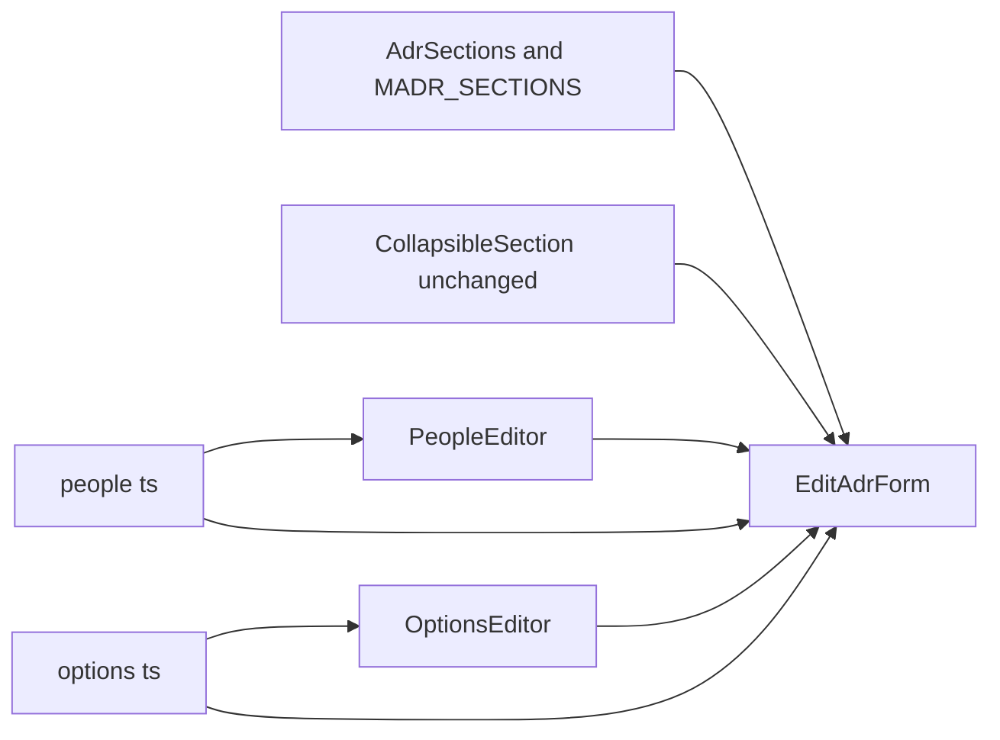
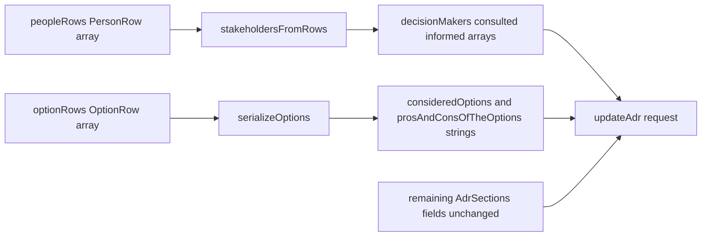

# Design Document — adr-form-structured-input

## Overview

This feature restructures `EditAdrForm`'s information architecture: Consequences and Confirmation move inside Decision Outcome's collapsible body; Decision Makers/Consulted/Informed become a single always-visible list of name+role rows positioned next to the record metadata; Considered Options and Pros and Cons of the Options merge into one structured list of description/pros/cons rows; and the remaining sections are visually regrouped into narrative clusters. All changes are confined to `apps/web/src/features/adr-editor/`; no API, data model, or markdown file format changes.

**Users**: ADR authors using the web UI to edit Architecture Decision Records.

**Impact**: `EditAdrForm` gains two new presentational components (`PeopleEditor`, `OptionsEditor`) and two new pure logic modules (`people.ts`, `options.ts`); loses the three CSV People inputs and the two standalone Considered Options / Pros and Cons textareas as top-level collapsibles. `CreateAdrForm`, `packages/core`, `packages/shared`, and the API are unchanged.

### Goals
- Nest Consequences/Confirmation inside Decision Outcome's existing collapsible body.
- Replace the three People CSV inputs with an always-visible list of name+role rows, positioned next to Title/Status/Date/Tags.
- Merge Considered Options and Pros and Cons of the Options into one structured list of description/pros/cons rows.
- Reorder the remaining section groups into narrative clusters without changing the saved markdown's canonical order.
- Preserve `data-testid` attributes on every textarea unaffected by this feature.

### Non-Goals
- `CreateAdrForm` — unchanged, retains its three CSV People inputs (explicit project-description boundary).
- API, data model, storage, and markdown file format — unchanged; `joinSections`/`splitSections`/`MADR_SECTIONS` are not modified.
- A fourth "title" field separate from `description` on option rows — the approved row shape has exactly 3 fields (see `research.md` Design Decision "Structured option markdown grammar").
- Persisting collapse state across sessions, or any change to `CollapsibleSection`'s own contract.

## Boundary Commitments

### This Spec Owns
- `EditAdrForm`'s internal state and JSX layout: nesting, reordering, and the People/Options groups.
- Two new pure modules: `people.ts` (`PersonRow` <-> `decisionMakers`/`consulted`/`informed` arrays) and `options.ts` (`OptionRow[]` <-> `consideredOptions`/`prosAndConsOfTheOptions` strings).
- Two new presentational components: `PeopleEditor`, `OptionsEditor`.
- The structured-option markdown grammar (bullet + heading shape) — defined and owned entirely within `apps/web`.
- Updates to `AdrEditor.test.tsx` and `apps/e2e/tests/adr-lifecycle.spec.ts` for the affected layout/interaction changes.

### Out of Boundary
- `CreateAdrForm` — no change.
- `packages/core` (`sections.ts`, `parse.ts`, `editingService.ts`) — read-only; `consideredOptions`/`prosAndConsOfTheOptions`/`decisionMakers`/`consulted`/`informed` remain opaque strings/arrays to these modules.
- `packages/shared` (`MADR_SECTIONS`, `AdrSections`, `MadrSectionMeta`) — read-only; canonical section order and count are unchanged.
- `CollapsibleSection.tsx` — reused unchanged; no prop or behavior changes.
- API server, `apiClient`, save/load/conflict behavior — unchanged.

### Allowed Dependencies
- `@adr/shared` (`MADR_SECTIONS`, `AdrSections`) — read-only upstream, as today.
- Existing `CollapsibleSection` component and its `soft-ui.css` styles — consumed, not modified.
- Existing CSS tokens (`apps/web/src/styles/tokens.css`) and `.field`/`.field__input`/`.btn` classes — referenced, not renamed.

### Revalidation Triggers
- If `MADR_SECTIONS` changes which keys are `level: 3` or which section they nest under, the Decision Outcome nesting (1.1–1.4) must be revisited.
- If the `Adr`/`AdrSections` shape changes (new/removed stakeholder categories or section keys), `people.ts`/`options.ts` and their row types must be updated.
- If `CollapsibleSection`'s props contract changes, `EditAdrForm`'s usage across all remaining collapsible groups must be re-verified.
- If a future spec adds a 4th stakeholder role or a per-option "title" distinct from `description`, `PersonRow`/`OptionRow` and the markdown grammar must be revised together with requirements.

## Architecture

### Existing Architecture Analysis
`AdrEditor.tsx` co-locates `AdrEditor` (dispatcher), `CreateAdrForm`, and `EditAdrForm`. `EditAdrForm` owns all edit-mode state via `useState` and renders the 8 `MADR_SECTIONS` generically via `.map()`, each wrapped in a `CollapsibleSection`, plus two hand-written `CollapsibleSection` blocks for `additionalContent` and `people`. `CollapsibleSection` (introduced by `adr-form-collapsible-sections`) is a stateless presentational component with no MADR-specific knowledge — reused unchanged here.

### Architecture Pattern
Stateless child / stateful parent, extending the existing pattern: `EditAdrForm` remains the sole state owner; `PeopleEditor` and `OptionsEditor` are pure presentational components (rows + callbacks in, no internal state), mirroring `CollapsibleSection`'s existing contract style. `people.ts` and `options.ts` are pure, side-effect-free mapping modules with no React dependency, mirroring `packages/core/src/adr/sections.ts`'s existing pure-function style.



Dependency direction: shared types -> pure logic modules -> presentational components -> `EditAdrForm`. No upward imports; `people.ts`/`options.ts` import nothing from the components that use them.

### Technology Stack

| Layer | Choice / Version | Role in Feature | Notes |
|-------|------------------|------------------|-------|
| UI component | React 18 (existing) | `PeopleEditor`, `OptionsEditor`, modified `EditAdrForm` | No new component library |
| State | `useState<PersonRow[]>`, `useState<OptionRow[]>` | Row-list state, replacing 3 CSV strings and 2 raw markdown strings | Ids generated client-side for React keys |
| Styling | Plain CSS (existing soft-ui conventions) | Row layout for People/Options editors in `soft-ui.css` | Extends `.field` patterns, no new framework |

## File Structure Plan

### New Files
```
apps/web/src/features/adr-editor/
├── people.ts            # PersonRow, StakeholderRole, rowsFromStakeholders, stakeholdersFromRows
├── people.test.ts        # Unit tests: round trip, blank-name filtering, role grouping
├── PeopleEditor.tsx       # Presentational: renders rows, add/remove, role field
├── PeopleEditor.test.tsx  # Component tests: add/remove/role-change callbacks
├── options.ts             # OptionRow, parseOptions, serializeOptions
├── options.test.ts        # Unit tests: markdown grammar round trip, blank-row filtering, malformed input
├── OptionsEditor.tsx      # Presentational: renders rows, add/remove, description/pros/cons fields
└── OptionsEditor.test.tsx # Component tests: add/remove/field-change callbacks
```

### Modified Files
- `apps/web/src/features/adr-editor/AdrEditor.tsx` — `EditAdrForm` only (`CreateAdrForm`/`AdrEditor` dispatcher untouched): replace `decisionMakers`/`consulted`/`informed` string state with `peopleRows: PersonRow[]`; replace the `consideredOptions`/`prosAndConsOfTheOptions` textareas with `optionRows: OptionRow[]`; exclude `consequences`, `confirmation`, `consideredOptions`, `prosAndConsOfTheOptions` from the generic `MADR_SECTIONS.map()` loop; render Consequences/Confirmation fields inside the Decision Outcome `CollapsibleSection`'s body; remove the `people` `CollapsibleSection` wrapper, `peoplePreview`, and the `"people"` key from `openSections` default; reorder JSX per 4.1–4.4.
- `apps/web/src/features/adr-editor/AdrEditor.test.tsx` — replace assertions on `decision-makers-input`/`consulted-input`/`informed-input`/`considered-options-textarea`/`pros-and-cons-of-the-options-textarea` with row-based assertions; add nesting/reordering assertions.
- `apps/web/src/styles/soft-ui.css` — add `.people-editor__row` / `.options-editor__row` layout rules (reusing `.field`, `.field__input`, `.btn` tokens); no new design tokens.
- `apps/e2e/tests/adr-lifecycle.spec.ts` — remove `consequences-textarea`/`confirmation-textarea`/`considered-options-textarea`/`pros-and-cons-of-the-options-textarea` from `SECTION_TEXTAREAS`/`SECTION_KEY_BY_TEXTAREA`; add row-based fill/assert steps for People and Options; update Decision Outcome section assertions to include nested Consequences/Confirmation.

No changes to `packages/core`, `packages/shared`, `apps/api`, or other E2E specs.

## System Flows

Save-time mapping from row-based UI state back to the existing `AdrSections`/stakeholder-array shape (1.1–1.4, 2.6, 2.7, 3.5, 3.6 all converge here):



Load-time is the mirror: `rowsFromStakeholders(decisionMakers, consulted, informed)` seeds `peopleRows`; `parseOptions(consideredOptions, prosAndConsOfTheOptions)` seeds `optionRows`. Both directions are pure functions with no network or state side effects beyond the `useState` setters that already exist in `applyLoadedAdr`/`handleSave`.

## Requirements Traceability

| Requirement | Summary | Components | Notes |
|-------------|---------|------------|-------|
| 1.1 | Consequences/Confirmation rendered inside Decision Outcome body | `EditAdrForm` | Manual JSX for `decisionOutcome` case, outside the generic `.map()` |
| 1.2 | No standalone Consequences/Confirmation sections | `EditAdrForm` | `consequences`/`confirmation` excluded from `MADR_SECTIONS.map()` |
| 1.3 | Hidden when Decision Outcome collapsed | `CollapsibleSection` (unchanged) | Shared `isOpen`/`hidden` body mechanism covers nested fields for free |
| 1.4 | Shown when Decision Outcome expanded | `CollapsibleSection` (unchanged) | Same mechanism |
| 2.1 | People always-visible near metadata | `EditAdrForm` | Rendered after Tags field; no `CollapsibleSection` wrapper |
| 2.2 | Add person row (name + role) | `PeopleEditor` | `onAddRow` callback appends a `PersonRow` |
| 2.3 | Role fixed to Decision Maker / Consulted / Informed | `PeopleEditor`, `people.ts` | `StakeholderRole` union type |
| 2.4 | Remove person row | `PeopleEditor` | `onRemoveRow(id)` callback |
| 2.5 | Load existing stakeholders into rows | `people.ts` | `rowsFromStakeholders` |
| 2.6 | Save rows grouped by role | `people.ts` | `stakeholdersFromRows` |
| 2.7 | Blank-name rows excluded on save | `people.ts` | `stakeholdersFromRows` filters `name.trim() === ""` |
| 2.8 | No 3 separate fixed inputs | `EditAdrForm` | `decisionMakers`/`consulted`/`informed` string state removed from `EditAdrForm` |
| 3.1 | Single structured Options list (description/pros/cons) | `OptionsEditor` | Renders `OptionRow[]` |
| 3.2 | Add option row | `OptionsEditor` | `onAddRow` callback |
| 3.3 | Remove option row | `OptionsEditor` | `onRemoveRow(id)` callback |
| 3.4 | Load existing content into rows | `options.ts` | `parseOptions` |
| 3.5 | Save rows into canonical MADR content | `options.ts` | `serializeOptions` |
| 3.6 | Fully-blank option rows excluded on save | `options.ts` | `serializeOptions` filters rows where description/pros/cons all empty |
| 3.7 | Graceful degradation for non-canonical existing content | `options.ts` | `parseOptions` never throws; unrecognized lines are simply not represented as rows |
| 4.1 | Decision Drivers adjacent to Context and Problem Statement | `EditAdrForm` | JSX order |
| 4.2 | Options group separate from Context/Drivers group | `EditAdrForm` | JSX order |
| 4.3 | Decision Outcome (+ nested content) as one uninterrupted group | `EditAdrForm` | JSX order; overlaps with 1.1–1.4 |
| 4.4 | More Information / Additional Content / Relations last | `EditAdrForm` | JSX order |
| 4.5 | Saved canonical order unaffected by on-screen order | `packages/core` `joinSections` (unchanged, out of boundary) | No design change needed — already true |
| 5.1 | Preserve testids on unchanged textareas | `EditAdrForm` | `contextAndProblemStatement`/`decisionDrivers`/`decisionOutcome`/`consequences`/`confirmation`/`moreInformation`/`additionalContent` testids untouched |
| 5.2 | Stable identifiers for new interactive elements | `PeopleEditor`, `OptionsEditor` | See Components section for concrete testid scheme |

## Components and Interfaces

| Component | Domain/Layer | Intent | Req Coverage | Key Dependencies (P0/P1) | Contracts |
|-----------|--------------|--------|--------------|--------------------------|-----------|
| `people.ts` | Domain logic | Maps `PersonRow[]` <-> stakeholder arrays | 2.5, 2.6, 2.7 | none | Service |
| `PeopleEditor` | UI | Renders/edits person rows | 2.1, 2.2, 2.3, 2.4, 2.8 | `people.ts` (P0) | State |
| `options.ts` | Domain logic | Maps `OptionRow[]` <-> markdown strings | 3.4, 3.5, 3.6, 3.7 | none | Service |
| `OptionsEditor` | UI | Renders/edits option rows | 3.1, 3.2, 3.3 | `options.ts` (P0) | State |
| `EditAdrForm` (modified) | UI orchestration | Owns state; wires nesting, reordering, People/Options groups, save/load mapping | 1.1–1.4, 2.1, 2.5–2.7, 3.4, 3.5, 4.1–4.4, 5.1 | `PeopleEditor` (P0), `OptionsEditor` (P0), `people.ts` (P0), `options.ts` (P0), `CollapsibleSection` (P0, unchanged) | State |

### Domain Logic

#### people.ts

| Field | Detail |
|-------|--------|
| Intent | Pure, bidirectional mapping between person rows and the existing `decisionMakers`/`consulted`/`informed` arrays |
| Requirements | 2.5, 2.6, 2.7 |

**Responsibilities & Constraints**
- Owns the `PersonRow`/`StakeholderRole` shape; no other module constructs these directly.
- Blank-name rows (after trim) are excluded when converting rows back to arrays.
- Row order on load follows: all `decisionMakers` first, then `consulted`, then `informed` (deterministic, matches how the arrays are already independently ordered).

**Contracts**: Service [x]

```typescript
export type StakeholderRole = "Decision Maker" | "Consulted" | "Informed";

export interface PersonRow {
  id: string;
  name: string;
  role: StakeholderRole;
}

export function rowsFromStakeholders(
  decisionMakers: readonly string[],
  consulted: readonly string[],
  informed: readonly string[],
): PersonRow[];

export function stakeholdersFromRows(
  rows: readonly PersonRow[],
): { decisionMakers: string[]; consulted: string[]; informed: string[] };
```
- Preconditions: none (all inputs may be empty arrays/lists).
- Postconditions: `stakeholdersFromRows` never includes an entry whose trimmed name is empty; `rowsFromStakeholders` produces exactly one row per input array element, in array order, roles matching source array.
- Invariants: `stakeholdersFromRows(rowsFromStakeholders(a, b, c))` reproduces `a`, `b`, `c` verbatim when none of their entries are blank or duplicated in a way the source arrays didn't already contain.

#### options.ts

| Field | Detail |
|-------|--------|
| Intent | Pure, bidirectional mapping between structured option rows and the `consideredOptions`/`prosAndConsOfTheOptions` markdown strings |
| Requirements | 3.4, 3.5, 3.6, 3.7 |

**Responsibilities & Constraints**
- Owns the markdown grammar described in `research.md` ("Structured option markdown grammar"): `consideredOptions` = one `* {description}` bullet per row; `prosAndConsOfTheOptions` = one `### {description}` block per row, followed by `* Good, because {line}` per non-blank `pros` line and `* Bad, because {line}` per non-blank `cons` line.
- `parseOptions` never throws; content that doesn't match the grammar (non-bullet lines in `consideredOptions`, headings without a matching bullet or vice versa) degrades to best-effort row construction per the pairing rule below, never to a thrown error.
- `serializeOptions` excludes rows where `description`, `pros`, and `cons` are all empty after trimming.

**Contracts**: Service [x]

```typescript
export interface OptionRow {
  id: string;
  description: string;
  pros: string;
  cons: string;
}

export function parseOptions(
  consideredOptions: string,
  prosAndConsOfTheOptions: string,
): OptionRow[];

export function serializeOptions(
  rows: readonly OptionRow[],
): { consideredOptions: string; prosAndConsOfTheOptions: string };
```
- Preconditions: `description` contains no newline characters — enforced by `OptionsEditor` rendering `description` as a single-line input (see UI Layer below), since `consideredOptions`'s one-bullet-per-line format requires it. `pros`/`cons` may be multi-line. Both input strings to `parseOptions` may be empty.
- Postconditions: `parseOptions` pairs `consideredOptions` bullets with `prosAndConsOfTheOptions` `###` blocks positionally (index `i` from each list forms row `i`); when one list is longer, the extra entries become rows with the missing side's fields empty. `serializeOptions` emits rows in array order, in the grammar above, joining per-option blocks in `prosAndConsOfTheOptions` with a blank line. If a `description` somehow contains a newline (defensive case only — the UI does not permit entering one), `serializeOptions` replaces it with a space before emitting the bullet, preserving the one-bullet-per-option invariant.
- Invariants: `parseOptions(serializeOptions(rows))` reproduces `rows` exactly for any `rows` produced by this UI (round-trips cleanly), because `description` is guaranteed single-line by construction; only externally hand-edited content that violates the grammar is subject to lossy degradation (3.7).

### UI Layer

#### PeopleEditor

| Field | Detail |
|-------|--------|
| Intent | Stateless list of person rows with add/remove and a role field per row |
| Requirements | 2.1, 2.2, 2.3, 2.4, 2.8 |

**Contracts**: State [x] (fully controlled by parent props)

```typescript
export interface PeopleEditorProps {
  rows: PersonRow[];
  onAddRow: () => void;
  onRemoveRow: (id: string) => void;
  onNameChange: (id: string, name: string) => void;
  onRoleChange: (id: string, role: StakeholderRole) => void;
}
```

**Implementation Notes**
- Integration: Rendered by `EditAdrForm` directly after the Tags field, outside any `CollapsibleSection`.
- Validation: None at this layer — blank-name filtering happens in `people.ts` at save time, not as inline field validation.
- Risks: Testids per row: `person-name-input-{id}`, `person-role-select-{id}`, `remove-person-button-{id}`; `add-person-button` for the add control. Using row `id` (not index) keeps testids stable across removals.

#### OptionsEditor

| Field | Detail |
|-------|--------|
| Intent | Stateless list of option rows with add/remove and description/pros/cons fields per row |
| Requirements | 3.1, 3.2, 3.3 |

**Contracts**: State [x] (fully controlled by parent props)

```typescript
export interface OptionsEditorProps {
  rows: OptionRow[];
  onAddRow: () => void;
  onRemoveRow: (id: string) => void;
  /** value is guaranteed single-line: the input element is a text input, not a textarea. */
  onDescriptionChange: (id: string, value: string) => void;
  onProsChange: (id: string, value: string) => void;
  onConsChange: (id: string, value: string) => void;
}
```

**Implementation Notes**
- Integration: Rendered inside a `CollapsibleSection sectionKey="options" title="Considered Options" required={false}`, positioned per 4.2, replacing the two former standalone sections.
- Validation: None at this layer — blank-row filtering happens in `options.ts` at save time. `description` is rendered as `<input type="text">` (not a textarea) specifically so it cannot contain a newline, protecting the one-bullet-per-option invariant `options.ts` relies on; `pros`/`cons` are `<textarea>`s.
- Risks: Testids per row: `option-description-input-{id}`, `option-pros-textarea-{id}`, `option-cons-textarea-{id}`, `remove-option-button-{id}`; `add-option-button` for the add control.

#### EditAdrForm (modified)

| Field | Detail |
|-------|--------|
| Intent | Owns all edit-mode state; composes `PeopleEditor`/`OptionsEditor`, applies nesting and reordering, maps to/from `AdrSections` and stakeholder arrays on load/save |
| Requirements | 1.1–1.4, 2.1, 2.5–2.7, 3.4, 3.5, 4.1–4.4, 5.1 |

**State Management**
- `peopleRows: PersonRow[]` replaces the three `decisionMakers`/`consulted`/`informed` `string` states within `EditAdrForm`.
- `optionRows: OptionRow[]` is the *sole* client-side source of truth for considered-options/pros-and-cons content. The `sections` state is retyped to `Omit<AdrSections, "consideredOptions" | "prosAndConsOfTheOptions">` — those two keys are removed from `sections` entirely rather than kept as a second, parallel copy that must be remembered to override at save time. `applyLoadedAdr` seeds `optionRows` via `parseOptions(adr.consideredOptions, adr.prosAndConsOfTheOptions)` and does not write those two keys into `sections`.
- `handleSave` builds the request as `{ ...sections, ...serializeOptions(optionRows), ... }` — with only one place these two fields can come from, there is no stale-value ordering hazard to get wrong.
- `openSections` default set drops `"people"` (no longer collapsible) and does not add `"options"` (optional, collapsed by default like its two predecessors).

**JSX order (top to bottom)**, per 4.1–4.4:
1. Card header, Title, Status, Date, Tags (unchanged from predecessor feature).
2. `PeopleEditor` (always-visible, no wrapper).
3. Context and Problem Statement `CollapsibleSection`.
4. Decision Drivers `CollapsibleSection`.
5. Options `CollapsibleSection` containing `OptionsEditor`.
6. Decision Outcome `CollapsibleSection`, body containing the Decision Outcome textarea followed by the Consequences and Confirmation fields, each preceded by its own visible label (`<span id="section-title-consequences">Consequences</span>` / `<span id="section-title-confirmation">Confirmation</span>`) so the two fields remain distinguishable and their `aria-labelledby` references resolve to a real element.
7. More Information `CollapsibleSection`.
8. Additional Content `CollapsibleSection` (unchanged).
9. Relations editor, Save footer (unchanged).

**Implementation Notes**
- Integration: `handleSave` computes `stakeholdersFromRows(peopleRows)` and `serializeOptions(optionRows)` immediately before building the `updateAdr` request, replacing the current `splitCsv(decisionMakers)`-style calls for People (Tags keeps its existing `splitCsv` — out of scope).
- Validation: Unchanged — existing `missingFields`/`missingTargets`/conflict handling is untouched; this feature does not add new save-time validation rules.
- Risks: `consequences`/`confirmation` keep their existing textarea testids exactly as today. Their `aria-labelledby="section-title-{key}"` attribute previously resolved to the header span of each field's *own* `CollapsibleSection` — once nested, that `CollapsibleSection` no longer exists for either field, so each nested field must get its own replacement label element carrying the matching `id` (see JSX order item 6) rather than keeping the attribute pointed at a now-nonexistent node.

## Data Models

### Domain Model
- `PersonRow { id, name, role }` and `OptionRow { id, description, pros, cons }` are transient, client-only view-state — never persisted directly. They exist only to give the UI a row-oriented shape over data whose persisted form remains the existing `AdrSections` string fields and stakeholder arrays.
- `StakeholderRole` is a closed 3-value union matching the existing `decisionMakers`/`consulted`/`informed` categories one-to-one; no new stakeholder category is introduced.

### Data Contracts & Integration
**Structured option markdown grammar** (full rationale in `research.md`):
- `consideredOptions`: `* {description}` per row, newline-joined, in row order.
- `prosAndConsOfTheOptions`: per row, `### {description}` followed by `* Good, because {line}` for each non-blank line of `pros` and `* Bad, because {line}` for each non-blank line of `cons`; blocks are joined with a blank line.
- Both fields remain plain strings inside `AdrSections`; no schema or API change.

## Error Handling

### Error Strategy
Reuses the existing no-throw, direct-cast style already established in `packages/core/src/adr/sections.ts`: `parseOptions` degrades to a best-effort row set rather than throwing on unrecognized input, consistent with how `splitSections` already treats non-matching content as catch-all rather than an error.

### Error Categories and Responses
- **Non-canonical existing content** (3.7): `parseOptions` returns whatever rows it can construct; content it cannot map into a row is not lost from the ADR (the raw string fields are still saved verbatim until the user next saves through the structured editor), only from that session's structured view.
- **Blank rows on save** (2.7, 3.6): Silently excluded — not an error state, no user-facing message, matching the existing silent `splitCsv` blank-filtering behavior.

## Testing Strategy

### Unit Tests (`people.test.ts`, `options.test.ts`)
- `rowsFromStakeholders`/`stakeholdersFromRows`: round trip for non-empty arrays; blank-name rows excluded on the rows-to-arrays direction; empty input arrays produce zero rows.
- `parseOptions`/`serializeOptions`: round trip for rows produced by `serializeOptions` itself; mismatched bullet/heading counts produce best-effort rows without throwing; empty input strings produce zero rows; a fully-blank row is excluded by `serializeOptions`.

### Component Tests (`PeopleEditor.test.tsx`, `OptionsEditor.test.tsx`, extended `AdrEditor.test.tsx`)
- `PeopleEditor`/`OptionsEditor`: add row appends, remove row removes only the targeted row (by `id`, not index), field changes call the correct callback with the correct row id.
- `EditAdrForm`: Consequences/Confirmation render inside Decision Outcome's body and are hidden when it is collapsed; People renders without a toggle/chevron; saving maps `peopleRows`/`optionRows` into the `updateAdr` request via `stakeholdersFromRows`/`serializeOptions`; loading an ADR seeds `peopleRows`/`optionRows` via `rowsFromStakeholders`/`parseOptions`.

### E2E Tests (`apps/e2e/tests/adr-lifecycle.spec.ts`)
- Full create -> edit -> save journey updated: People rows filled via row-based interactions instead of the three CSV inputs; at least one option row filled with description/pros/cons and saved; Decision Outcome section toggle reveals Consequences/Confirmation together with the Decision Outcome textarea; existing conflict/recover journey continues to pass with the updated fill steps.
