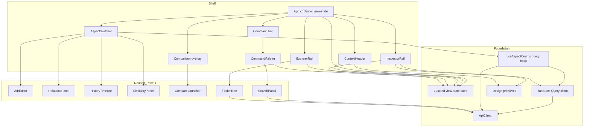
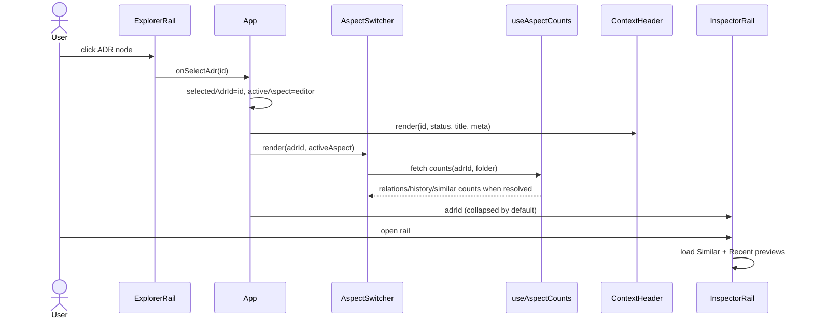
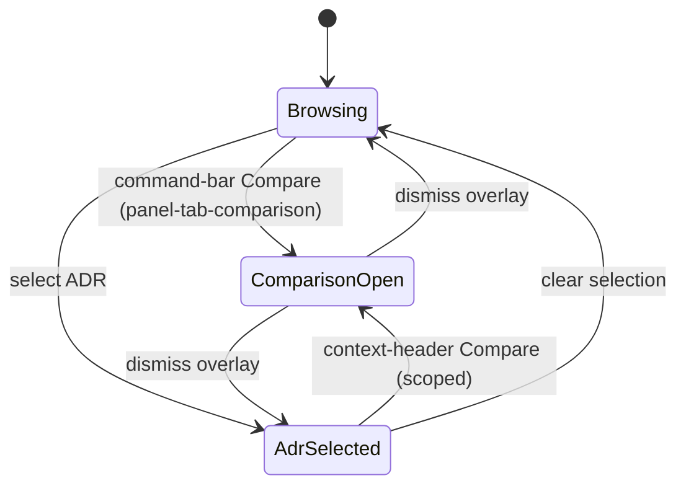

# Design Document

## Overview

**Purpose**: This feature re-architects the `apps/web` presentation and navigation
layer into an object-centric, contextual workspace that reshapes around the selected
ADR and adds tactile surface depth, so engineers are guided to the next action instead
of navigating a static, decision-blind shell.

**Users**: Engineers who author and browse Architecture Decision Records use the web
app to find decisions, edit them, and inspect their relations, history, comparison, and
similar decisions.

**Impact**: It replaces the always-on global five-tab bar with a four-zone shell — a
top command bar (with a Cmd-K palette), a left Tree View 2.0 explorer, a center
"ADR-as-object" region (context header + contextual aspect switcher), and a right
inspector rail — and introduces an additive Soft UI depth layer. Every existing feature
panel, primitive, palette token, and backend contract is reused unchanged; the change is
arrangement, navigation, and surface depth only.

### Goals
- Make navigation contextual: per-ADR views appear as aspects of the selected decision
  and never dead-end on a "select an ADR first" placeholder.
- Add a single keyboard-driven command palette for search, jump, and actions.
- Enrich the explorer (filter, breadcrumb, status dots, raised selection, hover move)
  and bring related context (similar, recent history) into a side rail.
- Add tactile Soft UI depth additively, preserving palette, typography, primitives,
  WCAG AA contrast, and visible keyboard focus.
- Preserve all behavior, API contracts, and (except the deliberately migrated
  `panel-tab-*` hooks) all test hooks; verify offline.

### Non-Goals
- No backend/API, `packages/*`, or `docs/design.md` token-value changes.
- No CSS framework, component library, or client-side router; and no new runtime/dev
  dependency **other than** the two adopted state-management libraries (TanStack Query +
  Zustand).
- No re-implementation of keyword search: the command palette reuses `SearchPanel`
  verbatim, so search stays on the panel's existing fetch (not migrated to TanStack Query).
- No new product capabilities or navigation destinations beyond rearranging existing ones.
- No changes to the `apps/e2e` harness/config or pixel-baseline snapshot oracle.

## Boundary Commitments

### This Spec Owns
- The four-zone application shell and the **view-state machine**, relocated from
  `App.tsx`'s local `useState` into a dedicated **Zustand store** (selection, active
  aspect, comparison-overlay open, palette open, inspector open).
- The **server-state layer**: a TanStack Query `QueryClient` provider at the app root,
  and the query hooks for the server-derived state this feature introduces (aspect
  counts and inspector Similar/History previews).
- The contextual **aspect switcher** (Edit / Relations / History / Similar with live
  counts) that replaces the global tab bar and renders only when an ADR is selected.
- The **ADR context header** (id chip, status badge, title, metadata, inline
  Edit/Compare actions) and the welcoming browse/create empty state.
- The new **command palette** (Cmd-K) composing the reused `SearchPanel` plus actions
  (New ADR, Compare, Focus search).
- The **Tree View 2.0** explorer presentation: an `ExplorerRail` wrapper (filter +
  breadcrumb) plus additive presentation props/markup on `FolderTree` (status dot,
  raised selection, hover-revealed move affordances).
- The **contextual inspector rail** (top-Similar + recent-history previews, collapsed by
  default, linking into the full aspects).
- The additive **Soft UI** depth layer: new depth/glass tokens in `tokens.css`, a new
  `soft-ui.css`, and shell/zone layout in `app-shell.css`.
- The deliberate migration of `panel-tab-*` hooks onto the aspect/comparison controls.
- Extension of the offline E2E design spec with contextual-navigation and depth
  assertions.

### Out of Boundary
- Behavior, validation, data fetching, and internal markup of the reused feature panels
  (`AdrEditor`, `RelationsPanel`, `HistoryTimeline`, `SimilarityPanel`, `CompareLauncher`,
  `SearchPanel`) — except the additive, default-preserving props added to `FolderTree`.
- `apps/api` routes/contracts, `packages/core`, `packages/shared`, and `ApiClient`
  method signatures.
- Existing design-token **values** and the five primitives' component specs in
  `docs/design.md` / `base.css` (only additive depth tokens and refinement rules are
  introduced).
- The `apps/e2e` harness/config; only spec files are added/edited.

### Allowed Dependencies
- **New (the only permitted additions)**: `@tanstack/react-query` (^5, server-state
  caching/dedupe/lifecycle for counts + inspector previews) and `zustand` (^5, UI/view
  store). Both target React 18.3 and are added to `apps/web` only.
- `ApiClient` methods as-is: `search`, `getSimilar`, `getHistory`, `getRelations`,
  `getTree`, `getAdr`, `createFolder`, `moveAdr`, and the comparison methods consumed by
  `CompareLauncher`.
- The five primitives (`StatusBadge`, `RelationChip`, `MonoChip`, `SimilarityMeter`,
  `AdrCard`) and `@adr/shared` types.
- The existing CSS token files (referenced by name only; never re-valued).
- Dependency direction (enforced): `tokens.css` → `base.css` → `app-shell.css` →
  `soft-ui.css` for styles; for modules: `@adr/shared` types → `ApiClient` → `store`
  (Zustand) / query hooks (TanStack Query) → primitives → feature panels → shell
  components (`ExplorerRail`, `CommandPalette`, `InspectorRail`, `AspectSwitcher`,
  `ContextHeader`) → `App`. The store holds no React imports; query hooks depend only on
  `ApiClient`. Imports never point upward.

### Revalidation Triggers
- A change to the adopted state libraries' major versions (TanStack Query / Zustand) or
  the shape of the view-state store contract consumed by shell components.
- A change to any `ApiClient` method shape or a feature-panel prop contract.
- Any change to `docs/design.md` token values or the primitives' specs.
- Removal/rename of a non-migrated `data-testid`/ARIA hook the test suites depend on.
- A change to the `apps/e2e` harness/config or the offline-by-default run model.

## Architecture

### Existing Architecture Analysis
- `App.tsx` is the single container of view-state and mounts one feature panel at a time
  behind `PANEL_TABS`/`PANEL_LABELS`. Tab controls carry `panel-tab-<key>`, `role="tab"`,
  `aria-selected`, `aria-current`. `comparison` is intentionally reachable with no
  selection; the other four panels gate on `selectedAdrId` and fall back to `panel-empty`.
- Feature panels are pure, prop-driven `ApiClient` consumers and own their own
  fetch/loading/error/empty states and hooks.
- Styling is a strict token cascade (`tokens.css` → `base.css` → `app-shell.css`) imported
  in `main.tsx`; `app-shell.css` owns layout only and never re-values a token.
- The offline E2E design oracle asserts the design contract through computed styles
  compared to literal token values, with no pixel baseline.

### Architecture Pattern & Boundary Map



**Architecture Integration**:
- Selected pattern: **Zustand store for UI/view state + TanStack Query for server state**,
  with prop-light shell components that read selection/aspect/visibility from the store and
  derived data from query hooks. This replaces the previous container-owned `useState`
  approach (see research.md decision) to remove the multi-flag state smell and the
  counts-vs-panel double-fetch.
- Domain/feature boundaries: the Zustand store owns cross-zone view-state; TanStack Query
  owns server-derived state (counts, previews); shell components own layout/navigation;
  feature panels own their own behavior/data; the cascade owns depth.
- Existing patterns preserved: one-panel-at-a-time mounting (now per aspect), explicit-
  action controls, token cascade, offline computed-style E2E oracle.
- New components rationale: `CommandPalette` and `InspectorRail` are genuinely new
  surfaces; `ExplorerRail`, `AspectSwitcher`, `ContextHeader` extract cohesive shell
  responsibilities out of `App.tsx`; the Zustand store decouples them from prop-drilling so
  the seams stay parallel-safe.
- Steering compliance: no steering directory exists; the project's `CLAUDE.md`
  offline/Chromium constraints are honored. The no-new-dependency rule is relaxed only for
  the two state libraries, per the amended Req 10.3.

### Technology Stack

| Layer | Choice / Version | Role in Feature | Notes |
|-------|------------------|-----------------|-------|
| Frontend | React 18.3 + TypeScript + Vite (existing) | Shell components, hooks, view-state machine | — |
| UI state | `zustand` ^5 (**new**) | Single typed store for cross-zone view-state (selection, active aspect, palette/comparison/inspector flags) | ~1kb, no provider; added to `apps/web` only |
| Server state | `@tanstack/react-query` ^5 (**new**) | Caching/dedupe/lifecycle for aspect counts + inspector previews | `QueryClientProvider` at root; React 18-compatible |
| Styling | Plain CSS token cascade (existing) | Additive depth tokens + `soft-ui.css` + zone layout | No CSS framework |
| Test (component) | Vitest + jsdom + real Fastify backend (existing) | Shell/hook/component tests; wrap query-consuming components in a `QueryClientProvider` test helper | `pnpm --filter @adr/web test` |
| Test (E2E) | Playwright + pre-provisioned Chromium, offline (existing) | Contextual-nav + depth design assertions | `pnpm --filter @adr/e2e test:e2e` |

> The two libraries are the deliberate exception to the no-new-dependency rule (Req 10.3);
> no other dependency is added. Both ship to `apps/web` only and run fully offline.

## File Structure Plan

### Directory Structure
```
apps/web/src/
├── App.tsx                              # MODIFIED: four-zone shell; reads/writes the Zustand store
├── main.tsx                             # MODIFIED: import soft-ui.css; wrap App in QueryClientProvider
├── state/
│   ├── workspaceStore.ts               # NEW: Zustand store for cross-zone view-state + actions
│   ├── workspaceStore.test.ts          # NEW
│   └── queryClient.ts                  # NEW: shared TanStack Query QueryClient instance
├── components/
│   ├── ContextHeader.tsx               # NEW: ADR-as-object header (id/status/title/meta + Edit/Compare)
│   ├── ContextHeader.test.tsx          # NEW
│   ├── AspectSwitcher.tsx              # NEW: contextual aspect tabs + counts; carries migrated panel-tab-* hooks
│   └── AspectSwitcher.test.tsx        # NEW
├── features/
│   ├── command-palette/
│   │   ├── CommandPalette.tsx          # NEW: Cmd-K dialog; mounts SearchPanel + actions
│   │   └── CommandPalette.test.tsx     # NEW
│   ├── explorer/
│   │   ├── ExplorerRail.tsx            # NEW: filter input + breadcrumb wrapper around FolderTree
│   │   └── ExplorerRail.test.tsx       # NEW
│   ├── inspector/
│   │   ├── InspectorRail.tsx           # NEW: collapsed-by-default Similar + Recent-history previews
│   │   └── InspectorRail.test.tsx      # NEW
│   └── folder-tree/FolderTree.tsx      # MODIFIED: optional filter/selectedAdrId props, status dot,
│                                       #           raised-selection + hover-reveal CSS hooks (defaults preserve behavior)
├── hooks/
│   ├── useAspectCounts.ts              # NEW: TanStack Query hook — relations/history/similar counts
│   ├── useAspectCounts.test.ts         # NEW
│   ├── useInspectorPreviews.ts         # NEW: TanStack Query hooks — top-Similar + recent-history previews
│   └── useInspectorPreviews.test.ts    # NEW
└── styles/
    ├── tokens.css                      # MODIFIED: additive depth/glass token block (no existing token re-valued)
    ├── app-shell.css                   # MODIFIED: four-zone grid, command bar, rails, responsive collapse
    └── soft-ui.css                     # NEW: depth refinements for .field/.btn/.card/.command-bar/.aspect-switcher

apps/e2e/tests/
└── design-system.spec.ts               # MODIFIED: contextual-nav + Soft UI depth assertions (offline)
```

### Modified Files
- `apps/web/src/App.tsx` — Replace the global tab bar with the four-zone shell; read/write
  view-state (selection, `activeAspect`, `comparisonOpen`, `paletteOpen`, `inspectorOpen`)
  from the Zustand `workspaceStore` instead of local `useState`; Cmd-K key handler dispatches
  a store action; render `ContextHeader`/`AspectSwitcher` only when an ADR is selected, else
  the browse/create state; move `SearchPanel` out of the sidebar into `CommandPalette`.
- `apps/web/src/main.tsx` — Add `import "./styles/soft-ui.css";` after `app-shell.css`, and
  wrap `<App/>` in `<QueryClientProvider client={queryClient}>` (from `state/queryClient.ts`).
- `apps/web/src/features/folder-tree/FolderTree.tsx` — Add optional `filter?: string` and
  `selectedAdrId?: string | null` props; render a status dot per ADR node; apply
  `adr-node--selected` and hover-reveal classes to move controls. Defaults reproduce
  current behavior and keep all existing hooks in the DOM.
- `apps/web/src/styles/tokens.css` — Append additive depth/glass custom properties.
- `apps/web/src/styles/app-shell.css` — Add four-zone grid, command-bar, explorer/inspector
  rail layout, and responsive rail collapse.
- `apps/web/src/App.test.tsx` — Update the queries affected by the tab→aspect/action
  migration (tabs now appear after selection; Compare via command bar); render `App` inside
  a `QueryClientProvider` test wrapper and reset the Zustand store between tests.
- `apps/web/src/package.json` — Add `@tanstack/react-query` and `zustand` to dependencies.
- `apps/e2e/tests/design-system.spec.ts` — Add contextual-nav + depth assertions; move the
  pre-selection tab-label assertion to after ADR creation.

## System Flows

### Selecting an ADR reshapes the workspace (Req 1, 2, 3, 6)


### Comparison as an action (Req 2.5, 3.4, 11.2)

Comparison is always reachable from the command bar (no selection required), preserving
the legacy behavior; the overlay renders `CompareLauncher` unchanged.

## Requirements Traceability

| Requirement | Summary | Components | Interfaces | Flows |
|-------------|---------|------------|------------|-------|
| 1.1–1.4 | Four-zone object-centric layout reshaping on selection | App, ContextHeader, AspectSwitcher, InspectorRail | App view-state | Selecting an ADR |
| 2.1–2.5 | Contextual aspect switcher; Comparison demoted to action | AspectSwitcher, App, CompareLauncher (overlay) | `AspectSwitcherProps`, `useAspectCounts` | Comparison as an action |
| 3.1–3.4 | ADR context header with inline Edit/Compare | ContextHeader | `ContextHeaderProps` | Selecting an ADR |
| 4.1–4.6 | Cmd-K palette: search/jump/actions | CommandPalette, SearchPanel (reused), App | `CommandPaletteProps` | — |
| 5.1–5.6 | Tree View 2.0 explorer | ExplorerRail, FolderTree (extended) | `ExplorerRailProps`, extended `FolderTreeProps` | — |
| 6.1–6.5 | Inspector rail previews, collapsed by default | InspectorRail | `InspectorRailProps` | Selecting an ADR |
| 7.1–7.4 | Soft UI depth, additive, AA-safe | tokens.css, soft-ui.css | CSS tokens/classes | — |
| 8.1–8.3 | Responsive three-zone layout | app-shell.css, App | CSS grid/media | — |
| 9.1–9.4 | Accessibility (focus, keyboard, labels, reduced motion) | CommandPalette, AspectSwitcher, ExplorerRail, InspectorRail, soft-ui.css | ARIA attrs | — |
| 10.1–10.3, 10.5 | Behavior/contract preservation; scoped deps; hooks | App, all reused panels | unchanged contracts | — |
| 10.4 | Server state via TanStack Query; view-state via Zustand | workspaceStore, queryClient, useAspectCounts, useInspectorPreviews | `WorkspaceStore`, query hooks | Selecting an ADR |
| 11.1–11.3 | Deliberate hook migration | AspectSwitcher, command bar, App.test | `data-testid` mapping | Comparison as an action |
| 12.1–12.4 | Offline E2E design + nav verification | design-system.spec.ts | computed-style assertions | — |

## Components and Interfaces

| Component | Domain/Layer | Intent | Req Coverage | Key Dependencies (P0/P1) | Contracts |
|-----------|--------------|--------|--------------|--------------------------|-----------|
| workspaceStore | State (Zustand) | Single source of cross-zone view-state + actions | 1, 2, 10 | none (framework-free) | State |
| queryClient | State (TanStack Query) | Shared QueryClient for server-state hooks | 10 | ApiClient (P1) | State |
| App | Shell container | Composes the four zones; binds store + shortcuts | 1, 2, 10, 11 | workspaceStore (P0), ContextHeader (P0), AspectSwitcher (P0), CommandPalette (P0), ExplorerRail (P0), InspectorRail (P1) | State |
| ContextHeader | Shell/UI | ADR-as-object header + inline actions | 3 | primitives (P0) | State |
| AspectSwitcher | Shell/UI | Contextual aspect tabs + counts; migrated hooks | 2, 11 | useAspectCounts (P1) | State |
| CommandPalette | Feature/UI | Cmd-K dialog: search/jump/actions | 4, 9 | SearchPanel (P0), workspaceStore (P1) | State |
| ExplorerRail | Feature/UI | Filter + breadcrumb wrapper over FolderTree | 5 | FolderTree (P0) | State |
| InspectorRail | Feature/UI | Collapsed Similar + Recent previews | 6, 9 | useInspectorPreviews (P0), SimilarityMeter (P1) | State |
| useAspectCounts | Hook (Query) | relations/history/similar counts for selected ADR | 2 | queryClient (P0), ApiClient (P0) | Service |
| useInspectorPreviews | Hook (Query) | top-Similar + recent-history previews | 6 | queryClient (P0), ApiClient (P0) | Service |
| FolderTree (extended) | Feature/UI | Tree View 2.0 presentation additions | 5 | ApiClient (P0) | State |

Reused panels (`AdrEditor`, `RelationsPanel`, `HistoryTimeline`, `SimilarityPanel`,
`CompareLauncher`, `SearchPanel`) are consumed via their existing props with no contract
change and need no detail block here.

### State (foundation)

#### workspaceStore (Zustand)
| Field | Detail |
|-------|--------|
| Intent | Single typed source of cross-zone view-state with explicit actions |
| Requirements | 1.2, 1.3, 1.4, 2.2, 2.5, 10.4 |

**Responsibilities & Constraints**
- Holds `selectedFolder`, `selectedAdrId`, `authorName`, `activeAspect`, and the
  `comparisonOpen` / `paletteOpen` / `inspectorOpen` flags (all default `false`).
- Exposes intent-named actions so transitions are explicit and testable; illegal
  combinations are prevented inside actions (e.g. selecting an ADR forces
  `activeAspect="editor"`). Framework-free — no React imports — so it is unit-testable in
  isolation and importable by any zone without prop-drilling.

**Contracts**: State [x]
```typescript
type Aspect = "editor" | "relations" | "history" | "similar";

interface WorkspaceState {
  selectedFolder: string | null;
  selectedAdrId: string | null;
  authorName: string;
  activeAspect: Aspect;
  comparisonOpen: boolean;
  paletteOpen: boolean;
  inspectorOpen: boolean;
}

interface WorkspaceActions {
  selectFolder(path: string): void;
  selectAdr(id: string): void;          // sets selectedAdrId, activeAspect="editor", paletteOpen=false
  clearSelection(): void;
  setAuthorName(name: string): void;
  setAspect(aspect: Aspect): void;
  openCompare(): void;                   // comparisonOpen=true (reachable with no selection)
  closeCompare(): void;
  setPaletteOpen(open: boolean): void;
  toggleInspector(): void;
  reset(): void;                         // test hook
}

type WorkspaceStore = WorkspaceState & WorkspaceActions;
```
- Invariants: exactly one `activeAspect`; dismissing the palette/overlay never mutates
  `selectedAdrId`. `reset()` restores initial state for test isolation.

**Implementation Notes**
- Integration: `App` and all zones subscribe via selectors to minimize re-renders.
- Risks: store-wide subscriptions — mitigated by per-slice selectors.

#### queryClient (TanStack Query)
| Field | Detail |
|-------|--------|
| Intent | Shared `QueryClient` instance + provider for server-state hooks |
| Requirements | 10.4 |

**Responsibilities & Constraints**
- Exports a single `QueryClient` (sensible defaults: no refetch-on-focus needed for this
  offline-capable tool; queries keyed by ADR id + concern). `main.tsx` wraps `<App/>` in
  `QueryClientProvider`; tests use a fresh client per render.

**Implementation Notes**
- Integration: only `useAspectCounts` and `useInspectorPreviews` consume it; reused panels
  keep their own fetch logic (out of boundary).

### Shell / UI

#### App (container)
| Field | Detail |
|-------|--------|
| Intent | Composes the four zones + overlay; binds the store and keyboard shortcut |
| Requirements | 1.1, 1.2, 1.3, 1.4, 2.2, 2.5, 10.1, 11.1 |

**Responsibilities & Constraints**
- Reads view-state from `workspaceStore` (no local `useState` for view-state) and renders
  the four zones; keeps the `apiClient` injection seam for tests.
- Renders `ContextHeader` + `AspectSwitcher` + the active aspect panel **only** while
  `selectedAdrId !== null`; otherwise renders the browse/create state. Never renders a
  "select an ADR first" placeholder.
- Binds Cmd/Ctrl-K to `setPaletteOpen`; selecting a result calls `store.selectAdr`.
- Renders `SearchPanel` only inside `CommandPalette` (removed from the sidebar).

**State Management**
- State model: derived from the store — discriminated by `selectedAdrId === null` (browse)
  vs selected (object).
- Concurrency: the store is the single writer; zones dispatch actions, never co-own state.

**Implementation Notes**
- Integration: store actions replace the former local handlers (`selectAdr`, `openCompare`,
  `setAspect`); the `apiClient` prop is still threaded to panels and query hooks.
- Validation: aspect panels remain gated on a non-null `selectedAdrId` by construction.
- Risks: file growth — mitigated by the extracted zones and the store.

#### ContextHeader
| Field | Detail |
|-------|--------|
| Intent | Present the selected ADR as an object with inline Edit/Compare actions |
| Requirements | 3.1, 3.2, 3.3, 3.4 |

**Responsibilities & Constraints**
- Renders the ADR identifier via `MonoChip` (id), status via `StatusBadge`, the title,
  and supporting metadata using existing primitive treatments.
- Exposes inline **Edit** (`onEdit`) and **Compare** (`onCompare`) actions; never fetches
  data itself — it is given the ADR summary it renders.

**Contracts**: State [x]
```typescript
interface ContextHeaderProps {
  adrId: string;
  title: string;
  status: string;
  meta?: React.ReactNode;
  onEdit: () => void;
  onCompare: () => void;
}
```
- Preconditions: rendered only when an ADR is selected.
- Postconditions: `onEdit` opens the Edit aspect; `onCompare` opens the comparison flow
  scoped to `adrId`.

**Implementation Notes**
- Integration: `onEdit` calls `setActiveAspect("editor")`; `onCompare` calls
  `handleOpenCompare(adrId)`.
- Risks: title/status come from the tree selection or a lightweight `getAdr`; design
  treats them as inputs (the source is wired in `App`).

#### AspectSwitcher
| Field | Detail |
|-------|--------|
| Intent | Contextual replacement for the global tab bar, with live counts |
| Requirements | 2.1, 2.2, 2.3, 2.4, 11.1, 11.2 |

**Responsibilities & Constraints**
- Renders four controls — Edit, Relations, History, Similar — only when an ADR is
  selected; renders nothing otherwise (Req 2.2).
- Each control carries the **migrated** `data-testid`: `panel-tab-editor`,
  `panel-tab-relations`, `panel-tab-history`, `panel-tab-similarity`, plus `role="tab"`,
  `aria-selected`, and `aria-current` on the active control.
- Displays a count beside Relations/History/Similar **when resolved** by
  `useAspectCounts`; Edit has no count.
- Does **not** include a Comparison control (Req 2.5).

**Contracts**: State [x]
```typescript
type Aspect = "editor" | "relations" | "history" | "similar";

interface AspectSwitcherProps {
  activeAspect: Aspect;
  counts: Partial<Record<Exclude<Aspect, "editor">, number>>;
  onSelectAspect: (aspect: Aspect) => void;
}
```
- Invariants: exactly one active aspect; counts render only for present keys.

**Implementation Notes**
- Integration: `counts` is supplied by `useAspectCounts`; absence of a count is a valid
  state (Req 2.4 "where available").
- Risks: hook migration — see Hook Migration Map below.

#### CommandPalette
| Field | Detail |
|-------|--------|
| Intent | Cmd-K dialog composing reused search with action commands |
| Requirements | 4.1, 4.2, 4.3, 4.4, 4.5, 4.6, 9.2, 9.3 |

**Responsibilities & Constraints**
- Opens on Cmd/Ctrl-K and via the command-bar trigger; rendered as an accessible dialog
  (`role="dialog"`, `aria-modal`, focus moved to the query field on open, Esc/overlay
  dismiss without changing selection — Req 4.6).
- Mounts the existing `SearchPanel` verbatim for search + jump; `onSelectAdr` selects the
  ADR and closes the palette (Req 4.3).
- Offers action commands: **New ADR**, **Compare**, **Focus search** (Req 4.4); each
  starts its action and closes the palette (Req 4.5), except Focus search which focuses
  the query field.

**Contracts**: State [x]
```typescript
interface CommandPaletteProps {
  open: boolean;
  apiClient: ApiClient;
  onClose: () => void;
  onSelectAdr: (id: string) => void;
  onNewAdr: () => void;
  onCompare: () => void;
}
```
- Preconditions: keyboard shortcut handled by `App`; palette is presentation + composition.
- Postconditions: dismiss leaves current selection unchanged.

**Implementation Notes**
- Integration: `onNewAdr` selects create mode (`selectedAdrId=null`, `activeAspect="editor"`);
  `onCompare` opens the comparison overlay; search hooks (`search-*`) are preserved by reuse.
- Validation: focus trap + Esc handling are the only new accessibility obligations.
- Risks: E2E search journey must open the palette first (affected-query update).

#### ExplorerRail
| Field | Detail |
|-------|--------|
| Intent | Tree View 2.0 wrapper owning filter + breadcrumb around FolderTree |
| Requirements | 5.1, 5.2, 5.3 |

**Responsibilities & Constraints**
- Owns a filter input (`explorer-filter-input`) and a path breadcrumb
  (`explorer-breadcrumb`) reflecting the current folder/selected ADR location.
- Passes `filter` and `selectedAdrId` to `FolderTree`; never re-implements tree fetch,
  folder create, or move (those stay in `FolderTree`).

**Contracts**: State [x]
```typescript
interface ExplorerRailProps {
  apiClient: ApiClient;
  authorName: string;
  selectedAdrId: string | null;
  selectedFolder: string | null;
  onSelectFolder: (path: string) => void;
  onSelectAdr: (id: string) => void;
}
```

**Implementation Notes**
- Integration: breadcrumb is derived from `selectedFolder`/`selectedAdrId`; filter is
  local presentation state passed down.
- Risks: keep `FolderTree` hooks intact (defaults preserve behavior).

#### InspectorRail
| Field | Detail |
|-------|--------|
| Intent | Collapsed-by-default previews bringing related context to the user |
| Requirements | 6.1, 6.2, 6.3, 6.4, 6.5, 9.2 |

**Responsibilities & Constraints**
- Collapsed by default; expands only on user action (Req 6.2) via an
  `inspector-toggle` control.
- While open with an ADR selected, renders a top-Similar preview (with `SimilarityMeter`)
  and a recent-history preview sourced from `useInspectorPreviews`; renders graceful
  loading/empty/error states (offline-safe) from the query state.
- Each preview item links into the corresponding full aspect (`onOpenAspect("similar" |
  "history")`) — Req 6.4. With no ADR selected, shows no ADR previews (Req 6.5).

**Contracts**: State [x], Service [x]
```typescript
interface InspectorRailProps {
  apiClient: ApiClient;     // threaded to useInspectorPreviews
  adrId: string | null;
  folder: string | null;
  open: boolean;
  onToggle: () => void;
  onOpenAspect: (aspect: "similar" | "history") => void;
}
```
- Preconditions: the underlying queries are enabled only while `open && adrId !== null`.
- Postconditions: previews read from the same `ApiClient` methods the full aspects use,
  via the shared `queryClient` (so a later full-aspect view can reuse the warm cache).

**Implementation Notes**
- Integration: limits preview length (top-N similar, recent history) for compactness;
  full data remains in the aspects.
- Risks: offline similarity may be empty — empty state must render cleanly; E2E asserts
  containers/behavior, not result counts.

### Hooks

Both hooks are thin TanStack Query wrappers over `ApiClient`; they consume the shared
`queryClient` and are `enabled` only when an ADR is selected. They never throw to the UI —
the consuming components read `data`/`isPending`/`isError` and degrade gracefully.

#### useAspectCounts
| Field | Detail |
|-------|--------|
| Intent | relations/history/similar counts for the selected ADR (TanStack Query) |
| Requirements | 2.4, 10.4 |

**Contracts**: Service [x]
```typescript
interface AspectCounts {
  relations?: number;
  history?: number;
  similar?: number;
}
function useAspectCounts(
  apiClient: ApiClient,
  adrId: string | null,
  folder: string | null,
): AspectCounts;
```
- Preconditions: queries disabled (returns `{}`) when `adrId === null`.
- Postconditions: a key is populated only when its query resolves successfully; failures
  and offline-empty similarity leave the key absent ("where available", Req 2.4).
- Invariants: read-only; query keys are `["counts", concern, adrId, scope]` so results
  are cached/deduped and shared with the panels' own data where keys align.

**Implementation Notes**
- Integration: counts derive from `getRelations(id).relations.length`,
  `getHistory(id).history.length`, `getSimilar(id, scope).results.length`; scope resolves
  like `SimilarityPanel` (selected folder, else the ADR's own folder).
- Risks: extra reads are deduped/cached by TanStack Query and cancelled on `adrId` change.

#### useInspectorPreviews
| Field | Detail |
|-------|--------|
| Intent | top-Similar + recent-history previews for the inspector (TanStack Query) |
| Requirements | 6.1, 6.3, 10.4 |

**Contracts**: Service [x]
```typescript
interface InspectorPreviews {
  similar: { data?: SimilarityResult[]; isPending: boolean; isError: boolean };
  history: { data?: CommitMeta[]; isPending: boolean; isError: boolean };
}
function useInspectorPreviews(
  apiClient: ApiClient,
  adrId: string | null,
  folder: string | null,
  enabled: boolean,         // bound to the rail's open state
): InspectorPreviews;
```
- Preconditions: queries run only while `enabled && adrId !== null`.
- Postconditions: previews share query keys with the Similar/History aspects so opening a
  full aspect reuses the warm cache (no duplicate fetch).
- Invariants: read-only; offline-empty similarity yields an empty (not error) preview.

### FolderTree (extended) — Implementation Note
Add optional `filter?: string` and `selectedAdrId?: string | null` props. When `filter`
is set, narrow visible nodes to matches (Req 5.2). Render a status dot on each ADR node
(Req 5.4) and apply `adr-node--selected` to the selected row (Req 5.5, raised via
`soft-ui.css`). Move controls remain in the DOM but are visually hidden until hover/focus
via CSS (Req 5.6), preserving the `move-*` hooks. All new props default to no-op behavior,
keeping `FolderTree.test.tsx` and `tree.spec.ts` green.

## Hook Migration Map (Req 11.1–11.3)

| Legacy hook | New location | Visibility change |
|-------------|--------------|-------------------|
| `panel-tab-editor` | AspectSwitcher Edit control | Now appears only when an ADR is selected |
| `panel-tab-relations` | AspectSwitcher Relations control | Same |
| `panel-tab-history` | AspectSwitcher History control | Same |
| `panel-tab-similarity` | AspectSwitcher Similar control | Same |
| `panel-tab-comparison` | Command-bar **Compare** action | Always reachable (no selection needed) |
| `panel-comparison` | Comparison overlay container | Rendered when the overlay is open |
| `panel-empty` | (removed) | Replaced by the browse/create state |

Only the queries touching these hooks are updated (`App.test.tsx`,
`design-system.spec.ts`, and the search journey's palette-open step). All other
`data-testid`/ARIA hooks remain unchanged (Req 11.3, 10.4).

## Error Handling

### Error Strategy
The shell adds no new data fetching beyond the read-only `useAspectCounts` and the
inspector previews; both degrade silently to absent counts / empty-or-error preview
states, mirroring the existing panels' fetch-failure handling (treat network failure the
same as `ok:false`). All authoritative error states (save conflict, load failures)
remain owned by the reused panels and are unchanged.

### Error Categories and Responses
- **User errors**: invalid command-palette query → the reused `SearchPanel` renders its
  existing empty/error states.
- **System errors**: count/preview fetch failure → the affected count is omitted and the
  preview shows its error/empty state; navigation remains usable.
- **Business logic**: comparison/self-compare rejections remain owned by
  `CompareLauncher`/its views (unchanged).

### Monitoring
No new telemetry; correctness is verified by the offline E2E design oracle and the
component test suite.

## Testing Strategy

> Components and hooks that consume TanStack Query are rendered through a shared test
> helper that wraps them in a fresh `QueryClientProvider`; the Zustand store is `reset()`
> in `beforeEach` for isolation.

### Unit / Component Tests (Vitest + jsdom + real backend)
- `workspaceStore`: `selectAdr` sets `activeAspect="editor"` and clears `paletteOpen`;
  `closeCompare`/palette dismiss never mutate `selectedAdrId`; `reset` restores defaults
  (10.4, 2.5).
- `AspectSwitcher`: renders nothing with no selection; renders four controls with
  migrated `panel-tab-*` hooks when selected; shows counts only for present keys; marks
  the active aspect (2.1–2.4, 11.1).
- `ContextHeader`: renders id chip/status badge/title/meta; `onEdit` and `onCompare`
  fire (3.1–3.4).
- `CommandPalette`: opens/closes; Esc/overlay dismiss preserves selection; mounting
  `SearchPanel` selecting a hit calls `onSelectAdr` and closes; action buttons fire
  (4.1–4.6).
- `useAspectCounts` / `useInspectorPreviews`: disabled (no fetch) for null ADR; populate
  from resolved queries; omit/empty on failure or offline-empty similarity without
  throwing (2.4, 6.1, 6.3, 10.4).
- `FolderTree` (extended): filter narrows nodes; selected row gets `adr-node--selected`;
  move hooks remain present; defaults preserve existing behavior (5.2, 5.4–5.6, 10.5).

### Integration / Cross-component (App)
- Selecting an ADR shows the context header + aspect switcher and hides the browse/create
  state; clearing selection restores it (1.2–1.4, 2.2).
- Command-bar Compare opens the overlay containing `CompareLauncher` with no selection
  (2.5, 11.2); the migrated `panel-tab-comparison → panel-comparison →
  compare-version-adr-id-input` path holds.
- Inspector starts collapsed; opening it with a selection loads previews; a preview link
  switches the active aspect (6.2–6.4).

### E2E / UI (Playwright, offline Chromium) — `design-system.spec.ts`
- Aspect switcher absent before any ADR is selected, present after creation; migrated
  tab labels assert after creation (2.2, 11.1, 12.1).
- Command palette opens via Cmd-K, searches, and selects an ADR (4.1–4.3, 12.1).
- Context header renders for the selected ADR; inspector previews appear when opened
  (3.1, 6.1, 12.1).
- Soft UI depth present (e.g. a raised primary button carries a non-`none` box-shadow)
  and a keyboard-focused control still shows a visible focus outline (7.1, 7.4, 9.1,
  12.2); no pixel-baseline snapshot, no new test/runtime dependency in the E2E layer, runs
  offline (12.3, 12.4).

## Security Considerations
No new authentication, authorization, sensitive data, or external integration is
introduced; the feature is presentation/navigation only over existing offline contracts.

## Accessibility Notes (Req 9)
- The command palette is a focus-managed dialog (focus on open, Esc to close, focus
  restored on close).
- The aspect switcher keeps `role="tab"`/`aria-selected`/`aria-current`; explorer filter
  and inspector controls are labeled for assistive technology.
- Depth is added only via shadow/gradient/glass; text and focus tokens are unchanged, so
  WCAG AA contrast and the visible `:focus-visible` outline are preserved. New transitions
  honor the existing `prefers-reduced-motion` block in `base.css`.
