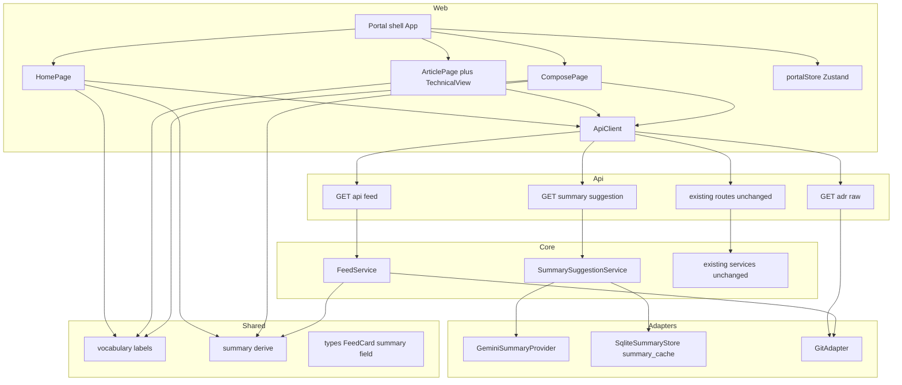
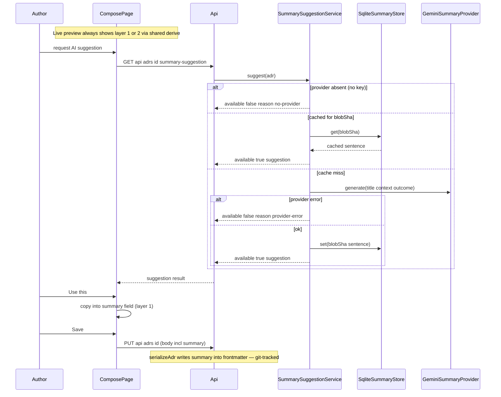
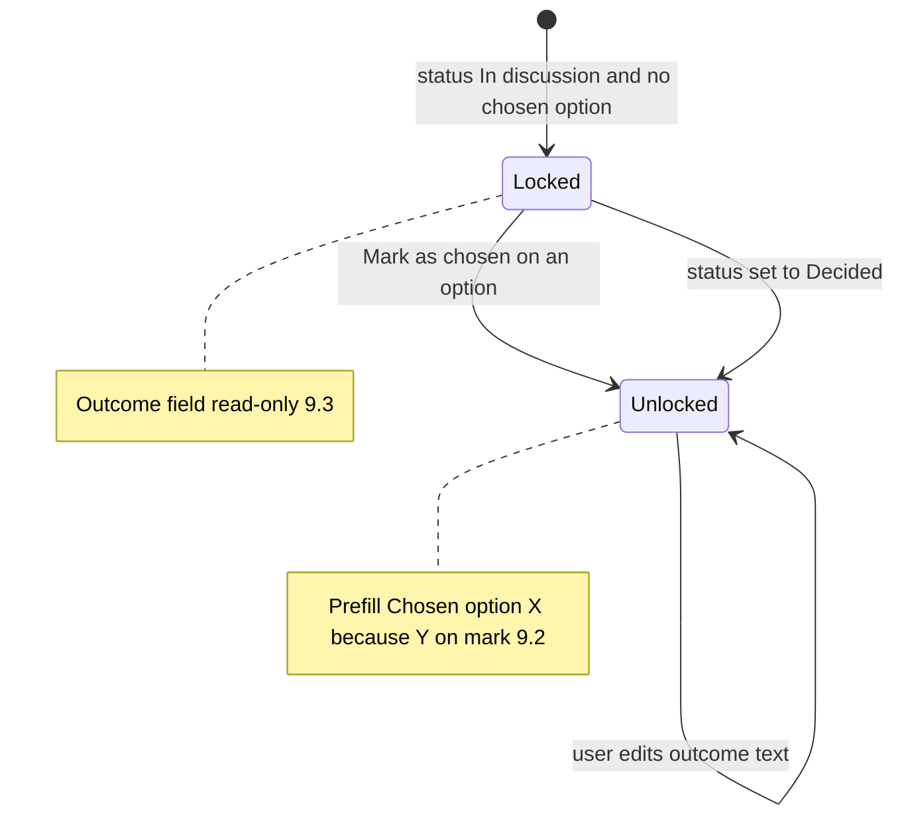

# Technical Design — adr-manager-decision-feed

## Overview

**Purpose**: This feature replaces the ADR Manager web app's engineer-oriented contextual shell with an editorial-portal presentation (Concept A, "Decision Feed") so that non-technical stakeholders — corporate/solution architects and business analysts — can read, create, and evolve decisions without knowing git or MADR vocabulary.

**Users**: Stakeholders browse a Home feed of decision cards, read decisions as outcome-first articles, and author decisions through a friendly single-page form. Engineers retain full fidelity through a per-decision Technical view (raw Markdown, file path, real git history, diffs, comparison).

**Impact**: The entire navigation layer of `apps/web` is replaced (tree explorer, Cmd-K palette, inspector rail, aspect switcher are removed). The backend gains three additive read endpoints (`GET /api/feed`, `GET /api/adrs/:id/raw`, `GET /api/adrs/:id/summary-suggestion`), one new SQLite cache table, and a typed optional `summary` frontmatter field. All existing API contracts, the MADR file format (beyond the additive field), git-as-source-of-truth behavior, and the offline E2E lifecycle are preserved.

### Goals
- Plain-language vocabulary everywhere outside Technical view; canonical MADR values stay on disk and verbatim in Technical view
- Home feed (hero search, status filter chips, decision cards, Topics rail, "Needs your attention" digest), Topics and People destinations
- Decision article page with outcome-first summary, friendly section names + canonical tags, option compare cards, plain-sentence relations/history rail, Technical view toggle
- Friendly compose form: prompt-card sections, plain-word status segment, "Mark as chosen" with Decision Outcome pre-fill/locking, live feed-card preview
- Three-layer short description: author `summary` frontmatter > deterministic derivation > cached, suggestion-only Gemini polish; fully offline-degradable

### Non-Goals
- Concept B (board/wizard) and Concept C (document workspace) presentation models
- Authentication, user accounts, notifications beyond the on-page digest; commenting or real-time collaboration
- Changes to existing API request/response contracts, `packages/core` service behavior, embeddings pipeline, harness/config of `apps/e2e`, or design-token values
- URL routing/deep-linking (no client-side router today; none added)
- Reindex-script integration for the summary cache (cache fills lazily; it is a disposable projection)

## Boundary Commitments

### This Spec Owns
- The entire presentation/navigation layer of `apps/web`: portal shell, Home/Topics/People/article/compose views, view-state store, portal styles, and the removal of the contextual-shell navigation
- The plain-language vocabulary tables and the short-description derivation module in `packages/shared` (new files)
- The typed `summary` frontmatter field: its type in `@adr/shared`, its passthrough in `editingService` payloads
- Three additive API read endpoints and their DTOs: `GET /api/feed`, `GET /api/adrs/:id/raw`, `GET /api/adrs/:id/summary-suggestion`
- The `FeedService` and `SummarySuggestionService` in `packages/core` with their ports, plus the `GeminiSummaryProvider` and `SqliteSummaryStore` adapters and the `summary_cache` table in `apps/api`
- Migration of all E2E journey specs to the portal navigation and the new `decision-feed.spec.ts`

### Out of Boundary
- Behavior, validation, and contracts of all existing endpoints (create/save/tree/relations/history/diff/compare/search/similar) — consumed as-is
- Existing core services (`AdrEditingService` beyond summary passthrough, `FolderService`, `HistoryService`, `ComparisonService`, `SearchService`, `SimilarityService`) and the embeddings pipeline/cache
- MADR section semantics, status/relation enums, ID scheme, git commit behavior
- E2E harness (`globalSetup`, `helpers`, `paths`, `playwright.config.ts`, runners) — only `tests/*.spec.ts` files change
- `docs/design.md` token values; `tokens.css`/`base.css`/`soft-ui.css` values (new styles consume existing tokens)

### Allowed Dependencies
- Existing runtime deps only: react, @tanstack/react-query, zustand (web); fastify, better-sqlite3, simple-git (api); gray-matter (core). **No new runtime or dev dependency.**
- Google Generative Language REST API (`:generateContent`) — optional at runtime, keyed by `GEMINI_API_KEY`, degradable to absent (mirrors the embeddings provider selection)
- Dependency direction: `shared → core → api`; `web → shared` + api HTTP only. Web never imports from core or api source.

### Revalidation Triggers
- Any change to the `FeedCard` DTO, the summary-suggestion response union, or the raw-content response shape
- Any change to the vocabulary label strings (E2E asserts them literally)
- Any change to `summary` frontmatter semantics (precedence, serialization key)
- Removal/renaming of the three new endpoints, or a change to `summary_cache` schema/keying

## Architecture

### Existing Architecture Analysis
- `apps/web` is a React SPA with App-level view switching (no router), Zustand view state, TanStack Query server state, a typed `ApiClient` returning discriminated `{ok:true}|{ok:false}` unions, shared primitives, and per-feature directories. The portal keeps every one of these patterns and swaps the composition root.
- `apps/api` follows route-plugin → container → core-service → port/adapter layering; offline degradation is decided once in `buildContainer` by inspecting `GEMINI_API_KEY`. The new capabilities follow the identical layering.
- `packages/core/src/adr/parse.ts` round-trips unknown frontmatter keys in both directions, so the `summary` field is additive with zero migration (existing ADRs remain valid — 11.3).

### Architecture Pattern & Boundary Map



**Architecture Integration**:
- Selected pattern: keep the existing layering (route → container-wired core service → port/adapter; SPA with store-driven view switch); replace only the web composition root and add additive read capabilities.
- Domain boundaries: presentation vocabulary and derivation live in `@adr/shared` (pure, isomorphic); feed assembly and suggestion orchestration live in `@adr/core`; network/persistence adapters live in `apps/api`.
- Existing patterns preserved: discriminated-union API client results, query-key-based caching, container provider selection for offline mode, `CREATE TABLE IF NOT EXISTS` + `INSERT OR REPLACE` cache stores.
- New components rationale: each new endpoint exists because no current response shape carries the needed data (cards, raw bytes, suggestions); each new core service isolates one orchestration concern.
- Steering compliance: steering directory is absent in this repo; CLAUDE.md environment rules (offline E2E, pre-provisioned Chromium) are honored by 16.3-16.4.

### Technology Stack

| Layer | Choice / Version | Role in Feature | Notes |
|-------|------------------|-----------------|-------|
| Frontend | React 18.3, TanStack Query 5, Zustand 5 (existing) | Portal views, server-state, view-state | No additions (15.5) |
| Shared | TypeScript (pure, dependency-free) | Vocabulary tables, derivation functions, DTO types | Isomorphic by construction |
| Backend | Fastify 4.28 (existing) | Three additive route plugins | Same plugin registration pattern |
| Data | better-sqlite3 11.3 (existing) | `summary_cache` table in existing SQLite file | Sibling of `embedding_cache` |
| External | Gemini `:generateContent` REST (optional) | One-sentence summary suggestion | Absent/degraded without `GEMINI_API_KEY`; model via `GEMINI_SUMMARY_MODEL` (default `gemini-2.0-flash`) |

## File Structure Plan

### New Files
```
packages/shared/src/
├── vocabulary.ts                 # STATUS_LABELS, RELATION_LABELS (directional), PEOPLE_LABELS
└── summary/derive.ts             # resolveShortDescription (layer 1 > 2), outcome parser, option-title extraction

packages/core/src/
├── feed/feedService.ts           # Scan repo via GitPort, parse ADRs, assemble FeedCard[]
├── summaries/summarySuggestionService.ts  # Cache-first suggestion orchestration
└── ports/summaries.ts            # SummaryProvider + SummaryStore port interfaces

apps/api/src/
├── routes/feed.ts                # GET /api/feed
├── routes/summaries.ts           # GET /api/adrs/:id/summary-suggestion
├── infrastructure/summaries/geminiSummaryProvider.ts   # :generateContent adapter
└── infrastructure/persistence/sqliteSummaryStore.ts    # summary_cache(blob_sha PK, summary)

apps/web/src/
├── state/portalStore.ts          # view discriminated union + authorName
├── hooks/useFeed.ts              # Query: GET /api/feed
├── hooks/useDecision.ts          # Queries: getAdr + relations + history (+ similar) for article
├── hooks/useSummarySuggestion.ts # On-demand suggestion query (form only)
├── components/TopNav.tsx         # Home / Topics / People, author-name field, New decision
├── components/FeedCard.tsx       # Decision card (Home, search results, topic/person lists, live preview)
├── features/home/HomePage.tsx    # Hero search + chips + feed + rails composition
├── features/home/AttentionDigest.tsx   # Author-matched open decisions
├── features/home/TopicsRail.tsx  # Topic shortcuts into Topics destination
├── features/topics/TopicsPage.tsx      # Topic list + per-topic feed
├── features/people/PeoplePage.tsx      # Person directory + per-person decisions
├── features/article/ArticlePage.tsx    # Outcome-first article composition
├── features/article/OptionCompareCards.tsx  # Options as compare cards, chosen highlighted
├── features/article/ContextRail.tsx   # Plain-sentence relations, story, related reading
├── features/article/TechnicalView.tsx # Raw MD + path + real history/diff/compare (reuses existing components)
├── features/compose/ComposePage.tsx   # Create/edit composition (both modes)
├── features/compose/PromptCard.tsx    # Friendly section card w/ helper text + MADR tag
├── features/compose/OptionCardsEditor.tsx  # Option rows as cards + "Mark as chosen"
├── features/compose/SummaryControl.tsx # Short-description field, source ladder, AI suggestion UI
├── features/compose/PreviewRail.tsx   # Live FeedCard preview + source indicator
├── features/compose/TopicPicker.tsx   # Choose/create topic (wraps getTree + createFolder + moveAdr)
├── features/compose/outcome.ts       # Pure: chosen-option→outcome prefill, canonical parse, lock rules
└── styles/{portal.css, home.css, article.css, compose.css}  # Portal surfaces on existing tokens

apps/e2e/tests/decision-feed.spec.ts  # Portal journeys + vocabulary assertions (16.1-16.2)
```

### Modified Files
- `packages/shared/src/types.ts` — add `summary?: string` to `AdrFrontmatter`; add `FeedCard`, `ShortDescription`, `SummarySuggestionResult`, `RawAdrContent` types
- `packages/shared/src/index.ts`, `packages/core/src/index.ts` — export new modules
- `packages/core/src/adr/editingService.ts` — accept optional `summary` in create/update payloads (explicit passthrough onto the Adr)
- `apps/api/src/config.ts` — add `gemini.summaryModel` (`GEMINI_SUMMARY_MODEL`, default `gemini-2.0-flash`)
- `apps/api/src/container.ts` — wire `FeedService`, `SummarySuggestionService`, `SqliteSummaryStore`, provider selection (null provider when key blank)
- `apps/api/src/server.ts` — register `feedRoutes`, `summariesRoutes`
- `apps/api/src/routes/adrs.ts` — add `GET /api/adrs/:id/raw`
- `apps/web/src/App.tsx` — rewrite: TopNav + view switch over `portalStore.view`
- `apps/web/src/main.tsx` — updated CSS imports
- `apps/web/src/api/client.ts` — add `getFeed`, `getRawAdr`, `getSummarySuggestion`
- `apps/web/src/components/StatusBadge.tsx` — label text from `@adr/shared` vocabulary (dot colors unchanged)
- `apps/web/src/components/RelationChip.tsx` — plain-language relation labels (compose + article contexts)
- `apps/e2e/tests/{design-system,adr-lifecycle,search,tree,similarity,migrated-fixture-content,migrated-fixture-title}.spec.ts` — migrate journeys to portal navigation (harness untouched)

### Deleted Files (contextual-shell navigation — 15.1)
- `apps/web/src/features/command-palette/`, `features/explorer/`, `features/inspector/`, `features/folder-tree/`, `features/search/SearchPanel.tsx`, `features/relations-graph/RelationsPanel.tsx`, `features/similarity-panel/SimilarityPanel.tsx`, `features/adr-editor/{AdrEditor,CollapsibleSection,OptionsEditor,PeopleEditor}.tsx`
- `apps/web/src/components/{AspectSwitcher,ContextHeader}.tsx`, `hooks/{useAspectCounts,useInspectorPreviews}.ts`, `state/workspaceStore.ts`
- `apps/web/src/styles/{app-shell,inspector,command-palette,folder-tree}.css`
- Pure helpers `features/adr-editor/{options,people}.ts` move to `features/compose/` (logic reused verbatim)
- Kept and reused: `components/{StatusBadge,RelationChip,MonoChip,SimilarityMeter,AdrCard}.tsx`, `features/diff-viewer/*`, `features/history-timeline/HistoryTimeline.tsx`, `state/queryClient.ts`, `styles/{tokens,base,soft-ui}.css` (RelationsPanel/SimilarityPanel/SearchPanel functionality is absorbed by ContextRail, hero search, and Technical view)

## System Flows

### Short-description resolution and AI suggestion



Flow decisions: the suggestion is fetched on explicit user action only (never per keystroke); a provider error is returned as `available:false` and is not cached; acceptance is the only path that writes AI text into the record (13.3).

### Outcome lock and prefill (compose form)



Lock state is UI-only; the save API's validation is untouched (9.5).

## Requirements Traceability

| Requirement | Summary | Components | Interfaces / Flows |
|-------------|---------|------------|--------------------|
| 1 (1.1-1.6) | Plain-language vocabulary | `vocabulary.ts`; StatusBadge, RelationChip, all portal views; TechnicalView (1.6 canonical verbatim) | Label constants consumed everywhere |
| 2 (2.1-2.7) | Home feed | HomePage, FeedCard, TopNav, useFeed | `GET /api/feed` → `FeedCard[]`; chip filter is client-side |
| 3 (3.1-3.4) | Topics | TopicsPage, TopicsRail | Client projection over `FeedCard.topic` |
| 4 (4.1-4.3) | People directory | PeoplePage | Client projection over FeedCard people fields, case-insensitive trim match |
| 5 (5.1-5.3) | Attention digest | AttentionDigest, portalStore.authorName | Filter: status proposed + author-name match |
| 6 (6.1-6.6) | Decision article | ArticlePage, OptionCompareCards, ContextRail, useDecision | getAdr/getRelations/getHistory/getSimilar (existing) |
| 7 (7.1-7.5) | Technical view | TechnicalView (reuses HistoryTimeline, VersionDiffView, AdrCompareView, CompareLauncher) | `GET /api/adrs/:id/raw` |
| 8 (8.1-8.5) | Compose form | ComposePage, PromptCard, TopicPicker, people/relations editors | Existing create/save incl. 409 conflict recovery (8.5) |
| 9 (9.1-9.5) | Chosen option / outcome | OptionCardsEditor, `outcome.ts` | Outcome lock state flow |
| 10 (10.1-10.3) | Live preview | PreviewRail, FeedCard, `derive.ts` | Shared resolution, source indicator |
| 11 (11.1-11.3) | Author summary field | `types.ts` summary field, editingService passthrough, SummaryControl | parse/serialize round-trip (existing) |
| 12 (12.1-12.5) | Deterministic derivation | `summary/derive.ts`, FeedService | Pure function, no network (12.5) |
| 13 (13.1-13.5) | AI suggestion | SummarySuggestionService, GeminiSummaryProvider, SqliteSummaryStore, SummaryControl, useSummarySuggestion | Suggestion sequence flow; `summary_cache` |
| 14 (14.1-14.2) | Search | HomePage hero search, FeedCard | Existing `GET /api/search`, hits joined to feed cards by id |
| 15 (15.1-15.5) | Replacement + preservation | Deleted-files list; unchanged routes/services; no new deps | Boundary Commitments |
| 16 (16.1-16.4) | Automated verification | `decision-feed.spec.ts`, migrated journey specs | Offline lifecycle preserved; no snapshots |

## Components and Interfaces

| Component | Domain/Layer | Intent | Req Coverage | Key Dependencies | Contracts |
|-----------|--------------|--------|--------------|------------------|-----------|
| vocabulary | shared | Label tables for statuses/relations/people | 1 | none | Service |
| summary/derive | shared | Layer 1>2 short-description resolution | 10, 11.2, 12 | vocabulary (P2) | Service |
| FeedService | core | Assemble FeedCard[] from repo | 2, 12 | GitPort (P0), derive (P0) | Service |
| SummarySuggestionService | core | Cache-first suggestion orchestration | 13 | SummaryProvider (P1), SummaryStore (P0) | Service |
| GeminiSummaryProvider | api adapter | `:generateContent` call | 13.1 | Gemini REST (P1, degradable) | Service |
| SqliteSummaryStore | api adapter | `summary_cache` persistence | 13.2 | better-sqlite3 (P0) | State |
| feed/summaries/raw routes | api | HTTP surface for the three additions | 2, 7.2, 13 | container (P0) | API |
| portalStore | web state | View union + authorName | 2.1, 5, 15.5 | zustand (P0) | State |
| ApiClient additions | web | Typed clients for new endpoints | 2, 7.2, 13 | fetch (P0) | Service |
| HomePage + FeedCard + rails | web UI | Feed, chips, digest, topics rail, search results | 2, 3.3, 5, 14 | useFeed (P0), derive (P2) | — |
| TopicsPage / PeoplePage | web UI | Grouped projections of feed | 3, 4 | useFeed (P0) | — |
| ArticlePage (+ OptionCompareCards, ContextRail, TechnicalView) | web UI | Outcome-first article + escape hatch | 1.6, 6, 7 | useDecision (P0), reused diff/history components (P0) | — |
| ComposePage (+ PromptCard, OptionCardsEditor, SummaryControl, PreviewRail, TopicPicker, outcome.ts) | web UI | Friendly create/edit | 8, 9, 10, 11, 13.3-13.4 | ApiClient (P0), derive (P0), useSummarySuggestion (P1) | — |

Full detail blocks below only for components introducing new boundaries; UI compositions rely on the summary rows plus implementation notes.

### Shared (`@adr/shared`)

#### vocabulary

| Field | Detail |
|-------|--------|
| Intent | Single source of truth for plain-language labels |
| Requirements | 1.1, 1.2, 1.5 |

##### Service Interface
```typescript
export const STATUS_LABELS: Record<AdrStatus, string>;
// proposed→"In discussion", accepted→"Decided", deprecated→"Retired",
// superseded→"Replaced", rejected→"Rejected"

export type RelationDirection = "outgoing" | "incoming";
export function relationLabel(type: RelationType, direction: RelationDirection): string;
// supersedes→"Replaces", superseded-by→"Replaced by", depends-on→"Builds on",
// relates-to→"Related to", conflicts-with→"Conflicts with" (direction-aware for supersedes pair)

export const PEOPLE_LABELS: { decisionMakers: string; consulted: string; informed: string };
// "Decision owner" / "Input from" / "Kept informed"
```
- Invariants: pure constants; stored enum values are never rewritten by this module (1.6).

#### summary/derive

| Field | Detail |
|-------|--------|
| Intent | Deterministic short-description resolution (layers 1-2) |
| Requirements | 10.2-10.3, 11.2, 12.1-12.5 |

##### Service Interface
```typescript
export type ShortDescriptionSource = "summary" | "derived";
export interface ShortDescription { text: string; source: ShortDescriptionSource; }

export interface DerivationInput {
  status: AdrStatus;
  summary?: string;
  decisionOutcome: string;
  consideredOptions: string;
  decisionDrivers: string;
  contextAndProblemStatement: string;
  date: string;
  relations: AdrRelation[];
}
export interface DerivationContext {
  resolveTitle(id: AdrId): string | undefined; // for "Replaced by <title>"
}
export function resolveShortDescription(input: DerivationInput, ctx: DerivationContext): ShortDescription;
export function parseCanonicalOutcome(outcome: string): { option: string; because?: string } | null;
```
- Preconditions: none (all inputs may be empty strings/arrays).
- Postconditions: always returns non-empty `text` when any source field is non-empty; `source:"summary"` iff frontmatter summary is non-blank (11.2). Branches: Decided → outcome pattern / first sentence (12.1); In discussion → options ± first driver (12.2); Replaced → superseded-by target title + date (12.3); otherwise → outcome, else first sentence of context (12.4). No I/O of any kind (12.5).
- Invariants: identical output on web and api for identical input (single implementation).

### Core (`@adr/core`)

#### FeedService

| Field | Detail |
|-------|--------|
| Intent | Assemble the card DTOs powering Home/Topics/People/digest/search rendering |
| Requirements | 2.3, 3.1-3.2, 4.1-4.2, 5.1, 12 |

**Responsibilities & Constraints**
- Lists ADR files via GitPort (same scan as `FolderService.buildTree`), parses each, resolves each card's short description via `resolveShortDescription` with a repo-wide title resolver.
- Read-only; owns no data; cost profile identical to the existing tree endpoint.

**Dependencies**
- Outbound: GitPort — file listing/reads (P0); `@adr/shared` derive (P0)

**Contracts**: Service [x]

##### Service Interface
```typescript
export interface FeedCard {
  id: AdrId; title: string; status: AdrStatus; path: string;
  topic: string;                       // parent folder path ("" = root)
  date: string;
  decisionMakers: string[]; consulted: string[]; informed: string[];
  shortDescription: ShortDescription;
}
export class FeedService {
  constructor(git: GitPort, root?: string);
  buildFeed(): Promise<FeedCard[]>;    // sorted by date descending, then id
}
```
- Postconditions: one card per parseable ADR; unparseable files are skipped (same tolerance as existing services).

#### SummarySuggestionService

| Field | Detail |
|-------|--------|
| Intent | Cache-first, degradation-safe suggestion orchestration |
| Requirements | 13.1, 13.2, 13.5 |

**Dependencies**
- Outbound: SummaryProvider — text generation (P1, optional); SummaryStore — cache (P0)

**Contracts**: Service [x]

##### Service Interface
```typescript
// ports/summaries.ts
export interface SummaryProvider {
  generateSummary(input: { title: string; context: string; outcome: string }): Promise<string>;
}
export interface SummaryStore {
  get(blobSha: string): string | null;
  set(blobSha: string, summary: string): void;
}

export type SummarySuggestionResult =
  | { available: true; suggestion: string }
  | { available: false; reason: "no-provider" | "provider-error" };

export class SummarySuggestionService {
  constructor(provider: SummaryProvider | null, store: SummaryStore);
  suggest(adr: Adr): Promise<SummarySuggestionResult>;
}
```
- Postconditions: cache hit short-circuits the provider (13.2); provider errors return `available:false` and are not cached; `null` provider returns `no-provider` without touching the store (13.5).

### API (`apps/api`)

#### New routes

| Field | Detail |
|-------|--------|
| Intent | HTTP surface for feed, raw content, suggestion |
| Requirements | 2.3, 7.2, 13.1, 15.3 |

**Contracts**: API [x]

##### API Contract
| Method | Endpoint | Request | Response | Errors |
|--------|----------|---------|----------|--------|
| GET | /api/feed | — | `FeedCard[]` | 500 |
| GET | /api/adrs/:id/raw | — | `{ path: string; markdown: string }` (exact file bytes via git adapter) | 404, 500 |
| GET | /api/adrs/:id/summary-suggestion | — | `SummarySuggestionResult` (200 for both variants) | 404, 500 |

- All three are additive; no existing route's request or response shape changes (15.3). Existing routes register unchanged in `server.ts`.

#### GeminiSummaryProvider / SqliteSummaryStore (adapters)

| Field | Detail |
|-------|--------|
| Intent | `:generateContent` call; `summary_cache` persistence |
| Requirements | 13.1, 13.2, 13.5 |

- `GeminiSummaryProvider implements SummaryProvider`: POST `{BASE}/{summaryModel}:generateContent?key=`, body `{contents:[{parts:[{text: prompt}]}]}`, reads `candidates[0].content.parts[0].text`, trims to a single sentence; throws on non-OK (service maps to `provider-error`). Prompt: instruct one plain-language sentence from title + context + outcome, no markdown.
- `SqliteSummaryStore implements SummaryStore`: table `summary_cache(blob_sha TEXT PRIMARY KEY, summary TEXT NOT NULL)` in the existing `config.sqlitePath` file, own connection, `INSERT OR REPLACE` — byte-for-byte the `embedding_cache` pattern.
- Container wiring mirrors embeddings: provider is `null` when `cfg.gemini.apiKey.trim() === ""`, else constructed with `cfg.gemini.summaryModel`.

**Implementation Notes**
- Integration: registered in `buildContainer`; no change to existing provider selection.
- Validation: integration test proves second `suggest()` for the same blobSha performs zero provider calls; offline test proves `no-provider` result with blank key.
- Risks: quota/latency — mitigated by on-demand fetch + cache; cache is disposable (recreated lazily), never authoritative.

### Web (`apps/web`)

#### portalStore

| Field | Detail |
|-------|--------|
| Intent | Cross-view UI state without a router |
| Requirements | 2.1, 2.6, 5.1-5.2, 7.1, 15.5 |

**Contracts**: State [x]

##### State Management
```typescript
export type PortalView =
  | { kind: "home" }
  | { kind: "topics" }
  | { kind: "topic"; path: string }
  | { kind: "people" }
  | { kind: "person"; name: string }
  | { kind: "decision"; id: AdrId; technical: boolean }
  | { kind: "compose"; id?: AdrId };   // id absent = create

export interface PortalState {
  view: PortalView;
  authorName: string;
  navigate(view: PortalView): void;
  setAuthorName(name: string): void;
  toggleTechnicalView(): void;         // only valid in decision view
}
```
- Persistence: in-memory (matches current behavior); default view `{kind:"home"}` (2.1).
- Concurrency: single-window SPA state; server state stays in TanStack Query.

#### ApiClient additions

##### Service Interface
```typescript
// added to interface ApiClient (existing 13 methods unchanged)
getFeed(): Promise<Result<FeedCard[]>>;
getRawAdr(id: AdrId): Promise<Result<{ path: string; markdown: string }>>;
getSummarySuggestion(id: AdrId): Promise<Result<SummarySuggestionResult>>;
```
Same discriminated `{ok:true,...}|{ok:false,status,...}` envelope as every existing method.

#### UI compositions (summary-level)

- **HomePage**: hero search (submits to existing `search`, joins hits to feed cards by id — 14.1-14.2), status chips filtering client-side (2.4-2.5), feed list of FeedCard (2.3, 2.6), TopicsRail (3.3), AttentionDigest (5), empty states (2.7).
- **AttentionDigest**: `feed.filter(c => c.status === "proposed" && peopleOf(c).some(matches(authorName)))` with case-insensitive trim matching (5.1); prompt state when authorName blank (5.2).
- **TopicsPage / PeoplePage**: pure groupings of `FeedCard[]` by `topic` (incl. nesting by path prefix — 3.1-3.2) and by normalized person name (4.1-4.3); empty-topic state (3.4).
- **ArticlePage**: summary box from `shortDescription` (6.2); sections via friendly names + canonical MADR tag from `MADR_SECTIONS` (6.3); OptionCompareCards highlights the option matching `parseCanonicalOutcome` (6.4); ContextRail renders relations/history as sentences via vocabulary + friendly dates, and "Related reading" from `getSimilar` with SimilarityMeter (6.5, preserved similarity per 15.2); people labels per 1.5 (6.6).
- **TechnicalView**: raw markdown + path from `getRawAdr` (7.2); reuses HistoryTimeline, VersionDiffView (7.3), CompareLauncher/AdrCompareView (7.4); toggle returns to article (7.5); canonical values verbatim (1.6).
- **ComposePage**: PromptCards per MADR section with helper text/placeholder/tag (8.1); status segment on `STATUS_LABELS` (8.2); create requires title+context only, publishes as proposed (8.3); TopicPicker for folder choice/creation and move-on-edit (existing `createFolder`/`moveAdr`); people + relations editors with plain labels (8.4); save via existing create/update incl. 409 recovery UI (8.5); `outcome.ts` implements lock/prefill (9.1-9.5); PreviewRail renders a live FeedCard from unsaved form state via `resolveShortDescription` with a feed-backed title resolver (10.1-10.3); SummaryControl shows the source ladder, the author field (11), and the AI suggestion with Use this / Write my own (13.3-13.4).

**Implementation Notes (web)**
- Integration: `main.tsx` swaps shell CSS imports for portal CSS; `App.tsx` becomes TopNav + switch on `view.kind`; query keys: `["feed"]`, `["adr", id]`, `["relations", id]`, `["history", id]`, `["similar", id]`, `["raw", id]`, `["summary-suggestion", id, blobSha]`. Saves invalidate `["feed"]` and the per-id keys.
- Validation: component tests against the real Fastify backend (existing pattern); accessibility bar (focus treatment, labels, reduced motion) carried over from existing token/styles conventions.
- Risks: FeedCard is rendered in five contexts — keep it presentational (data in, no fetching) so preview reuse (10.1) stays trivial.

## Data Models

### Domain Model
- `Adr` aggregate is unchanged except the additive optional `summary` on `AdrFrontmatter`. Invariant: `summary` is author-owned prose; it is never written by the system without explicit user acceptance (13.3); absence is valid (11.3).
- `FeedCard` is a read-model projection (value object), derived per request, never persisted.
- `ShortDescription` value object records provenance (`source`) so the UI can show the resolution ladder (10.3).

### Physical Data Model
```sql
CREATE TABLE IF NOT EXISTS summary_cache (
  blob_sha TEXT PRIMARY KEY,
  summary  TEXT NOT NULL
);
```
- Same SQLite file as `embedding_cache`/`adr_fts`; own connection per store class (existing convention). Disposable projection: deleting the file only forces regeneration.

### Data Contracts & Integration
- `GET /api/feed` → `FeedCard[]` (JSON). Additive endpoint; consumers: HomePage, TopicsPage, PeoplePage, AttentionDigest, search-result rendering, PreviewRail title resolution.
- `GET /api/adrs/:id/raw` → `{path, markdown}` — exact stored bytes.
- `GET /api/adrs/:id/summary-suggestion` → `SummarySuggestionResult` discriminated union; both variants are HTTP 200 (absence of AI is not an error — 13.5).
- Frontmatter serialization: `summary` round-trips via existing `parseAdr`/`serializeAdr` spread behavior; `editingService` accepts it in create/update payloads.

## Error Handling

### Error Strategy
- **Feed/article fetch failure (5xx/network)**: standard query error state with retry action; empty states (2.7, 3.4) are distinct from errors.
- **Unknown decision id (404)**: article view shows a not-found state with a path back Home.
- **Save conflict (409)**: reuse the existing stale-write recovery flow and message content unchanged (8.5).
- **Suggestion degradation**: `available:false` renders as quiet absence of the suggestion control's AI affordance (with a subdued "unavailable offline" hint), never a blocking error (13.5); provider exceptions are mapped in the service, not leaked to HTTP 5xx.
- **Derivation over malformed content**: `resolveShortDescription` total function — falls through 12.1→12.4 and finally to first non-empty source text; never throws on empty sections.

### Monitoring
- Fastify request logging covers the new routes (existing setup). Provider failures logged server-side with status + truncated body, mirroring the embed adapter's error text.

## Testing Strategy

### Unit Tests (vitest, colocated)
1. `summary/derive.test.ts` — each branch 12.1-12.4 (canonical outcome parse, non-canonical fallback, options weighing ± driver, replaced-by with title resolver, retired/rejected fallback), summary precedence 11.2, purity 12.5 (no fetch/fs usage).
2. `vocabulary.test.ts` — exact label tables 1.1/1.2/1.5, directional relation labels.
3. `outcome.test.ts` (web) — lock matrix 9.3-9.4, prefill phrasing 9.2 round-trips through `parseCanonicalOutcome`.
4. `summarySuggestionService.test.ts` — cache-hit short-circuit (provider spy: zero calls), miss→generate→store, provider-error not cached, null provider → `no-provider` (13.2, 13.5).
5. `feedService.test.ts` — card assembly against in-memory GitPort fake: topic derivation, date sort, skip-unparseable, per-status descriptions.

### Integration Tests (api, vitest)
1. `routes/feed` — enriched cards over a seeded repo; existing endpoints' responses byte-compatible before/after (15.3 guard).
2. `routes/summaries` — offline container returns `available:false/no-provider`; keyed container with fake provider returns and caches; second call hits `summary_cache`.
3. `GET /api/adrs/:id/raw` — exact bytes match the file written by a prior save, incl. `summary` frontmatter after an accepting save (11.1, 7.2).
4. `editingService` — create/update with `summary` persists and round-trips; ADRs without it stay valid (11.3).

### Web Component Tests (vitest + jsdom + real backend)
1. HomePage — cards render title/status-label/description/topic/people/timestamp (2.3); chip filtering (2.5); empty state (2.7); search submit renders hit cards (14).
2. AttentionDigest — matching semantics incl. case/whitespace, blank-author prompt state (5.1-5.2).
3. ArticlePage — outcome-first box, friendly names + canonical tags, chosen-option highlight, plain-sentence rail (6); Technical view toggle shows raw values verbatim (1.6, 7).
4. ComposePage — required-fields publish gate (8.3), status segment labels (8.2), mark-as-chosen prefill + lock transitions (9), live preview updates + source indicator (10), suggestion accept copies to summary field (13.3).

### E2E (Playwright, offline, pre-provisioned Chromium)
1. `decision-feed.spec.ts` — portal journey: Home feed renders seeded decisions with plain-language labels (16.1-16.2); chip filter; topic browse; people directory; digest appears for matching author name; open article → summary box → Technical view shows canonical `proposed`/`supersedes` strings; create via compose (title+context only) → appears in feed with derived description; mark-as-chosen → outcome prefilled → Decided card.
2. Migrated journeys — `adr-lifecycle`, `search`, `tree`(→topics), `similarity`(→article related reading), `migrated-fixture-*` specs re-targeted to portal navigation; harness, runners, and offline gating untouched (16.3-16.4); no pixel snapshots.

## Security Considerations
- The Gemini call sends decision title/context/outcome to an external service **only** when an operator has configured `GEMINI_API_KEY` — the same consent boundary the embeddings pipeline already established; no new data category leaves the system. Key stays server-side (never in web bundle). Suggestion output is user-reviewed before persistence (13.3), limiting prompt-injection blast radius to a visible suggestion string.

## Performance & Scalability
- `GET /api/feed` performs the same full scan+parse as `GET /api/tree`; acceptable at current repo scale (explicitly accepted risk in `research.md`). Client renders one feed payload across five views — no N+1. Suggestion latency is off the critical path (on-demand + cached).

## Migration Strategy
- Single-cut replacement within the spec's implementation: build shared/core/api additions first (independently testable), then the portal views alongside the old shell files, then swap `App.tsx` + delete shell files + migrate E2E specs in the same change set so the suite is never green against a half-replaced UI. `summary_cache` requires no data migration (lazy, disposable). Existing ADR files require no migration (11.3).
