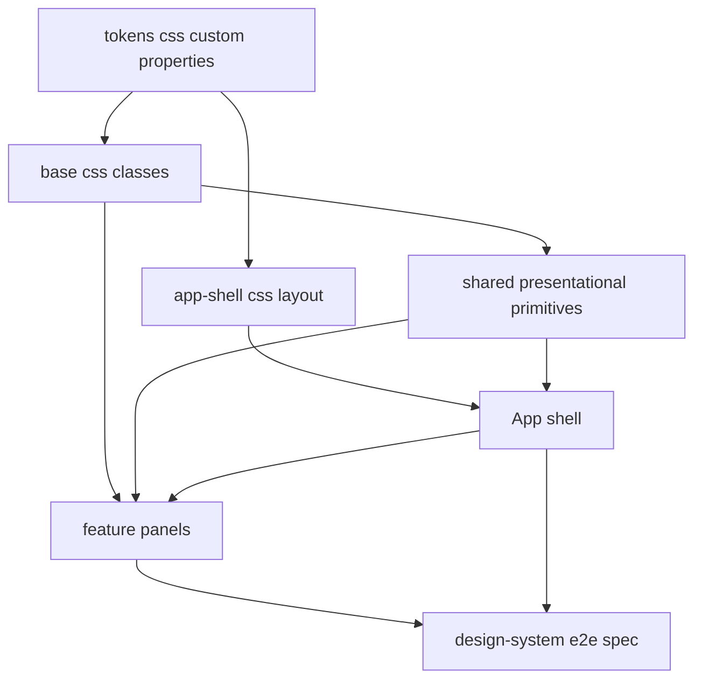
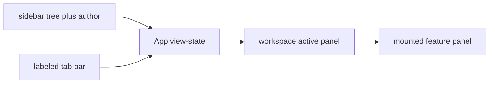

# Design Document: ADR Manager Frontend Redesign

## Overview

**Purpose**: This feature delivers a clear, user-friendly visual identity to the ADR Manager web app (`apps/web`) by applying the canonical "morski"/teal design system (`docs/design.md`) across every surface. It is a presentation-and-layout overhaul, not a behavior change.

**Users**: Engineers who author and browse Architecture Decision Records will gain an interface where decisions, statuses, and relationships are distinguishable at a glance, with a real application shell instead of a single unstyled column.

**Impact**: Today `tokens.css` and the three Google Fonts are wired but unused — no component consumes a token and no component sets a `className`. This feature consumes that foundation: it restructures `App.tsx` into a sidebar + workspace shell, adds reusable design-system CSS classes and presentational primitives, restyles all nine feature components, and adds DOM-level design-verification assertions to the E2E suite. All existing functionality, `data-testid`/ARIA contracts, and API contracts are preserved.

### Goals
- Apply `docs/design.md` tokens, typography, and component specs to every `apps/web` surface (no unstyled fallback).
- Replace the flat single column with a responsive sidebar + workspace shell and human-readable, labeled panel tabs.
- Render domain visuals — ADR cards, status badges, relation chips, machine-identifier chips, diff coloring, similarity meter — consistently via shared primitives.
- Deliver considered empty/loading/error states and the accessibility bar (visible focus, reduced-motion, WCAG AA contrast).
- Verify the design contract through DOM/computed-style E2E assertions.

### Non-Goals
- Any change to ADR behavior, validation, domain logic, persistence, embeddings, git access, or backend routes/contracts.
- New product features, panels, or navigation destinations.
- Editing `docs/design.md`, changing existing `data-testid`/ARIA hooks, or introducing a CSS framework, component library, or router.
- Pixel-baseline visual-regression (`toHaveScreenshot`) and an automated accessibility audit tool (`axe-core`). Accessibility is a manual quality gate.

## Boundary Commitments

### This Spec Owns
- The presentation layer of `apps/web`: a new foundation stylesheet pair (`styles/base.css`, `styles/app-shell.css`), shared presentational primitives in `apps/web/src/components/`, and the `className`/markup-wrapper changes inside `App.tsx` and the nine `features/*` components.
- The mapping from `docs/design.md` component specs to concrete CSS classes and primitive components.
- DOM/computed-style design-verification assertions added to `apps/e2e/tests/`.

### Out of Boundary
- `apps/api`, `packages/core`, `packages/shared` — no changes.
- The contents/authority of `docs/design.md` and `apps/web/src/styles/tokens.css` token values (consumed as-is; `tokens.css` is not re-valued, only extended by new stylesheets that reference it).
- The `playwright-e2e` harness design (config lifecycle, global setup/teardown, helpers) — reused unchanged; this spec only adds a spec file.
- Existing `data-testid` attributes, ARIA roles, `<label>` associations, and API request/response shapes.

### Allowed Dependencies
- Upstream: `docs/design.md` (design contract), `apps/web/src/styles/tokens.css` (CSS custom properties), `@adr/shared` types, the existing `ApiClient`, and the existing `apps/e2e` harness + Playwright `1.56.1` devDependency.
- Constraint: **no new runtime or dev dependency**; no CSS framework, component library, or router. Plain CSS + Vite-native CSS handling only.

### Revalidation Triggers
- Any change to an existing `data-testid`, ARIA role, or `<label htmlFor>` association (would break component/E2E tests).
- Any change to `tokens.css` token names/values (primitives and classes reference them by name).
- Any change to the `apps/e2e` run lifecycle or `testDir`.
- Any change to `ApiClient` method shapes or `@adr/shared` types consumed by the restyled components.

## Architecture

### Existing Architecture Analysis
- **Pattern**: `App.tsx` owns local view-state (`selectedFolder`, `selectedAdrId`, `activePanel`, `authorName`) and mounts one feature panel at a time; each feature owns its `ApiClient` calls. No router. (See `adr-manager` design.)
- **Styling**: single import of `tokens.css` in `main.tsx`; no other CSS; no `className` anywhere. Components return semantic-ish HTML with `data-testid` hooks and label associations.
- **Constraint preserved**: the redesign keeps the view-state ownership, the one-panel-at-a-time model, the DI seam (`apiClient` prop), and every test hook. Only presentation (markup wrappers + classes + display text) changes.

### Architecture Pattern & Boundary Map



**Architecture Integration**:
- Selected pattern: **plain CSS design layer + shared presentational primitives**. Rationale in `research.md` (rejected CSS Modules and Tailwind on boundary/simplicity grounds).
- Feature boundaries: the foundation stylesheets and primitives are shared and built first; each feature panel is then restyled independently (parallel-safe), consuming primitives + classes.
- Existing patterns preserved: view-state in `App.tsx`, per-feature `ApiClient` ownership, DI seam, no router, no new dependency.
- New components rationale: primitives (`StatusBadge`, `RelationChip`, `MonoChip`, `SimilarityMeter`, `AdrCard`) remove cross-feature duplication and give the E2E checks stable elements to assert.
- Steering compliance: no steering directory exists; the governing constraints are the `adr-manager` design's "no framework/router" stance and `docs/design.md`.

### Dependency Direction

`tokens.css` → `base.css` / `app-shell.css` → `components/*` primitives → `App.tsx` shell + `features/*` panels → `apps/e2e` design spec.

Each layer references only layers to its left. Primitives never import feature code; features never redefine primitive markup. CSS files never depend on TS. Violations are treated as errors in review.

### Technology Stack

| Layer | Choice / Version | Role in Feature | Notes |
|-------|------------------|-----------------|-------|
| Frontend | React 18.3 + Vite 5.4 + TypeScript 5.5 (existing) | Restyled components and primitives | No new dependency |
| Styling | Plain CSS custom properties (existing `tokens.css`) + new global stylesheets | Apply `docs/design.md` | No framework / Modules |
| Fonts | Google Fonts link (existing in `index.html`) | Display/body/mono typefaces | Unchanged |
| E2E | Playwright 1.56.1 (existing devDependency) | DOM/computed-style design checks | New spec file only |

## File Structure Plan

### Directory Structure
```
apps/web/src/
├── styles/
│   ├── tokens.css              # EXISTING — design tokens (unchanged)
│   ├── base.css                # NEW — reset, typography application, reusable
│   │                           #       classes: btn, field, card, badge, chip,
│   │                           #       mono-chip, meter, diff, empty/loading/
│   │                           #       error, focus-visible, reduced-motion
│   └── app-shell.css           # NEW — sidebar + workspace grid, tab bar,
│                               #       responsive collapse to mobile
├── components/                 # NEW — shared presentational primitives
│   ├── StatusBadge.tsx         # status -> dot + label + status color classes (R4)
│   ├── RelationChip.tsx        # relation type -> mono chip + colored marker (R5)
│   ├── MonoChip.tsx            # variant id|sha|status -> mono identifier chip (R6)
│   ├── SimilarityMeter.tsx     # score -> teal-gradient bar + mono value (R8)
│   └── AdrCard.tsx             # accent bar + id chip + status badge + title (R3)
├── App.tsx                     # MODIFY — sidebar+workspace shell, labeled tabs
├── main.tsx                    # MODIFY — import base.css + app-shell.css
└── features/                   # MODIFY — apply classes/primitives per panel
    ├── adr-editor/AdrEditor.tsx
    ├── folder-tree/FolderTree.tsx
    ├── relations-graph/RelationsPanel.tsx
    ├── history-timeline/HistoryTimeline.tsx
    ├── diff-viewer/VersionDiffView.tsx
    ├── diff-viewer/AdrCompareView.tsx
    ├── diff-viewer/CompareLauncher.tsx
    ├── search/SearchPanel.tsx
    └── similarity-panel/SimilarityPanel.tsx

apps/e2e/tests/
└── design-system.spec.ts       # NEW — DOM/computed-style design assertions (R13)
```

### Modified Files
- `apps/web/src/main.tsx` — add `import "./styles/base.css"` and `import "./styles/app-shell.css"` after the existing `tokens.css` import.
- `apps/web/src/App.tsx` — restructure into a sidebar (tree + author field) and workspace (active panel) using `app-shell.css`; add a `PANEL_LABELS` map so tabs show human-readable text while keeping `data-testid="panel-tab-<key>"` and `aria-current`; apply `tablist`/`tab`/`tabpanel` roles where missing.
- `apps/web/src/features/*.tsx` (nine files) — apply `base.css` classes and use shared primitives; preserve every `data-testid`, ARIA role, and `<label>`; convert raw status/relation/id/sha/diff/similarity rendering to the corresponding primitive.
- `apps/web/src/features/**/*.test.tsx` and `apps/web/src/App.test.tsx` — update only where new wrapper markup changes a structural query; behavior assertions and testid selectors stay.

## Components and Interfaces

| Component | Domain/Layer | Intent | Req Coverage | Key Dependencies (P0/P1) | Contracts |
|-----------|--------------|--------|--------------|--------------------------|-----------|
| base.css | Styling foundation | Reusable design-system classes + states + a11y | 1.1–1.4, 9.1–9.3, 11.1–11.3 | tokens.css (P0) | — |
| app-shell.css | Styling foundation | Shell layout + responsive | 2.1, 10.1–10.2 | tokens.css (P0) | — |
| StatusBadge | UI primitive | Status → colored dot + label badge | 4.1–4.3 | base.css (P0), @adr/shared AdrStatus (P0) | State |
| RelationChip | UI primitive | Relation → mono chip + marker | 5.1–5.2 | base.css (P0), @adr/shared RelationType (P0) | State |
| MonoChip | UI primitive | ID/SHA/status-key → mono chip | 6.1–6.3 | base.css (P0) | State |
| SimilarityMeter | UI primitive | Score → gradient bar + mono value | 8.1–8.2 | base.css (P0) | State |
| AdrCard | UI primitive | ADR summary card | 3.1–3.3 | StatusBadge, MonoChip, RelationChip (P1) | State |
| App shell | UI shell | Sidebar + workspace + labeled tabs | 2.1–2.4, 10.1, 11.4 | app-shell.css (P0), feature panels (P0) | State |
| feature panels (×9) | UI | Apply design to each panel + states | 1.x, 3.x, 4.x, 5.x, 6.x, 7.x, 8.x, 9.x, 11.x, 12.x | primitives + base.css (P0), ApiClient (P0) | State |
| design-system.spec | E2E verification | Assert design contract via DOM | 13.1–13.3 | apps/e2e harness, Playwright (P0) | — |

Detailed blocks below cover only components introducing a new contract/boundary (the primitives and the E2E spec). The shell and feature panels are presentational restyles of existing behavior and rely on their summary rows plus the Implementation Notes.

### UI Primitives

Shared base props for primitives that forward styling/test hooks:

```typescript
interface BasePrimitiveProps {
  /** Optional extra class appended after the primitive's own design-system class. */
  className?: string;
  /** Optional test hook; primitives never invent testids, callers opt in. */
  "data-testid"?: string;
}
```

#### StatusBadge

| Field | Detail |
|-------|--------|
| Intent | Render an ADR status as a colored dot + human-readable label per the status table |
| Requirements | 4.1, 4.2, 4.3 |

**Responsibilities & Constraints**
- Maps `AdrStatus` → a status modifier class (`badge badge--<status>`) whose colors derive from `--<status>` / `--<status>-bg` tokens.
- Renders a dot element plus a label. A value outside the four known statuses renders the neutral `badge` class (3 / 4.3).
- Pure presentational; no data access.

**Contracts**: State [x]

```typescript
type KnownStatus = "proposed" | "accepted" | "deprecated" | "superseded";

interface StatusBadgeProps extends BasePrimitiveProps {
  /** Accepts the typed status or any raw string; unknown values fall back to neutral. */
  status: KnownStatus | (string & {});
}
```
- Preconditions: none.
- Postconditions: output contains a dot + label; class encodes the status or neutral fallback.
- Invariants: danger tokens are never used here (4 is non-error).

#### RelationChip

| Field | Detail |
|-------|--------|
| Intent | Render a relation as a monospace chip with the type's colored marker |
| Requirements | 5.1, 5.2 |

**Responsibilities & Constraints**
- Maps `RelationType` → marker class per the Relations table: solid teal for `supersedes`/`superseded-by`, solid indigo for `depends-on`, dashed slate for `relates-to`, solid danger for `conflicts-with`.
- Monospace chip; optional target text rendered via `MonoChip`/inline mono.

**Contracts**: State [x]

```typescript
interface RelationChipProps extends BasePrimitiveProps {
  type: import("@adr/shared").RelationType;
  /** Optional related ADR id to display alongside the marker. */
  target?: string;
}
```

#### MonoChip

| Field | Detail |
|-------|--------|
| Intent | Render a machine identifier (ADR id, blob SHA, or status key) as a monospace chip |
| Requirements | 6.1, 6.2, 6.3 |

**Contracts**: State [x]

```typescript
interface MonoChipProps extends BasePrimitiveProps {
  /** id -> teal id chip; sha -> neutral sha chip; status -> neutral status-key chip. */
  variant: "id" | "sha" | "status";
  value: string;
}
```
- Invariants: `id` uses `--teal-700`/`--teal-50`/`--teal-200`; `sha`/`status` use neutral `--ink-500`/`--surface` per the Sygnatura section.

#### SimilarityMeter

| Field | Detail |
|-------|--------|
| Intent | Render a similarity score as a teal-gradient bar proportional to the value, plus a monospace numeric value |
| Requirements | 8.1, 8.2 |

**Contracts**: State [x]

```typescript
interface SimilarityMeterProps extends BasePrimitiveProps {
  /** Normalized similarity in [0, 1]; clamped before rendering. */
  score: number;
}
```
- Preconditions: `score` is finite; values are clamped to `[0,1]`.
- Postconditions: bar fill width is proportional to the clamped score; the numeric value is shown in monospace (e.g., `0.86`).

#### AdrCard

| Field | Detail |
|-------|--------|
| Intent | Present an ADR summary as a card: accent bar, id chip, status badge, title, optional relations/meta |
| Requirements | 3.1, 3.2, 3.3 |

**Contracts**: State [x]

```typescript
interface AdrCardProps extends BasePrimitiveProps {
  id: string;
  title: string;
  status: StatusBadgeProps["status"];
  relations?: ReadonlyArray<import("@adr/shared").AdrRelation>;
  /** Optional footer metadata (date, deciders, sha, similarity). */
  meta?: React.ReactNode;
}
```

**Implementation Notes** (primitives)
- Integration: primitives accept typed `@adr/shared` values from feature panels; they hold no state and make no `ApiClient` calls.
- Validation: unknown status / out-of-range score handled by fallback/clamp; no throwing.
- Risks: none beyond class-name drift; mitigated by centralizing classes in `base.css`.

### E2E Verification

#### design-system.spec

| Field | Detail |
|-------|--------|
| Intent | Assert through the rendered DOM that the design contract holds for key elements |
| Requirements | 13.1, 13.2, 13.3 |

**Responsibilities & Constraints**
- Drives the launched real UI (same `baseURL`/lifecycle as existing specs); asserts computed styles via `toHaveCSS`/`getComputedStyle`.
- Checks: (a) a status badge's color matches the status token; (b) a relation chip's `font-family` is the monospace stack; (c) the ADR card exposes its accent treatment; (d) a keyboard-focused control shows a visible focus outline (non-`none`); (e) panel tabs render human-readable labels, not raw state keys.
- Adds assertions within the existing run lifecycle and `testDir`; introduces no `toHaveScreenshot` and no new dependency (13.2, 13.3).

**Contracts**: none (test artifact).

**Implementation Notes**
- Integration: new file under `apps/e2e/tests/`, auto-discovered; reuses `harness/helpers` `shot()` for artifacts only (not as an oracle).
- Validation: assertions are value-based (computed color/font/outline/text), resilient to font/OS differences.
- Risks: over-tight color assertions — mitigate by comparing against the same token value the component uses (computed `rgb`).

## Requirements Traceability

| Requirement | Summary | Components | Flows |
|-------------|---------|------------|-------|
| 1.1 | Typefaces applied everywhere | base.css, main.tsx | — |
| 1.2 | Colors/spacing/shape from tokens | base.css, app-shell.css | — |
| 1.3 | Component specs honored | all primitives + feature panels | — |
| 1.4 | Danger red reserved for errors | base.css (error classes), feature error states | Error states |
| 2.1 | Sidebar + workspace shell | App shell, app-shell.css | Shell layout |
| 2.2 | Labeled panel controls | App shell (PANEL_LABELS) | — |
| 2.3 | Active panel indicated | App shell (aria-current/active class) | — |
| 2.4 | Guidance when no ADR selected | App shell (panel-empty) | — |
| 3.1–3.3 | ADR cards | AdrCard (+ StatusBadge, MonoChip, RelationChip) | — |
| 4.1–4.3 | Status badges | StatusBadge | — |
| 5.1–5.2 | Relation chips | RelationChip, AdrEditor relations-editor, RelationsPanel | — |
| 6.1–6.3 | Mono identifier chips | MonoChip | — |
| 7.1–7.3 | Diff/compare visualization | base.css diff classes, VersionDiffView, AdrCompareView | — |
| 8.1–8.2 | Similarity meter | SimilarityMeter, SimilarityPanel | — |
| 9.1–9.4 | Empty/loading/error states + voice | base.css state classes, all feature panels | Error/empty states |
| 10.1–10.2 | Responsive layout | app-shell.css, base.css | Responsive |
| 11.1–11.4 | Accessibility bar | base.css (focus, reduced-motion, contrast), App shell labels | — |
| 12.1–12.4 | Behavior/contract preservation | all feature panels (additive classes), main.tsx | — |
| 13.1–13.3 | Design verification | design-system.spec | E2E |

## System Flows

### Shell layout and panel selection (Req 2)



Key decisions: tabs map `activePanel` keys → display labels (`PANEL_LABELS`) while preserving `data-testid="panel-tab-<key>"` and `aria-current`. When `selectedAdrId` is null and the active panel requires a selection, the workspace renders the existing `panel-empty` guidance (2.4) restyled as an empty state (9.2).

## Error Handling

### Error Strategy
Presentation-only: this feature restyles existing error/empty/loading branches; it does not introduce new error categories or alter when they fire.

### Error Categories and Responses
- **Loading** (9.1): each panel's existing loading branch (`*-loading` testids) renders a design-system loading indicator.
- **Empty/no-results** (9.2): existing empty/no-results branches (`*-empty`, `search-no-results`, `similarity-empty`, `panel-empty`) render an inviting empty state, not a blank area.
- **Operation/validation/conflict errors** (9.3, 1.4): existing error branches (`*-error`, `missing-fields-message`, `invalid-relations-message`, `conflict-message`, `folder-conflict-message`) render with the reserved danger treatment and the existing copy. The stale-write conflict message text (`CONFLICT_COPY` in `AdrEditor`) is preserved verbatim (9.4).

### Monitoring
None added; this is a client presentation change. E2E artifacts (screenshots/traces) remain diagnostic only.

## Testing Strategy

### Unit / Component Tests (Vitest, `apps/web`)
- StatusBadge maps each of the four statuses to its modifier class and an unknown value to the neutral class (4.1, 4.3).
- MonoChip renders the correct variant class for `id`/`sha`/`status` (6.1–6.3).
- SimilarityMeter clamps out-of-range scores and sets fill proportional to the value (8.1, 8.2).
- App shell renders human-readable tab labels while keeping `panel-tab-<key>` testids and marks the active tab (2.2, 2.3).
- Regression: existing feature component tests still pass with additive markup (12.1, 12.2).

### E2E / Design Verification (Playwright, `apps/e2e`)
- Status badge computed color matches the status token for at least one status (13.1).
- Relation chip computed `font-family` is the monospace stack (13.1).
- ADR card exposes its accent treatment (13.1).
- A keyboard-focused interactive element shows a visible (non-`none`) focus outline (11.1, 13.1).
- Panel tabs display human-readable labels (13.1); existing journey specs still pass unchanged (12.2, 13.2); no `toHaveScreenshot` is introduced (13.3).

### Manual Accessibility Gate
- Verify WCAG AA text contrast, reduced-motion suppression, and mobile responsiveness during implementation/validation (11.2, 11.3, 10.1, 10.2). Not automated (no `axe-core`).

## Supporting References
- `docs/design.md` — token values, component specs, UI voice, accessibility bar (canonical; consumed unchanged).
- `.kiro/specs/adr-manager-frontend-redesign/research.md` — discovery findings, pattern evaluation, and decision rationale.
- `.kiro/specs/adr-manager/design.md` `## UI Design System` — upstream mapping this spec realizes.
