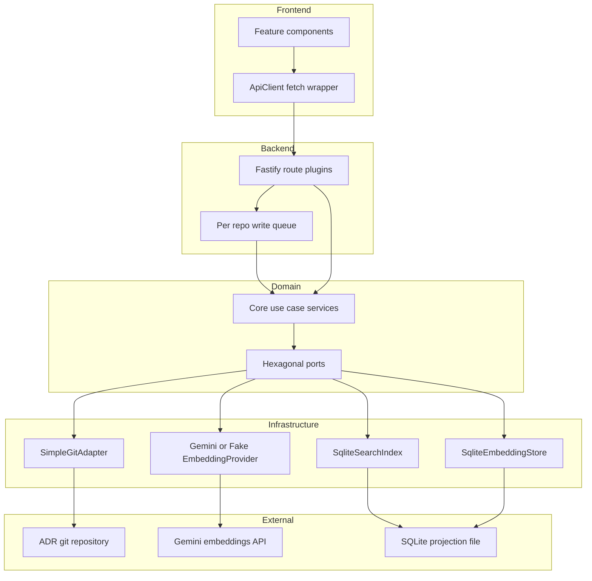
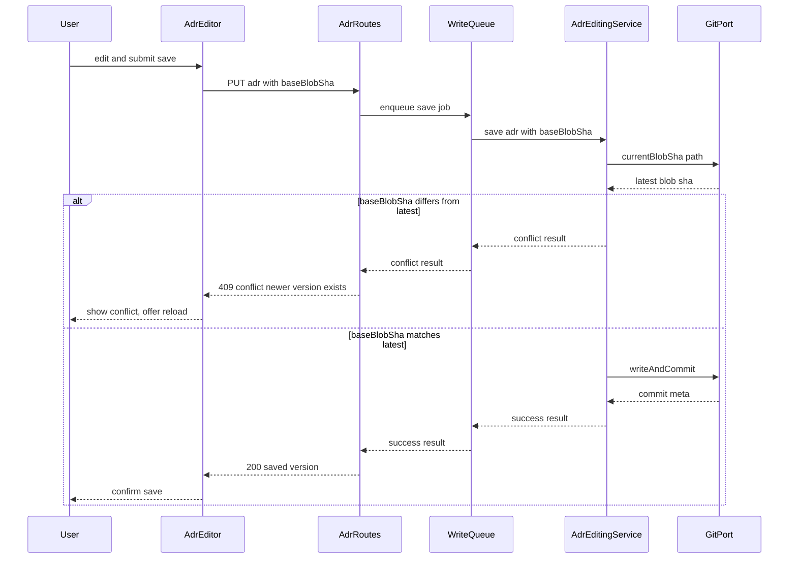
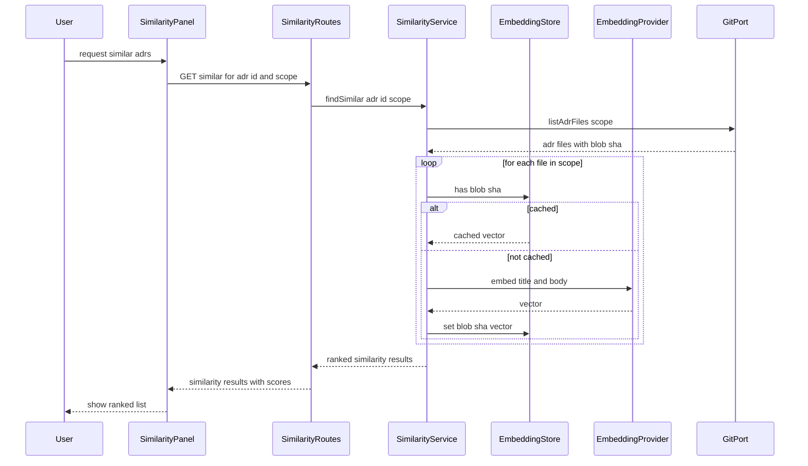

# Design Document: ADR Manager

> Reorders the template slightly: Requirements Traceability is placed after Architecture and before the detailed Components section so reviewers can see *what* must be built before *how* each piece is implemented.

## Overview

ADR Manager adds a GUI and API layer on top of a git repository of MADR-format Markdown files, while keeping that git repository as the sole source of truth. It delivers guided authoring with optimistic-concurrency-safe saves, folder organization and tree browsing, typed cross-ADR relationships with reciprocal display, git-derived version history, version-to-version and ADR-to-ADR comparisons, keyword search, and folder-scoped semantic similarity search backed by a fully rebuildable SQLite projection.

**Purpose**: This feature delivers a usable GUI and structured tooling layer to teams who currently maintain ADRs as raw Markdown files with only a text editor and git CLI.
**Users**: ADR authors (create/edit/relate ADRs), ADR readers (browse/search/compare/view history), and an ADR Manager operator (triggers projection rebuilds).
**Impact**: Replaces the current empty scaffold (`apps/web/src/App.tsx` placeholder, `apps/api/src/server.ts` with only `/health`) with working domain services, API routes, and UI features, and extends `GitPort` with two new methods plus a new `SqliteSearchIndex` adapter. No existing contract is removed or broken.

### Goals
- Let an author create, edit, and save ADRs through a guided editor with required-field validation and optimistic-concurrency-safe saves (Req 1, 2).
- Let a maintainer organize ADRs into folders and let any reader browse/navigate the resulting tree (Req 3, 4).
- Support typed, reciprocal relationships between ADRs (Req 5).
- Provide git-derived version history, version diff, and ADR-to-ADR field comparison (Req 6, 7, 8).
- Provide ranked keyword search and folder-scoped semantic similarity search (Req 9, 10).
- Guarantee the search/similarity projection is fully and repeatably rebuildable from git alone (Req 11).

### Non-Goals
- Status lifecycle enforcement, tag taxonomy management, schema validation beyond required-field checks, automatic `supersedes` detection, export — all explicitly out of scope per requirements.
- Authentication, login sessions, or role-based permissions — explicitly out of scope for this iteration.
- Provisioning the ADR git repository itself, or selecting/configuring the embedding provider — both are adjacent expectations this spec depends on but does not own.
- A persisted (materialized) folder-tree or relations projection in SQLite — both stay live-computed from git (see `research.md`).

## Boundary Commitments

### This Spec Owns
- GUI screens and API endpoints for: ADR create/edit with optimistic concurrency (Req 1, 2), folder create/move and tree browsing (Req 3, 4), typed relationships with reciprocal display (Req 5), version history and version content retrieval (Req 6), version diff (Req 7), ADR-to-ADR field comparison (Req 8), keyword search (Req 9), folder-scoped similarity search (Req 10), and rebuild of the search/similarity projection from git (Req 11).
- Two new `GitPort` methods (`listTreeEntries`, `move`) and the updated `--follow` semantics of `log()`.
- A new `SqliteSearchIndex` adapter implementing the existing `SearchIndex` port.
- The shape of new shared view types: `AdrSummary`, `FolderNode`, `RelationView`, `VersionDiffView`/`DiffHunk`, `FieldComparison`/`AdrCompareView`, `SimilarityResult`.
- The per-repo `WriteQueue` serialization guarantee for concurrent saves (Req 2.4).

### Out of Boundary
- Authentication, login sessions, role-based permissions — author identity stays a free-text field per save, as stated in the requirements' Introduction.
- Status lifecycle workflow, tag taxonomy, schema validation beyond required fields, automatic `supersedes` detection, export.
- Initial provisioning of the ADR git repository (assumed to already exist and be reachable).
- Choosing or swapping the embedding/similarity provider (the existing `GeminiEmbeddingProvider`/`FakeEmbeddingProvider` are reused unchanged).
- Any persisted relations or folder-tree table in SQLite — both are computed live from git on every request to keep git the sole authoritative source (Req 11.1).

### Allowed Dependencies
- Existing ports (`GitPort`, `EmbeddingProvider`, `EmbeddingStore`, `SearchIndex`) and their existing adapters (`SimpleGitAdapter`, `GeminiEmbeddingProvider`, `FakeEmbeddingProvider`, `SqliteEmbeddingStore`) — extended, not replaced.
- `better-sqlite3`'s bundled FTS5 extension (no new package).
- `simple-git`'s existing API surface (`.mv()`, `.raw()`, `.log()`) for the two new `GitPort` methods.
- The existing Fastify app instance, `config.ts`, and workspace packages (`@adr/core`, `@adr/shared`).

### Revalidation Triggers
- Any change to the `GitPort`, `EmbeddingProvider`, `EmbeddingStore`, or `SearchIndex` contracts.
- Introduction of an authentication/authorization spec — would change the free-text author model this design assumes throughout.
- A future migration from SQLite to PostgreSQL+pgvector (the scaling path stated in `README.md`) — would replace the SQLite adapters and revisit the live-computation-vs-persisted-projection trade-off for relations/tree.
- Any change to the MADR frontmatter schema (`AdrFrontmatter`) — this design's parsing and validation assumptions depend on its current shape.

## Architecture

### Existing Architecture Analysis
- The codebase already implements hexagonal/ports-and-adapters: `packages/core` is zero-I/O domain code depending only on port interfaces; concrete adapters live under `apps/api/src/infrastructure/{git,embeddings,persistence}`.
- `GitPort` covers read, current-blob-SHA lookup, write-and-commit, log, diff, and flat ADR-file listing — but has no tree-listing or move/rename method.
- `SearchIndex` is defined as a port but has no adapter yet; `EmbeddingStore`/`EmbeddingProvider` are fully wired (`SqliteEmbeddingStore`, `GeminiEmbeddingProvider`, `FakeEmbeddingProvider`).
- `apps/web/src/App.tsx` and `apps/api/src/server.ts` are placeholders that already name the intended feature/route boundaries in comments — this design follows that existing naming exactly (see File Structure Plan).
- This is an **extension**: no new architectural pattern is introduced; new use-case services are added inside `packages/core`, consuming existing and two new port methods.

### Architecture Pattern & Boundary Map



**Architecture Integration**:
- Selected pattern: continue hexagonal/ports-and-adapters (no alternative seriously evaluated — see `research.md` Architecture Pattern Evaluation).
- Domain/feature boundaries: each requirement area gets one core service (`AdrEditingService`, `FolderService`, `RelationGraphService`, `HistoryService`, `ComparisonService`, `SearchService`, `SimilarityService`); each service depends only on port interfaces, never on a concrete adapter or Fastify.
- Existing patterns preserved: `packages/core` stays zero-I/O; adapters stay under `apps/api/src/infrastructure`; tests keep using `FakeEmbeddingProvider` and a tmp-dir git repo.
- New components rationale: one service per requirement area keeps each save/read use case independently testable and keeps route handlers thin (HTTP translation only).
- Steering compliance: no steering files exist yet in this repo (`.kiro/steering/` is empty); design instead follows `README.md`'s stated architecture and the existing scaffold's own naming, which serve the same role here.

### Technology Stack

| Layer | Choice / Version | Role in Feature | Notes |
|-------|------------------|------------------|-------|
| Frontend | React 18.3 + Vite 5.4 + TypeScript (`apps/web`) | Feature panels (editor, tree, relations, history, diff, search, similarity) | No new dependency; no router added (see `research.md`) |
| Styling | Plain CSS custom properties + Google Fonts (Bricolage Grotesque, Hanken Grotesk, JetBrains Mono) | Visual design system (color, type, spacing, shape tokens) for every `apps/web` feature | No new npm dependency; tokens defined in `docs/design.md`, see UI Design System below |
| Backend / Services | Node.js + Fastify 4.28 + TypeScript (`apps/api`) | Route plugins, composition root, write queue | New route plugins only; same Fastify instance |
| Domain Core | Pure TypeScript (`packages/core`) | New use-case services, extended `GitPort` | Zero I/O preserved; depends only on ports |
| Data / Storage | better-sqlite3 ^11.3.0 (FTS5 + existing `embedding_cache`) | New `adr_fts` virtual table for keyword search | FTS5 already compiled in; no new package |
| Git Access | simple-git ^3.25.0 | `.mv()` for move, `--follow` for history continuity | Existing dependency, two new `GitPort` methods |
| Embeddings | Gemini `text-embedding-004` via existing `GeminiEmbeddingProvider`/`FakeEmbeddingProvider` | Similarity vectors, cached by blob SHA | Unchanged; reused as-is |
| Frontmatter | gray-matter ^4.0.3 | Parse/serialize MADR frontmatter | Unchanged (`parseAdr`/`serializeAdr`) |

## File Structure Plan

### Directory Structure
```
packages/core/src/
├── ports/
│   └── git.ts                  # MODIFIED: + TreeEntry, listTreeEntries, move
├── adr/
│   └── editingService.ts       # NEW: AdrEditingService (create/save, validation, concurrency, reciprocity, search upsert)
├── folders/
│   └── folderService.ts        # NEW: FolderService (createFolder, moveAdr, buildTree)
├── relations/
│   └── relationGraphService.ts # NEW: RelationGraphService (inbound+outbound view, target-exists check)
├── history/
│   └── historyService.ts       # NEW: HistoryService (timeline, version content)
├── compare/
│   └── comparisonService.ts    # NEW: ComparisonService (version diff, ADR field diff)
├── search/
│   └── searchService.ts        # NEW: SearchService (thin wrapper over SearchIndex)
├── similarity/
│   └── similarityService.ts    # NEW: SimilarityService (folder-scoped ranking, cache-first lookups)
└── index.ts                    # MODIFIED: export new services

packages/shared/src/
└── types.ts                    # MODIFIED: + AdrSummary, FolderNode, RelationView, VersionDiffView,
                                 #            DiffHunk, FieldComparison, AdrCompareView, SimilarityResult,
                                 #            and request DTOs (CreateAdrRequest, UpdateAdrRequest,
                                 #            CreateFolderRequest, MoveAdrRequest)

apps/api/src/
├── container.ts                       # NEW: composition root — wires adapters into core services
├── server.ts                          # MODIFIED: registers route plugins from container.ts
├── routes/
│   ├── adrs.ts                        # NEW: create/get/update ADR
│   ├── folders.ts                     # NEW: create folder, move ADR, get tree
│   ├── relations.ts                   # NEW: get relations for an ADR
│   ├── history.ts                     # NEW: get history, get version, get version diff
│   ├── compare.ts                     # NEW: get ADR-to-ADR comparison
│   ├── search.ts                      # NEW: keyword search
│   └── similarity.ts                  # NEW: folder-scoped similarity search
├── infrastructure/
│   ├── git/simpleGitAdapter.ts        # MODIFIED: + listTreeEntries, move; log() now uses --follow
│   ├── persistence/
│   │   └── sqliteSearchIndex.ts       # NEW: SqliteSearchIndex (FTS5-backed)
│   └── concurrency/writeQueue.ts      # NEW: WriteQueue (per-repo serialized saves)
└── scripts/reindex.ts                 # MODIFIED: also populates SqliteSearchIndex; prunes stale ids

apps/web/
├── index.html                              # MODIFIED: add Google Fonts <link> (Bricolage Grotesque, Hanken Grotesk, JetBrains Mono)
└── src/
    ├── App.tsx                            # MODIFIED: real shell with local view-state navigation
    ├── main.tsx                           # MODIFIED: import ./styles/tokens.css
    ├── api/client.ts                      # NEW: ApiClient (typed fetch wrapper over @adr/shared types)
    ├── styles/tokens.css                  # NEW: design tokens (CSS custom properties) from docs/design.md
    └── features/
        ├── adr-editor/AdrEditor.tsx       # NEW: Req 1, 2, 5.1, 5.4, 5.5 (relation add/remove); author from App.tsx session state
        ├── folder-tree/FolderTree.tsx     # NEW: Req 3, 4 (incl. create folder, move ADR); author from App.tsx session state
        ├── relations-graph/RelationsPanel.tsx # NEW: Req 5.2, 5.3 (read-only relation view)
        ├── history-timeline/HistoryTimeline.tsx # NEW: Req 6
        ├── diff-viewer/VersionDiffView.tsx # NEW: Req 7
        ├── diff-viewer/AdrCompareView.tsx  # NEW: Req 8
        ├── diff-viewer/CompareLauncher.tsx # NEW: selects the two versions (Req 7) / two ADRs (Req 8) to compare
        ├── search/SearchPanel.tsx          # NEW: Req 9
        └── similarity-panel/SimilarityPanel.tsx # NEW: Req 10
```
The `apps/web/src/features/*` layout matches the feature names already named in the existing `App.tsx` scaffold comment; `apps/api/src/routes/*` matches the module names already named in the existing `server.ts` TODO comment.

### Modified Files
- `packages/core/src/ports/git.ts` — add `TreeEntry { path: string; type: "folder" | "adr" }`, `listTreeEntries(rootPath): Promise<TreeEntry[]>`, `move(fromPath, toPath, message, author): Promise<CommitMeta>`.
- `apps/api/src/infrastructure/git/simpleGitAdapter.ts` — implement the two new methods; change `log()` to pass `--follow`.
- `apps/api/src/scripts/reindex.ts` — after upserting current ADRs into `EmbeddingStore`, also upsert into `SqliteSearchIndex`, then remove any indexed id no longer present among current ADR files.
- `apps/api/src/server.ts` — replace the TODO with registration of the seven route plugins built from `container.ts`.
- `apps/web/src/App.tsx` — replace the static placeholder with a shell holding `{ selectedFolder, selectedAdrId, activePanel, authorName }` view-state, a panel-switching control, a session author-name input, and rendering the relevant feature components.
- `docs/design.md` — NEW. Visual design system (color/type/spacing/shape tokens, component conventions, voice, accessibility bar) authored independently of this spec; canonical styling reference for all `apps/web` features. See UI Design System below.
- `apps/web/index.html` — add the Google Fonts `<link>` for Bricolage Grotesque / Hanken Grotesk / JetBrains Mono.
- `apps/web/src/styles/tokens.css` — NEW. The `:root` CSS custom properties block from `docs/design.md`, imported once in `main.tsx`.

## UI Design System

`docs/design.md` is the canonical visual design system for every `apps/web` component built by this spec ("morski" / teal variant). It was authored independently of this design and is treated as a Supporting Reference (see below) rather than duplicated here; this section only records how its tokens and conventions tie back to specific requirements and components.

- **Delivery mechanism**: plain CSS custom properties (`apps/web/src/styles/tokens.css`, imported once in `main.tsx`) plus a Google Fonts `<link>` in `apps/web/index.html`. No CSS framework or component library is introduced — consistent with this design's existing no-new-dependency stance (see "No frontend router" decision in `research.md`).
- **Status badges** (Req 1.5, 4.2) — `AdrSummary.status` and `Adr.status` render using the four-status color table (`proposed`/`accepted`/`deprecated`/`superseded`) in `FolderTree`, `AdrEditor`, and `HistoryTimeline` wherever a status badge appears.
- **Relation chips** (Req 5.1, 5.3) — `RelationsPanel` (read-only display) and `AdrEditor` (relation add/remove controls) both render each relation as a monospace chip with the colored marker from the design system's Relations table: solid teal for `supersedes`/`superseded-by`, solid indigo for `depends-on`, dashed slate for `relates-to`, solid danger-red for `conflicts-with`.
- **Diff view** (Req 7.2) — `VersionDiffView` and `AdrCompareView` use the `--add`/`--del` tokens (text + background) for added/removed lines, with line numbers on `--surface`.
- **Similarity meter** (Req 10.2) — `SimilarityPanel` renders the teal-gradient bar plus a monospace score (e.g. `0.86`) per the "Miara podobieństwa" component spec.
- **Similarity scope source** (Req 10.1) — `SimilarityPanel` scopes `findSimilar` to `App.tsx`'s `selectedFolder` view-state (the folder currently selected in `FolderTree`); if no folder is selected, it falls back to the open ADR's own containing folder.
- **Conflict and validation errors** (Req 1.3, 2.2, 2.3, 3.3, 5.4, 7.3, 8.3) — all use the reserved `--danger`/`--danger-bg` tokens for field/error states. This spec defines no irreversible delete action, so the `danger` button variant itself is not used; `--danger` appears only for error and 409-conflict states. Error copy follows the system's voice rule (state what happened and how to fix it, no apology) — e.g. Req 2.2's stale-write conflict message mirrors the design system's own example: "Plik zmienił się od ostatniego odczytu. Odśwież i zapisz ponownie."
- **Machine identifiers** — `AdrSummary.id` / `Adr.id` (ADR ID), `CommitMeta.sha` (blob SHA), and raw `AdrStatus` keys are always rendered in JetBrains Mono per the design system's monospace signature rule, across `FolderTree`, `HistoryTimeline`, and `AdrEditor`.
- **Accessibility bar** — visible keyboard focus, mobile responsiveness, respect for `prefers-reduced-motion`, and WCAG AA text contrast apply to every new component listed in the File Structure Plan's `apps/web/src/features/*` tree; verified during this spec's implementation/testing phase, not re-specified per component.

## System Flows

### Save with optimistic concurrency (Req 2)

`WriteQueue` is keyed by the single configured repo path (one Fastify process owns one `ADR_REPO_PATH`), so every save — successful or rejected — runs strictly one at a time, satisfying Req 2.4 without a database-level lock.

### Folder-scoped similarity search (Req 10)

Because `EmbeddingStore` is keyed by blob SHA, an edited ADR gets a new blob SHA on its next save, so this loop always misses the stale cache entry and recomputes — Req 10.4 is satisfied with no explicit cache-invalidation step.

## Requirements Traceability

| Requirement | Summary | Components | Interfaces | Flows |
|---|---|---|---|---|
| 1.1 | Pre-fill id/title/status/date on new ADR | AdrEditor, AdrEditingService | POST /api/adrs | — |
| 1.2 | Persist all fields as one saved version | AdrEditingService, GitAdapter | PUT /api/adrs/:id | Save flow |
| 1.3 | Reject save missing title/body, list missing fields | AdrEditingService | PUT /api/adrs/:id (400) | Save flow |
| 1.4 | Show currently saved content while editing | AdrEditor, ApiClient | GET /api/adrs/:id | — |
| 1.5 | Status editable as one of 4 fixed values | AdrEditor | PUT /api/adrs/:id | — |
| 1.6 | Author name entry per save | App.tsx, AdrEditor, AdrEditingService | PUT /api/adrs/:id | Save flow |
| 2.1 | Track loaded version (base blob SHA) | AdrEditor | GET /api/adrs/:id | — |
| 2.2 | Reject save if newer version exists | AdrEditingService, GitAdapter | PUT /api/adrs/:id (409) | Save flow |
| 2.3 | Allow reload of latest after conflict | AdrEditor, ApiClient | GET /api/adrs/:id | Save flow |
| 2.4 | Serialize concurrent saves, no lost writes | WriteQueue | — | Save flow |
| 2.5 | Confirm save, refresh editor to new version | AdrEditor, AdrEditingService | PUT /api/adrs/:id (200) | Save flow |
| 3.1 | Create folder at specified location | FolderTree, FolderService, GitAdapter | POST /api/folders | — |
| 3.2 | Move ADR, preserve id/content/relations/history | FolderTree, FolderService, GitAdapter | POST /api/adrs/:id/move | — |
| 3.3 | Reject duplicate folder name at same location | FolderTree, FolderService | POST /api/folders (409) | — |
| 4.1 | Display full tree from repo root by default | FolderTree, FolderService | GET /api/tree | — |
| 4.2 | Each ADR entry shows title, id, status | FolderTree, FolderService | GET /api/tree | — |
| 4.3 | Expanding a folder shows its direct children | FolderTree | GET /api/tree | — |
| 4.4 | Collapsing hides children without removing them | FolderTree | — (client-side state) | — |
| 4.5 | Empty folder shown as empty, not omitted | FolderService | GET /api/tree | — |
| 4.6 | Selecting a folder filters to its subtree | FolderTree, FolderService | GET /api/tree | — |
| 4.7 | Selecting an ADR opens it for viewing | FolderTree, AdrEditor | GET /api/adrs/:id | — |
| 5.1 | Relation type required from fixed 5-value set | AdrEditor, AdrEditingService | PUT /api/adrs/:id | — |
| 5.2 | Supersedes implies reciprocal superseded-by | RelationGraphService | GET /api/adrs/:id/relations | — |
| 5.3 | Show all relations, declared here or pointing here | RelationGraphService, RelationsPanel | GET /api/adrs/:id/relations | — |
| 5.4 | Reject relation to nonexistent target | AdrEditor, AdrEditingService, RelationGraphService | PUT /api/adrs/:id (400) | — |
| 5.5 | Removing a relation removes its reciprocal | AdrEditor, RelationGraphService | PUT /api/adrs/:id | — |
| 6.1 | Timeline with author, date, message per version | HistoryService, GitAdapter | GET /api/adrs/:id/history | — |
| 6.2 | Selecting a version shows its full content | HistoryService, GitAdapter | GET /api/adrs/:id/versions/:sha | — |
| 6.3 | Timeline ordered newest to oldest | HistoryService | GET /api/adrs/:id/history | — |
| 6.4 | Single-version ADR shown without implying priors | HistoryTimeline | GET /api/adrs/:id/history | — |
| 7.1 | Show diff between two versions of same ADR | CompareLauncher, ComparisonService, GitAdapter | GET /api/adrs/:id/diff | — |
| 7.2 | Visually distinguish added/removed/unchanged | VersionDiffView | GET /api/adrs/:id/diff | — |
| 7.3 | Reject single-version or cross-ADR comparison | CompareLauncher, ComparisonService | GET /api/adrs/:id/diff (400) | — |
| 8.1 | Side-by-side title/status/date/deciders/tags/body | CompareLauncher, ComparisonService | GET /api/compare | — |
| 8.2 | Visually distinguish differing vs identical fields | AdrCompareView | GET /api/compare | — |
| 8.3 | Reject comparing an ADR against itself | CompareLauncher, ComparisonService | GET /api/compare (400) | — |
| 9.1 | Match search term against title/tags/body | SearchService, SqliteSearchIndex | GET /api/search | — |
| 9.2 | Rank closer matches above weaker ones | SqliteSearchIndex (bm25) | GET /api/search | — |
| 9.3 | Inform user when no results found | SearchPanel | GET /api/search (200, empty) | — |
| 9.4 | Selecting a result opens that ADR | SearchPanel, AdrEditor | GET /api/adrs/:id | — |
| 10.1 | Similar ADRs from same folder subtree, ranked by meaning | SimilarityService | GET /api/adrs/:id/similar | Similarity flow |
| 10.2 | Show similarity score/ranking per suggestion | SimilarityService | GET /api/adrs/:id/similar | Similarity flow |
| 10.3 | Inform user when subtree has no other ADRs | SimilarityPanel | GET /api/adrs/:id/similar (200, empty) | Similarity flow |
| 10.4 | Similarity reflects updated body content | SimilarityService, EmbeddingStore | GET /api/adrs/:id/similar | Similarity flow |
| 11.1 | Git is sole authoritative source for content/status/relations/tags/history | All core services | — | — |
| 11.2 | Operator-triggered rebuild regenerates from current repo state | reindex.ts | `pnpm reindex` (CLI) | — |
| 11.3 | Full restore of search/similarity from repo, no ADR data loss | reindex.ts, SqliteSearchIndex, SqliteEmbeddingStore | `pnpm reindex` (CLI) | — |
| 11.4 | Repeated rebuilds produce no duplicate/inconsistent results | reindex.ts | `pnpm reindex` (CLI) | — |

## Components and Interfaces

| Component | Domain/Layer | Intent | Req Coverage | Key Dependencies (P0/P1) | Contracts |
|---|---|---|---|---|---|
| AdrEditingService | Core | Create/save ADR with validation, concurrency check, reciprocity, search upsert | 1, 2, 5.1, 5.4 | GitPort (P0), RelationGraphService (P0), SearchIndex (P1) | Service |
| FolderService | Core | Create folder, move ADR, build folder tree | 3, 4 | GitPort (P0) | Service |
| RelationGraphService | Core | Compute inbound+outbound relation view; validate targets exist | 5 | GitPort (P0) | Service |
| HistoryService | Core | Timeline and historical version content | 6 | GitPort (P0) | Service |
| ComparisonService | Core | Version diff and ADR-to-ADR field diff | 7, 8 | GitPort (P0) | Service |
| SearchService | Core | Thin pass-through ranking wrapper | 9 | SearchIndex (P0) | Service |
| SimilarityService | Core | Folder-scoped similarity ranking, cache-first lookup | 10 | GitPort (P0), EmbeddingStore (P0), EmbeddingProvider (P1) | Service |
| WriteQueue | Infrastructure | Serialize concurrent saves per repo | 2.4 | — | State |
| SimpleGitAdapter (extension) | Infrastructure | Implements GitPort, incl. new tree/move methods | 3, 4, 6 | simple-git (P0) | Service |
| SqliteSearchIndex | Infrastructure | Implements SearchIndex via FTS5 | 9, 11 | better-sqlite3 (P0) | Service |
| AdrRoutes / FolderRoutes / RelationRoutes / HistoryRoutes / CompareRoutes / SearchRoutes / SimilarityRoutes | Backend | Fastify plugins translating HTTP to core services | 1–10 | container.ts services (P0) | API |
| reindex.ts (extended) | Backend / Batch | Rebuild EmbeddingStore + SqliteSearchIndex from git | 11 | GitPort, EmbeddingProvider/Store, SearchIndex (all P0) | Batch |
| ApiClient | Frontend | Typed fetch wrapper | 1–10 | Fastify routes (P0) | API (client) |
| AdrEditor | Frontend | Create/edit form, conflict UI, status input, relation add/remove | 1, 2, 5.1, 5.4, 5.5 | ApiClient (P0) | State |
| FolderTree | Frontend | Tree browse, expand/collapse, folder/ADR selection, create folder, move ADR | 3.1, 3.2, 4 | ApiClient (P0) | State |
| RelationsPanel | Frontend | Read-only display of an ADR's relations (declared + reciprocal) | 5.2, 5.3 | ApiClient (P0) | State |
| HistoryTimeline | Frontend | Chronological version list, version selection | 6 | ApiClient (P0) | State |
| VersionDiffView | Frontend | Added/removed/unchanged highlighting for 2 versions | 7 | ApiClient (P0) | State |
| AdrCompareView | Frontend | Side-by-side field comparison, diff highlighting | 8 | ApiClient (P0) | State |
| SearchPanel | Frontend | Search box, ranked results, empty-state message | 9 | ApiClient (P0) | State |
| SimilarityPanel | Frontend | Ranked similarity list, empty-state message | 10 | ApiClient (P0) | State |

Only components introducing a new boundary (core services, the write queue, the two infrastructure adapters, and the route layer/batch script) get full detail blocks below. Frontend presentational components rely on the summary row above plus a short Implementation Note.

### Core Domain Services

#### AdrEditingService

| Field | Detail |
|-------|--------|
| Intent | Create and save ADRs with required-field validation, optimistic-concurrency check, and relation-target validation |
| Requirements | 1.1, 1.2, 1.3, 1.4, 1.5, 1.6, 2.1, 2.2, 2.3, 2.4, 2.5, 5.1, 5.4 |

**Responsibilities & Constraints**
- Generates a new ADR id and pre-filled frontmatter on create (1.1).
- Rejects a save when `title` or `body` is empty, returning which fields are missing (1.3).
- Compares the caller-supplied `baseBlobSha` against `GitPort.currentBlobSha(path)`; rejects with a conflict result if they differ (2.2).
- Validates every `relations[].target` against `RelationGraphService` before committing; rejects if any target ADR id does not exist (5.4).
- On successful commit, upserts the saved ADR into `SearchIndex` (keeps Req 9 results fresh immediately).
- Does not itself serialize concurrent calls — that is `WriteQueue`'s job; this service is safe to call only one-at-a-time per repo.

**Dependencies**
- Outbound: `GitPort` — read current blob SHA, write and commit (P0).
- Outbound: `RelationGraphService` — target-existence check (P0).
- Outbound: `SearchIndex` — upsert after save (P1; failure to index does not fail the save).

**Contracts**: Service [x] / API [ ] / Event [ ] / Batch [ ] / State [ ]

##### Service Interface
```typescript
interface AdrEditingService {
  create(input: CreateAdrInput, author: string): Promise<Adr>;
  save(id: string, input: SaveAdrInput, baseBlobSha: string, author: string): Promise<SaveResult>;
}

type SaveResult =
  | { kind: "saved"; adr: Adr }
  | { kind: "conflict"; latest: Adr }
  | { kind: "invalid"; missingFields: string[] }
  | { kind: "invalidRelations"; missingTargets: string[] };
```
- Preconditions: `input.title` and `input.body` are present for `save` to reach the commit step.
- Postconditions: on `"saved"`, the ADR file is committed and the search index reflects the new content.
- Invariants: a commit is only ever produced when `baseBlobSha` equals the path's current blob SHA at the moment of the check.

#### FolderService

| Field | Detail |
|-------|--------|
| Intent | Create folders, move ADRs between folders, and build the folder/ADR tree |
| Requirements | 3.1, 3.2, 3.3, 4.1, 4.2, 4.3, 4.5, 4.6 |

**Responsibilities & Constraints**
- `createFolder(path, author)` rejects if a folder already exists at that exact path (3.3); otherwise writes a `.gitkeep` placeholder via `GitPort.writeAndCommit`, which requires the same `author` as any other commit (3.1).
- `moveAdr(id, targetFolder, author)` resolves the ADR's current path, calls `GitPort.move`, and leaves id/content/relations untouched; history continuity comes from `--follow` in `GitPort.log` (3.2).
- `buildTree(rootPath)` combines `GitPort.listTreeEntries` (folders) with `GitPort.listAdrFiles` (ADRs, parsed for title/id/status) into a `FolderNode` tree, including folders with no children (4.5).

**Dependencies**
- Outbound: `GitPort` — `listTreeEntries`, `listAdrFiles`, `read` (for frontmatter), `writeAndCommit`, `move` (all P0).

**Contracts**: Service [x] / API [ ] / Event [ ] / Batch [ ] / State [ ]

##### Service Interface
```typescript
interface FolderService {
  createFolder(path: string, author: string): Promise<CreateFolderResult>;
  moveAdr(id: string, targetFolder: string, author: string): Promise<MoveAdrResult>;
  buildTree(rootPath: string): Promise<FolderNode>;
}

type CreateFolderResult = { kind: "created"; node: FolderNode } | { kind: "conflict" };
type MoveAdrResult = { kind: "moved"; adr: Adr } | { kind: "notFound" };
```
- Preconditions: `targetFolder` need not already exist as an empty folder; moving into a new path is allowed.
- Postconditions: `buildTree` always returns every folder under `rootPath`, including ones with zero subfolders and zero ADRs.
- Invariants: `.gitkeep` files are never surfaced as ADR entries.

#### RelationGraphService

| Field | Detail |
|-------|--------|
| Intent | Compute the full relation view (declared + reciprocal) for an ADR and validate relation targets |
| Requirements | 5.1, 5.2, 5.3, 5.4, 5.5 |

**Responsibilities & Constraints**
- `relationsFor(id)` scans all ADRs (via `GitPort.listAdrFiles` + `read`/parse) and returns both relations declared on `id` and relations declared on other ADRs that point to `id`, deriving the reciprocal type (`supersedes` &harr; `superseded-by`; all other types are symmetric "relates-to"/"depends-on"/"conflicts-with" shown on both sides as the same type) (5.2, 5.3).
- `targetExists(targetId)` is used by `AdrEditingService` before commit (5.4).
- Removing a relation is a side effect of `AdrEditingService.save` writing a `relations` array without that entry; because the reciprocal view is always recomputed live, the reciprocal disappears automatically on the next read — no separate removal step is needed (5.5).

**Dependencies**
- Outbound: `GitPort` — `listAdrFiles`, `read` (P0).

**Contracts**: Service [x] / API [ ] / Event [ ] / Batch [ ] / State [ ]

##### Service Interface
```typescript
interface RelationGraphService {
  relationsFor(id: string): Promise<RelationView[]>;
  targetExists(targetId: string): Promise<boolean>;
}
```
- Preconditions: none.
- Postconditions: `relationsFor` result always includes both `direction: "outbound"` (declared here) and `direction: "inbound"` (declared elsewhere, pointing here) entries.
- Invariants: a relation's reciprocal is never separately persisted; it is always derived.

#### HistoryService

| Field | Detail |
|-------|--------|
| Intent | Provide the chronological version timeline and historical version content |
| Requirements | 6.1, 6.2, 6.3, 6.4 |

**Responsibilities & Constraints**
- `timeline(id)` returns `GitPort.log(path)` results (newest first, per `simple-git`'s default ordering) (6.1, 6.3); a single-commit history naturally renders as one entry without synthesizing any "prior version" marker (6.4).
- `versionAt(id, sha)` reads and parses the ADR content as of that commit via `GitPort.read(path, sha)` (6.2).

**Dependencies**
- Outbound: `GitPort` — `log`, `read` (P0).

**Contracts**: Service [x] / API [ ] / Event [ ] / Batch [ ] / State [ ]

##### Service Interface
```typescript
interface HistoryService {
  timeline(id: string): Promise<CommitMeta[]>;
  versionAt(id: string, sha: string): Promise<Adr>;
}
```
- Preconditions: `id` must resolve to a known ADR path.
- Postconditions: `timeline` is ordered most-recent-first.
- Invariants: history is always read directly from git; never cached or persisted separately.

#### ComparisonService

| Field | Detail |
|-------|--------|
| Intent | Produce a version-to-version diff and an ADR-to-ADR field comparison |
| Requirements | 7.1, 7.2, 7.3, 8.1, 8.2, 8.3 |

**Responsibilities & Constraints**
- `versionDiff(id, from, to)` rejects if `from`/`to` are missing or resolve to different ADR ids (7.3), otherwise returns `GitPort.diff` translated into `DiffHunk[]` tagged `added`/`removed`/`unchanged` (7.1, 7.2).
- `adrDiff(idA, idB)` rejects if `idA === idB` (8.3), otherwise loads both ADRs and produces one `FieldComparison` per field (`title`, `status`, `date`, `deciders`, `tags`, `body`) with a `differs` flag (8.1, 8.2).

**Dependencies**
- Outbound: `GitPort` — `diff`, `read` (P0).

**Contracts**: Service [x] / API [ ] / Event [ ] / Batch [ ] / State [ ]

##### Service Interface
```typescript
interface ComparisonService {
  versionDiff(id: string, from: string, to: string): Promise<VersionDiffResult>;
  adrDiff(idA: string, idB: string): Promise<AdrDiffResult>;
}

type VersionDiffResult = { kind: "ok"; view: VersionDiffView } | { kind: "invalid"; reason: string };
type AdrDiffResult = { kind: "ok"; view: AdrCompareView } | { kind: "invalid"; reason: string };
```
- Preconditions: for `versionDiff`, `from` and `to` must both resolve to commits touching the same ADR path.
- Postconditions: `adrDiff` always returns one entry per compared field, never omitting identical fields.
- Invariants: comparison is read-only; never mutates git state.

#### SearchService

| Field | Detail |
|-------|--------|
| Intent | Thin pass-through over `SearchIndex` for keyword search |
| Requirements | 9.1, 9.2, 9.4 |

**Responsibilities & Constraints**
- `search(query, limit?)` delegates directly to `SearchIndex.search`, which already returns results ranked by `bm25()` (9.1, 9.2). Selecting a result (9.4) is a frontend navigation concern (`SearchPanel` → `AdrEditor`), not a service responsibility.

**Dependencies**
- Outbound: `SearchIndex` (P0).

**Contracts**: Service [x] / API [ ] / Event [ ] / Batch [ ] / State [ ]

##### Service Interface
```typescript
interface SearchService {
  search(query: string, limit?: number): Promise<SearchHit[]>;
}
```
- Preconditions: none; an empty/no-match query simply yields an empty array (9.3 handled by `SearchPanel` displaying a "no results" message for an empty array).
- Postconditions: results ordered by descending score.
- Invariants: never writes to the index.

#### SimilarityService

| Field | Detail |
|-------|--------|
| Intent | Rank ADRs in a folder subtree by embedding similarity to a given ADR |
| Requirements | 10.1, 10.2, 10.3, 10.4 |

**Responsibilities & Constraints**
- `findSimilar(id, scopePath)` lists ADRs under `scopePath` (via `GitPort.listAdrFiles`), fetches/produces an embedding per ADR (cache-first against `EmbeddingStore`, falling back to `EmbeddingProvider.embed` on miss), and ranks all *other* ADRs in scope against the target ADR's vector using `cosine` from `packages/core/src/similarity/cosine.ts` (10.1, 10.2).
- Returns an explicit empty-scope result distinct from "no similar enough" so the panel can show the "no similar ADRs available in scope" message verbatim (10.3).
- Because `EmbeddingStore` is keyed by blob SHA, an edited ADR's next save produces a new blob SHA, so the next `findSimilar` call always misses the stale vector and recomputes (10.4) — see System Flows.

**Dependencies**
- Outbound: `GitPort` — `listAdrFiles`, `read` (P0).
- Outbound: `EmbeddingStore` — `has`, `get`, `set` (P0).
- Outbound: `EmbeddingProvider` — `embed` (P1; only called on cache miss).

**Contracts**: Service [x] / API [ ] / Event [ ] / Batch [ ] / State [ ]

##### Service Interface
```typescript
interface SimilarityService {
  findSimilar(id: string, scopePath: string): Promise<SimilarityFindResult>;
}

type SimilarityFindResult =
  | { kind: "ranked"; results: SimilarityResult[] }
  | { kind: "emptyScope" };
```
- Preconditions: `id` must resolve to an ADR within or below `scopePath` for a meaningful ranking.
- Postconditions: `results` excludes the target ADR itself and is sorted by descending score.
- Invariants: never mutates `EmbeddingStore` except to fill a genuine cache miss.

### Infrastructure

#### WriteQueue

| Field | Detail |
|-------|--------|
| Intent | Serialize all `AdrEditingService` / `FolderService` write calls for the single configured repo |
| Requirements | 2.4 |

**Responsibilities & Constraints**
- Maintains one promise chain per process (the API process owns exactly one `ADR_REPO_PATH`); every `enqueue(job)` call appends to the chain so jobs run strictly in submission order, never concurrently.
- Does not retry or reorder; a rejected job (e.g., a 409 conflict) simply resolves its own promise with that rejection result and lets the next job proceed.

**Dependencies**
- Inbound: all route handlers that call a write-capable core service (P0).

**Contracts**: Service [ ] / API [ ] / Event [ ] / Batch [ ] / State [x]

##### State Management
- State model: a single in-memory `Promise` tail per process; no persistence.
- Persistence & consistency: none needed — the queue's only job is in-process ordering; durability comes from each job's underlying git commit.
- Concurrency strategy: FIFO; one job executes at a time; this directly satisfies Req 2.4 ("apply the saves one at a time").

#### SimpleGitAdapter (extension)

| Field | Detail |
|-------|--------|
| Intent | Implement the two new `GitPort` methods and update `log()` history continuity |
| Requirements | 3.2, 4.1, 4.3, 4.5, 6.1 |

**Responsibilities & Constraints**
- `listTreeEntries(rootPath)` runs `git ls-tree -r --name-only HEAD -- rootPath` (plus a directory-only pass to surface empty folders holding only a `.gitkeep`) and classifies each entry as `"folder"` or `"adr"` (`.md` files).
- `move(fromPath, toPath, message, author)` calls `this.git.mv(fromPath, toPath)` then commits, mirroring `writeAndCommit`'s commit-and-return-`CommitMeta` shape.
- `log(path)` now calls `this.git.log({ file: path, "--follow": null })` so history survives a prior `move` (3.2).

**Dependencies**
- External: `simple-git` ^3.25.0 (P0).

**Contracts**: Service [x] / API [ ] / Event [ ] / Batch [ ] / State [ ]

##### Service Interface
```typescript
interface GitPort {
  // existing members unchanged: read, currentBlobSha, writeAndCommit, log, diff, listAdrFiles
  listTreeEntries(rootPath: string): Promise<TreeEntry[]>;
  move(fromPath: string, toPath: string, message: string, author: string): Promise<CommitMeta>;
}

interface TreeEntry {
  path: string;
  type: "folder" | "adr";
}
```
- Preconditions: `fromPath` must exist at `HEAD`.
- Postconditions: `move` produces exactly one new commit; `listTreeEntries` includes folders with no tracked files other than `.gitkeep`.
- Invariants: neither method ever amends or rewrites existing history.

#### SqliteSearchIndex

| Field | Detail |
|-------|--------|
| Intent | Implement `SearchIndex` using an SQLite FTS5 virtual table |
| Requirements | 9.1, 9.2, 11.2, 11.3, 11.4 |

**Responsibilities & Constraints**
- On construction, runs `CREATE VIRTUAL TABLE IF NOT EXISTS adr_fts USING fts5(id UNINDEXED, title, body, tags)`.
- `upsert(doc)` deletes any existing row for `doc.id` then inserts the new row (FTS5 has no native upsert) — keeps re-saves idempotent.
- `remove(id)` deletes the row for `id` — used by the extended `reindex.ts` to prune ADRs no longer present in git.
- `search(query, limit)` runs a `bm25()`-ordered `MATCH` query and maps rows to `SearchHit[]`.

**Dependencies**
- External: `better-sqlite3` ^11.3.0 (P0).

**Contracts**: Service [x] / API [ ] / Event [ ] / Batch [ ] / State [x]

##### Service Interface
```typescript
interface SearchIndex {
  upsert(doc: SearchDoc): void;
  remove(id: string): void;
  search(query: string, limit?: number): SearchHit[];
}
```
- Preconditions: `doc.id` is the stable ADR id (frontmatter `id`, not the file path).
- Postconditions: repeated `upsert` calls for the same `id` never produce duplicate rows.
- Invariants: this table is purely derived; deleting the SQLite file and re-running `pnpm reindex` fully restores it (Req 11.3).

##### State Management
- State model: one row per ADR id in `adr_fts`, mirroring `embedding_cache`'s existing co-location in the same SQLite file (`config.sqlitePath`).
- Persistence & consistency: eventually/eagerly consistent with git — updated synchronously on save (`AdrEditingService`) and fully rebuilt on `pnpm reindex`.
- Concurrency strategy: `better-sqlite3` is synchronous and single-connection; no additional locking needed beyond `WriteQueue` already serializing the saves that trigger upserts.

### Backend Routes (pattern) and Batch Script

#### AdrRoutes (representative of all seven route plugins)

| Field | Detail |
|-------|--------|
| Intent | Translate HTTP requests into `AdrEditingService` calls and map result kinds to status codes |
| Requirements | 1, 2, 5.1, 5.4 |

**Responsibilities & Constraints**
- Every route plugin (`adrs`, `folders`, `relations`, `history`, `compare`, `search`, `similarity`) follows the same shape: parse/validate request shape, call the corresponding core service (write calls go through `WriteQueue`), map the service's discriminated result to an HTTP status.
- No business logic lives in route handlers — they are translation-only, keeping core services independently unit-testable without an HTTP server.

**Dependencies**
- Inbound: `apps/web` `ApiClient` (P0).
- Outbound: `container.ts`-provided service instances (P0).

**Contracts**: Service [ ] / API [x] / Event [ ] / Batch [ ] / State [ ]

##### API Contract
| Method | Endpoint | Request | Response | Errors |
|--------|----------|---------|----------|--------|
| POST | /api/adrs | CreateAdrRequest | Adr | 400 |
| GET | /api/adrs/:id | — | Adr | 404 |
| PUT | /api/adrs/:id | UpdateAdrRequest (incl. baseBlobSha) | Adr | 400, 404, 409 |
| POST | /api/folders | CreateFolderRequest | FolderNode | 409 |
| POST | /api/adrs/:id/move | MoveAdrRequest | Adr | 404 |
| GET | /api/tree | — | FolderNode | — |
| GET | /api/adrs/:id/relations | — | RelationView[] | 404 |
| GET | /api/adrs/:id/history | — | CommitMeta[] | 404 |
| GET | /api/adrs/:id/versions/:sha | — | Adr | 404 |
| GET | /api/adrs/:id/diff?from&to | — | VersionDiffView | 400, 404 |
| GET | /api/compare?a&b | — | AdrCompareView | 400, 404 |
| GET | /api/search?q | — | SearchHit[] | — |
| GET | /api/adrs/:id/similar?scope | — | SimilarityResult[] | 404 |

#### reindex.ts (extended)

| Field | Detail |
|-------|--------|
| Intent | Rebuild both projections (`EmbeddingStore`, `SqliteSearchIndex`) entirely from the current git state |
| Requirements | 11.1, 11.2, 11.3, 11.4 |

**Responsibilities & Constraints**
- Lists current ADR files via `GitPort.listAdrFiles(".")`; for each, upserts into `SqliteSearchIndex` unconditionally (cheap) and into `EmbeddingStore` only on cache miss (existing behavior, unchanged).
- After upserting current files, queries `SqliteSearchIndex` for ids no longer present in the current file list and calls `remove(id)` for each — prevents stale/duplicate search results after an ADR is moved-and-renamed or otherwise disappears (11.4).
- Never writes to the git repository itself (11.2 — "without modifying any ADR content").

**Dependencies**
- Outbound: `GitPort`, `EmbeddingStore`, `EmbeddingProvider`, `SqliteSearchIndex` (all P0).

**Contracts**: Service [ ] / API [ ] / Event [ ] / Batch [x] / State [ ]

##### Batch / Job Contract
- Trigger: manual `pnpm reindex` invocation by an operator.
- Input / validation: full re-scan of `config.repoPath` via `GitPort.listAdrFiles`.
- Output / destination: `config.sqlitePath` (`embedding_cache` and `adr_fts` tables).
- Idempotency & recovery: upserts are replace-semantics and stale ids are pruned, so re-running produces the same end state regardless of how many times it runs (11.4); deleting the SQLite file entirely and re-running fully restores both projections (11.3).

### Frontend (presentational components)

All frontend components share `ApiClient` (a typed `fetch` wrapper returning `@adr/shared` types) and a local view-state object owned by `App.tsx` (`{ selectedFolder, selectedAdrId, activePanel, authorName }` — no router, see `research.md`). `App.tsx` also renders the panel-switching control that sets `activePanel` (editor, relations, history, comparison, similarity) for the currently selected ADR and mounts the matching feature area, and an input for `authorName` entered once per session and passed down to `AdrEditor` (save/create) and `FolderTree` (move and folder creation) as the `author` value for their respective requests.

**Implementation Notes** (apply to `AdrEditor`, `FolderTree`, `RelationsPanel`, `HistoryTimeline`, `VersionDiffView`, `AdrCompareView`, `CompareLauncher`, `SearchPanel`, `SimilarityPanel`):
- Integration: each component receives data via `ApiClient` calls keyed off `App.tsx`'s view-state; selection callbacks update that shared state (e.g., `FolderTree`'s ADR selection sets `selectedAdrId` and switches `activePanel` to the editor).
- Validation: client-side required-field checks in `AdrEditor` mirror `AdrEditingService`'s checks for fast feedback, but the server check is authoritative (1.3).
- Risks: none beyond standard React state management; no new dependency introduced.

## Data Models

### Domain Model
- **Adr** (aggregate root): identified by frontmatter `id`; located by `path`; invariants — `title` and `body` non-empty (1.3); `status` ∈ the four fixed values (1.5); every `relations[].target` must resolve to an existing `Adr.id` at save time (5.4).
- **Relation** (value object, embedded in `Adr.relations`): `{ type, target }`; reciprocal edges are never separately persisted — always derived by `RelationGraphService` at read time (5.2, 5.3, 5.5).
- **Folder** (virtual entity): identified solely by path prefix of contained files; existence for an otherwise-empty folder is recorded via a committed `.gitkeep` file.
- **Version** (value object): one git commit touching an `Adr`'s path; ordered by commit date descending.

### Logical Data Model
- `Adr` 1—\* `Relation` (embedded array; not a separate table).
- `Folder` 1—\* `Adr`, `Folder` 1—\* `Folder` (containment derived from path prefixes, not stored).
- `Adr` 1—\* `CommitMeta` (history; derived from `git log --follow`, not stored).
- Natural key: `Adr.id` (frontmatter). Physical key: `Adr.path`. Referential integrity for `relations[].target` is enforced at save time only (`AdrEditingService` + `RelationGraphService.targetExists`); it is not re-validated retroactively if a target is later deleted, since deletion of an ADR is out of scope for this spec.
- Temporal aspect: every save is a new git commit; no in-place mutation of history.

### Physical Data Model (SQLite — projection only, fully rebuildable)

| Table | Columns | Notes |
|-------|---------|-------|
| `embedding_cache` (existing, unchanged) | `blob_sha TEXT PRIMARY KEY`, `vector TEXT` | Cache of similarity vectors keyed by git blob SHA |
| `adr_fts` (new) | `id UNINDEXED`, `title`, `body`, `tags` (FTS5 virtual table) | Keyword search index; rebuilt by `pnpm reindex`, kept fresh on save via `AdrEditingService` |

Both tables live in the same file (`config.sqlitePath`); neither is ever the only copy of any fact — content/relations/history/tags all remain reconstructible from `config.repoPath` alone (Req 11.1).

### Data Contracts & Integration

**API Data Transfer** (new shared types in `packages/shared/src/types.ts`):
```typescript
interface AdrSummary { id: string; title: string; status: AdrStatus; path: string; }
interface FolderNode { path: string; name: string; folders: FolderNode[]; adrs: AdrSummary[]; }
interface RelationView { type: RelationType; target: AdrId; direction: "outbound" | "inbound"; }
interface DiffHunk { kind: "added" | "removed" | "unchanged"; text: string; }
interface VersionDiffView { from: CommitMeta; to: CommitMeta; hunks: DiffHunk[]; }
interface FieldComparison { field: string; a: string; b: string; differs: boolean; }
interface AdrCompareView { a: Adr; b: Adr; fields: FieldComparison[]; }
interface SimilarityResult { adr: AdrSummary; score: number; }

interface CreateAdrRequest { title: string; deciders?: string[]; tags?: string[]; folder: string; }
interface UpdateAdrRequest { title: string; status: AdrStatus; date: string; deciders?: string[]; tags?: string[]; relations?: AdrRelation[]; body: string; author: string; baseBlobSha: string; }
interface CreateFolderRequest { path: string; author: string; }
interface MoveAdrRequest { targetFolder: string; author: string; }
```
- Validation rules: `UpdateAdrRequest.title`/`.body` non-empty (1.3); `baseBlobSha` required (2.1, 2.2); `relations[].target` checked server-side regardless of client validation (5.4).
- Serialization format: JSON over HTTP, matching the existing `/health` route's convention.

## Error Handling

### Error Strategy
Every write-path service returns a discriminated-union result (`"saved" | "conflict" | "invalid" | ...`) rather than throwing for expected business outcomes; route handlers map each `kind` to one HTTP status. Unexpected exceptions (e.g., git CLI failure) propagate to Fastify's default 500 handler with the existing logger.

### Error Categories and Responses
| Scenario | Requirement | Status | Response shape |
|---|---|---|---|
| Missing title/body on save | 1.3 | 400 | `{ missingFields: string[] }` |
| Newer version exists at save time | 2.2 | 409 | `{ latest: Adr }` (lets client offer reload, 2.3) |
| Duplicate folder name at same location | 3.3 | 409 | `{ message: string }` |
| Relation target ADR does not exist | 5.4 | 400 | `{ missingTargets: string[] }` |
| Version comparison: one version or two different ADRs | 7.3 | 400 | `{ message: string }` |
| ADR-to-ADR comparison: same ADR twice | 8.3 | 400 | `{ message: string }` |
| No search results | 9.3 | 200 | `[]` (client renders "no results found") |
| Empty similarity scope | 10.3 | 200 | `{ kind: "emptyScope" }` (client renders the scope-specific message) |
| ADR id not found (get/move/history/relations) | — | 404 | `{ message: string }` |

### Monitoring
Reuses Fastify's built-in request logger (already configured with `logger: true` in `server.ts`); no new monitoring infrastructure is introduced by this spec.

## Testing Strategy

- **Unit Tests** (`packages/core`, fakes + tmp-dir git, no network — existing pattern):
  - `AdrEditingService.save` rejects on missing title/body (1.3), rejects on blob-SHA mismatch (2.2), rejects on a nonexistent relation target (5.4), and upserts the search index on success.
  - `RelationGraphService.relationsFor` returns a derived `superseded-by` entry for a target ADR when the source declares `supersedes`, and that entry disappears once the source's `relations` array no longer contains it (5.2, 5.5).
  - `FolderService.buildTree` includes a folder containing only a `.gitkeep` as an empty folder rather than omitting it (4.5); `ComparisonService.adrDiff` rejects `idA === idB` (8.3) and `versionDiff` rejects mismatched ADR ids (7.3).
  - `SimilarityService.findSimilar` returns `{ kind: "emptyScope" }` for a scope with only the target ADR (10.3), and produces a different ranking after a re-save changes an ADR's blob SHA (10.4).
- **Integration Tests** (real tmp-dir git repo + real SQLite file, `FakeEmbeddingProvider`):
  - `WriteQueue` serializes concurrent repository writes — `AdrEditingService.create`/`save`, `FolderService.createFolder`, and `FolderService.moveAdr` — against the same repository, so each later write always observes the prior one's committed result (2.4).
  - `SqliteSearchIndex.search` ranks an exact-title match above a body-only match for the same query (9.2).
  - `SimpleGitAdapter.move` + `log` with `--follow` returns history entries from before *and* after a move for the same ADR (3.2).
  - `reindex.ts` run twice in a row against an unchanged repo produces no duplicate `adr_fts` rows and removes entries for an ADR file deleted between runs (11.4).
- **E2E/UI Tests** (`apps/web`):
  - Create-then-edit-then-save flow in `AdrEditor`, including triggering and recovering from a 409 conflict via reload (1, 2).
  - `FolderTree` expand/collapse/select interactions against a tree containing one empty folder (4), plus create-folder and move-ADR controls round-tripping through the API (3.1, 3.2).
  - `SearchPanel` empty-state message for a no-match query (9.3) and `SimilarityPanel` empty-state message for a single-ADR folder (10.3).
  - `CompareLauncher` selection flow drives both the two-version diff view (7.1, 7.3) and the two-ADR comparison view (8.1, 8.3).

## Security Considerations
No authentication or authorization is introduced or assumed, per the requirements' explicit scope. The recorded "author" on every save is free-text supplied by the caller, not a verified identity — this is a deliberate product decision already stated in requirements.md's Introduction, not a gap introduced by this design. Anyone who can reach the API can read and write any ADR.

## Performance & Scalability
Folder tree (`FolderService.buildTree`) and reverse relations (`RelationGraphService.relationsFor`) are recomputed from git on every request rather than cached or persisted, trading per-request cost for guaranteed consistency with git (Req 11.1). This is acceptable at the scale implied by this spec; if the ADR corpus grows large enough for this to matter, the documented path (per `README.md`) is migrating the projection to PostgreSQL+pgvector — that migration is explicitly a revalidation trigger for this design, not something this spec pre-optimizes for.

## Supporting References
- `research.md` — discovery findings, architecture pattern evaluation, and full rationale for each Build-vs-Adopt and Simplification decision referenced above.
- `requirements.md` — approved requirements this design traces to.
- `README.md` — existing architecture description, concurrency model, and stated scaling path.
- `docs/design.md` — canonical UI design system (color, type, spacing, shape tokens; component conventions; voice; accessibility bar) referenced by the UI Design System section above.
