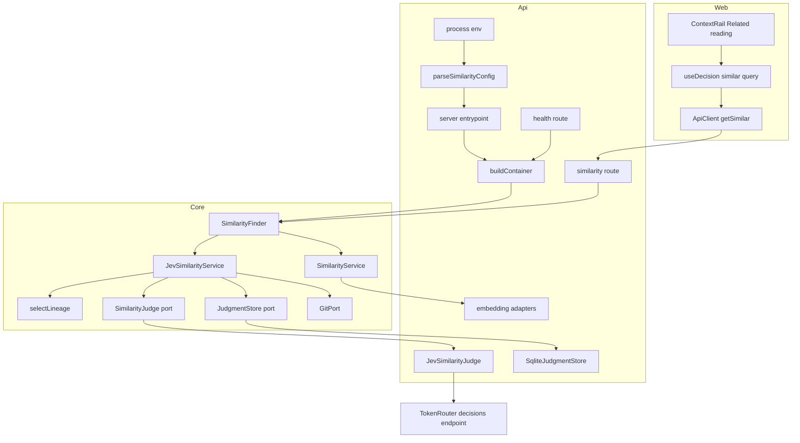
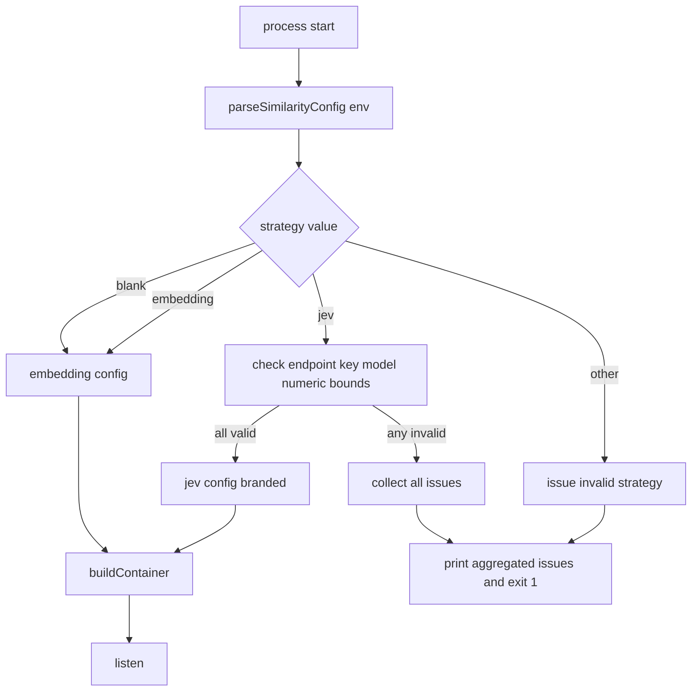
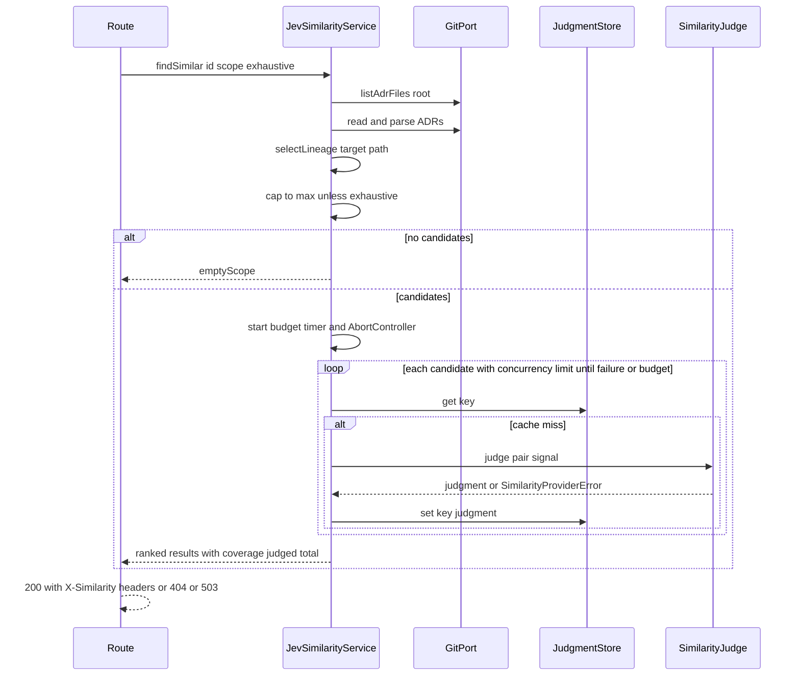

# Design Document — jev-similarity

## Overview
**Purpose**: This feature gives ADR Manager operators an alternative way to rank similar ADRs. TypeSafe **Jev**, accessed through **TokenRouter**'s decisions endpoint, judges each candidate pairwise against the target ADR, and the candidates come from the target folder's **lineage**: its whole subtree downward, and only the ADRs sitting directly in each ancestor folder upward.

**Users**: Operators select the strategy with one configuration flag. ADR authors see the same "Related reading" list, now ranked by Jev's probability that two ADRs address the same or an overlapping decision. Each result additionally carries its lineage position and relation kind. When the lineage holds more candidates than the cap, authors are told how many were compared and can choose to compare all of them anyway. When related decisions cannot be loaded, authors see an error with a retry action instead of an empty area.

**Impact**: The API gains a validated similarity configuration that fails the process at startup when it is inconsistent, a `SimilarityFinder` seam with two implementations, a Jev HTTP adapter, a judgment cache table, a per-request time budget, an opt-in exhaustive comparison, candidate-count response headers, and a 503 error for provider failures. The web UI's "Related reading" area gains an error state, a capped-list notice and a "compare all" action. The embedding strategy stays the default and its ranking is behaviorally unchanged.

### Goals
- Select `embedding` (default) or `jev` with `SIMILARITY_STRATEGY`, and refuse to start on any inconsistent combination.
- Rank lineage candidates by Jev pairwise probability, deterministically, with an extra relation label.
- Keep the HTTP response body contract unchanged under both strategies; new information travels in optional fields, a query parameter and response headers.
- Bound the cost of one request: at most `JEV_MAX_CANDIDATES` (default 100) judgments unless the user asks for all, and at most `JEV_REQUEST_BUDGET_MS` (default 120 s) of judging.
- Never show a failed or capped similarity result as if it were complete.
- Keep all test suites offline-capable.

### Non-Goals
- Hybrid or pre-filtered scoring (cosine + Jev), and any change to the embedding strategy.
- UI features that display `relation` or `lineage` (the fields are additive and ignored by the UI).
- Progress reporting or streaming of partial results during a long comparison.
- Hot switching of the strategy, per-request strategy selection, or a strategy registry.
- Extending the `reindex` script to warm the Jev cache.

## Boundary Commitments

### This Spec Owns
- The similarity configuration contract: env variable names, defaults, bounds, validation and the aggregated startup failure.
- The `SimilarityFinder` interface and the selection of its implementation in the composition root.
- `JevSimilarityService`: lineage selection, per-pair judging, caching, ranking and failure propagation.
- The `SimilarityJudge` and `JudgmentStore` ports, their Jev HTTP and SQLite adapters, and the `jev_judgment_cache` table.
- The additive `lineage` / `relation` fields on `SimilarityResult`, the `exhaustive` query parameter, the `X-Similarity-Judged` / `X-Similarity-Candidates` response headers, and the 503 `providerUnavailable` response of `GET /api/adrs/:id/similar`.
- The `similarity.strategy` field in `GET /health`.
- In `apps/web`: the similarity part of `ApiClient.getSimilar`, the `similar` query of `useDecision`, and the "Related reading" section of `ContextRail` (error state, capped-list notice, compare-all and retry actions).

### Out of Boundary
- `SimilarityService` (embedding) ranking, scope semantics, `embedding_cache`, `FakeEmbeddingProvider`, `GeminiEmbeddingProvider`: only the one-line `implements SimilarityFinder` is added.
- Web UI (`apps/web`) beyond the three touch points listed above: no other component, route or style changes. The Connected decisions and Story sections of `ContextRail` are untouched.
- The E2E suite: it keeps running in embedding mode. No new journey is added; the UI states are covered by web tests.
- `scripts/reindex.ts`, the summaries feature, and search.
- Confirming Jev's commercial terms or data-processing agreement (an operator responsibility).

### Allowed Dependencies
- The dependency direction is `@adr/shared` (types) → `@adr/core` (ports, pure services) → `apps/api` (config → infrastructure adapters → container → routes → server). Imports go only rightward-to-leftward in that chain, and never from core into `apps/api`.
- `apps/web` imports only `@adr/shared` types (`SimilarityResult`, `SimilarityCoverage`) and talks to the API over HTTP. No new npm dependencies.
- Core uses only `GitPort`, `SimilarityJudge`, `JudgmentStore`, `parseAdr` and `combinedSectionText`, plus the global `AbortController` and `setTimeout` for the request budget. No `node:*` imports, no `fetch`.
- `apps/api` may use the global `fetch`, `AbortController` and `AbortSignal.any` (the repo's `engines` require Node ≥ 20) and `better-sqlite3`. No new npm dependencies.
- External: the Jev decisions endpoint named by `JEV_ENDPOINT`, reached only by `JevSimilarityJudge`. The supported access route is TokenRouter (`https://api.tokenrouter.com/api/alpha/decisions`). Any endpoint that speaks the same decisions request/response contract (for example a local stub) is also accepted.

### Revalidation Triggers
- Any change to the `SimilarityResult` shape, the `exhaustive` parameter, the `X-Similarity-*` headers, or the 200/404/503 semantics of `/api/adrs/:id/similar` → re-check `apps/web` `getSimilar`, `useDecision` and the E2E similarity journey.
- A change to the `["similar", id, …]` query key → re-check the prefix invalidation in `useComposeSave`.
- A change to the env variable names, defaults or bounds → update `.env.example`, `README.md` and the deployment configuration.
- A change to the Jev prompt, questions or model → bump `JEV_PROMPT_VERSION` (invalidates the cache by key).
- A confirmed change to Jev's response schema → change `parseJevAnswers` only.
- A change to `GitPort.listAdrFiles` semantics (recursion, filtering) → re-check `selectLineage`.

## Architecture

### Existing Architecture Analysis
- Hexagonal: core services depend on ports (`GitPort`, `EmbeddingProvider`, `EmbeddingStore`, `SummaryProvider`…). `apps/api/src/container.ts` is the only composition root, and it picks adapters from `config`.
- Derived data lives in SQLite tables keyed by git blob SHA, all in the same file (`SQLITE_PATH`).
- `routes/similarity.ts` currently maps every thrown error to 404. This must be narrowed so that provider failures get 503.
- `config.ts` never validates. This feature introduces the first fail-fast configuration check, scoped to similarity settings only.
- `buildContainer(cfg: ContainerConfig = config)` defaults to the module-level `config`, and `server.ts` passes `config` directly. The validation result therefore must not live on the `config` object itself (see similarityConfig and Container).
- `/health` is registered in `buildServer` and currently reads the module-level `config`. The strategy field is read from the container instead.
- In the web app, `useDecision`'s `similar` query throws on any non-200, and `App.tsx` renders `decision.similar.data ?? []`, so `ContextRail` hides "Related reading" on failure. This feature replaces that silent path (Requirement 9).

### Architecture Pattern & Boundary Map



**Architecture Integration**:
- Selected pattern: a strategy behind the `SimilarityFinder` interface, chosen once at composition time from validated configuration (alternatives are in `research.md`).
- Boundaries: lineage and ranking policy live in core. Everything Jev-specific (prompt wording, question schema, HTTP, response parsing, prompt version) lives in the adapter. Configuration semantics live in `similarityConfig.ts`.
- Existing patterns preserved: ports and adapters, blob-SHA-keyed SQLite caches, the result-union returns of core services, and `app.inject`-based route tests.
- Steering compliance: no steering directory exists. The design follows the conventions visible in existing specs (`adr-manager`, `madr-template-alignment`).

### Technology Stack

| Layer | Choice / Version | Role in Feature | Notes |
|-------|------------------|-----------------|-------|
| Backend / Services | TypeScript 5.5, Fastify 4.28 | Route error mapping, health field | Existing |
| Backend / Integration | Node global `fetch` + `AbortController` | Jev HTTP calls with timeout | No new dependency; `@typesafe-ai/sdk` deliberately not adopted (see `research.md`) |
| Data / Storage | better-sqlite3 11.x | `jev_judgment_cache` table in the existing `SQLITE_PATH` file | Derived, deletable |
| External | TypeSafe Jev via TokenRouter, `POST https://api.tokenrouter.com/api/alpha/decisions`, model `typesafe/jev-1.13` (pinned default) | Pairwise judgments | The endpoint is **alpha**: breaking changes are possible without deprecation (Risk R4). Answer shape confirmed live on 2026-09-26 (Risk R1, see research.md) |

## File Structure Plan

### Directory Structure
```
packages/shared/src/
└── types.ts                                  # (modified) SimilarityRelation, LineagePosition, SimilarityCoverage, optional fields on SimilarityResult

packages/core/src/
├── ports/
│   └── similarityJudge.ts                    # SimilarityJudge + JudgmentStore ports, JudgePair, PairJudgment
├── similarity/
│   ├── errors.ts                             # SimilarityProviderError (typed provider-failure signal)
│   ├── lineageScope.ts                       # selectLineage: pure down/up candidate selection, labeling and ordering
│   ├── lineageScope.test.ts
│   ├── jevSimilarityService.ts               # SimilarityFinder impl: load ADRs, lineage, cap/exhaustive, budget, cache-first judging, rank
│   ├── jevSimilarityService.test.ts
│   └── similarityService.ts                  # (modified) declares SimilarityFinder, FindSimilarOptions, coverage on SimilarityFindResult; SimilarityService implements it
└── index.ts                                  # (modified) export new modules

apps/api/src/
├── similarityConfig.ts                       # parseSimilarityConfig, SimilarityConfig union, branded ValidatedJevConfig, formatConfigIssues
├── similarityConfig.test.ts
├── config.ts                                 # (modified) separate export similarityConfigResult = parseSimilarityConfig(process.env)
├── container.ts                              # (modified) no default cfg; strategy selection; Container.similarity: SimilarityFinder; similarityStrategy
├── container.test.ts                         # (modified) jev wiring + embedding default assertions
├── server.ts                                 # (modified) fail-fast entrypoint; health similarity.strategy
├── server.test.ts                            # (modified) health field assertion
├── routes/
│   ├── similarity.ts                         # (modified) exhaustive param; coverage headers; SimilarityProviderError → 503
│   └── similarity.test.ts                    # (modified) 503, exhaustive pass-through, headers, additive fields under a substitute finder
└── infrastructure/
    ├── jev/
    │   ├── jevSimilarityJudge.ts             # SimilarityJudge adapter: request building, timeout, parseJevAnswers, prompt version
    │   └── jevSimilarityJudge.test.ts        # against a local Fastify stub endpoint (loopback http)
    └── persistence/
        ├── sqliteJudgmentStore.ts            # JudgmentStore adapter over jev_judgment_cache
        └── sqliteJudgmentStore.test.ts

apps/web/src/
├── api/
│   ├── client.ts                             # (modified) getSimilar(id, scope?, { exhaustive }); coverage from X-Similarity-* headers
│   └── client.test.ts                        # (modified) coverage parsing, exhaustive query, 503 → { ok: false, status: 503 }
├── hooks/
│   ├── useDecision.ts                        # (modified) similar query returns SimilarView; exhaustive state; compareAll / retry
│   └── useDecision.test.ts                   # (modified) error status, coverage, compareAll switches the query key
├── features/article/
│   ├── ContextRail.tsx                       # (modified) Related reading: error state, capped notice, retry + compare-all actions
│   └── ContextRail.test.tsx                  # (modified) the new states, a11y roles, keyboard activation
├── styles/article.css                        # (modified) two small classes for the notice and error text, existing tokens only
└── App.tsx                                   # (modified) passes the new similar props into ContextRail

.env.example                                  # (modified) SIMILARITY_STRATEGY + JEV_* entries, commented
README.md                                     # (modified) configuration table rows for the new variables
```

### Modified Files
- `packages/shared/src/types.ts`: adds `SimilarityRelation`, `LineagePosition` and `SimilarityCoverage`, and optional `lineage?` / `relation?` on `SimilarityResult` (5.2, 5.3, 5.6).
- `packages/core/src/similarity/similarityService.ts`: adds the exported `SimilarityFinder` interface, `FindSimilarOptions`, the optional `coverage` on the `ranked` variant of `SimilarityFindResult`, and `implements SimilarityFinder`. `SimilarityService` accepts and ignores the options argument and never sets `coverage`. There is no ranking change (1.3, 5.7).
- `packages/core/src/index.ts`: re-exports `ports/similarityJudge`, `similarity/errors`, `similarity/lineageScope` and `similarity/jevSimilarityService`.
- `apps/api/src/config.ts`: adds a **separate** export `similarityConfigResult: SimilarityConfigResult`, computed without throwing. The existing `config` object is not changed, so it stays assignable to `ContainerConfig`.
- `apps/api/src/container.ts`: removes the `= config` default of `buildContainer` (every caller already passes a config explicitly), and adds an optional `ContainerConfig.similarity: SimilarityConfig` (absent → `{ strategy: "embedding" }`), `Container.similarity: SimilarityFinder`, and `Container.similarityStrategy`.
- `apps/api/src/server.ts`: the entrypoint aborts on an invalid configuration and otherwise calls `buildContainer({ ...config, similarity: similarityConfigResult.config })`. `/health` adds `similarity: { strategy: container.similarityStrategy }`.
- `apps/api/src/routes/similarity.ts`: reads `exhaustive`, sets the coverage headers, and narrows the catch so that `SimilarityProviderError` → 503 and everything else → 404.
- `apps/web`: see "Web layer" below. `useComposeSave`'s prefix invalidation of `["similar", id]` is unchanged and still matches both query keys.
- `.env.example` and `README.md`: document the new variables.

## System Flows

### Startup configuration validation



- Every Jev check runs even after the first failure, so the operator sees all problems at once (2.6). An unknown strategy is reported together with any Jev problems only when the value is `jev`. Otherwise Jev settings are ignored (2.8).
- The cross-field check `JEV_REQUEST_BUDGET_MS ≥ JEV_TIMEOUT_MS` runs only when both values are individually valid (2.10).
- Messages name the variable and the rule, never the value of `JEV_API_KEY` (2.7).

### Similar-ADRs request under the Jev strategy



- The target is located by id among all repository ADRs. A missing id throws a plain `Error` → 404 (5.4).
- The first `SimilarityProviderError` rejects the whole request. The service starts no further judgments and aborts those in flight through the shared `AbortSignal` (7.1, 7.7). Judgments already obtained are still cached, because they are valid (6.5).
- When `JEV_REQUEST_BUDGET_MS` elapses first, the service aborts the shared signal and rejects with `SimilarityProviderError("budget")` → 503 (7.6). Because completed judgments are cached, a retry resumes from where the previous attempt stopped, so a large exhaustive comparison converges over a few retries.
- `coverage = { judged: <number of candidates judged>, total: <lineage size> }`. Without `exhaustive`, `judged = min(total, maxCandidates)`; with it, `judged = total` (4.8, 4.9, 5.6).
- The `scope` argument is accepted and ignored (4.6).

## Requirements Traceability

| Requirement | Summary | Components | Interfaces | Flows |
|-------------|---------|------------|------------|-------|
| 1.1 | Single strategy setting | similarityConfig | `SIMILARITY_STRATEGY`, `parseSimilarityConfig` | Startup |
| 1.2 | Blank → embedding | similarityConfig | `parseSimilarityConfig` | Startup |
| 1.3 | Embedding unchanged | SimilarityService, Container | `SimilarityFinder` | — |
| 1.4 | Jev serves all requests, no embeddings | Container, JevSimilarityService | `SimilarityFinder` | Request |
| 1.5 | Process-lifetime selection | Container, server entrypoint | `buildContainer` | Startup |
| 2.1 | Invalid strategy value rejected | similarityConfig, server entrypoint | `ConfigIssue` | Startup |
| 2.2 | Jev without endpoint rejected | similarityConfig | `ConfigIssue` | Startup |
| 2.3 | Jev without key rejected | similarityConfig | `ConfigIssue` | Startup |
| 2.4 | Endpoint https or loopback http | similarityConfig | `ConfigIssue` | Startup |
| 2.5 | Numeric settings bounds | similarityConfig | `JEV_TIMEOUT_MS`, `JEV_MAX_CANDIDATES`, `JEV_CONCURRENCY`, `JEV_REQUEST_BUDGET_MS` | Startup |
| 2.6 | All issues reported at once | similarityConfig, server entrypoint | `formatConfigIssues` | Startup |
| 2.7 | Key never disclosed | similarityConfig, JevSimilarityJudge, health route | `ConfigIssue`, logging rule | Startup, Request |
| 2.8 | Jev settings ignored under embedding | similarityConfig | `parseSimilarityConfig` | Startup |
| 2.9 | Container unbuildable with half config | similarityConfig, Container | `ValidatedJevConfig` brand, `ContainerConfig.similarity` | — |
| 2.10 | Budget ≥ timeout | similarityConfig | cross-field `ConfigIssue` | Startup |
| 3.1 | Pairwise probability per candidate | JevSimilarityService, JevSimilarityJudge | `SimilarityJudge.judge` | Request |
| 3.2 | Title + section text + position sent | JevSimilarityService, JevSimilarityJudge | `JudgePair` | Request |
| 3.3 | Score = probability, descending | JevSimilarityService | `SimilarityResult.score` | Request |
| 3.4 | Deterministic tie-break | JevSimilarityService | ranking rule | Request |
| 3.5 | Relation label | JevSimilarityJudge, JevSimilarityService | `PairJudgment.relation`, `SimilarityResult.relation` | Request |
| 3.6 | Invalid answer = failure | JevSimilarityJudge | `parseJevAnswers` | Request |
| 4.1 | Anchor = containing folder | lineageScope | `selectLineage` | Request |
| 4.2 | Anchor + descendants, minus target | lineageScope | `selectLineage` | Request |
| 4.3 | Ancestors' direct ADRs to root | lineageScope | `selectLineage` | Request |
| 4.4 | Siblings excluded | lineageScope | `selectLineage` | Request |
| 4.5 | Direction + level labels | lineageScope | `LineagePosition` | Request |
| 4.6 | `scope` ignored | JevSimilarityService | `findSimilar` | Request |
| 4.7 | No candidates → emptyScope | JevSimilarityService | `SimilarityFindResult` | Request |
| 4.8 | Cap (default 100) with ordering | lineageScope, JevSimilarityService | `selectLineage` order, `maxCandidates` | Request |
| 4.9 | Exhaustive comparison on request | similarity route, JevSimilarityService | `exhaustive` param, `FindSimilarOptions` | Request |
| 5.1 | Contract unchanged | similarity route | API contract | Request |
| 5.2 | Additive fields under Jev | shared types, JevSimilarityService | `SimilarityResult` | Request |
| 5.3 | No additive fields under embedding | SimilarityService (unchanged) | `SimilarityResult` | — |
| 5.4 | 404 on unknown id | similarity route, both services | API contract | Request |
| 5.5 | Health exposes strategy only | server health route | `/health` | — |
| 5.6 | Judged / total reported, body unchanged | JevSimilarityService, similarity route | `SimilarityCoverage`, `X-Similarity-*` headers | Request |
| 5.7 | Embedding ignores exhaustive, no counts | SimilarityService, similarity route | `FindSimilarOptions` | Request |
| 6.1 | Cache key | JevSimilarityService, SqliteJudgmentStore | `JudgmentKey` | Request |
| 6.2 | Cache hit skips Jev | JevSimilarityService | `JudgmentStore.get` | Request |
| 6.3 | Fresh after edit | JevSimilarityService | blob SHA in key | Request |
| 6.4 | Derived, deletable | SqliteJudgmentStore | `jev_judgment_cache` | — |
| 6.5 | Only valid judgments cached | JevSimilarityService | `JudgmentStore.set` | Request |
| 7.1 | 503 on any failure | JevSimilarityJudge, JevSimilarityService, similarity route | `SimilarityProviderError`, API contract | Request |
| 7.2 | No embedding fallback | Container, JevSimilarityService | — | Request |
| 7.3 | Timeout abort | JevSimilarityJudge | `JEV_TIMEOUT_MS` | Request |
| 7.4 | Concurrency limit | JevSimilarityService | `concurrency` option | Request |
| 7.5 | Failure logging without secrets | JevSimilarityJudge, similarity route | `SimilarityProviderError.category/status` | Request |
| 7.6 | Request time budget | JevSimilarityService | `JEV_REQUEST_BUDGET_MS`, category `budget` | Request |
| 7.7 | Stop and abort after first failure | JevSimilarityService, JevSimilarityJudge | shared `AbortSignal` | Request |
| 8.1 | Substitute judge tests | JevSimilarityService tests | `SimilarityJudge` | — |
| 8.2 | Adapter vs local stub | JevSimilarityJudge tests | loopback `http` endpoint (2.4) | — |
| 8.3 | Existing suites pass | Container default, config default | embedding default | — |
| 9.1 | Visible failure message | useDecision, ContextRail | `SimilarView`, `similarError` prop | UI |
| 9.2 | Provider-unavailable wording | ApiClient, ContextRail | `status === 503` | UI |
| 9.3 | Retry action | useDecision, ContextRail | `retry()`, `onRetrySimilar` | UI |
| 9.4 | Capped notice + compare-all action | ApiClient, useDecision, ContextRail | `SimilarityCoverage`, `onCompareAllSimilar` | UI |
| 9.5 | Exhaustive request with progress | useDecision, ContextRail | `compareAll()`, `similarComparing` prop | UI |
| 9.6 | Existing presentation kept | ContextRail | `SimilarityMeter` | UI |
| 9.7 | Accessible announcements, keyboard | ContextRail | `role="alert"`, `role="status"`, native buttons | UI |

## Components and Interfaces

| Component | Domain/Layer | Intent | Req Coverage | Key Dependencies (P0/P1) | Contracts |
|-----------|--------------|--------|--------------|--------------------------|-----------|
| Shared similarity types | shared | Additive result metadata types | 3.5, 4.5, 5.2, 5.3 | — | State |
| SimilarityFinder | core | Strategy seam for "rank ADRs like this one" | 1.3, 1.4 | — | Service |
| SimilarityProviderError | core | Typed provider-failure signal | 7.1, 7.5 | — | Service |
| selectLineage | core | Pure lineage candidate selection | 4.1–4.5, 4.8 | — | Service |
| SimilarityJudge / JudgmentStore ports | core | Jev-agnostic judging and caching contracts | 3.1, 6.1 | — | Service |
| JevSimilarityService | core | Jev-strategy `SimilarityFinder` | 1.4, 3.1–3.5, 4.6–4.9, 5.6, 6.1–6.3, 6.5, 7.1, 7.2, 7.4, 7.6, 7.7, 8.1 | GitPort (P0), SimilarityJudge (P0), JudgmentStore (P1) | Service |
| similarityConfig | api/config | Parse + validate + brand similarity configuration | 1.1, 1.2, 2.1–2.10 | — | Service |
| JevSimilarityJudge | api/infrastructure | HTTP adapter to Jev | 3.1, 3.2, 3.5, 3.6, 7.1, 7.3, 7.5, 7.7, 8.2 | Jev endpoint (P0) | Service, API |
| SqliteJudgmentStore | api/infrastructure | Judgment cache persistence | 6.1, 6.4 | better-sqlite3 (P1) | State |
| Container | api/composition | Strategy selection at startup | 1.3–1.5, 2.9, 7.2, 8.3 | similarityConfig (P0) | Service |
| Server entrypoint + health | api/runtime | Fail-fast startup, strategy in health | 2.1, 2.6, 2.7, 5.5 | similarityConfig (P0) | API |
| Similarity route | api/routes | `exhaustive` param, coverage headers, error mapping 404 / 503 | 4.9, 5.1, 5.4, 5.6, 5.7, 7.1, 7.5 | SimilarityFinder (P0) | API |
| ApiClient.getSimilar | web/api | Exhaustive query, coverage headers, failure status | 9.2, 9.4, 9.5 | Similarity route (P0) | API |
| useDecision `similar` | web/hooks | Similar query state, compare-all and retry | 9.1, 9.3, 9.5 | ApiClient (P0), TanStack Query (P0) | State |
| ContextRail "Related reading" | web/features | Error state, capped notice, actions | 9.1–9.7 | useDecision via App (P0) | State |

### Shared

#### Shared similarity types (summary only)
```typescript
export type SimilarityRelation =
  | "duplicate" | "supersedes" | "conflicts" | "constrains" | "related" | "unrelated";

export interface LineagePosition {
  direction: "down" | "up";
  /** 0 = anchor folder; >0 = folders below (down) or above (up) the anchor. */
  level: number;
}

export interface SimilarityResult {
  adr: AdrSummary;
  score: number;
  /** Present only under the jev strategy (5.2, 5.3). */
  lineage?: LineagePosition;
  /** Present only under the jev strategy (3.5). */
  relation?: SimilarityRelation;
}

/** How many lineage candidates were judged out of how many exist (5.6). judged ≤ total. */
export interface SimilarityCoverage {
  judged: number;
  total: number;
}
```

### Core

#### SimilarityFinder and SimilarityProviderError

| Field | Detail |
|-------|--------|
| Intent | One interface for both strategies, plus the typed failure the route can recognize |
| Requirements | 1.3, 1.4, 7.1, 7.5 |

**Contracts**: Service [x]

```typescript
// similarityService.ts
export type SimilarityFindResult =
  | { kind: "ranked"; results: SimilarityResult[]; /** jev only (5.6, 5.7) */ coverage?: SimilarityCoverage }
  | { kind: "emptyScope" };

export interface FindSimilarOptions {
  /** Judge every lineage candidate, ignoring the cap (4.9). Ignored by the embedding strategy (5.7). */
  exhaustive?: boolean;
}

export interface SimilarityFinder {
  /** Throws Error when `id` is not found; throws SimilarityProviderError on provider failure. */
  findSimilar(id: string, scopePath: string, options?: FindSimilarOptions): Promise<SimilarityFindResult>;
}

// errors.ts
export type SimilarityProviderFailure =
  | "network" | "timeout" | "http-status" | "invalid-response"
  | "budget"   // JEV_REQUEST_BUDGET_MS elapsed for the whole request (7.6)
  | "aborted"; // cancelled because another judgment of the same request failed (7.7); never the reported cause

export class SimilarityProviderError extends Error {
  readonly name = "SimilarityProviderError";
  constructor(
    readonly category: SimilarityProviderFailure,
    readonly httpStatus: number | null,
    message: string // must not contain secrets or ADR content
  );
}
```
- Invariant: `SimilarityService` (embedding) never throws `SimilarityProviderError`. Its behavior is unchanged (1.3).

#### selectLineage

| Field | Detail |
|-------|--------|
| Intent | Choose, label and order lineage candidates from a flat list of repository ADR paths |
| Requirements | 4.1, 4.2, 4.3, 4.4, 4.5, 4.8 (ordering) |

**Contracts**: Service [x]

```typescript
export interface LineageCandidate<T extends { path: string }> {
  item: T;
  position: LineagePosition;
}

export function selectLineage<T extends { path: string }>(
  items: readonly T[],
  targetPath: string
): LineageCandidate<T>[];
```
- Preconditions: paths are repository-relative, POSIX-separated and without a leading `./`. `targetPath` is one of `items`.
- Postconditions: the result excludes the target. It contains only items in the anchor, its descendants, or directly in an ancestor, including the root (whose dirname is `""`/`.`, normalized to `""`). It is the **full** lineage, sorted by ascending level, then `down` before `up`, then ascending path. The cap is applied by `JevSimilarityService` as a prefix of this order (4.8), so the full length is available as `coverage.total`.
- Invariant: pure. Folder comparisons are segment-based (`a/b` is not an ancestor of `a/bc`).

#### SimilarityJudge and JudgmentStore ports

**Contracts**: Service [x]

```typescript
export interface JudgedAdr {
  title: string;
  /** combinedSectionText(adr, adr.additionalContent) */
  text: string;
}

export interface JudgePair {
  target: JudgedAdr;
  candidate: JudgedAdr;
  position: LineagePosition;
}

export interface PairJudgment {
  /** 0..1 inclusive */
  probability: number;
  relation: SimilarityRelation;
}

export interface SimilarityJudge {
  /** Stable identity of model + prompt version; part of every cache key (6.1). */
  readonly judgmentVersion: string;
  /**
   * Resolves only with a validated judgment; otherwise rejects with SimilarityProviderError.
   * When `signal` aborts, rejects promptly with category "aborted" (7.6, 7.7).
   */
  judge(pair: JudgePair, signal: AbortSignal): Promise<PairJudgment>;
}

export interface JudgmentKey {
  targetBlobSha: string;
  candidateBlobSha: string;
  judgmentVersion: string;
}

export interface JudgmentStore {
  get(key: JudgmentKey): PairJudgment | null;
  set(key: JudgmentKey, judgment: PairJudgment): void;
}
```
- The position is part of the prompt but **not** of the cache key. Position changes only when a file moves, and a move leaves blob SHAs unchanged. The resulting reuse is accepted: the probability depends on content, and the position is re-labeled from the current lineage on every request. This is recorded as design decision D-Cache below.

#### JevSimilarityService

| Field | Detail |
|-------|--------|
| Intent | The `SimilarityFinder` for the Jev strategy |
| Requirements | 1.4, 3.1, 3.2, 3.3, 3.4, 3.5, 4.6, 4.7, 4.8, 4.9, 5.6, 6.1, 6.2, 6.3, 6.5, 7.1, 7.2, 7.4, 7.6, 7.7, 8.1 |

**Responsibilities & Constraints**
- Lists all repository ADRs (`git.listAdrFiles(".")`), parses them, and locates the target by id (not found → `Error`, i.e. 404).
- Calls `selectLineage(adrs, target.path)`. An empty result → `{ kind: "emptyScope" }`.
- Takes the first `maxCandidates` of the lineage, or all of it when `options.exhaustive` is true (4.8, 4.9).
- Creates one `AbortController` per request and arms a `setTimeout(requestBudgetMs)` that aborts it with category `budget`. The timer is cleared when the request settles (7.6).
- For each selected candidate, with at most `concurrency` in flight: tries the cache (`JudgmentKey` from both blob SHAs + `judge.judgmentVersion`); on a miss calls `judge.judge(pair, signal)` and stores the validated result.
- On the first `SimilarityProviderError`, aborts the controller, starts no further judgments, waits for in-flight ones to settle, and rejects with that first error, never with a secondary `aborted` (7.1, 7.7).
- Builds `SimilarityResult { adr, score: probability, lineage: position, relation }`, sorts by score descending, then level ascending, then path ascending (3.3, 3.4), and returns `{ kind: "ranked", results, coverage: { judged, total } }` (5.6).
- Never returns partial rankings and never calls an embedding port (7.1, 7.2).

**Dependencies**
- Outbound: GitPort — ADR listing and reading (P0); SimilarityJudge — judgments (P0); JudgmentStore — cache (P1).

**Contracts**: Service [x]

```typescript
export interface JevSimilarityOptions {
  maxCandidates: number;   // validated 1..1000, default 100
  concurrency: number;     // validated 1..16
  requestBudgetMs: number; // validated 1000..600000, ≥ timeoutMs
}

export class JevSimilarityService implements SimilarityFinder {
  constructor(git: GitPort, judge: SimilarityJudge, store: JudgmentStore, options: JevSimilarityOptions);
  findSimilar(id: string, scopePath: string, options?: FindSimilarOptions): Promise<SimilarityFindResult>;
}
```

**Implementation Notes**
- Integration: text construction reuses `combinedSectionText` so both strategies see the same ADR content.
- Validation: the unit tests cover the target missing, empty lineage, cache hit (the judge is not called), cache miss (stored), a failure mid-batch (rejects with the first error, no new calls after it, in-flight signals aborted, valid ones stored), the concurrency ceiling (an instrumented judge), the ordering and tie-break, the cap versus `exhaustive` with the reported coverage, and the budget (fake timers: rejects with `budget`, completed judgments stay cached).
- Risks: the full-repository parse per request (see Performance).

### API layer

#### similarityConfig

| Field | Detail |
|-------|--------|
| Intent | Turn environment variables into a validated `SimilarityConfig`, or a complete list of issues |
| Requirements | 1.1, 1.2, 2.1, 2.2, 2.3, 2.4, 2.5, 2.6, 2.7, 2.8, 2.9 |

**Contracts**: Service [x]

```typescript
// Module-private runtime symbol (not exported), so only this module can mint the brand.
const validatedJev: unique symbol = Symbol("ValidatedJevConfig");

export interface ValidatedJevConfig {
  readonly [validatedJev]: true;
  readonly endpoint: URL;
  readonly apiKey: string;
  readonly model: string;
  readonly timeoutMs: number;
  readonly maxCandidates: number;
  readonly concurrency: number;
  readonly requestBudgetMs: number;
}

export type SimilarityConfig =
  | { readonly strategy: "embedding" }
  | { readonly strategy: "jev"; readonly jev: ValidatedJevConfig };

export type SimilarityStrategyName = SimilarityConfig["strategy"];

export interface ConfigIssue {
  variable: string; // e.g. "JEV_ENDPOINT"
  message: string;  // never contains the JEV_API_KEY value
}

export type SimilarityConfigResult =
  | { ok: true; config: SimilarityConfig }
  | { ok: false; issues: ConfigIssue[] };

export function parseSimilarityConfig(env: Readonly<Record<string, string | undefined>>): SimilarityConfigResult;
export function formatConfigIssues(issues: readonly ConfigIssue[]): string;
```

**Configuration contract**

| Variable | Required when | Default | Rule | Req |
|----------|---------------|---------|------|-----|
| `SIMILARITY_STRATEGY` | never | `embedding` | trimmed, case-insensitive; `embedding` or `jev` | 1.1, 1.2, 2.1 |
| `JEV_ENDPOINT` | strategy = jev | none (documented value: `https://api.tokenrouter.com/api/alpha/decisions`) | absolute URL; `https:` or `http:` with host `localhost`, `127.0.0.1` or `[::1]` | 2.2, 2.4 |
| `JEV_API_KEY` | strategy = jev | none | TokenRouter API key; non-blank; value never echoed | 2.3, 2.7 |
| `JEV_MODEL` | never | `typesafe/jev-1.13` | non-blank after trim if present; a pinned version rather than a `latest` alias, so that cached judgments stay tied to one model (6.1) | — |
| `JEV_TIMEOUT_MS` | never | `10000` | integer 100–60000 | 2.5, 7.3 |
| `JEV_MAX_CANDIDATES` | never | `100` | integer 1–1000; the default cap, which the user can override per request with "compare all" | 2.5, 4.8, 4.9 |
| `JEV_CONCURRENCY` | never | `4` | integer 1–16 | 2.5, 7.4 |
| `JEV_REQUEST_BUDGET_MS` | never | `120000` | integer 1000–600000, and ≥ `JEV_TIMEOUT_MS` | 2.5, 2.10, 7.6 |

- `JEV_ENDPOINT` deliberately has **no default**, even though TokenRouter is the documented value. Selecting `jev` is therefore never enough on its own: the operator must also name the endpoint, and forgetting it fails startup (2.2).
- Under `embedding`, `JEV_*` variables are not read (2.8).
- `ValidatedJevConfig` values are produced only inside `parseSimilarityConfig`. The brand symbol is a real, non-exported `Symbol`, so object literals cannot satisfy `SimilarityConfig`'s `jev` member without a cast (2.9). Tests obtain a Jev config by calling `parseSimilarityConfig` with a loopback endpoint.
- `config.ts` exports the parse result as a separate `similarityConfigResult`. It is **not** a property of `config`, so `config` stays assignable to `ContainerConfig`.
- `formatConfigIssues` produces a single multi-line message: a header, then one line per issue, then a pointer to `.env.example` (2.6).

#### JevSimilarityJudge

| Field | Detail |
|-------|--------|
| Intent | Implement `SimilarityJudge` over the Jev HTTP API |
| Requirements | 3.1, 3.2, 3.5, 3.6, 7.1, 7.3, 7.5, 8.2 |

**Responsibilities & Constraints**
- Owns `JEV_PROMPT_VERSION` (starting at `"1"`). `judgmentVersion = \`${model}#${JEV_PROMPT_VERSION}\``.
- Builds one request per pair, combines its own `timeoutMs` abort with the caller's `signal` (`AbortSignal.any`), maps outcomes to `SimilarityProviderError` categories (own timeout → `timeout`, caller abort → `aborted`), and validates answers with `parseJevAnswers`.
- Logs nothing itself. It raises errors whose messages hold only the category and status. The route logs them (7.5).

**Dependencies**
- External: Jev endpoint — pairwise decision (P0).

**Contracts**: Service [x] / API [x]

```typescript
export class JevSimilarityJudge implements SimilarityJudge {
  constructor(config: ValidatedJevConfig, fetchImpl?: typeof fetch);
  readonly judgmentVersion: string;
  judge(pair: JudgePair, signal: AbortSignal): Promise<PairJudgment>;
}

/** Pure; returns null when the body does not match the expected answer shape (3.6). */
export function parseJevAnswers(body: unknown): PairJudgment | null;
```

##### API Contract (outbound)
| Method | Endpoint | Request | Response | Errors |
|--------|----------|---------|----------|--------|
| POST | `{JEV_ENDPOINT}` (TokenRouter: `https://api.tokenrouter.com/api/alpha/decisions`) | `JevRequest` (below), headers `Authorization: Bearer {JEV_API_KEY}`, `Content-Type: application/json` | `{ model, answers: { similar, relation }, usage }` | non-2xx → `http-status`; own timeout → `timeout`; caller abort → `aborted`; fetch rejection → `network`; `parseJevAnswers` null or JSON error → `invalid-response` |

```typescript
interface JevRequest {
  model: string;
  state: {
    target: { title: string; text: string };
    candidate: { title: string; text: string; direction: "down" | "up"; level: number };
  };
  questions: {
    similar: {
      type: "noul";
      instructions: string; // "Do the target and candidate ADRs address the same or an overlapping architectural decision?"
      criteria: { true: string; false: string };
    };
    relation: {
      type: "choice";
      instructions: string; // "How does the candidate ADR relate to the target ADR?"
      criteria: Record<SimilarityRelation, string>;
    };
  };
}
```
- The request body matches TokenRouter's documented decisions example: `model`, `state` (string or JSON object), and `questions` keyed by id, where `noul` carries `criteria: { true, false }` and `choice` carries `criteria: Record<option, description>`. The `score` type exists but is not used.
- `parseJevAnswers` requires `answers.similar` to yield a finite number in [0, 1], and `answers.relation` to yield a top option that is a member of `SimilarityRelation`. It takes the chosen option (or the arg-max of the distribution) and does **not** require the distribution to sum to exactly 1, because Jev returns rounded probabilities that may total 0.99. The field paths were confirmed against a live TokenRouter response on 2026-09-26: `answers.similar.noul` and `answers.relation.choice` / `answers.relation.probabilities` (see research.md, "Live verification against TokenRouter"). Only this function encodes them.

#### SqliteJudgmentStore (summary)
- Implements `JudgmentStore` over the `jev_judgment_cache` table (see Physical Data Model) on `SQLITE_PATH`, following `SqliteSummaryStore`'s pattern (`CREATE TABLE IF NOT EXISTS`, `INSERT OR REPLACE`). The table is created only when the Jev strategy is active (6.4).

#### Container

**Contracts**: Service [x]

```typescript
export interface ContainerConfig {
  repoPath: string;
  sqlitePath: string;
  gemini: { model: string; apiKey: string; summaryModel?: string };
  /** Absent → { strategy: "embedding" }, so existing callers compile unchanged (8.3). */
  similarity?: SimilarityConfig;
}

// No default argument any more: every caller passes a config explicitly.
export function buildContainer(cfg: ContainerConfig): Container;

export interface Container {
  // …existing members…
  similarity: SimilarityFinder;
  similarityStrategy: SimilarityStrategyName;
}
```
- `embedding` → `new SimilarityService(git, embeddingStore, embeddingProvider)`. This is today's wiring, including the fake fallback (1.3).
- `jev` → `new JevSimilarityService(git, new JevSimilarityJudge(jev), new SqliteJudgmentStore(sqlitePath), { maxCandidates, concurrency, requestBudgetMs })`. The embedding adapters are still constructed for other consumers, but they are not wired into similarity (1.4, 7.2).
- The entrypoint checks `similarityConfigResult.ok` first and then calls `buildContainer({ ...config, similarity: similarityConfigResult.config })`. A failed result can never reach `buildContainer`, because only the `ok: true` variant carries a `config` (2.9).

#### Server entrypoint, health and similarity route

##### API Contract
| Method | Endpoint | Request | Response | Errors |
|--------|----------|---------|----------|--------|
| GET | `/api/adrs/:id/similar` | `scope?` (ignored under jev); `exhaustive?` (`true` → judge all; any other value or absent → capped; ignored under embedding) | 200 `SimilarityResult[]` or `{ kind: "emptyScope" }`. Under jev, a ranked 200 also carries `X-Similarity-Judged: <n>` and `X-Similarity-Candidates: <total>` | 404 unknown id; **503 `{ kind: "providerUnavailable" }`** (jev only) |
| GET | `/health` | — | existing fields + `similarity: { strategy: "embedding" \| "jev" }` | — |

- Entrypoint: if `!similarityConfigResult.ok`, write `formatConfigIssues(issues)` to stderr and `process.exit(1)` before `buildContainer` (2.1–2.6, 2.10).
- Health: `buildServer` reads `container.similarityStrategy`, never the environment (5.5).
- Route: parses `exhaustive` like `scope` (first value of a repeated key; only the literal `true` enables it) and passes `{ exhaustive }` to `findSimilar` (4.9). For a ranked result with `coverage`, it sets both `X-Similarity-*` headers (5.6). The body is unchanged (5.1).
- Route: `catch (err)`: if `err instanceof SimilarityProviderError`, then `request.log.warn({ category: err.category, httpStatus: err.httpStatus }, "similarity provider unavailable")` → 503 (7.1, 7.5, 7.6); otherwise → 404 (5.4).
- The web app reaches the API same-origin (the Vite proxy in dev and E2E), so no `Access-Control-Expose-Headers` is needed.

### Web layer

#### ApiClient.getSimilar

```typescript
type GetSimilarResult =
  | { ok: true; kind: "ranked"; results: SimilarityResult[]; coverage: SimilarityCoverage | null }
  | { ok: true; kind: "emptyScope" }
  | ApiFailure; // { ok: false; status: number }, unchanged

getSimilar(id: string, scope?: string, options?: { exhaustive?: boolean }): Promise<GetSimilarResult>;
```
- Appends `exhaustive=true` to the query only when requested (9.5).
- Reads `X-Similarity-Judged` and `X-Similarity-Candidates`. Both present and parseable as non-negative integers → `coverage`; otherwise `null`, which is always the case under the embedding strategy (9.4).
- A network error (fetch rejection) maps to `{ ok: false, status: 0 }`, so the UI shows the generic failure (9.1).

#### useDecision `similar`

```typescript
export interface SimilarView {
  results: SimilarityResult[];     // [] for emptyScope, as today
  coverage: SimilarityCoverage | null;
}

similar: {
  data: SimilarView | undefined;
  isPending: boolean;
  isError: boolean;
  /** HTTP status of the failure; 0 = network error; null when not failed. */
  errorStatus: number | null;
  /** true while an exhaustive request is in flight (9.5). */
  isComparingAll: boolean;
  compareAll(): void; // switches to the exhaustive query
  retry(): void;      // refetches the currently active query (9.3)
}
```
- The capped query keeps the key `["similar", adrId, null]`. The exhaustive query uses `["similar", adrId, null, "exhaustive"]`. Both match the `["similar", id]` prefix that `useComposeSave` invalidates after a save.
- `compareAll()` sets a local `exhaustive` flag. The flag resets when `adrId` changes. While the exhaustive query is pending, `data` keeps the capped result (`placeholderData: keepPreviousData`, TanStack Query v5), so the list does not disappear during a long comparison.
- The query function throws a small `SimilarRequestError { status }` so that `errorStatus` can be read from `query.error`. The app-wide `retry: false` stays: a 503 is shown immediately and retried only by the user (9.3).
- `App.tsx` passes `results`, `coverage`, `errorStatus` and both callbacks to `ContextRail`.

#### ContextRail "Related reading"

```typescript
export interface ContextRailProps {
  // …existing props unchanged, including similar: SimilarityResult[]
  similarCoverage?: SimilarityCoverage | null;
  /** null / undefined = no failure. 503 → provider wording (9.2). */
  similarErrorStatus?: number | null;
  similarComparing?: boolean;
  onRetrySimilar?: () => void;
  onCompareAllSimilar?: () => void;
}
```

| State | Condition | Rendering |
|-------|-----------|-----------|
| Hidden | no error and `similar` is empty | nothing, as today (9.6) |
| List | results present, coverage absent or `judged === total` | existing list with `SimilarityMeter`, unchanged (9.6) |
| Capped | results present and `judged < total` | existing list, then a `role="status"` line "Compared {judged} of {total} related decisions." and a button "Compare all {total}" (9.4, 9.7) |
| Comparing | `similarComparing` | list stays visible; the button is disabled and reads "Comparing all {total}…"; `aria-busy="true"` on the section (9.5) |
| Error | `similarErrorStatus != null` | heading "Related reading" is kept; a `role="alert"` message: 503 → "Related reading is unavailable because the similarity service could not be reached."; otherwise "Related decisions could not be loaded."; and a "Try again" button (9.1–9.3, 9.7) |

- An error on the exhaustive query replaces the capped list with the error state. "Try again" repeats the exhaustive request, and because completed judgments are cached server-side, each retry makes progress (7.6).
- Buttons are native `<button type="button">`, so they are keyboard-operable (9.7). Styling reuses the existing `context-rail__*` classes and tokens in `styles/article.css`. No new colors are introduced.
- The copy follows the plain-language tone of the rest of the rail.

## Data Models

### Logical Data Model
- `PairJudgment` is a value object `(probability ∈ [0,1], relation ∈ SimilarityRelation)`, and is immutable per `JudgmentKey`.
- `JudgmentKey = (targetBlobSha, candidateBlobSha, judgmentVersion)`. It is directional: (A, B) and (B, A) are distinct entries, because the prompt is asymmetric (the `constrains` and `supersedes` relations).
- **D-Cache**: lineage position is not in the key (see the ports note). Editing either ADR changes its blob SHA, so the next request misses the cache (6.3). Changing the prompt or model changes `judgmentVersion` (Revalidation Triggers).

### Physical Data Model
```sql
CREATE TABLE IF NOT EXISTS jev_judgment_cache (
  target_blob_sha    TEXT NOT NULL,
  candidate_blob_sha TEXT NOT NULL,
  judgment_version   TEXT NOT NULL,
  probability        REAL NOT NULL CHECK (probability >= 0 AND probability <= 1),
  relation           TEXT NOT NULL,
  PRIMARY KEY (target_blob_sha, candidate_blob_sha, judgment_version)
);
```
- Derived and deletable. Removing the table or the file only causes re-judging (6.4). There is no migration: the table is created on demand.

## Error Handling

### Error Strategy
- **Configuration errors** fail fast at startup with an aggregated message and exit code 1. They never surface at request time (2.x).
- **Provider errors** use a typed `SimilarityProviderError` → 503 with no fallback (7.1, 7.2). Only validated judgments are cached (6.5).
- **Not found** keeps the existing plain `Error` → 404 (5.4).

### Error Categories and Responses
| Situation | Category | HTTP | Body |
|-----------|----------|------|------|
| Unknown ADR id | user | 404 | empty (unchanged) |
| Jev unreachable / DNS / TLS | `network` | 503 | `{ kind: "providerUnavailable" }` |
| Jev exceeds `JEV_TIMEOUT_MS` | `timeout` | 503 | same |
| Jev non-2xx (e.g. 401 bad key, 429, 5xx) | `http-status` | 503 | same |
| Jev body unparsable or out-of-range | `invalid-response` | 503 | same |
| Whole request exceeds `JEV_REQUEST_BUDGET_MS` | `budget` | 503 | same |

In the web UI, every non-200 status and every network error renders the "Related reading" error state; 503 uses the provider wording (9.1, 9.2).

### Monitoring
- One `warn` log per failed request, with `category` and `httpStatus`. No key, endpoint query string, or ADR text is logged (2.7, 7.5).
- One `info` log per exhaustive request, with `judged` and `total`, so that operators can see how often users override the cap.
- `/health` reports the active strategy, so operators can verify the flag took effect (5.5).

## Testing Strategy

### Unit Tests
- `similarityConfig.test.ts`: blank/absent → embedding (1.2); `JEV` / ` jev ` accepted (2.1); `foo` → an issue that lists the allowed values (2.1); jev without `JEV_ENDPOINT` → an issue naming it (2.2); without the key (2.3); `http://api.example.com` rejected and `http://127.0.0.1:4010` accepted (2.4); `JEV_TIMEOUT_MS=0`, `abc`, `60001` and `JEV_REQUEST_BUDGET_MS=999` rejected (2.5); `JEV_REQUEST_BUDGET_MS=5000` with `JEV_TIMEOUT_MS=10000` → an issue naming both (2.10); defaults `JEV_MAX_CANDIDATES=100`, `JEV_REQUEST_BUDGET_MS=120000`; endpoint + key + timeout all bad → three issues in one result (2.6); the key value is absent from `formatConfigIssues` output (2.7); embedding with garbage `JEV_*` → ok (2.8).
- `lineageScope.test.ts`: the tree `org/`, `org/platform/`, `org/platform/payments/` (anchor), `org/platform/payments/refunds/`, `org/platform/identity/`, `other/`: included sets, levels, directions, root-level ADRs included, `org/platform/identity/*` and `other/*` excluded (4.2–4.5), prefix trap `payments` vs `payments-v2` (4.4), and the full lineage order that the cap takes a prefix of (4.8).
- `jevSimilarityService.test.ts` with an in-memory `GitPort`, a substitute `SimilarityJudge` and a map store: ranking and tie-break (3.3, 3.4), additive fields (5.2), `scope` ignored (4.6), empty lineage → emptyScope (4.7), cache hit skips the judge (6.2), an edited blob → re-judge (6.3), a mid-batch failure rejects with the first error, starts no new judgments and aborts in-flight signals, with valid judgments cached (6.5, 7.1, 7.7), max in-flight ≤ concurrency (7.4), 150 candidates with cap 100 → 100 judged and `coverage { judged: 100, total: 150 }`, `exhaustive` → 150 judged and `coverage { judged: 150, total: 150 }` (4.8, 4.9, 5.6), and the budget with fake timers → `budget` rejection, completed judgments cached (7.6) (8.1).

### Integration Tests
- `jevSimilarityJudge.test.ts` against a local Fastify stub on `http://127.0.0.1:<port>` (8.2): the request carries the Bearer header and both questions (3.2); a valid answer → `PairJudgment` (3.1, 3.5); 401/500 → `http-status` (7.1); a delayed stub beyond the timeout → `timeout` (7.3); a probability of `1.2`, an unknown relation, or a missing `answers` → `invalid-response` (3.6); a caller abort mid-request → `aborted` (7.7); error messages never contain the key (2.7).
- `sqliteJudgmentStore.test.ts`: round trip, key isolation by `judgmentVersion`, CHECK constraint enforced (6.1, 6.4).
- `container.test.ts`: no `similarity` → `SimilarityService` instance with `similarityStrategy === "embedding"` (1.3, 8.3); a jev config from `parseSimilarityConfig` → `JevSimilarityService` (1.4).
- `routes/similarity.test.ts` with a substitute finder: `SimilarityProviderError` (any category, including `budget`) → 503 `{ kind: "providerUnavailable" }` (7.1, 7.6); a plain Error → 404 (5.4); ranked results pass `lineage`/`relation` through untouched (5.2); `?exhaustive=true` reaches the finder as `{ exhaustive: true }`, other values as `false` (4.9); coverage → both `X-Similarity-*` headers, no coverage → no headers, body identical (5.1, 5.6, 5.7). `server.test.ts`: `/health` includes `similarity.strategy` and no `JEV_*` values (5.5, 2.7).

### Web Tests
- `api/client.test.ts` (real Fastify backend, embedding): `coverage` is `null`; the existing ranked/emptyScope behavior is unchanged. With a stubbed `fetch`: headers → `coverage`, malformed headers → `null`, `exhaustive` adds the query parameter, 503 → `{ ok: false, status: 503 }`, fetch rejection → `status: 0` (9.2, 9.4).
- `hooks/useDecision.test.ts`: a failure exposes `isError` and `errorStatus` (9.1); `retry()` refetches (9.3); `compareAll()` calls `getSimilar` with `{ exhaustive: true }`, keeps the capped data while pending, then replaces it (9.5); changing `adrId` resets the flag.
- `features/article/ContextRail.test.tsx`: each row of the state table (hidden, list, capped, comparing, error 503, error other), the roles `status`/`alert`, and keyboard activation of both buttons with `userEvent.keyboard` (9.1–9.7).

### E2E Tests
- There is no new E2E journey. The existing offline `similarity.spec.ts` runs unchanged under the embedding default and acts as the regression guard (1.3, 5.1, 8.3). The new UI states never render in that journey, because embedding responses carry no coverage and succeed offline.

## Security Considerations
- Under the `jev` strategy, ADR titles and section text are sent to the configured endpoint. With TokenRouter this means two third parties: TokenRouter as the router, and TypeSafe as the model provider. This only happens after the operator explicitly opts in via `SIMILARITY_STRATEGY=jev`, and it is documented in `.env.example` and the README.
- `JEV_API_KEY` is held only in `ValidatedJevConfig` and the outbound `Authorization` header. It is never logged, returned by `/health`, or included in error messages (2.7).
- Plain `http` is allowed only for loopback hosts (test stubs, local proxies). All remote traffic is `https` (2.4).

## Performance & Scalability
- Latency on a cold cache is about ⌈candidates / concurrency⌉ × Jev latency (sub-second per call according to TypeSafe). A warm cache needs no Jev calls, only SQLite lookups.
- Every request is bounded in time by `JEV_REQUEST_BUDGET_MS` (default 120 s). By default it is also bounded in cost by `JEV_MAX_CANDIDATES` (default 100) and `JEV_CONCURRENCY` (default 4): at most 100 calls in 25 waves. Without the budget, the old worst case was 25 × 10 s = 250 s.
- "Compare all" removes only the candidate cap. The budget still applies. A lineage too large to finish within one budget returns 503. Its completed judgments stay cached, so each "Try again" continues the work, and the list finishes after a few retries.
- Editing the target ADR changes its blob SHA, so the next view re-judges every selected candidate. This is inherent to 6.3 and is bounded by the cap and the budget.
- Listing and parsing the whole repository per request matches the existing whole-repo embedding scope cost. An id → path index is out of scope.

## Open Questions / Risks
- **R1 — Jev answer shape.** *Resolved 2026-09-26*: confirmed against a live TokenRouter response (see research.md). The first implementation task encodes the confirmed paths in `parseJevAnswers` with fixtures taken from that response. No other component depends on them.
- **R2 — Probability calibration is disputed publicly.** The score is used for ordering only, and no thresholds are introduced.
- **R3 — Egress.** Deployments with an outbound allow-list must permit `api.tokenrouter.com`, which was blocked in the Claude Code cloud environment at design time and is reachable as of 2026-09-26. Otherwise every Jev-mode request returns 503, which is visible in logs and `/health` checks.
- **R4 — Alpha endpoint.** TokenRouter's `/api/alpha/decisions` may change its request/response shape or its model ids without deprecation. Mitigations: the model is pinned (`typesafe/jev-1.13`), the answers are validated strictly (any mismatch is a 503, never a wrong score), the prompt version and model are part of the cache key, and the embedding strategy is one restart away.
- **R5 — Cost of "compare all".** An exhaustive request on a large lineage can issue many paid Jev calls. Mitigations: it is always an explicit user action, the budget bounds each attempt, and each exhaustive request is logged with its counts. If cost becomes a problem, a hard upper limit for exhaustive requests can be added as a follow-up setting.
