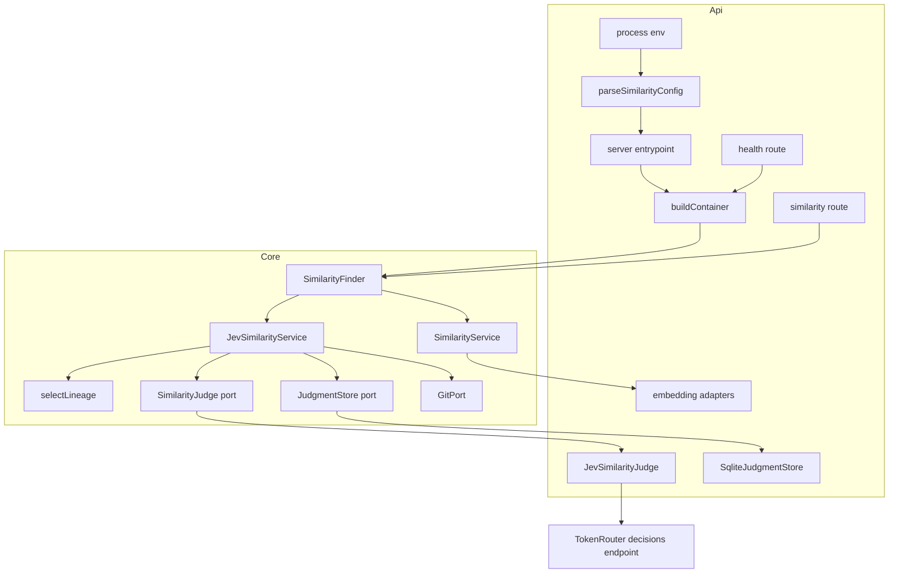
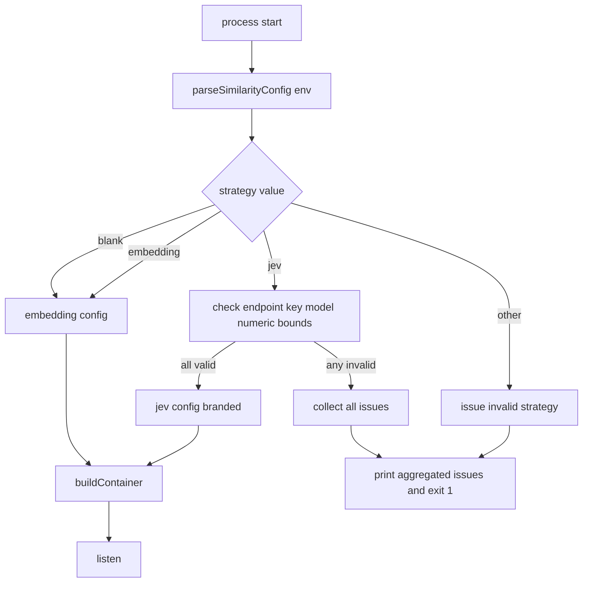
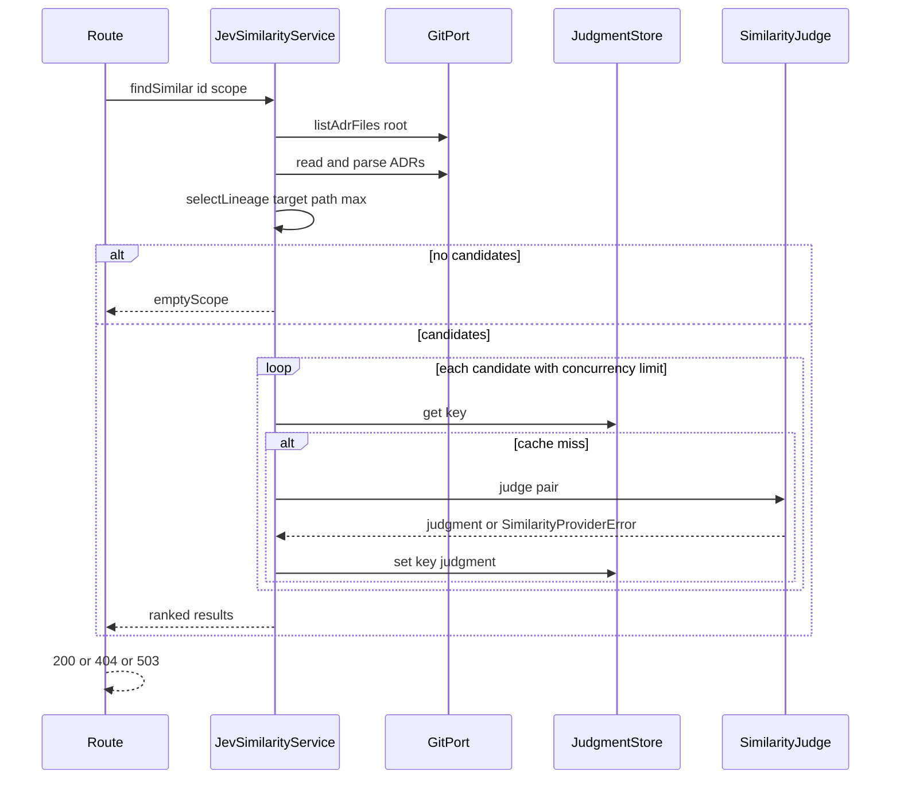

# Design Document — jev-similarity

## Overview
**Purpose**: This feature gives ADR Manager operators an alternative way to rank similar ADRs. TypeSafe **Jev**, accessed through **TokenRouter**'s decisions endpoint, judges each candidate pairwise against the target ADR, and the candidates come from the target folder's **lineage**: its whole subtree downward, and only the ADRs sitting directly in each ancestor folder upward.

**Users**: Operators select the strategy with one configuration flag. ADR authors see the same "Related reading" list, now ranked by Jev's probability that two ADRs address the same or an overlapping decision. Each result additionally carries its lineage position and relation kind.

**Impact**: The API gains a validated similarity configuration that fails the process at startup when it is inconsistent, a `SimilarityFinder` seam with two implementations, a Jev HTTP adapter, a judgment cache table, and a 503 error for provider failures. The embedding strategy stays the default and is behaviorally unchanged.

### Goals
- Select `embedding` (default) or `jev` with `SIMILARITY_STRATEGY`, and refuse to start on any inconsistent combination.
- Rank lineage candidates by Jev pairwise probability, deterministically, with an extra relation label.
- Keep the HTTP contract and the web UI working unchanged under both strategies.
- Keep all test suites offline-capable.

### Non-Goals
- Hybrid or pre-filtered scoring (cosine + Jev), and any change to the embedding strategy.
- UI features that display `relation` or `lineage` (the fields are additive and ignored by the current UI).
- Hot switching of the strategy, per-request strategy selection, or a strategy registry.
- Extending the `reindex` script to warm the Jev cache.

## Boundary Commitments

### This Spec Owns
- The similarity configuration contract: env variable names, defaults, bounds, validation and the aggregated startup failure.
- The `SimilarityFinder` interface and the selection of its implementation in the composition root.
- `JevSimilarityService`: lineage selection, per-pair judging, caching, ranking and failure propagation.
- The `SimilarityJudge` and `JudgmentStore` ports, their Jev HTTP and SQLite adapters, and the `jev_judgment_cache` table.
- The additive `lineage` / `relation` fields on `SimilarityResult`, and the 503 `providerUnavailable` response of `GET /api/adrs/:id/similar`.
- The `similarity.strategy` field in `GET /health`.

### Out of Boundary
- `SimilarityService` (embedding) ranking, scope semantics, `embedding_cache`, `FakeEmbeddingProvider`, `GeminiEmbeddingProvider`: only the one-line `implements SimilarityFinder` is added.
- Web UI (`apps/web`): no changes. Its existing non-200 handling covers the 503.
- The E2E suite: it keeps running in embedding mode.
- `scripts/reindex.ts`, the summaries feature, and search.
- Confirming Jev's commercial terms or data-processing agreement (an operator responsibility).

### Allowed Dependencies
- The dependency direction is `@adr/shared` (types) → `@adr/core` (ports, pure services) → `apps/api` (config → infrastructure adapters → container → routes → server). Imports go only rightward-to-leftward in that chain, and never from core into `apps/api`.
- Core uses only `GitPort`, `SimilarityJudge`, `JudgmentStore`, `parseAdr` and `combinedSectionText`. No `node:*` imports, no `fetch`.
- `apps/api` may use the global `fetch`/`AbortController` (Node ≥ 18) and `better-sqlite3`. No new npm dependencies.
- External: the Jev decisions endpoint named by `JEV_ENDPOINT`, reached only by `JevSimilarityJudge`. The supported access route is TokenRouter (`https://api.tokenrouter.com/api/alpha/decisions`). Any endpoint that speaks the same decisions request/response contract (for example a local stub) is also accepted.

### Revalidation Triggers
- Any change to the `SimilarityResult` shape or to the 200/404/503 semantics of `/api/adrs/:id/similar` → re-check `apps/web` `getSimilar` and the E2E similarity journey.
- A change to the env variable names, defaults or bounds → update `.env.example`, `README.md` and the deployment configuration.
- A change to the Jev prompt, questions or model → bump `JEV_PROMPT_VERSION` (invalidates the cache by key).
- A confirmed change to Jev's response schema → change `parseJevAnswers` only.
- A change to `GitPort.listAdrFiles` semantics (recursion, filtering) → re-check `selectLineage`.

## Architecture

### Existing Architecture Analysis
- Hexagonal: core services depend on ports (`GitPort`, `EmbeddingProvider`, `EmbeddingStore`, `SummaryProvider`…). `apps/api/src/container.ts` is the only composition root, and it picks adapters from `config`.
- Derived data lives in SQLite tables keyed by git blob SHA, all in the same file (`SQLITE_PATH`).
- `routes/similarity.ts` currently maps every thrown error to 404. This must be narrowed so that provider failures get 503.
- `config.ts` never validates. This feature introduces the first fail-fast configuration check, scoped to similarity settings only.

### Architecture Pattern & Boundary Map



**Architecture Integration**:
- Selected pattern: a strategy behind the `SimilarityFinder` interface, chosen once at composition time from validated configuration (alternatives are in `research.md`).
- Boundaries: lineage and ranking policy live in core. Everything Jev-specific (prompt wording, question schema, HTTP, response parsing, prompt version) lives in the adapter. Configuration semantics live in `similarityConfig.ts`.
- Existing patterns preserved: ports and adapters, blob-SHA-keyed SQLite caches, the result-union returns of core services, and `app.inject`-based route tests.
- Steering compliance: no steering directory exists. The design follows the conventions visible in existing specs (`adr-manager`, `madr-template-alignment`).

### Technology Stack

| Layer | Choice / Version | Role in Feature | Notes |
|-------|------------------|-----------------|-------|
| Backend / Services | TypeScript 5.5, Fastify 4.28 | Route error mapping, health field | Existing |
| Backend / Integration | Node global `fetch` + `AbortController` | Jev HTTP calls with timeout | No new dependency; `@typesafe-ai/sdk` deliberately not adopted (see `research.md`) |
| Data / Storage | better-sqlite3 11.x | `jev_judgment_cache` table in the existing `SQLITE_PATH` file | Derived, deletable |
| External | TypeSafe Jev via TokenRouter, `POST https://api.tokenrouter.com/api/alpha/decisions`, model `typesafe/jev-1.13` (pinned default) | Pairwise judgments | The endpoint is **alpha**: breaking changes are possible without deprecation (Risk R4). Answer shape to be confirmed (Risk R1) |

## File Structure Plan

### Directory Structure
```
packages/shared/src/
└── types.ts                                  # (modified) SimilarityRelation, LineagePosition, optional fields on SimilarityResult

packages/core/src/
├── ports/
│   └── similarityJudge.ts                    # SimilarityJudge + JudgmentStore ports, JudgePair, PairJudgment
├── similarity/
│   ├── errors.ts                             # SimilarityProviderError (typed provider-failure signal)
│   ├── lineageScope.ts                       # selectLineage: pure down/up candidate selection + labeling + cap
│   ├── lineageScope.test.ts
│   ├── jevSimilarityService.ts               # SimilarityFinder impl: load ADRs, lineage, cache-first judging, rank
│   ├── jevSimilarityService.test.ts
│   └── similarityService.ts                  # (modified) declares SimilarityFinder; SimilarityService implements it
└── index.ts                                  # (modified) export new modules

apps/api/src/
├── similarityConfig.ts                       # parseSimilarityConfig, SimilarityConfig union, branded ValidatedJevConfig, formatConfigIssues
├── similarityConfig.test.ts
├── config.ts                                 # (modified) config.similarity = parseSimilarityConfig(process.env)
├── container.ts                              # (modified) strategy selection; Container.similarity: SimilarityFinder; similarityStrategy
├── container.test.ts                         # (modified) jev wiring + embedding default assertions
├── server.ts                                 # (modified) fail-fast entrypoint; health similarity.strategy
├── server.test.ts                            # (modified) health field assertion
├── routes/
│   ├── similarity.ts                         # (modified) SimilarityProviderError → 503
│   └── similarity.test.ts                    # (modified) 503 + additive fields under a substitute finder
└── infrastructure/
    ├── jev/
    │   ├── jevSimilarityJudge.ts             # SimilarityJudge adapter: request building, timeout, parseJevAnswers, prompt version
    │   └── jevSimilarityJudge.test.ts        # against a local Fastify stub endpoint (loopback http)
    └── persistence/
        ├── sqliteJudgmentStore.ts            # JudgmentStore adapter over jev_judgment_cache
        └── sqliteJudgmentStore.test.ts

.env.example                                  # (modified) SIMILARITY_STRATEGY + JEV_* entries, commented
README.md                                     # (modified) configuration table rows for the new variables
```

### Modified Files
- `packages/shared/src/types.ts`: adds `SimilarityRelation` and `LineagePosition`, and optional `lineage?` / `relation?` on `SimilarityResult` (5.2, 5.3).
- `packages/core/src/similarity/similarityService.ts`: adds the exported `SimilarityFinder` interface and `implements SimilarityFinder`. There is no behavior change (1.3).
- `packages/core/src/index.ts`: re-exports `ports/similarityJudge`, `similarity/errors`, `similarity/lineageScope` and `similarity/jevSimilarityService`.
- `apps/api/src/config.ts`: adds a `similarity: SimilarityConfigResult` property, computed without throwing.
- `apps/api/src/container.ts`: adds an optional `ContainerConfig.similarity: SimilarityConfig` (default `{ strategy: "embedding" }`), `Container.similarity: SimilarityFinder`, and `Container.similarityStrategy`.
- `apps/api/src/server.ts`: the entrypoint aborts on an invalid configuration, and `/health` adds `similarity: { strategy }`.
- `apps/api/src/routes/similarity.ts`: narrows the catch, so that `SimilarityProviderError` → 503 and everything else → 404.
- `.env.example` and `README.md`: document the new variables.

## System Flows

### Startup configuration validation



- Every Jev check runs even after the first failure, so the operator sees all problems at once (2.6). An unknown strategy is reported together with any Jev problems only when the value is `jev`. Otherwise Jev settings are ignored (2.8).
- Messages name the variable and the rule, never the value of `JEV_API_KEY` (2.7).

### Similar-ADRs request under the Jev strategy



- The target is located by id among all repository ADRs. A missing id throws a plain `Error` → 404 (5.4).
- The first `SimilarityProviderError` rejects the whole request, and in-flight calls are allowed to settle. Judgments already obtained are still cached, because they are valid (6.5, 7.1).
- The `scope` argument is accepted and ignored (4.6).

## Requirements Traceability

| Requirement | Summary | Components | Interfaces | Flows |
|-------------|---------|------------|------------|-------|
| 1.1 | Single strategy setting | similarityConfig | `SIMILARITY_STRATEGY`, `parseSimilarityConfig` | Startup |
| 1.2 | Blank → embedding | similarityConfig | `parseSimilarityConfig` | Startup |
| 1.3 | Embedding unchanged | SimilarityService, Container | `SimilarityFinder` | — |
| 1.4 | Jev serves all requests, no embeddings | Container, JevSimilarityService | `SimilarityFinder` | Request |
| 1.5 | Process-lifetime selection | Container, server entrypoint | `buildContainer` | Startup |
| 2.1 | Invalid strategy value rejected | similarityConfig, server entrypoint | `ConfigIssue` | Startup |
| 2.2 | Jev without endpoint rejected | similarityConfig | `ConfigIssue` | Startup |
| 2.3 | Jev without key rejected | similarityConfig | `ConfigIssue` | Startup |
| 2.4 | Endpoint https or loopback http | similarityConfig | `ConfigIssue` | Startup |
| 2.5 | Numeric settings bounds | similarityConfig | `JEV_TIMEOUT_MS`, `JEV_MAX_CANDIDATES`, `JEV_CONCURRENCY` | Startup |
| 2.6 | All issues reported at once | similarityConfig, server entrypoint | `formatConfigIssues` | Startup |
| 2.7 | Key never disclosed | similarityConfig, JevSimilarityJudge, health route | `ConfigIssue`, logging rule | Startup, Request |
| 2.8 | Jev settings ignored under embedding | similarityConfig | `parseSimilarityConfig` | Startup |
| 2.9 | Container unbuildable with half config | similarityConfig, Container | `ValidatedJevConfig` brand, `ContainerConfig.similarity` | — |
| 3.1 | Pairwise probability per candidate | JevSimilarityService, JevSimilarityJudge | `SimilarityJudge.judge` | Request |
| 3.2 | Title + section text + position sent | JevSimilarityService, JevSimilarityJudge | `JudgePair` | Request |
| 3.3 | Score = probability, descending | JevSimilarityService | `SimilarityResult.score` | Request |
| 3.4 | Deterministic tie-break | JevSimilarityService | ranking rule | Request |
| 3.5 | Relation label | JevSimilarityJudge, JevSimilarityService | `PairJudgment.relation`, `SimilarityResult.relation` | Request |
| 3.6 | Invalid answer = failure | JevSimilarityJudge | `parseJevAnswers` | Request |
| 4.1 | Anchor = containing folder | lineageScope | `selectLineage` | Request |
| 4.2 | Anchor + descendants, minus target | lineageScope | `selectLineage` | Request |
| 4.3 | Ancestors' direct ADRs to root | lineageScope | `selectLineage` | Request |
| 4.4 | Siblings excluded | lineageScope | `selectLineage` | Request |
| 4.5 | Direction + level labels | lineageScope | `LineagePosition` | Request |
| 4.6 | `scope` ignored | JevSimilarityService | `findSimilar` | Request |
| 4.7 | No candidates → emptyScope | JevSimilarityService | `SimilarityFindResult` | Request |
| 4.8 | Cap with ordering | lineageScope | `selectLineage(max)` | Request |
| 5.1 | Contract unchanged | similarity route | API contract | Request |
| 5.2 | Additive fields under Jev | shared types, JevSimilarityService | `SimilarityResult` | Request |
| 5.3 | No additive fields under embedding | SimilarityService (unchanged) | `SimilarityResult` | — |
| 5.4 | 404 on unknown id | similarity route, both services | API contract | Request |
| 5.5 | Health exposes strategy only | server health route | `/health` | — |
| 6.1 | Cache key | JevSimilarityService, SqliteJudgmentStore | `JudgmentKey` | Request |
| 6.2 | Cache hit skips Jev | JevSimilarityService | `JudgmentStore.get` | Request |
| 6.3 | Fresh after edit | JevSimilarityService | blob SHA in key | Request |
| 6.4 | Derived, deletable | SqliteJudgmentStore | `jev_judgment_cache` | — |
| 6.5 | Only valid judgments cached | JevSimilarityService | `JudgmentStore.set` | Request |
| 7.1 | 503 on any failure | JevSimilarityJudge, JevSimilarityService, similarity route | `SimilarityProviderError`, API contract | Request |
| 7.2 | No embedding fallback | Container, JevSimilarityService | — | Request |
| 7.3 | Timeout abort | JevSimilarityJudge | `JEV_TIMEOUT_MS` | Request |
| 7.4 | Concurrency limit | JevSimilarityService | `concurrency` option | Request |
| 7.5 | Failure logging without secrets | JevSimilarityJudge, similarity route | `SimilarityProviderError.category/status` | Request |
| 8.1 | Substitute judge tests | JevSimilarityService tests | `SimilarityJudge` | — |
| 8.2 | Adapter vs local stub | JevSimilarityJudge tests | loopback `http` endpoint (2.4) | — |
| 8.3 | Existing suites pass | Container default, config default | embedding default | — |

## Components and Interfaces

| Component | Domain/Layer | Intent | Req Coverage | Key Dependencies (P0/P1) | Contracts |
|-----------|--------------|--------|--------------|--------------------------|-----------|
| Shared similarity types | shared | Additive result metadata types | 3.5, 4.5, 5.2, 5.3 | — | State |
| SimilarityFinder | core | Strategy seam for "rank ADRs like this one" | 1.3, 1.4 | — | Service |
| SimilarityProviderError | core | Typed provider-failure signal | 7.1, 7.5 | — | Service |
| selectLineage | core | Pure lineage candidate selection | 4.1–4.5, 4.8 | — | Service |
| SimilarityJudge / JudgmentStore ports | core | Jev-agnostic judging and caching contracts | 3.1, 6.1 | — | Service |
| JevSimilarityService | core | Jev-strategy `SimilarityFinder` | 1.4, 3.1–3.5, 4.6, 4.7, 6.1–6.3, 6.5, 7.1, 7.2, 7.4, 8.1 | GitPort (P0), SimilarityJudge (P0), JudgmentStore (P1) | Service |
| similarityConfig | api/config | Parse + validate + brand similarity configuration | 1.1, 1.2, 2.1–2.9 | — | Service |
| JevSimilarityJudge | api/infrastructure | HTTP adapter to Jev | 3.1, 3.2, 3.5, 3.6, 7.1, 7.3, 7.5, 8.2 | Jev endpoint (P0) | Service, API |
| SqliteJudgmentStore | api/infrastructure | Judgment cache persistence | 6.1, 6.4 | better-sqlite3 (P1) | State |
| Container | api/composition | Strategy selection at startup | 1.3–1.5, 2.9, 7.2, 8.3 | similarityConfig (P0) | Service |
| Server entrypoint + health | api/runtime | Fail-fast startup, strategy in health | 2.1, 2.6, 2.7, 5.5 | similarityConfig (P0) | API |
| Similarity route | api/routes | Error mapping 404 / 503 | 5.1, 5.4, 7.1, 7.5 | SimilarityFinder (P0) | API |

### Shared

#### Shared similarity types (summary only)
```typescript
export type SimilarityRelation =
  | "duplicate" | "supersedes" | "conflicts" | "constrains" | "related" | "unrelated";

export interface LineagePosition {
  direction: "down" | "up";
  /** 0 = anchor folder; >0 = folders below (down) or above (up) the anchor. */
  level: number;
}

export interface SimilarityResult {
  adr: AdrSummary;
  score: number;
  /** Present only under the jev strategy (5.2, 5.3). */
  lineage?: LineagePosition;
  /** Present only under the jev strategy (3.5). */
  relation?: SimilarityRelation;
}
```

### Core

#### SimilarityFinder and SimilarityProviderError

| Field | Detail |
|-------|--------|
| Intent | One interface for both strategies, plus the typed failure the route can recognize |
| Requirements | 1.3, 1.4, 7.1, 7.5 |

**Contracts**: Service [x]

```typescript
// similarityService.ts (existing SimilarityFindResult reused)
export interface SimilarityFinder {
  /** Throws Error when `id` is not found; throws SimilarityProviderError on provider failure. */
  findSimilar(id: string, scopePath: string): Promise<SimilarityFindResult>;
}

// errors.ts
export type SimilarityProviderFailure = "network" | "timeout" | "http-status" | "invalid-response";

export class SimilarityProviderError extends Error {
  readonly name = "SimilarityProviderError";
  constructor(
    readonly category: SimilarityProviderFailure,
    readonly httpStatus: number | null,
    message: string // must not contain secrets or ADR content
  );
}
```
- Invariant: `SimilarityService` (embedding) never throws `SimilarityProviderError`. Its behavior is unchanged (1.3).

#### selectLineage

| Field | Detail |
|-------|--------|
| Intent | Choose and label lineage candidates from a flat list of repository ADR paths |
| Requirements | 4.1, 4.2, 4.3, 4.4, 4.5, 4.8 |

**Contracts**: Service [x]

```typescript
export interface LineageCandidate<T extends { path: string }> {
  item: T;
  position: LineagePosition;
}

export function selectLineage<T extends { path: string }>(
  items: readonly T[],
  targetPath: string,
  maxCandidates: number
): LineageCandidate<T>[];
```
- Preconditions: paths are repository-relative, POSIX-separated and without a leading `./`. `targetPath` is one of `items`. `maxCandidates ≥ 1`.
- Postconditions: the result excludes the target. It contains only items in the anchor, its descendants, or directly in an ancestor, including the root (whose dirname is `""`/`.`, normalized to `""`). It is sorted by ascending level, then `down` before `up`, then ascending path, and truncated to `maxCandidates` (4.8).
- Invariant: pure. Folder comparisons are segment-based (`a/b` is not an ancestor of `a/bc`).

#### SimilarityJudge and JudgmentStore ports

**Contracts**: Service [x]

```typescript
export interface JudgedAdr {
  title: string;
  /** combinedSectionText(adr, adr.additionalContent) */
  text: string;
}

export interface JudgePair {
  target: JudgedAdr;
  candidate: JudgedAdr;
  position: LineagePosition;
}

export interface PairJudgment {
  /** 0..1 inclusive */
  probability: number;
  relation: SimilarityRelation;
}

export interface SimilarityJudge {
  /** Stable identity of model + prompt version; part of every cache key (6.1). */
  readonly judgmentVersion: string;
  /** Resolves only with a validated judgment; otherwise rejects with SimilarityProviderError. */
  judge(pair: JudgePair): Promise<PairJudgment>;
}

export interface JudgmentKey {
  targetBlobSha: string;
  candidateBlobSha: string;
  judgmentVersion: string;
}

export interface JudgmentStore {
  get(key: JudgmentKey): PairJudgment | null;
  set(key: JudgmentKey, judgment: PairJudgment): void;
}
```
- The position is part of the prompt but **not** of the cache key. Position changes only when a file moves, and a move leaves blob SHAs unchanged. The resulting reuse is accepted: the probability depends on content, and the position is re-labeled from the current lineage on every request. This is recorded as design decision D-Cache below.

#### JevSimilarityService

| Field | Detail |
|-------|--------|
| Intent | The `SimilarityFinder` for the Jev strategy |
| Requirements | 1.4, 3.1, 3.2, 3.3, 3.4, 3.5, 4.6, 4.7, 6.1, 6.2, 6.3, 6.5, 7.1, 7.2, 7.4, 8.1 |

**Responsibilities & Constraints**
- Lists all repository ADRs (`git.listAdrFiles(".")`), parses them, and locates the target by id (not found → `Error`, i.e. 404).
- Calls `selectLineage(adrs, target.path, maxCandidates)`. An empty result → `{ kind: "emptyScope" }`.
- For each candidate, with at most `concurrency` in flight: tries the cache (`JudgmentKey` from both blob SHAs + `judge.judgmentVersion`); on a miss calls `judge.judge` and stores the validated result.
- Builds `SimilarityResult { adr, score: probability, lineage: position, relation }` and sorts by score descending, then level ascending, then path ascending (3.3, 3.4).
- Propagates the first `SimilarityProviderError`. It never returns partial rankings and never calls an embedding port (7.1, 7.2).

**Dependencies**
- Outbound: GitPort — ADR listing and reading (P0); SimilarityJudge — judgments (P0); JudgmentStore — cache (P1).

**Contracts**: Service [x]

```typescript
export interface JevSimilarityOptions {
  maxCandidates: number; // validated 1..1000
  concurrency: number;   // validated 1..16
}

export class JevSimilarityService implements SimilarityFinder {
  constructor(git: GitPort, judge: SimilarityJudge, store: JudgmentStore, options: JevSimilarityOptions);
  findSimilar(id: string, scopePath: string): Promise<SimilarityFindResult>;
}
```

**Implementation Notes**
- Integration: text construction reuses `combinedSectionText` so both strategies see the same ADR content.
- Validation: the unit tests cover the target missing, empty lineage, cache hit (the judge is not called), cache miss (stored), a failure mid-batch (rejects; valid ones stored), the concurrency ceiling (an instrumented judge), and the ordering and tie-break.
- Risks: the full-repository parse per request (see Performance).

### API layer

#### similarityConfig

| Field | Detail |
|-------|--------|
| Intent | Turn environment variables into a validated `SimilarityConfig`, or a complete list of issues |
| Requirements | 1.1, 1.2, 2.1, 2.2, 2.3, 2.4, 2.5, 2.6, 2.7, 2.8, 2.9 |

**Contracts**: Service [x]

```typescript
declare const validatedJev: unique symbol;

export interface ValidatedJevConfig {
  readonly [validatedJev]: true;
  readonly endpoint: URL;
  readonly apiKey: string;
  readonly model: string;
  readonly timeoutMs: number;
  readonly maxCandidates: number;
  readonly concurrency: number;
}

export type SimilarityConfig =
  | { readonly strategy: "embedding" }
  | { readonly strategy: "jev"; readonly jev: ValidatedJevConfig };

export type SimilarityStrategyName = SimilarityConfig["strategy"];

export interface ConfigIssue {
  variable: string; // e.g. "JEV_ENDPOINT"
  message: string;  // never contains the JEV_API_KEY value
}

export type SimilarityConfigResult =
  | { ok: true; config: SimilarityConfig }
  | { ok: false; issues: ConfigIssue[] };

export function parseSimilarityConfig(env: Readonly<Record<string, string | undefined>>): SimilarityConfigResult;
export function formatConfigIssues(issues: readonly ConfigIssue[]): string;
```

**Configuration contract**

| Variable | Required when | Default | Rule | Req |
|----------|---------------|---------|------|-----|
| `SIMILARITY_STRATEGY` | never | `embedding` | trimmed, case-insensitive; `embedding` or `jev` | 1.1, 1.2, 2.1 |
| `JEV_ENDPOINT` | strategy = jev | none (documented value: `https://api.tokenrouter.com/api/alpha/decisions`) | absolute URL; `https:` or `http:` with host `localhost`, `127.0.0.1` or `[::1]` | 2.2, 2.4 |
| `JEV_API_KEY` | strategy = jev | none | TokenRouter API key; non-blank; value never echoed | 2.3, 2.7 |
| `JEV_MODEL` | never | `typesafe/jev-1.13` | non-blank after trim if present; a pinned version rather than a `latest` alias, so that cached judgments stay tied to one model (6.1) | — |
| `JEV_TIMEOUT_MS` | never | `10000` | integer 100–60000 | 2.5, 7.3 |
| `JEV_MAX_CANDIDATES` | never | `100` | integer 1–1000 | 2.5, 4.8 |
| `JEV_CONCURRENCY` | never | `4` | integer 1–16 | 2.5, 7.4 |

- `JEV_ENDPOINT` deliberately has **no default**, even though TokenRouter is the documented value. Selecting `jev` is therefore never enough on its own: the operator must also name the endpoint, and forgetting it fails startup (2.2).
- Under `embedding`, `JEV_*` variables are not read (2.8).
- `ValidatedJevConfig` values are produced only inside `parseSimilarityConfig`. The brand symbol is module-private, so object literals cannot satisfy `SimilarityConfig`'s `jev` member (2.9).
- `formatConfigIssues` produces a single multi-line message: a header, then one line per issue, then a pointer to `.env.example` (2.6).

#### JevSimilarityJudge

| Field | Detail |
|-------|--------|
| Intent | Implement `SimilarityJudge` over the Jev HTTP API |
| Requirements | 3.1, 3.2, 3.5, 3.6, 7.1, 7.3, 7.5, 8.2 |

**Responsibilities & Constraints**
- Owns `JEV_PROMPT_VERSION` (starting at `"1"`). `judgmentVersion = \`${model}#${JEV_PROMPT_VERSION}\``.
- Builds one request per pair, applies `AbortController` with `timeoutMs`, maps outcomes to `SimilarityProviderError` categories, and validates answers with `parseJevAnswers`.
- Logs nothing itself. It raises errors whose messages hold only the category and status. The route logs them (7.5).

**Dependencies**
- External: Jev endpoint — pairwise decision (P0).

**Contracts**: Service [x] / API [x]

```typescript
export class JevSimilarityJudge implements SimilarityJudge {
  constructor(config: ValidatedJevConfig, fetchImpl?: typeof fetch);
  readonly judgmentVersion: string;
  judge(pair: JudgePair): Promise<PairJudgment>;
}

/** Pure; returns null when the body does not match the expected answer shape (3.6). */
export function parseJevAnswers(body: unknown): PairJudgment | null;
```

##### API Contract (outbound)
| Method | Endpoint | Request | Response | Errors |
|--------|----------|---------|----------|--------|
| POST | `{JEV_ENDPOINT}` (TokenRouter: `https://api.tokenrouter.com/api/alpha/decisions`) | `JevRequest` (below), headers `Authorization: Bearer {JEV_API_KEY}`, `Content-Type: application/json` | `{ model, answers: { similar, relation }, usage }` | non-2xx → `http-status`; abort → `timeout`; fetch rejection → `network`; `parseJevAnswers` null or JSON error → `invalid-response` |

```typescript
interface JevRequest {
  model: string;
  state: {
    target: { title: string; text: string };
    candidate: { title: string; text: string; direction: "down" | "up"; level: number };
  };
  questions: {
    similar: {
      type: "noul";
      instructions: string; // "Do the target and candidate ADRs address the same or an overlapping architectural decision?"
      criteria: { true: string; false: string };
    };
    relation: {
      type: "choice";
      instructions: string; // "How does the candidate ADR relate to the target ADR?"
      criteria: Record<SimilarityRelation, string>;
    };
  };
}
```
- The request body matches TokenRouter's documented decisions example: `model`, `state` (string or JSON object), and `questions` keyed by id, where `noul` carries `criteria: { true, false }` and `choice` carries `criteria: Record<option, description>`. The `score` type exists but is not used.
- `parseJevAnswers` requires `answers.similar` to yield a finite number in [0, 1], and `answers.relation` to yield a top option that is a member of `SimilarityRelation`. It takes the chosen option (or the arg-max of the distribution) and does **not** require the distribution to sum to exactly 1, because Jev returns rounded probabilities that may total 0.99. The exact field paths are confirmed against a live TokenRouter response in the first implementation task (Risk R1). Only this function encodes them.

#### SqliteJudgmentStore (summary)
- Implements `JudgmentStore` over the `jev_judgment_cache` table (see Physical Data Model) on `SQLITE_PATH`, following `SqliteSummaryStore`'s pattern (`CREATE TABLE IF NOT EXISTS`, `INSERT OR REPLACE`). The table is created only when the Jev strategy is active (6.4).

#### Container

**Contracts**: Service [x]

```typescript
export interface ContainerConfig {
  repoPath: string;
  sqlitePath: string;
  gemini: { model: string; apiKey: string; summaryModel?: string };
  /** Defaults to { strategy: "embedding" } so existing callers compile unchanged (8.3). */
  similarity?: SimilarityConfig;
}

export interface Container {
  // …existing members…
  similarity: SimilarityFinder;
  similarityStrategy: SimilarityStrategyName;
}
```
- `embedding` → `new SimilarityService(git, embeddingStore, embeddingProvider)`. This is today's wiring, including the fake fallback (1.3).
- `jev` → `new JevSimilarityService(git, new JevSimilarityJudge(jev), new SqliteJudgmentStore(sqlitePath), { maxCandidates, concurrency })`. The embedding adapters are still constructed for other consumers, but they are not wired into similarity (1.4, 7.2).
- `buildContainer(config)` is called with `config.similarity.config` only after the entrypoint has checked `ok` (the entrypoint passes the unwrapped `SimilarityConfig`).

#### Server entrypoint, health and similarity route

##### API Contract
| Method | Endpoint | Request | Response | Errors |
|--------|----------|---------|----------|--------|
| GET | `/api/adrs/:id/similar` | `scope?` (ignored under jev) | 200 `SimilarityResult[]` or `{ kind: "emptyScope" }` | 404 unknown id; **503 `{ kind: "providerUnavailable" }`** (jev only) |
| GET | `/health` | — | existing fields + `similarity: { strategy: "embedding" \| "jev" }` | — |

- Entrypoint: if `!config.similarity.ok`, write `formatConfigIssues(issues)` to stderr and `process.exit(1)` before `buildContainer` (2.1–2.6).
- Route: `catch (err)`: if `err instanceof SimilarityProviderError`, then `request.log.warn({ category: err.category, httpStatus: err.httpStatus }, "similarity provider unavailable")` → 503 (7.1, 7.5); otherwise → 404 (5.4).

## Data Models

### Logical Data Model
- `PairJudgment` is a value object `(probability ∈ [0,1], relation ∈ SimilarityRelation)`, and is immutable per `JudgmentKey`.
- `JudgmentKey = (targetBlobSha, candidateBlobSha, judgmentVersion)`. It is directional: (A, B) and (B, A) are distinct entries, because the prompt is asymmetric (the `constrains` and `supersedes` relations).
- **D-Cache**: lineage position is not in the key (see the ports note). Editing either ADR changes its blob SHA, so the next request misses the cache (6.3). Changing the prompt or model changes `judgmentVersion` (Revalidation Triggers).

### Physical Data Model
```sql
CREATE TABLE IF NOT EXISTS jev_judgment_cache (
  target_blob_sha    TEXT NOT NULL,
  candidate_blob_sha TEXT NOT NULL,
  judgment_version   TEXT NOT NULL,
  probability        REAL NOT NULL CHECK (probability >= 0 AND probability <= 1),
  relation           TEXT NOT NULL,
  PRIMARY KEY (target_blob_sha, candidate_blob_sha, judgment_version)
);
```
- Derived and deletable. Removing the table or the file only causes re-judging (6.4). There is no migration: the table is created on demand.

## Error Handling

### Error Strategy
- **Configuration errors** fail fast at startup with an aggregated message and exit code 1. They never surface at request time (2.x).
- **Provider errors** use a typed `SimilarityProviderError` → 503 with no fallback (7.1, 7.2). Only validated judgments are cached (6.5).
- **Not found** keeps the existing plain `Error` → 404 (5.4).

### Error Categories and Responses
| Situation | Category | HTTP | Body |
|-----------|----------|------|------|
| Unknown ADR id | user | 404 | empty (unchanged) |
| Jev unreachable / DNS / TLS | `network` | 503 | `{ kind: "providerUnavailable" }` |
| Jev exceeds `JEV_TIMEOUT_MS` | `timeout` | 503 | same |
| Jev non-2xx (e.g. 401 bad key, 429, 5xx) | `http-status` | 503 | same |
| Jev body unparsable or out-of-range | `invalid-response` | 503 | same |

### Monitoring
- One `warn` log per failed request, with `category` and `httpStatus`. No key, endpoint query string, or ADR text is logged (2.7, 7.5).
- `/health` reports the active strategy, so operators can verify the flag took effect (5.5).

## Testing Strategy

### Unit Tests
- `similarityConfig.test.ts`: blank/absent → embedding (1.2); `JEV` / ` jev ` accepted (2.1); `foo` → an issue that lists the allowed values (2.1); jev without `JEV_ENDPOINT` → an issue naming it (2.2); without the key (2.3); `http://api.example.com` rejected and `http://127.0.0.1:4010` accepted (2.4); `JEV_TIMEOUT_MS=0`, `abc`, `60001` rejected (2.5); endpoint + key + timeout all bad → three issues in one result (2.6); the key value is absent from `formatConfigIssues` output (2.7); embedding with garbage `JEV_*` → ok (2.8).
- `lineageScope.test.ts`: the tree `org/`, `org/platform/`, `org/platform/payments/` (anchor), `org/platform/payments/refunds/`, `org/platform/identity/`, `other/`: included sets, levels, directions, root-level ADRs included, `org/platform/identity/*` and `other/*` excluded (4.2–4.5), prefix trap `payments` vs `payments-v2` (4.4), and the cap ordering (4.8).
- `jevSimilarityService.test.ts` with an in-memory `GitPort`, a substitute `SimilarityJudge` and a map store: ranking and tie-break (3.3, 3.4), additive fields (5.2), `scope` ignored (4.6), empty lineage → emptyScope (4.7), cache hit skips the judge (6.2), an edited blob → re-judge (6.3), a mid-batch failure rejects with valid judgments cached (6.5, 7.1), max in-flight ≤ concurrency (7.4) (8.1).

### Integration Tests
- `jevSimilarityJudge.test.ts` against a local Fastify stub on `http://127.0.0.1:<port>` (8.2): the request carries the Bearer header and both questions (3.2); a valid answer → `PairJudgment` (3.1, 3.5); 401/500 → `http-status` (7.1); a delayed stub beyond the timeout → `timeout` (7.3); a probability of `1.2`, an unknown relation, or a missing `answers` → `invalid-response` (3.6); error messages never contain the key (2.7).
- `sqliteJudgmentStore.test.ts`: round trip, key isolation by `judgmentVersion`, CHECK constraint enforced (6.1, 6.4).
- `container.test.ts`: the default (no `similarity`) → `SimilarityService` instance with `similarityStrategy === "embedding"` (1.3, 8.3); a parsed jev config → `JevSimilarityService` (1.4).
- `routes/similarity.test.ts` with a substitute finder: `SimilarityProviderError` → 503 `{ kind: "providerUnavailable" }` (7.1); a plain Error → 404 (5.4); ranked results pass `lineage`/`relation` through untouched (5.2). `server.test.ts`: `/health` includes `similarity.strategy` and no `JEV_*` values (5.5, 2.7).

### E2E Tests
- There is no new E2E journey. The existing offline `similarity.spec.ts` runs unchanged under the embedding default and acts as the regression guard (1.3, 5.1, 8.3).

## Security Considerations
- Under the `jev` strategy, ADR titles and section text are sent to the configured endpoint. With TokenRouter this means two third parties: TokenRouter as the router, and TypeSafe as the model provider. This only happens after the operator explicitly opts in via `SIMILARITY_STRATEGY=jev`, and it is documented in `.env.example` and the README.
- `JEV_API_KEY` is held only in `ValidatedJevConfig` and the outbound `Authorization` header. It is never logged, returned by `/health`, or included in error messages (2.7).
- Plain `http` is allowed only for loopback hosts (test stubs, local proxies). All remote traffic is `https` (2.4).

## Performance & Scalability
- Latency on a cold cache is about ⌈candidates / concurrency⌉ × Jev latency (sub-second per call according to TypeSafe). A warm cache needs no Jev calls, only SQLite lookups.
- Bounded by `JEV_MAX_CANDIDATES` (default 100) and `JEV_CONCURRENCY` (default 4). With the defaults, the worst case per request is 100 calls, 25 waves and a 10 s timeout per call.
- Listing and parsing the whole repository per request matches the existing whole-repo embedding scope cost. An id → path index is out of scope.

## Open Questions / Risks
- **R1 — Jev answer shape unconfirmed.** The primary docs were unreachable during design. The first implementation task confirms the `answers.*` field paths and encodes them in `parseJevAnswers` with fixtures. No other component depends on them.
- **R2 — Probability calibration is disputed publicly.** The score is used for ordering only, and no thresholds are introduced.
- **R3 — Egress.** Deployments with an outbound allow-list must permit `api.tokenrouter.com`, which is currently blocked in the Claude Code cloud environment. Otherwise every Jev-mode request returns 503, which is visible in logs and `/health` checks.
- **R4 — Alpha endpoint.** TokenRouter's `/api/alpha/decisions` may change its request/response shape or its model ids without deprecation. Mitigations: the model is pinned (`typesafe/jev-1.13`), the answers are validated strictly (any mismatch is a 503, never a wrong score), the prompt version and model are part of the cache key, and the embedding strategy is one restart away.
