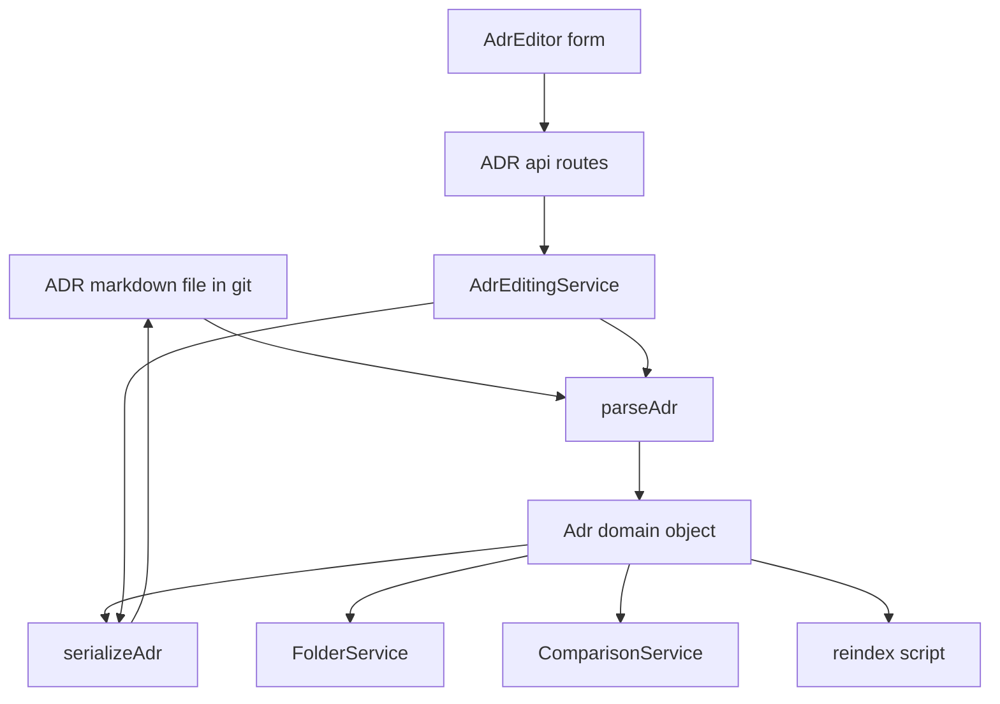
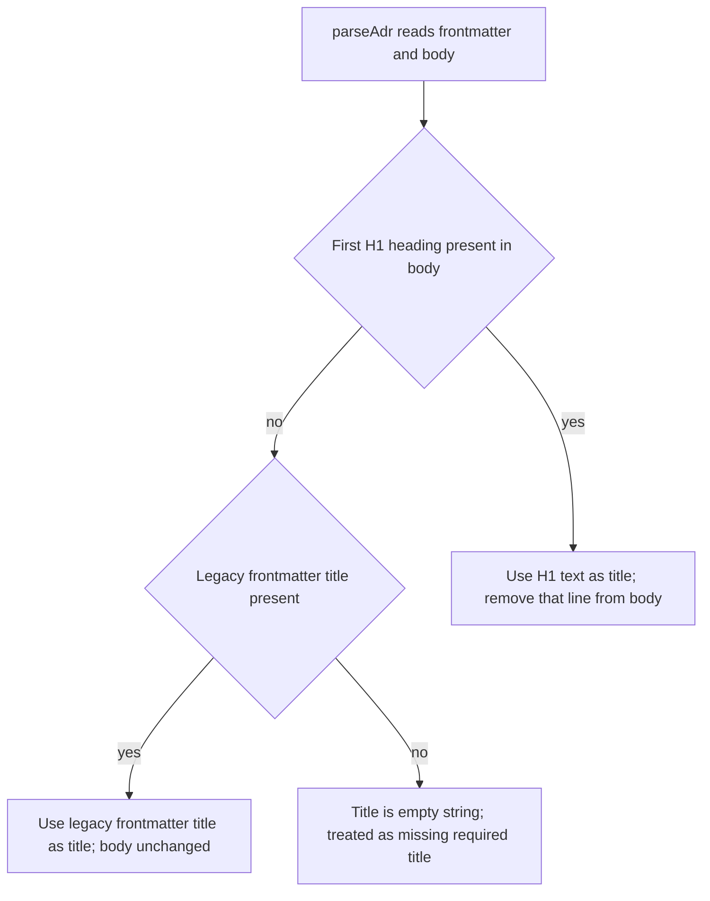

# Design Document: MADR Template Alignment

## Overview

**Purpose**: This feature realigns the ADR Manager's ADR data model and serialization with the official MADR template, pinned to [MADR v4.0.0](https://github.com/adr/madr/releases/tag/4.0.0) (released 2024-09-17, commit `2475fe1973f66a12aaf58a91d8fa7b42c0f5ea3d`), so that files this system commits are directly portable to other MADR-aware tooling, and new ADRs are scaffolded with MADR's section structure instead of starting blank.

**Users**: ADR authors and maintainers of this repository, who create, edit, compare, and read ADRs through the existing web app and API.

**Impact**: Changes the shared ADR type contract (`@adr/shared`), the single parse/serialize translation boundary in `@adr/core` (`packages/core/src/adr/parse.ts`), the ADR creation/save flow, the comparison field list, the status list/badge, the editor form, and this repository's example ADR fixture. It does not change git-as-source-of-truth, the optimistic-concurrency mechanism, the relations/supersession model, or the search-index rebuild mechanics — those continue to operate over the renamed/relocated fields without structural change.

### Goals
- Rename `deciders` to `decision-makers` in ADR frontmatter and add optional `consulted`/`informed`, end to end (model, API, editor, comparison).
- Add `rejected` to the status vocabulary, kept fully independent of the relations-based supersession model.
- Scaffold new ADR bodies with the 8 MADR section headings, distinguishing required from optional sections.
- Relocate the ADR title from a frontmatter field to the body's H1 heading, with read-time derivation and legacy-frontmatter fallback.
- Preserve backward-compatible reads of legacy `deciders`/frontmatter `title`, rewriting them to the new format on next save.
- Migrate this repository's example ADR fixture to the new format.

### Non-Goals
- Renaming or removing the existing non-MADR frontmatter fields `id`, `tags`, `relations`.
- Any change to how the relations-based supersession model is structured, validated, or displayed.
- Encoding a superseding ADR's identifier inside the status value (MADR's "superseded by ADR-0123" string convention).
- Any change to git-as-source-of-truth, the search-index rebuild mechanics, or the optimistic-concurrency conflict model, beyond carrying the renamed/relocated fields through them.
- Visual/presentation changes (owned by the separate `adr-manager-frontend-redesign` spec).

## Boundary Commitments

### This Spec Owns
- The `AdrFrontmatter`, `Adr`, `AdrStatus`, `CreateAdrRequest`, and `UpdateAdrRequest` shape changes in `@adr/shared`.
- The parse/serialize translation boundary (`packages/core/src/adr/parse.ts`): legacy-key back-compat reads, H1 title extraction/injection, and the canonical `decision-makers` YAML key on write.
- The MADR body scaffold content and its use in `AdrEditingService.create()`.
- Exposure of `decisionMakers`/`consulted`/`informed` in the editor form and the comparison field list, and `rejected` in the status list/badge.
- Migration of `examples/0001-uzycie-gita-jako-zrodla-prawdy.md` to the new format.

### Out of Boundary
- `RelationGraphService` and the relations/supersession model — already fully independent of `status`; this spec adds `rejected` without touching this service.
- `GitPort` mechanics, the optimistic-concurrency blobSha comparison, and the SQLite/search-index schema and rebuild orchestration — only the field names and title source flowing through them change, not their mechanics.
- Any new validation/schema library or formal migration tooling beyond the parse-time legacy fallback already described.
- Visual/design-system presentation of any of the changed fields (status badge color, card layout, etc.) — covered by `adr-manager-frontend-redesign`.

### Allowed Dependencies
- `gray-matter` (existing dependency, no version change) — the only library this design relies on, extended in-place.
- Existing `GitPort`, `SearchIndex`, and `RelationGraphService` ports/services, used unmodified.
- Existing `AdrEditingService` / `ComparisonService` / `FolderService` structure — only specific field references inside `AdrEditingService` and `ComparisonService` change; `FolderService` is unmodified.

### Revalidation Triggers
- Any future change to `AdrFrontmatter`'s field set or the H1-title contract must re-check `parse.ts`, `comparisonService.ts`'s `FIELD_NAMES`, `reindex.ts`'s embedding text, and the editor form.
- Any change to what `AdrEditingService.create()` uses as the initial body must re-check `MADR_BODY_SCAFFOLD`'s consumption.
- Any change to `AdrStatus`'s union must re-check `AdrEditor.tsx`'s `ADR_STATUSES` and `StatusBadge.tsx`'s `STATUS_LABELS`.

## Architecture

### Existing Architecture Analysis
- Git is the sole source of truth for ADR content; SQLite is a rebuildable secondary projection (search index, embedding cache) via `pnpm reindex`. This design does not touch that split.
- Every consumer of ADR data — `FolderService`, `ComparisonService`, `AdrEditingService`, the API routes, `reindex.ts`, and every web UI component — obtains `Adr` objects exclusively through `parseAdr`, and writes them exclusively through `serializeAdr`. None of these consumers re-derives fields from raw YAML or raw Markdown themselves.
- `Adr extends AdrFrontmatter` today, so `title` is presently a literal frontmatter passthrough. Because every consumer already treats `adr.title` as an opaque string, `title` can be relocated to the body's H1 by changing only `AdrFrontmatter` (drop `title`) and `Adr` (declare `title: string` directly, now populated by `parseAdr` instead of inherited from frontmatter) — no consumer beyond `parse.ts` needs to change to support the relocation.
- Optimistic concurrency (blobSha comparison) and relation-target validation in `AdrEditingService.save()` operate independently of which frontmatter fields exist, so they require no change.

This is the key architectural finding from `research.md`: the rename and the title relocation can both be fully absorbed by the single `parse.ts` translation boundary, keeping the blast radius limited to that file plus the handful of surfaces that explicitly enumerate `deciders` or status values.

### Architecture Pattern & Boundary Map



**Architecture Integration**:
- Selected pattern: single translation boundary — extend the existing `parse.ts` module rather than introduce a schema/validation layer.
- Domain/feature boundaries: `@adr/shared` declares the canonical (post-migration) shape; `parse.ts` is the only code aware of legacy on-disk variants (legacy `deciders` key, legacy frontmatter `title`).
- Existing patterns preserved: git-as-source-of-truth, scan-based `findAdrById` in each service, optimistic concurrency via blobSha, best-effort search-index upsert on save.
- New components rationale: one new constant module (`madrTemplate.ts`) holds the body scaffold, kept separate from `editingService.ts` for single-responsibility and isolated unit testing.
- Steering compliance: no steering documents exist yet for this repository; this design follows the codebase's own established conventions (camelCase multi-word fields, scan-based lookups, the gray-matter boundary as the sole YAML touchpoint).

### Technology Stack

| Layer | Choice / Version | Role in Feature | Notes |
|-------|------------------|------------------|-------|
| Data / Storage (file format) | gray-matter (existing, unchanged version) | YAML frontmatter parse/stringify boundary, extended with H1 extraction/injection and legacy-key fallback | No new dependency introduced |
| Backend / Services | TypeScript (existing) | `@adr/shared` type changes, `@adr/core` parse/edit/compare service changes | |
| Frontend | React + TypeScript (existing) | Editor form fields for `decisionMakers`/`consulted`/`informed`, `rejected` status option | |

## File Structure Plan

### Modified Files
- `packages/shared/src/types.ts` — `AdrFrontmatter` drops `title`, renames `deciders?` to `decisionMakers?`, adds `consulted?`/`informed?`; `Adr` declares `title: string` directly; `AdrStatus` adds `"rejected"`; `CreateAdrRequest`/`UpdateAdrRequest` get the same field rename and additions.
- `packages/core/src/adr/parse.ts` — `parseAdr` extracts the title from the body's first H1 (falling back to a legacy frontmatter `title`, else `""`), and maps the frontmatter `decision-makers` key (falling back to legacy `deciders`) into `decisionMakers`. `serializeAdr` prepends `# {title}` to the body and writes `decision-makers` in frontmatter — it never writes `title` or `deciders`.
- `packages/core/src/adr/madrTemplate.ts` (new) — exports `MADR_BODY_SCAFFOLD: string`: the 8 MADR v4.0.0 section headings in order and at the same heading levels as the upstream template (Consequences/Confirmation nested as `###` under `## Decision Outcome`, the other six as `##`), with optional sections marked by an HTML comment beneath the heading (mirroring MADR's own template convention) and all sections left empty.
- `packages/core/src/adr/editingService.ts` — `create()` uses `MADR_BODY_SCAFFOLD` instead of `""` as the initial body, and passes `decisionMakers`/`consulted`/`informed` instead of `deciders`; `save()` gets the same field rename.
- `packages/core/src/compare/comparisonService.ts` — `FIELD_NAMES` replaces `"deciders"` with `"decisionMakers"`, `"consulted"`, `"informed"`; `fieldValue()`'s array-join branch covers the three renamed/new fields.
- `apps/web/src/features/adr-editor/AdrEditor.tsx` — `ADR_STATUSES` adds `"rejected"`; the `deciders` form field/input is renamed to `decisionMakers` (testid `decision-makers-input`), with two additional optional inputs for `consulted` and `informed`.
- `apps/web/src/components/StatusBadge.tsx` — `STATUS_LABELS` adds `rejected: "Rejected"`.
- `examples/0001-uzycie-gita-jako-zrodla-prawdy.md` — frontmatter `deciders` renamed to `decision-makers`, frontmatter `title` removed, and the body gains `# Użycie gita jako źródła prawdy dla ADR` as its new first line; the existing `## Kontekst`/`## Decyzja`/`## Konsekwencje` sections are unchanged below it.
- Test files colocated with each module above (`*.test.ts`/`*.test.tsx`) and `apps/e2e/tests/adr-lifecycle.spec.ts` are updated in lockstep with their corresponding source change (field rename, added status, H1-title assertions) — not enumerated individually since each follows the same rename pattern as its source file.

### Confirmed Unchanged (no edits — listed for traceability against the boundary above)
`apps/api/src/routes/adrs.ts`, `apps/web/src/api/client.ts`, `packages/core/src/folders/folderService.ts`, `packages/core/src/relations/relationGraphService.ts`, `apps/api/src/scripts/reindex.ts`, `apps/web/src/components/AdrCard.tsx`, `apps/web/src/components/ContextHeader.tsx`, `apps/web/src/App.tsx`. Each consumes `Adr`/`AdrSummary` fields (`title`, `status`, etc.) generically through `parseAdr`'s output and requires no code change; their continued correct behavior is exercised by the updated tests in the modified files above.

## System Flows

Title resolution is the one branching rule introduced by this feature; everything else is a direct rename.



- `decisionMakers` resolution is a single fallback (`decision-makers` frontmatter key, else legacy `deciders`, else absent) and does not need its own diagram.
- The editor's dedicated Title field remains the only way a user edits the title through this app's UI; the body textarea never displays the H1 line, since `parseAdr` strips it before populating `Adr.body`. `serializeAdr` is solely responsible for re-injecting `# {title}` at write time, so normal use of this app's own editor cannot produce a duplicate H1.

## Requirements Traceability

| Requirement | Summary | Components | Interfaces | Flows |
|---|---|---|---|---|
| 1.1 | `decision-makers` recorded on create | types.ts, editingService.create | `AdrFrontmatter`, `CreateAdrRequest` | — |
| 1.2 | optional `consulted`/`informed` | types.ts | `AdrFrontmatter`, `CreateAdrRequest`, `UpdateAdrRequest` | — |
| 1.3 | editor view/edit fields | AdrEditor.tsx | `EditAdrForm` | — |
| 1.4 | API accepts/returns the renamed fields | types.ts (DTOs) | `CreateAdrRequest`, `UpdateAdrRequest`, `Adr` | — |
| 1.5 | comparison includes the renamed/new fields | comparisonService.ts | `FIELD_NAMES`, `fieldValue` | — |
| 2.1 | `rejected` is a valid status | types.ts | `AdrStatus` | — |
| 2.2 | `rejected` selectable | AdrEditor.tsx | `ADR_STATUSES` | — |
| 2.3 | supersession stays relations-only | relationGraphService.ts (unchanged) | `RelationGraphService` | — |
| 2.4 | no relation required for `superseded`/`rejected` | editingService.save (unchanged validation) | `AdrEditingService.save` | — |
| 3.1 | 8 section headings in order | madrTemplate.ts | `MADR_BODY_SCAFFOLD` | — |
| 3.2 | required vs optional distinguishable | madrTemplate.ts | `MADR_BODY_SCAFFOLD` | — |
| 3.3 | sections left empty | madrTemplate.ts, editingService.create | `MADR_BODY_SCAFFOLD` | — |
| 4.1 | new ADR title written as H1, no frontmatter title | parse.ts (`serializeAdr`), editingService.create | `serializeAdr` | Title resolution |
| 4.2 | read derives title from H1 | parse.ts (`parseAdr`) | `parseAdr` | Title resolution |
| 4.3 | editing title updates the H1 | parse.ts (`serializeAdr`), editingService.save | `serializeAdr` | — |
| 4.4 | display shows the H1-derived title | AdrCard/ContextHeader/App.tsx (unchanged) | `Adr.title` | — |
| 4.5 | search/compare use the H1-derived title equivalently | reindex.ts (unchanged), comparisonService.ts | `Adr.title` | — |
| 4.6 | missing H1 + no legacy title = missing required title | parse.ts (`parseAdr`) | `parseAdr` | Title resolution |
| 5.1 | legacy `deciders` read as `decision-makers` | parse.ts (`parseAdr`) | `parseAdr` | — |
| 5.2 | legacy `deciders` rewritten on next save | parse.ts (`serializeAdr`) | `serializeAdr` | — |
| 5.3 | legacy frontmatter `title` fallback | parse.ts (`parseAdr`) | `parseAdr` | Title resolution |
| 5.4 | migrate example fixture | examples/0001-...md | — | — |
| 5.5 | migrated fixture reads/displays/indexes/compares correctly | examples/0001-...md + unchanged services | `parseAdr`, `reindex` script | — |
| 6.1 | git remains source of truth | GitPort (unchanged) | — | — |
| 6.2 | concurrency check unaffected | editingService.save (unchanged) | `AdrEditingService.save` | — |
| 6.3 | reindex reflects renamed/relocated fields | reindex.ts (unchanged code, new `Adr` shape) | reindex script | — |

## Components and Interfaces

| Component | Domain/Layer | Intent | Req Coverage | Key Dependencies | Contracts |
|---|---|---|---|---|---|
| `AdrFrontmatter` / `Adr` / `AdrStatus` / `CreateAdrRequest` / `UpdateAdrRequest` | `@adr/shared` types | Canonical on-disk + domain shape | 1.1, 1.2, 1.4, 2.1 | none (P0) | State |
| `parseAdr` / `serializeAdr` | `@adr/core` adr | Single translation boundary: legacy keys, H1 title extraction/injection | 4.1, 4.2, 4.3, 4.6, 5.1, 5.2, 5.3 | gray-matter (P0) | Service |
| `MADR_BODY_SCAFFOLD` | `@adr/core` adr | New-ADR body section skeleton | 3.1, 3.2, 3.3 | none (P2) | State |
| `AdrEditingService` | `@adr/core` adr | create/save orchestration using parse/serialize and the scaffold | 1.1, 1.2, 2.4, 3.3, 4.1, 4.3, 6.2 | `parseAdr`/`serializeAdr` (P0), `RelationGraphService` (P1), `SearchIndex` (P1) | Service |
| `ComparisonService` | `@adr/core` compare | Field-diff includes `decisionMakers`/`consulted`/`informed` and the H1-derived title | 1.5, 4.5 | `parseAdr` (P0) | Service |
| `AdrEditor` (CreateAdrForm/EditAdrForm) | `apps/web` UI | Exposes `decisionMakers`/`consulted`/`informed` fields and the `rejected` status option | 1.3, 2.2 | `ApiClient` (P0) | State |
| `StatusBadge` | `apps/web` UI | Adds the `rejected` label | 2.2 | none (P2) | State |
| Example fixture migration | `examples/` | Demonstrates the new format in this repository | 5.4, 5.5 | `parseAdr` (P1) | — |

### Core / `@adr/shared`

#### Shared Types

| Field | Detail |
|-------|--------|
| Intent | Declares the canonical post-migration ADR frontmatter, domain, and DTO shapes |
| Requirements | 1.1, 1.2, 1.4, 2.1 |

**Responsibilities & Constraints**
- `AdrFrontmatter` declares exactly the literal frontmatter keys this system writes going forward: `id`, `status`, `date`, `decisionMakers?`, `consulted?`, `informed?`, `tags?`, `relations?` — no `title`, no `deciders`.
- `Adr` (still `extends AdrFrontmatter`) adds `title: string` directly, since title is no longer a frontmatter passthrough but a value `parseAdr` derives from the body.
- `AdrStatus` adds `"rejected"` alongside the four existing values.
- `CreateAdrRequest`/`UpdateAdrRequest` mirror the `AdrFrontmatter` rename (`decisionMakers?`, `consulted?`, `informed?`) and keep `title` as a plain DTO field (unaffected by where it's physically stored on disk).

**Contracts**: Service [ ] / API [ ] / Event [ ] / Batch [ ] / State [x]

Full before/after type definitions are in Supporting References.

### Core / `@adr/core` adr

#### parseAdr / serializeAdr

| Field | Detail |
|-------|--------|
| Intent | The single boundary that translates between on-disk MADR-shaped Markdown and the in-memory `Adr` object, absorbing all legacy back-compat logic |
| Requirements | 4.1, 4.2, 4.3, 4.6, 5.1, 5.2, 5.3 |

**Responsibilities & Constraints**
- Owns title resolution (H1 extraction, legacy-frontmatter fallback, missing-title fallback to `""`) per the Title Resolution flow above.
- Owns `decisionMakers` resolution: reads frontmatter `decision-makers` if present, else legacy `deciders`, else leaves it `undefined`.
- Is the only code in the system that reads or writes the literal `decision-makers`/legacy `deciders`/legacy `title` keys; every other consumer operates on `Adr.decisionMakers`/`Adr.title` as plain values.
- `serializeAdr` never emits a frontmatter `title` or `deciders` key — new and resaved ADRs always conform to the canonical shape (satisfies 5.2's "next save persists as `decision-makers`").

**Dependencies**
- External: gray-matter — YAML frontmatter parse/stringify (P0)

**Contracts**: Service [x] / API [ ] / Event [ ] / Batch [ ] / State [ ]

##### Service Interface
```typescript
interface AdrParser {
  parseAdr(raw: string, path: string, blobSha: string): Adr;
  serializeAdr(adr: Adr): string;
}
```
- Preconditions: `raw` is gray-matter-parseable (YAML frontmatter + Markdown body); for `serializeAdr`, `adr.title` is a string (possibly empty) and `adr.body` does not itself contain the title's H1 line.
- Postconditions: `parseAdr(raw, ...).title` equals the body's first H1 text when one exists, else the legacy frontmatter `title` when present, else `""`; the returned `Adr.body` never contains the line that was identified as the title. `serializeAdr(adr)`'s frontmatter never contains `title` or `deciders` keys, and contains `decision-makers` whenever `adr.decisionMakers` is defined.
- Invariants: `decisionMakers` is read from at most one of `decision-makers` / legacy `deciders` per parse (the canonical key always wins when both are somehow present); round-tripping a canonically-shaped `Adr` through `serializeAdr` then `parseAdr` yields an equal `Adr`.

**Implementation Notes**
- Integration: `AdrEditingService`, `FolderService`, `ComparisonService`, the API routes, and `reindex.ts` all call these two functions exclusively and require no further change.
- Validation: no new validation is added here; a missing title degrades to `""` rather than throwing, consistent with this module's existing no-throw, direct-cast style.
- Risks: a body whose first line is an incidental `#`-prefixed line that is not intended as the title would be misparsed as the title; accepted as an edge case outside this app's own editor flow (see System Flows note above), not defended against with extra parsing rules.

#### MADR_BODY_SCAFFOLD

| Field | Detail |
|-------|--------|
| Intent | Initial body content for newly created ADRs: the 8 MADR section headings, optional ones marked | 
| Requirements | 3.1, 3.2, 3.3 |

**Responsibilities & Constraints**
- A single exported string constant; no logic, no parsing dependency on `parse.ts`.
- Section order and heading levels match MADR v4.0.0 exactly: six `##` sections — Context and Problem Statement, Decision Drivers, Considered Options, Decision Outcome, Pros and Cons of the Options, More Information — with Consequences and Confirmation nested as `###` subsections under Decision Outcome, mirroring the upstream template's structure rather than flattening all 8 to the same heading level.
- Required sections (Context and Problem Statement, Decision Outcome) carry no marker; optional sections — including the two `###` ones nested under Decision Outcome — carry an HTML comment beneath the heading, mirroring the official MADR template's own convention for marking optional elements.

**Contracts**: Service [ ] / API [ ] / Event [ ] / Batch [ ] / State [x]

**Implementation Notes**
- Integration: consumed only by `AdrEditingService.create()`, replacing today's `body: ""`.
- Validation: none — content is plain Markdown text the author edits or replaces freely.
- Risks: none; full text is in Supporting References for review.

#### AdrEditingService (changes only)

| Field | Detail |
|-------|--------|
| Intent | Orchestrates ADR creation and save, now sourcing the scaffold body and the renamed decision-participant fields |
| Requirements | 1.1, 1.2, 2.4, 3.3, 4.1, 4.3, 6.2 |

**Responsibilities & Constraints**
- `create()`: passes `decisionMakers`/`consulted`/`informed` (instead of `deciders`) into the `withoutUndefined` frontmatter spread, and uses `MADR_BODY_SCAFFOLD` instead of `""` for `body`. The id generation, commit flow, and `status: "proposed"` defaulting are unchanged.
- `save()`: same field rename in its `withoutUndefined` spread. The `missingFields`/concurrency/relation-target validation order, and the fact that no relation is required for any status value (including `superseded`/`rejected`), are unchanged — this is already true today since none of that logic is keyed on `status`.

**Contracts**: Service [x] / API [ ] / Event [ ] / Batch [ ] / State [ ]

**Implementation Notes**
- Integration: no signature change to `create`/`save`; only the literal field names referenced inside their bodies change.
- Validation: unchanged — `!input.title`/`!input.body` remain the only missing-field checks; Req 4.6's "missing title" case surfaces here exactly as any other empty required string would, the first time such an ADR is edited and saved.
- Risks: none beyond what `parse.ts` already covers.

### Core / `@adr/core` compare

#### ComparisonService (changes only)

| Field | Detail |
|-------|--------|
| Intent | Field-level diff between two ADRs or two versions, now covering the renamed/new participant fields and the H1-derived title | 
| Requirements | 1.5, 4.5 |

**Responsibilities & Constraints**
- `FIELD_NAMES` becomes `["title", "status", "date", "decisionMakers", "consulted", "informed", "tags", "body"]`.
- `fieldValue()`'s array-join branch (currently `"deciders" | "tags"`) extends to cover `"decisionMakers" | "consulted" | "informed" | "tags"`.
- `title` continues to flow through `fieldValue`'s default `String(adr[field])` branch unchanged — it is still a plain string field on `Adr`, just sourced differently upstream by `parseAdr`.

**Contracts**: Service [x] / API [ ] / Event [ ] / Batch [ ] / State [ ]

**Implementation Notes**
- Integration: no signature change to `versionDiff`/`adrDiff`; only `FIELD_NAMES` and `fieldValue`'s switch change.
- Validation: none beyond what exists today.
- Risks: none.

### Web UI

#### AdrEditor (CreateAdrForm / EditAdrForm)

Summary-only (no new boundary — same form/API integration pattern as today).

**Implementation Notes**
- Integration: `EditAdrForm`'s `deciders` state/input is renamed to `decisionMakers` (testid `decision-makers-input`); two new optional text inputs are added for `consulted`/`informed`, following the existing comma-separated-list convention (`splitCsv`/join) already used for `tags`. `ADR_STATUSES` gains `"rejected"`, appearing in the existing `<select>` with no other change.
- Validation: unchanged — the existing `missingFields`/`missingTargets`/`conflict` handling already covers every status value and every optional field.
- Risks: none; this is a presentation-adjacent field/option addition, not a new boundary.

#### StatusBadge

Summary-only (no new boundary).

**Implementation Notes**
- Integration: `STATUS_LABELS` gains `rejected: "Rejected"`. The existing `isKnownStatus`/neutral-fallback mechanism requires no change.
- Risks: none.

## Data Models

### Domain Model
- `Adr` remains the single aggregate for an ADR's full state (frontmatter-derived fields + body + git position). Its only structural change is that `title` is now a value `parseAdr` derives once from the body (or a legacy fallback), rather than a literal frontmatter passthrough — `Adr` declares `title: string` directly instead of inheriting it through `AdrFrontmatter`.
- Invariant: every `Adr` has exactly one title, resolved once at parse time and re-serialized once at write time; no other code path reads or writes title.
- `AdrFrontmatter` is the value object representing exactly the literal on-disk frontmatter shape going forward — it never includes `title` or `deciders`.

### Logical Data Model

**Before**:
```typescript
export interface AdrFrontmatter {
  id: AdrId;
  title: string;
  status: AdrStatus;
  date: string;
  deciders?: string[];
  tags?: string[];
  relations?: AdrRelation[];
}

export interface Adr extends AdrFrontmatter {
  body: string;
  path: string;
  blobSha: string;
}
```

**After**:
```typescript
export type AdrStatus = "proposed" | "accepted" | "deprecated" | "superseded" | "rejected";

export interface AdrFrontmatter {
  id: AdrId;
  status: AdrStatus;
  date: string;
  decisionMakers?: string[];
  consulted?: string[];
  informed?: string[];
  tags?: string[];
  relations?: AdrRelation[];
}

export interface Adr extends AdrFrontmatter {
  title: string;
  body: string;
  path: string;
  blobSha: string;
}
```

`CreateAdrRequest`/`UpdateAdrRequest` keep `title: string` (a DTO field, independent of physical storage) and rename `deciders?` to `decisionMakers?`, adding `consulted?`/`informed?`:
```typescript
export interface CreateAdrRequest {
  title: string;
  decisionMakers?: string[];
  consulted?: string[];
  informed?: string[];
  tags?: string[];
  folder: string;
}

export interface UpdateAdrRequest {
  title: string;
  status: AdrStatus;
  date: string;
  decisionMakers?: string[];
  consulted?: string[];
  informed?: string[];
  tags?: string[];
  relations?: AdrRelation[];
  body: string;
  author: string;
  baseBlobSha: string;
}
```

**Consistency & Integrity**: No change to transaction boundaries (one git commit per create/save, as today) or to the optimistic-concurrency blobSha check; both operate on `Adr`/file content as a whole, independent of which fields it contains.

### Data Contracts & Integration

**API Data Transfer**: `POST /api/adrs` and `PUT /api/adrs/:id` request/response bodies follow the updated `CreateAdrRequest`/`UpdateAdrRequest`/`Adr` shapes above; HTTP status codes and the `missingFields`/`invalidRelations`/`conflict` response shapes are unchanged (1.4, 6.2).

**On-disk frontmatter (file format)**:
```yaml
id: "adr-0007"
status: proposed
date: 2026-06-26
decision-makers: [Alice]
consulted: [Bob]
informed: [Carol]
tags: [storage]
```
followed by a body whose first line is `# <title>`. This is the literal MADR-portable shape this feature produces (5.1, 5.2).

## Error Handling

### Error Strategy
Reuses the existing two-tier model rather than introducing a new one: request-time validation returns the existing `invalid`/`invalidRelations`/`conflict` result variants from `AdrEditingService.save()`; read-time issues (a malformed or legacy file) degrade to a value-level fallback (`title: ""`) instead of throwing, consistent with `parse.ts`'s existing no-throw, direct-cast style and with how unknown `status` values already degrade to a neutral badge in `StatusBadge`.

### Error Categories and Responses
- **User Errors (4xx)**: A missing title (Req 4.6 — no H1 and no legacy frontmatter title) is not rejected at read time; `parseAdr` returns `title: ""`. It surfaces through the existing `missingFields` mechanism the next time that ADR is edited and saved, since `AdrEditingService.save()` already rejects `!input.title` — no new error variant is introduced.
- **System Errors (5xx)**: Malformed YAML frontmatter is a pre-existing, out-of-scope failure mode (`parseAdr` already performs a direct, unvalidated cast); this feature does not change that behavior.
- **Business Logic Errors**: Unchanged `invalid` / `invalidRelations` / `conflict` `SaveResult` variants — none of this feature's new fields (`decisionMakers`, `consulted`, `informed`, `rejected`) introduce a new validation rule beyond the existing missing-required-field check.

### Monitoring
No new logging or monitoring is introduced. The existing best-effort search-index upsert failure swallowing (try/catch around `searchIndex.upsert`) is unchanged and continues to apply to upserts carrying the renamed fields.

## Testing Strategy

### Unit Tests
- `parse.ts`: `parseAdr` extracts the title from the first H1 and strips that line from `body`; falls back to a legacy frontmatter `title` when no H1 exists; returns `""` when neither exists; prefers frontmatter `decision-makers` over legacy `deciders` when both are present. `serializeAdr` prepends `# {title}` to the body and never emits frontmatter `title` or `deciders`. A serialize-then-parse round trip preserves `title`/`decisionMakers`/`consulted`/`informed`.
- `madrTemplate.ts`: the scaffold contains exactly the 8 MADR v4.0.0 headings, in order and at the correct heading level (Consequences/Confirmation as `###` under Decision Outcome, the rest as `##`); the two required sections carry no optional-marker comment, the six optional sections do.
- `editingService.test.ts`: `create()` seeds `body` with `MADR_BODY_SCAFFOLD` and passes `decisionMakers`/`consulted`/`informed` through; `save()` persists those same fields and succeeds for `status: "rejected"`/`"superseded"` with no relation present (regression check for 2.4).
- `comparisonService.test.ts`: the field diff includes `decisionMakers`/`consulted`/`informed`; the `title` field reflects each ADR's H1-derived value.

### Integration Tests
- `apps/api` route tests: POST/PUT round-trip `decisionMakers`/`consulted`/`informed` through request and response bodies; GET on a fixture with no frontmatter `title` returns the H1-derived title.
- `reindex.ts`: rebuilding the index against the migrated example fixture, and against a fixture using legacy `deciders`/frontmatter `title`, produces the correct title and tags in the index (6.3, 5.5).

### E2E/UI Tests
- `adr-lifecycle.spec.ts`: the create flow's resulting ADR body (reloaded into the editor) contains the MADR section headings; selecting `rejected` status and saving succeeds without adding a relation; the renamed decision-makers input round-trips through save and reload.
- Loading the migrated example fixture displays its H1-derived title correctly in the tree, card, and editor.

## Supporting References

Full text of `MADR_BODY_SCAFFOLD` (`packages/core/src/adr/madrTemplate.ts`), matching MADR v4.0.0's heading levels:
```markdown
## Context and Problem Statement

## Decision Drivers

<!-- Optional: list the decision drivers that motivated this choice. -->

## Considered Options

<!-- Optional: list the options that were considered. -->

## Decision Outcome

### Consequences

<!-- Optional: describe the consequences of this decision. -->

### Confirmation

<!-- Optional: describe how compliance with this decision is confirmed. -->

## Pros and Cons of the Options

<!-- Optional: detail the pros and cons of each considered option. -->

## More Information

<!-- Optional: add supporting evidence, links, or follow-up notes. -->
```

- [MADR template, v4.0.0](https://github.com/adr/madr/blob/4.0.0/template/adr-template.md) (released 2024-09-17, commit `2475fe1973f66a12aaf58a91d8fa7b42c0f5ea3d`) — canonical section structure, frontmatter field names, and the optional-section comment convention this feature aligns with. Pinned to this tag, not the `develop` branch, so a future upstream template change cannot silently drift this spec's alignment without a deliberate version bump.
- Frontmatter optionality note: MADR v4.0.0 marks every frontmatter field — including `status` and `date` — as optional ("These are optional metadata elements. Feel free to remove any of them."). This design keeps `id`, `status`, and `date` required-by-type on `AdrFrontmatter`/`Adr`, consistent with this application's pre-existing architecture (status drives the badge/filter UI; date drives sorting/history) rather than a new restriction introduced by this feature. Only `decisionMakers`, `consulted`, `informed`, `tags`, and `relations` are optional here, matching MADR's own optionality for those specific fields.
