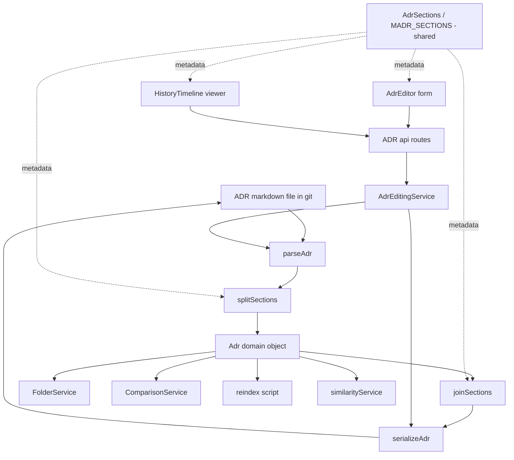
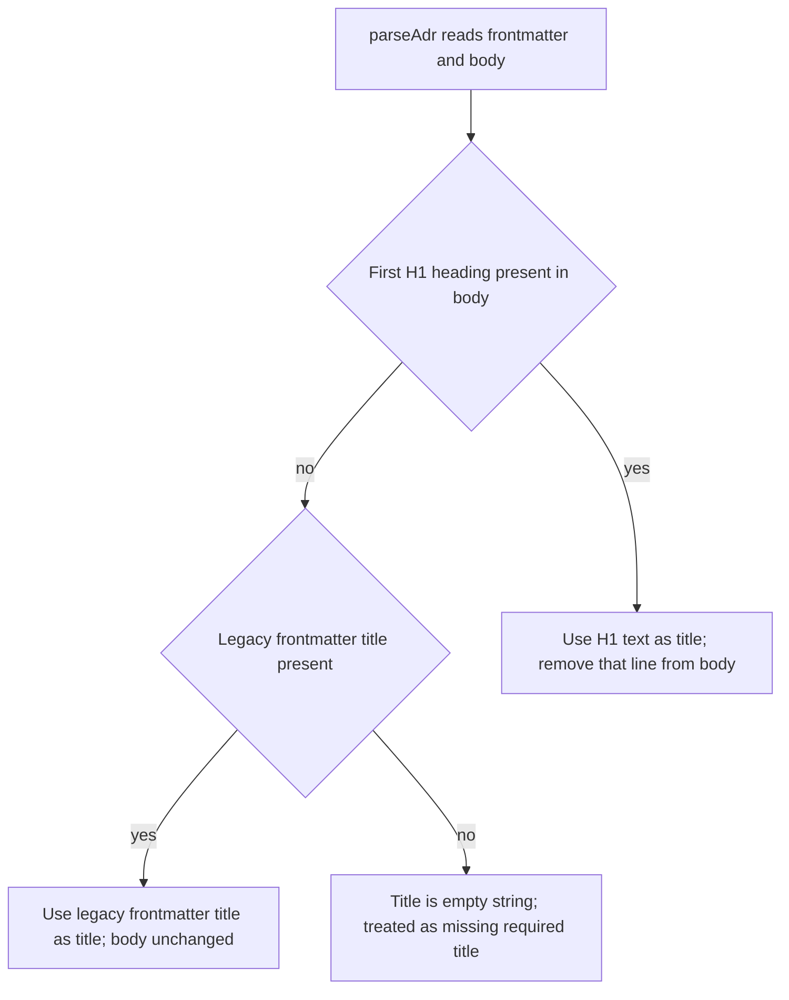
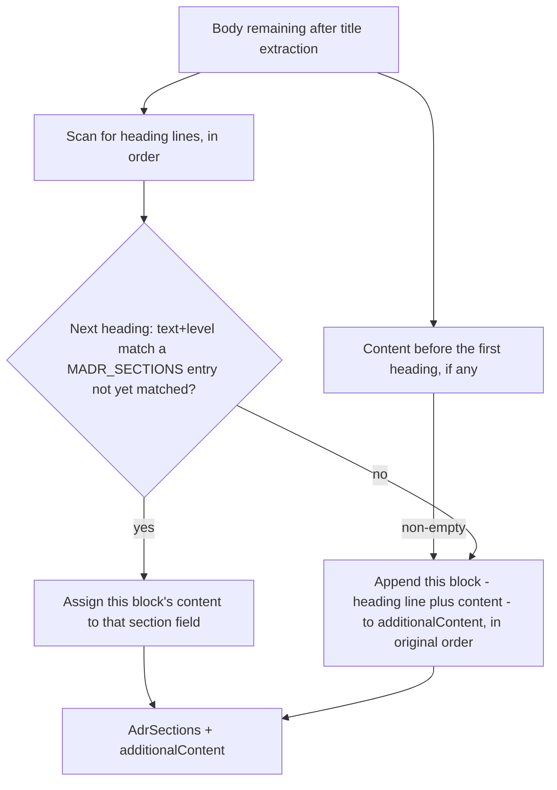

# Design Document: MADR Template Alignment

## Overview

**Purpose**: This feature realigns the ADR Manager's ADR data model and serialization with the official MADR template, pinned to [MADR v4.0.0](https://github.com/adr/madr/releases/tag/4.0.0) (released 2024-09-17, commit `2475fe1973f66a12aaf58a91d8fa7b42c0f5ea3d`), so that files this system commits are directly portable to other MADR-aware tooling, and authors are guided section by section through a complete decision record instead of editing one undifferentiated body field.

**Users**: ADR authors and maintainers of this repository, who create, edit, compare, and read ADRs through the existing web app and API.

**Impact**: Changes the shared ADR type contract (`@adr/shared`), the single parse/serialize translation boundary in `@adr/core` (`packages/core/src/adr/parse.ts`), a new section split/join module (`packages/core/src/adr/sections.ts`, replacing `madrTemplate.ts`), the ADR creation/save flow, the comparison field list, both embedding-text construction sites (`reindex.ts` and `similarityService.ts`), the editor form, the history version viewer, the status list/badge, and this repository's example ADR fixture (confirmed to need no further edit — see File Structure Plan). It does not change git-as-source-of-truth, the optimistic-concurrency mechanism, the relations/supersession model, or the search-index storage mechanics — those continue to operate over the restructured fields without structural change.

### Goals
- Replace the single `body: string` field with 8 individually editable fields — one per MADR section — plus one catch-all field for content that doesn't map to any of the 8 sections.
- Serialize the 8 fields to canonical MADR Markdown headings (in MADR's order and heading levels) on write, followed by the catch-all field's content if non-empty.
- Losslessly parse legacy or non-conforming bodies (free-form text, non-MADR headings, out-of-order headings, content before the first heading) by mapping recognized headings to their fields and routing everything else into the catch-all field.
- Distinguish the two MADR-required sections (Context and Problem Statement, Decision Outcome) from the six optional ones, both in the editor UI and in the missing-required-field check that previously applied to `body`.
- Extend comparison, search indexing, and the embedding-similarity text construction to the new field set, producing results equivalent to today's whole-body-based behavior.
- Rename `deciders` to `decision-makers` in ADR frontmatter and add optional `consulted`/`informed`, end to end (model, API, editor, comparison).
- Add `rejected` to the status vocabulary, kept fully independent of the relations-based supersession model.
- Relocate the ADR title from a frontmatter field to the body's H1 heading, with read-time derivation and legacy-frontmatter fallback.
- Preserve backward-compatible reads of legacy `deciders`/frontmatter `title`, rewriting them to the new format on next save.

### Non-Goals
- Renaming or removing the existing non-MADR frontmatter fields `id`, `tags`, `relations`.
- Any change to how the relations-based supersession model is structured, validated, or displayed.
- Encoding a superseding ADR's identifier inside the status value (MADR's "superseded by ADR-0123" string convention).
- Any change to git-as-source-of-truth, the search-index storage mechanics, or the optimistic-concurrency conflict model, beyond carrying the restructured/renamed/relocated fields through them.
- Reorganizing or translating existing non-MADR-section body content (including this repository's example fixture, which uses non-MADR Polish headings) into the 8 discrete sections — such content is preserved verbatim through the catch-all field.
- Preserving the nesting/grouping of arbitrary sub-headings an author might add inside a section (e.g. a hypothetical `### Option 1` under "Pros and Cons of the Options") — only the 8 canonical headings are recognized as section boundaries; anything else, including such sub-headings and their content, is treated as catch-all content. No data is lost, but physical grouping with the logical parent section is not guaranteed across a round trip.
- Visual/presentation changes beyond what's needed to render 9 fields instead of 1 (owned by the separate `adr-manager-frontend-redesign` spec).

## Boundary Commitments

### This Spec Owns
- The `AdrSections` interface and `MADR_SECTIONS` ordered metadata array (heading text, heading level, required flag, key, in canonical order), declared once in `@adr/shared` and consumed by both `@adr/core` and `apps/web`.
- The `AdrFrontmatter`, `Adr`, `AdrStatus`, `CreateAdrRequest`, and `UpdateAdrRequest` shape changes in `@adr/shared`, including replacing `body: string` with `AdrSections` + `additionalContent: string`.
- The parse/serialize translation boundary (`packages/core/src/adr/parse.ts`): legacy-key back-compat reads, H1 title extraction/injection, and the canonical `decision-makers` YAML key on write.
- The new section split/join module (`packages/core/src/adr/sections.ts`): `splitSections` (lossless read-time mapping of body content into the 8 fields + catch-all) and `joinSections` (canonical write-time serialization), replacing `madrTemplate.ts`/`MADR_BODY_SCAFFOLD`.
- The single shared combined-text helper used by both embedding-text construction sites (`reindex.ts`, `similarityService.ts`) and search indexing, built on top of `joinSections`.
- `AdrEditingService.create()`/`save()`'s use of the 9 fields in place of `body`, including the missing-required-section check that replaces the old `!input.body` check.
- `ComparisonService`'s field list, replacing `"body"` with the 8 section keys + `"additionalContent"`.
- Exposure of the 9 fields in the editor form (`AdrEditor.tsx`) and the read-only history version viewer (`HistoryTimeline.tsx`), and exposure of `decisionMakers`/`consulted`/`informed` in the editor form and the comparison field list, and `rejected` in the status list/badge.
- Confirming (not modifying) that `examples/0001-uzycie-gita-jako-zrodla-prawdy.md` requires no further edit under the new model.

### Out of Boundary
- `RelationGraphService` and the relations/supersession model — already fully independent of `status`; this spec adds `rejected` without touching this service.
- `GitPort` mechanics, the optimistic-concurrency blobSha comparison, and the SQLite/search-index schema and rebuild orchestration — only the text fed into them changes, not their mechanics or schema.
- Any markdown-AST parsing library — `splitSections`/`joinSections` use the same line-based heading-scan approach already prototyped for the (now-deleted) `madrTemplate.test.ts`, consistent with this codebase's existing direct-cast, no-new-dependency style.
- Any new validation/schema library or formal migration tooling beyond the parse-time legacy fallback and the required-section check already described.
- Preserving nested sub-heading structure within a section across a round trip (see Non-Goals).
- Visual/design-system presentation of any of the changed fields (status badge color, layout, etc.) — covered by `adr-manager-frontend-redesign`.

### Allowed Dependencies
- `gray-matter` (existing dependency, no version change) — the only library `parse.ts` relies on, extended in-place.
- Existing `GitPort`, `SearchIndex`, and `RelationGraphService` ports/services, used unmodified.
- Existing `AdrEditingService` / `ComparisonService` / `FolderService` structure — only specific field references inside `AdrEditingService` and `ComparisonService` change; `FolderService` is unmodified.
- `@adr/core`'s existing public export surface (`packages/core/src/index.ts`) — extended with a new `sections.js` export, not restructured.

### Revalidation Triggers
- Any future change to `AdrFrontmatter`'s field set or the H1-title contract must re-check `parse.ts`, `comparisonService.ts`'s `FIELD_NAMES`, both embedding-text call sites, and the editor form.
- Any future change to `MADR_SECTIONS`' heading text, level, or order must re-check `splitSections`/`joinSections`, the editor form, and `HistoryTimeline.tsx`, since all four read the same shared metadata array.
- Any change to `AdrStatus`'s union must re-check `AdrEditor.tsx`'s `ADR_STATUSES` and `StatusBadge.tsx`'s `STATUS_LABELS`.
- Any change to which two sections are MADR-required must re-check `AdrEditingService.save()`'s missing-field check and the editor's required/optional rendering, since both derive the same two keys from `MADR_SECTIONS`.

## Architecture

### Existing Architecture Analysis
- Git is the sole source of truth for ADR content; SQLite is a rebuildable secondary projection (search index, embedding cache) via `pnpm reindex`. This design does not touch that split.
- Every consumer of ADR data obtains `Adr` objects exclusively through `parseAdr`, and writes them exclusively through `serializeAdr`. A repo-wide sweep for `.body` usages beyond test files found exactly five production call sites depending on the current flat `body` field: `editingService.ts` (missing-field check, two assignments), `comparisonService.ts` (`FIELD_NAMES`), `AdrEditor.tsx` (the `body` textarea state), `HistoryTimeline.tsx` (the read-only version viewer), `reindex.ts`, and `similarityService.ts` (both construct embedding text from `adr.body`). The latter two were not part of the previously-implemented scaffold-only version of this spec and must be added to this revision's scope; the old design's "Confirmed Unchanged" classification for `reindex.ts` was incorrect and is corrected here.
- `apps/web` depends only on `@adr/shared` (confirmed via `apps/web/package.json` and a repo-wide grep — the only `@adr/core` string match in `apps/web` is inside a test file, not production code); `apps/web` cannot import from `@adr/core`. `@adr/shared` has zero runtime dependencies. `@adr/core` depends on `@adr/shared` + `gray-matter`. This dependency direction is the reason `AdrSections`/`MADR_SECTIONS` must live in `@adr/shared`: it is the only package both the UI (which needs the metadata to render labeled, ordered, required-marked inputs) and `@adr/core` (which needs it to split/join body text) can both import.
- `SearchDoc.body` (`packages/core/src/ports/search.ts`) is the search-index port's own internal column name, structurally unrelated to `Adr.body`/`UpdateAdrRequest.body` being removed here — only the value passed into it changes (from `adr.body` to combined section text), not the port's field name.
- Optimistic concurrency (blobSha comparison) and relation-target validation in `AdrEditingService.save()` operate independently of which content fields exist, so they require no change.

This is the key architectural finding carried forward from the prior research: the rename and title relocation are fully absorbed by `parse.ts`. This revision adds a second, parallel finding: the body-to-fields restructuring is absorbed by one new module, `sections.ts`, sitting directly downstream of `parse.ts`'s existing body extraction — `parse.ts` already isolates "the body, with the title line stripped" as a value; `sections.ts` takes that value one step further and splits it into the 9 fields, and joins it back on write. No other consumer needs to know about heading-scanning mechanics, mirroring how no other consumer needs to know about legacy-key fallback today.

### Architecture Pattern & Boundary Map



**Architecture Integration**:
- Selected pattern: single translation boundary, extended one layer deeper — `parse.ts` remains the only code aware of on-disk legacy variants (legacy `deciders` key, legacy frontmatter `title`); the new `sections.ts` is the only code aware of which headings count as MADR sections and how to scan for them. Neither module needs to know about the other's concerns.
- Domain/feature boundaries: `@adr/shared` declares the canonical (post-migration) shape and the section metadata both `@adr/core` and `apps/web` need; `@adr/core` owns all body-text mechanics (legacy keys, H1 title, section split/join); `apps/web` only ever renders fields it's handed and never re-derives them from raw Markdown.
- Existing patterns preserved: git-as-source-of-truth, scan-based `findAdrById` in each service, optimistic concurrency via blobSha, best-effort search-index upsert on save.
- New components rationale: `sections.ts` replaces `madrTemplate.ts` as a focused, single-responsibility module (split/join logic instead of a static scaffold string), isolated from `editingService.ts`'s orchestration and independently unit-testable, mirroring why `madrTemplate.ts` was originally kept separate. `AdrSections`/`MADR_SECTIONS` is a new shared-types module because, unlike everything else this spec touches, it is the one piece of domain knowledge needed on both sides of the `apps/web` → `@adr/core` dependency boundary that `apps/web` cannot cross.
- Steering compliance: no steering documents exist for this repository; this design follows the codebase's own established conventions (camelCase multi-word fields, scan-based lookups, the gray-matter boundary as the sole YAML touchpoint, line-based text scanning rather than an AST library for the one other place this codebase parses Markdown structure).

### Technology Stack

| Layer | Choice / Version | Role in Feature | Notes |
|-------|------------------|------------------|-------|
| Data / Storage (file format) | gray-matter (existing, unchanged version) | YAML frontmatter parse/stringify boundary, extended with H1 extraction/injection and legacy-key fallback | No new dependency introduced |
| Body structuring | Line-based heading scan (new, in `sections.ts`) | Splits/joins the 8 MADR sections + catch-all using regex heading detection, mirroring the existing `madrTemplate.test.ts` prototype | No markdown-AST library introduced — rejected per Simplification lens, consistent with the existing no-validation-layer precedent |
| Backend / Services | TypeScript (existing) | `@adr/shared` type changes, `@adr/core` parse/sections/edit/compare/similarity/reindex changes | |
| Frontend | React + TypeScript (existing) | Editor form fields for the 9 content fields + `decisionMakers`/`consulted`/`informed`, `rejected` status option; history viewer renders the same 9 fields read-only | |

## File Structure Plan

### New Files
- `packages/shared/src/adrSections.ts` — exports `AdrSections` (8 `string` fields: `contextAndProblemStatement`, `decisionDrivers`, `consideredOptions`, `decisionOutcome`, `consequences`, `confirmation`, `prosAndConsOfTheOptions`, `moreInformation`) and `MADR_SECTIONS: readonly MadrSectionMeta[]`, an ordered array of `{ key, heading, level, required }` — the single source of truth for heading text, heading level (`2` or `3`), required flag, and canonical order, consumed by `sections.ts`, `AdrEditor.tsx`, and `HistoryTimeline.tsx`.
- `packages/core/src/adr/sections.ts` (replaces `madrTemplate.ts`) — exports `splitSections(body: string): { sections: AdrSections; additionalContent: string }` and `joinSections(sections: AdrSections, additionalContent: string): string`, plus a re-exported combined-text helper (`combinedSectionText` or equivalent) used by search indexing and embedding-text construction.

### Modified Files
- `packages/shared/src/types.ts` — `Adr` drops `body: string`, instead extends `AdrSections` and adds `additionalContent: string`. `UpdateAdrRequest` drops `body: string`, instead extends `AdrSections` and adds `additionalContent: string`, keeping `title`/`status`/`date`/`decisionMakers?`/`consulted?`/`informed?`/`tags?`/`relations?`/`author`/`baseBlobSha` unchanged. `CreateAdrRequest` is unchanged (it never had a body field). `packages/shared/src/index.ts` adds `export * from "./adrSections.js";`.
- `packages/core/src/adr/parse.ts` — `parseAdr` calls `splitSections` on the body remaining after title extraction, spreading the resulting `AdrSections` fields plus `additionalContent` onto the returned `Adr`. `serializeAdr` calls `joinSections(adr, adr.additionalContent)` to reconstruct the body text before prepending `# {title}`. `packages/core/src/index.ts` adds `export * from "./adr/sections.js";`.
- `packages/core/src/adr/editingService.ts` — drops the `madrTemplate.js` import; `create()` sets all 8 `AdrSections` fields and `additionalContent` to `""` directly (no scaffold constant) instead of `body: ""`. `save()`'s missing-field check replaces `if (!input.body) missingFields.push("body")` with checks against the two MADR-required sections (`contextAndProblemStatement`, `decisionOutcome`); `searchIndex.upsert`'s indexed text is built from the combined-text helper over the 9 fields instead of `input.body`.
- `packages/core/src/compare/comparisonService.ts` — `FIELD_NAMES` replaces `"body"` with the 8 section keys plus `"additionalContent"` (9 entries replacing 1); `fieldValue()` requires no new branch since all 9 are plain strings already covered by the default `String(adr[field])` path.
- `apps/api/src/scripts/reindex.ts` — both the embedding-text template literal (line 36) and `searchIndex.upsert`'s `body` argument (line 42) switch from `adr.body` to the shared combined-text helper over the 9 fields. *(Corrects the prior design's "Confirmed Unchanged" classification for this file.)*
- `packages/core/src/similarity/similarityService.ts` — `vectorFor()`'s embedding-text template literal (line 61) switches from `adr.body` to the same shared combined-text helper, so both embedding call sites stay in sync by construction rather than by convention. *(Newly identified consumer, absent from the prior design.)*
- `apps/web/src/features/adr-editor/AdrEditor.tsx` — `ADR_STATUSES` adds `"rejected"`. In `EditAdrForm`, the single `body` state/textarea is replaced by one state field and one textarea per `MADR_SECTIONS` entry (rendered by mapping over the shared array, each labeled with its heading text and a required/optional indicator driven by `meta.required`) plus one additional textarea for `additionalContent`. The `deciders` input is renamed to `decisionMakers` (testid `decision-makers-input`), with two new optional inputs for `consulted`/`informed`. `CreateAdrForm` (today: `title` only) gains the same `decisionMakers`/`consulted`/`informed` inputs (Req 1.3 covers create as well as edit); it does not gain section inputs, since Req 3.4 already leaves all sections empty at creation and `CreateAdrRequest` carries no content fields.
- `apps/web/src/features/history-timeline/HistoryTimeline.tsx` — the single `<p data-testid="history-version-body">{selected.adr.body}</p>` is replaced by a read-only block per `MADR_SECTIONS` entry (heading + content, each with its own testid derived from `meta.key`), followed by `additionalContent` rendered as its own block when non-empty. This mirrors the editor's per-section structure for consistency between editing and viewing, and is necessary because `apps/web` cannot import `joinSections` from `@adr/core` to re-flatten the fields for display.
- `apps/web/src/components/StatusBadge.tsx` — `STATUS_LABELS` adds `rejected: "Rejected"`.

### Deleted Files
- `packages/core/src/adr/madrTemplate.ts` — superseded by `sections.ts`; the static scaffold-string approach (one shared body blob with HTML-comment optional markers) no longer applies once content is 9 discrete fields.
- `packages/core/src/adr/madrTemplate.test.ts` — superseded by `sections.test.ts`; its `parseHeadings()` helper is the prototype `splitSections` adapts.

### Confirmed Unchanged (no edits — listed for traceability against the boundary above)
`apps/api/src/routes/adrs.ts`, `apps/web/src/api/client.ts`, `packages/core/src/folders/folderService.ts`, `packages/core/src/relations/relationGraphService.ts`, `apps/web/src/components/AdrCard.tsx`, `apps/web/src/components/ContextHeader.tsx`, `apps/web/src/App.tsx`, `packages/core/src/ports/search.ts` (its `SearchDoc.body` field name is unrelated to `Adr.body`/`UpdateAdrRequest.body` — only callers' input value changes), `apps/api/src/infrastructure/persistence/sqliteSearchIndex.ts`, `examples/0001-uzycie-gita-jako-zrodla-prawdy.md` (confirmed: under `splitSections`, none of its three Polish headings match a canonical MADR heading, so its entire existing body lands in `additionalContent` on next read — no edit needed; this is the fixture's proof case for the catch-all mechanism). Each of these either consumes `Adr`/`AdrSummary` fields (`title`, `status`, etc.) generically and requires no code change, or operates on a structurally unrelated field; their continued correct behavior is exercised by the updated tests in the modified files above.

## System Flows

Two branching rules are introduced by this feature: title resolution (carried over from the prior revision, unchanged) and body-to-sections splitting (new in this revision).





- `decisionMakers` resolution is a single fallback (`decision-makers` frontmatter key, else legacy `deciders`, else absent) and does not need its own diagram.
- The editor's dedicated Title field remains the only way a user edits the title through this app's UI; the section/catch-all textareas never display the H1 line, since `parseAdr` strips it before calling `splitSections`. `serializeAdr` is solely responsible for re-injecting `# {title}` at write time, so normal use of this app's own editor cannot produce a duplicate H1.
- A heading only counts as a section match the first time its exact text and level are seen; a later duplicate of an already-matched heading (or any heading whose level doesn't match its text's canonical level) is treated as unmatched and routed to `additionalContent`, preserving original document order for everything routed there.
- `joinSections` always emits all 8 canonical headings, in canonical order and level, even when a field's content is empty — this keeps every saved file a structurally complete, portable MADR document regardless of how much the author has filled in. `additionalContent`'s content (if non-empty) is appended last, wrapped under one reserved heading, `## Additional Content` (level 2, exact text reserved outside the 8 `MADR_SECTIONS` entries) — without this wrapper, `additionalContent` content that doesn't itself start with a heading line (e.g. legacy free-form prose, or text preceding the first heading) would be indistinguishable on re-read from trailing content of the preceding section ("More Information"), breaking round-trip stability. The wrapper heading is recognized by `splitSections` using the same heading-scan mechanism as the 8 canonical headings (first occurrence wins, heading line stripped from the captured content) rather than a separate code path, so the fix adds one reserved heading to recognize, not a new parsing mode.

## Requirements Traceability

| Requirement | Summary | Components | Interfaces | Flows |
|---|---|---|---|---|
| 1.1 | `decision-makers` recorded on create | types.ts, editingService.create | `AdrFrontmatter`, `CreateAdrRequest` | — |
| 1.2 | optional `consulted`/`informed` | types.ts | `AdrFrontmatter`, `CreateAdrRequest`, `UpdateAdrRequest` | — |
| 1.3 | create/edit view/edit fields | AdrEditor.tsx | `CreateAdrForm`, `EditAdrForm` | — |
| 1.4 | API accepts/returns the renamed fields | types.ts (DTOs) | `CreateAdrRequest`, `UpdateAdrRequest`, `Adr` | — |
| 1.5 | comparison includes the renamed/new fields | comparisonService.ts | `FIELD_NAMES`, `fieldValue` | — |
| 2.1 | `rejected` is a valid status | types.ts | `AdrStatus` | — |
| 2.2 | `rejected` selectable | AdrEditor.tsx | `ADR_STATUSES` | — |
| 2.3 | supersession stays relations-only | relationGraphService.ts (unchanged) | `RelationGraphService` | — |
| 2.4 | no relation required for `superseded`/`rejected` | editingService.save (unchanged validation) | `AdrEditingService.save` | — |
| 3.1 | 8 discrete section fields, in MADR order | adrSections.ts, types.ts | `AdrSections`, `MADR_SECTIONS` | — |
| 3.2 | each section independently editable | AdrEditor.tsx | `EditAdrForm` | — |
| 3.3 | required vs optional distinguishable | adrSections.ts, AdrEditor.tsx | `MADR_SECTIONS`, `EditAdrForm` | — |
| 3.4 | new ADR leaves sections empty | editingService.create | `AdrEditingService.create` | — |
| 3.5 | write serializes sections as canonical headings | sections.ts | `joinSections` | Body split/join |
| 3.6 | catch-all field for non-section content | adrSections.ts, sections.ts | `Adr.additionalContent`, `splitSections` | — |
| 3.7 | lossless read of non-conforming bodies | sections.ts | `splitSections` | Body split/join |
| 3.8 | write serializes sections then catch-all | sections.ts | `joinSections` | Body split/join |
| 3.9 | API carries the 9 fields independently | types.ts (DTOs) | `UpdateAdrRequest`, `Adr` | — |
| 3.10 | comparison covers the 9 fields individually | comparisonService.ts | `FIELD_NAMES`, `fieldValue` | — |
| 3.11 | search indexes combined content of the 9 fields | editingService.ts, reindex.ts | combined-text helper, `SearchIndex.upsert` | — |
| 4.1 | new ADR title written as H1, no frontmatter title | parse.ts (`serializeAdr`), editingService.create | `serializeAdr` | Title resolution |
| 4.2 | read derives title from H1 | parse.ts (`parseAdr`) | `parseAdr` | Title resolution |
| 4.3 | editing title updates the H1 | parse.ts (`serializeAdr`), editingService.save | `serializeAdr` | — |
| 4.4 | display shows the H1-derived title | AdrCard/ContextHeader/App.tsx (unchanged) | `Adr.title` | — |
| 4.5 | search/compare use the H1-derived title equivalently | reindex.ts, comparisonService.ts | `Adr.title` | — |
| 4.6 | missing H1 + no legacy title = missing required title | parse.ts (`parseAdr`) | `parseAdr` | Title resolution |
| 5.1 | legacy `deciders` read as `decision-makers` | parse.ts (`parseAdr`) | `parseAdr` | — |
| 5.2 | legacy `deciders` rewritten on next save | parse.ts (`serializeAdr`) | `serializeAdr` | — |
| 5.3 | legacy frontmatter `title` fallback | parse.ts (`parseAdr`) | `parseAdr` | Title resolution |
| 5.4 | migrate example fixture | examples/0001-...md (confirmed already migrated; no further edit) | — | — |
| 5.5 | migrated fixture reads/displays/indexes/compares correctly | examples/0001-...md + sections.ts (catch-all path) | `parseAdr`, `splitSections`, reindex script | Body split/join |
| 6.1 | git remains source of truth | GitPort (unchanged) | — | — |
| 6.2 | concurrency check unaffected | editingService.save (unchanged) | `AdrEditingService.save` | — |
| 6.3 | reindex reflects renamed/relocated/restructured fields | reindex.ts (updated), similarityService.ts (updated) | combined-text helper | — |

## Components and Interfaces

| Component | Domain/Layer | Intent | Req Coverage | Key Dependencies | Contracts |
|---|---|---|---|---|---|
| `AdrSections` / `MADR_SECTIONS` | `@adr/shared` types | Canonical 8-section shape + ordered heading/level/required metadata | 3.1, 3.3 | none (P0) | State |
| `AdrFrontmatter` / `Adr` / `AdrStatus` / `CreateAdrRequest` / `UpdateAdrRequest` | `@adr/shared` types | Canonical on-disk + domain + DTO shape | 1.1, 1.2, 1.4, 2.1, 3.6, 3.9 | `AdrSections` (P0) | State |
| `parseAdr` / `serializeAdr` | `@adr/core` adr | Single translation boundary: legacy keys, H1 title extraction/injection | 4.1, 4.2, 4.3, 4.6, 5.1, 5.2, 5.3 | gray-matter (P0), `sections.ts` (P0) | Service |
| `splitSections` / `joinSections` | `@adr/core` adr | Lossless body↔fields translation boundary | 3.5, 3.6, 3.7, 3.8, 5.5 | `AdrSections`/`MADR_SECTIONS` (P0) | Service |
| `AdrEditingService` | `@adr/core` adr | create/save orchestration using parse/serialize/sections | 1.1, 1.2, 2.4, 3.4, 3.11, 4.1, 4.3, 6.2 | `parseAdr`/`serializeAdr` (P0), `sections.ts` (P0), `RelationGraphService` (P1), `SearchIndex` (P1) | Service |
| `ComparisonService` | `@adr/core` compare | Field-diff includes `decisionMakers`/`consulted`/`informed`, the 9 content fields, and the H1-derived title | 1.5, 3.10, 4.5 | `parseAdr` (P0) | Service |
| `reindex.ts` / `similarityService.ts` | `@adr/api`, `@adr/core` | Embedding/index text construction from combined section content | 3.11, 6.3 | `sections.ts` (P0) | Service |
| `AdrEditor` (CreateAdrForm/EditAdrForm) | `apps/web` UI | Exposes the 9 content fields (edit only), `decisionMakers`/`consulted`/`informed`, and the `rejected` status option | 1.3, 2.2, 3.2, 3.3 | `MADR_SECTIONS` (P0), `ApiClient` (P0) | State |
| `HistoryTimeline` | `apps/web` UI | Read-only display of the 9 content fields for a historical version | 3.2 (viewing) | `MADR_SECTIONS` (P0) | State |
| `StatusBadge` | `apps/web` UI | Adds the `rejected` label | 2.2 | none (P2) | State |
| Example fixture (confirmed unchanged) | `examples/` | Proof case for catch-all preservation of non-MADR content | 5.4, 5.5 | `splitSections` (P1) | — |

### Core / `@adr/shared`

#### AdrSections / MADR_SECTIONS

| Field | Detail |
|-------|--------|
| Intent | Declares the 8 discrete MADR-section fields and the single ordered metadata array describing their heading text, level, required flag, and order |
| Requirements | 3.1, 3.3 |

**Responsibilities & Constraints**
- `AdrSections` declares exactly 8 `string` properties, one per MADR v4.0.0 section, named to mirror the heading text in camelCase: `contextAndProblemStatement`, `decisionDrivers`, `consideredOptions`, `decisionOutcome`, `consequences`, `confirmation`, `prosAndConsOfTheOptions`, `moreInformation`.
- `MADR_SECTIONS` is a `readonly` array of `{ key: keyof AdrSections; heading: string; level: 2 | 3; required: boolean }`, in canonical MADR order, with `consequences`/`confirmation` marked `level: 3` (nested under `decisionOutcome`) and all others `level: 2`; `contextAndProblemStatement` and `decisionOutcome` are the only entries with `required: true`.
- This is the single source of truth every other component (`sections.ts`'s split/join, `AdrEditor.tsx`'s field rendering, `HistoryTimeline.tsx`'s field rendering, and `AdrEditingService.save()`'s required-field check) reads from — none of them hardcode heading text, level, or order independently.

**Contracts**: Service [ ] / API [ ] / Event [ ] / Batch [ ] / State [x]

Full type definition is in Supporting References.

#### Shared Types (AdrFrontmatter / Adr / AdrStatus / CreateAdrRequest / UpdateAdrRequest)

| Field | Detail |
|-------|--------|
| Intent | Declares the canonical post-migration ADR frontmatter, domain, and DTO shapes, now composed with `AdrSections` |
| Requirements | 1.1, 1.2, 1.4, 2.1, 3.6, 3.9 |

**Responsibilities & Constraints**
- `AdrFrontmatter` is unchanged from the prior revision: `id`, `status`, `date`, `decisionMakers?`, `consulted?`, `informed?`, `tags?`, `relations?` — no `title`, no `deciders`, no body-related field (frontmatter never carried `body` in the first place).
- `Adr` (still `extends AdrFrontmatter`) now also `extends AdrSections`, adds `title: string` (unchanged from the prior revision) and `additionalContent: string` in place of `body: string`.
- `AdrStatus` adds `"rejected"` alongside the four existing values (unchanged from the prior revision).
- `CreateAdrRequest` is unchanged — it never carried a body or section field; new ADRs start with every section and `additionalContent` empty, set directly by `AdrEditingService.create()`.
- `UpdateAdrRequest` now also `extends AdrSections`, adds `additionalContent: string` in place of `body: string`; `title`/`status`/`date`/`decisionMakers?`/`consulted?`/`informed?`/`tags?`/`relations?`/`author`/`baseBlobSha` are unchanged.

**Contracts**: Service [ ] / API [ ] / Event [ ] / Batch [ ] / State [x]

Full before/after type definitions are in Supporting References.

### Core / `@adr/core` adr

#### splitSections / joinSections

| Field | Detail |
|-------|--------|
| Intent | The lossless translation boundary between a flat body string and the 9 discrete content fields |
| Requirements | 3.5, 3.6, 3.7, 3.8, 5.5 |

**Responsibilities & Constraints**
- `splitSections(body)` scans `body` line by line for ATX heading lines (`/^(#{1,6})\s+(.*)$/`). For each heading whose trimmed text and `#`-count exactly match an unconsumed `MADR_SECTIONS` entry, the content up to the next heading (or end of body) is assigned to that section's field; the heading itself is not retained in the field's content. One additional heading text is reserved alongside the 8 `MADR_SECTIONS` entries solely to mark the start of `additionalContent`: `## Additional Content` (level 2, exact text, not one of the 8 canonical headings). The first occurrence of this reserved heading is matched the same way a canonical section heading is — content up to the next heading or end of body is captured with the heading line itself stripped — except the captured content is assigned to `additionalContent` instead of a section field. A later duplicate heading (canonical or reserved), any heading that doesn't match an entry (wrong text or wrong level for its text), and any content preceding the first heading, are all appended — heading line included, in original document order — to `additionalContent` as well, alongside the reserved heading's (stripped) content.
- Any of the 8 fields with no matching heading in `body` is returned as `""`.
- `joinSections(sections, additionalContent)` emits all 8 canonical headings in canonical order and level (via `"#".repeat(level) + " " + heading`), each followed by its field's content (which may be empty); if `additionalContent` is non-empty, it then emits the reserved `## Additional Content` heading followed by `additionalContent` verbatim. The reserved heading is omitted entirely when `additionalContent` is empty (mirroring `joinSections`' existing "only if non-empty" rule for the catch-all field).
- `splitSections` and `joinSections` are pure functions with no knowledge of frontmatter, titles, or git — they operate purely on the body string `parse.ts` hands them after title extraction.

**Contracts**: Service [x] / API [ ] / Event [ ] / Batch [ ] / State [ ]

##### Service Interface
```typescript
interface AdrSectionCodec {
  splitSections(body: string): { sections: AdrSections; additionalContent: string };
  joinSections(sections: AdrSections, additionalContent: string): string;
}
```
- Preconditions: `body` is the section content only (any title H1 line already stripped by `parse.ts`); `sections` has all 8 keys present (possibly empty strings).
- Postconditions: every character of the input `body` to `splitSections` is accounted for in either a section field or `additionalContent` — no content is dropped; `joinSections(...)`'s output, when passed back through `splitSections`, yields the same 8 field values and the same `additionalContent` (round-trip stability) for every possible field/`additionalContent` combination, including `additionalContent` that does not itself start with a heading line, since `joinSections` always emits exactly the 8 canonical headings plus — whenever `additionalContent` is non-empty — the reserved `## Additional Content` heading immediately before it, giving `splitSections` an unambiguous boundary to re-detect on every read.
- Invariants: a section field is populated from at most one heading occurrence per parse (first match wins); heading match requires both exact text and exact level — a right-text-wrong-level heading is treated as unmatched, not coerced to the canonical level.

**Implementation Notes**
- Integration: consumed by `parse.ts` (`parseAdr`/`serializeAdr`) and by the combined-text helper used in `editingService.ts`'s search-index upsert, `reindex.ts`, and `similarityService.ts`.
- Validation: none — `splitSections` never throws; an empty or heading-less body simply yields all-empty sections with the entire body (if any) in `additionalContent`.
- Risks: nested sub-headings inside a section's content (e.g. an author-added `### Detail` under "Considered Options") are not themselves heading-scanned for further splitting — they remain literal content of whichever field or `additionalContent` block contains them, accepted per this design's Non-Goals.

#### parseAdr / serializeAdr (changes only)

| Field | Detail |
|-------|--------|
| Intent | The single boundary that translates between on-disk MADR-shaped Markdown and the in-memory `Adr` object, now delegating body structuring to `sections.ts` |
| Requirements | 4.1, 4.2, 4.3, 4.6, 5.1, 5.2, 5.3, 3.7, 3.8 |

**Responsibilities & Constraints**
- Title resolution (H1 extraction, legacy-frontmatter fallback, missing-title fallback to `""`) and `decisionMakers` resolution are unchanged from the prior revision.
- `parseAdr` now calls `splitSections` on the body remaining after title-line removal, and spreads the resulting 8 fields plus `additionalContent` onto the returned `Adr` in place of a single `body` value.
- `serializeAdr` now calls `joinSections(adr, adr.additionalContent)` to reconstruct the body text, then prepends `# {title}` exactly as before.
- Still the only code in the system that reads or writes the literal `decision-makers`/legacy `deciders`/legacy `title` keys; every other consumer operates on `Adr`'s plain-value fields.

**Contracts**: Service [x] / API [ ] / Event [ ] / Batch [ ] / State [ ]

**Implementation Notes**
- Integration: `AdrEditingService`, `FolderService`, `ComparisonService`, the API routes, `reindex.ts`, and `similarityService.ts` all call `parseAdr`/`serializeAdr` exclusively and require no further change to how they invoke these two functions.
- Validation: unchanged no-throw style; a missing title still degrades to `""`.
- Risks: unchanged from the prior revision (an incidental leading `#`-line misparsed as title); the new body-structuring step doesn't introduce additional risk since `splitSections` itself never throws.

#### AdrEditingService (changes only)

| Field | Detail |
|-------|--------|
| Intent | Orchestrates ADR creation and save, now sourcing the 9 content fields directly and indexing their combined text |
| Requirements | 1.1, 1.2, 2.4, 3.4, 3.11, 4.1, 4.3, 6.2 |

**Responsibilities & Constraints**
- `create()`: sets all 8 `AdrSections` fields and `additionalContent` to `""` directly (no scaffold constant — Req 3.4 requires empty sections, which a `""` literal satisfies as directly as a scaffold constant did), alongside the existing `decisionMakers`/`consulted`/`informed` rename. The id generation, commit flow, and `status: "proposed"` defaulting are unchanged.
- `save()`: the single `if (!input.body) missingFields.push("body")` check is replaced by checking the two MADR-required sections: `if (!input.contextAndProblemStatement) missingFields.push("contextAndProblemStatement")` and `if (!input.decisionOutcome) missingFields.push("decisionOutcome")` — preserving the same missing-required-content strictness the old single-field check provided, now scoped to the two sections MADR itself marks required (Req 3.3). The concurrency/relation-target validation order, and the fact that no relation is required for any status value (including `superseded`/`rejected`), are unchanged.
- `searchIndex.upsert`'s indexed `body` argument is now built by the shared combined-text helper over the 9 fields (`sections.ts`), rather than passed through from a single `input.body` value, satisfying Req 3.11's "combined content of the eight section fields and the catch-all field."

**Contracts**: Service [x] / API [ ] / Event [ ] / Batch [ ] / State [ ]

**Implementation Notes**
- Integration: no signature change to `create`/`save`'s callers (`AdrEditingService` remains the only orchestrator); only the field names/count referenced inside the bodies change.
- Validation: the required-section check is a deliberate design extrapolation from Req 3.3's required/optional distinction, replacing equivalent (not new) strictness that the old `!input.body` check already provided; it is not a new validation rule beyond what existed for the single-field model.
- Risks: none beyond what `sections.ts` already covers.

### Core / `@adr/core` compare

#### ComparisonService (changes only)

| Field | Detail |
|-------|--------|
| Intent | Field-level diff between two ADRs or two versions, now covering the 9 discrete content fields individually instead of one combined body |
| Requirements | 1.5, 3.10, 4.5 |

**Responsibilities & Constraints**
- `FIELD_NAMES` replaces its single `"body"` entry with 9 entries: the 8 `AdrSections` keys plus `"additionalContent"` (alongside the existing `"title"`, `"status"`, `"date"`, `"decisionMakers"`, `"consulted"`, `"informed"`, `"tags"` entries — 16 total).
- `fieldValue()` requires no new branch: all 9 new fields are plain strings, already covered by the existing default `String(adr[field])` path that already handles `title`/`status`/`date`.

**Contracts**: Service [x] / API [ ] / Event [ ] / Batch [ ] / State [ ]

**Implementation Notes**
- Integration: no signature change to `versionDiff`/`adrDiff`; only `FIELD_NAMES`'s contents change.
- Validation: none beyond what exists today.
- Risks: none.

### `reindex.ts` / `similarityService.ts` (changes only)

| Field | Detail |
|-------|--------|
| Intent | Both embedding-text construction sites switch from the single `adr.body` to the same combined-section-text helper |
| Requirements | 3.11, 6.3 |

**Responsibilities & Constraints**
- `reindex.ts` (`apps/api/src/scripts/reindex.ts`, lines 36 and 42) and `similarityService.ts` (`packages/core/src/similarity/similarityService.ts`, line 61) each currently build `` `${adr.title}\n\n${adr.body}` `` independently; both switch to the shared combined-text helper exported from `@adr/core`, so the two call sites cannot drift out of sync about how combined section text is constructed.
- `SearchIndex.upsert`'s `body` argument (the port's own field name, unrelated to `Adr.body`) is populated from the same helper's output in both `reindex.ts` and `AdrEditingService.save()`.

**Contracts**: Service [x] / API [ ] / Event [ ] / Batch [ ] / State [ ]

**Implementation Notes**
- Integration: no change to either function's external signature or to `SearchIndex`/embedding-provider contracts — only the text fed into them changes.
- Validation: none.
- Risks: none — this was a previously-uncaught gap (neither file appeared in the original scaffold-only design), now closed.

### Web UI

#### AdrEditor (CreateAdrForm / EditAdrForm)

Summary-only (no new boundary — same form/API integration pattern as today, extended to more fields).

**Implementation Notes**
- Integration: `EditAdrForm` replaces its single `body` state/textarea with one state value and one `<textarea>` per `MADR_SECTIONS` entry, rendered by mapping over the shared array (in its canonical order) so heading label, required/optional indicator, and testid (`{kebab-case key}-textarea`) are all derived from the metadata rather than hardcoded per field; a 9th textarea for `additionalContent` (testid `additional-content-textarea`) follows the 8 section fields. The required two sections render their required indicator from `meta.required`; this is the UI-side counterpart to Req 3.3.
- Integration (decision-participant fields, unchanged from prior revision): `deciders` renamed to `decisionMakers` (testid `decision-makers-input`); `consulted`/`informed` added as optional inputs using the existing comma-separated-list (`splitCsv`/join) convention. `ADR_STATUSES` gains `"rejected"`.
- Integration (create flow, unchanged from prior revision): `CreateAdrForm` gains `decisionMakers`/`consulted`/`informed` inputs; it does not gain section inputs (Req 3.4 leaves sections empty at creation, and `CreateAdrRequest` carries no content fields).
- Validation: unchanged — the existing `missingFields`/`missingTargets`/`conflict` handling already surfaces whatever `AdrEditingService.save()` reports, now including `contextAndProblemStatement`/`decisionOutcome` instead of `body`.
- Risks: 9 textareas is a larger form than before; no risk to correctness, only a larger single-screen surface — explicitly out of scope to redesign visually (see Non-Goals; owned by `adr-manager-frontend-redesign`).

#### HistoryTimeline

| Field | Detail |
|-------|--------|
| Intent | Read-only display of a historical ADR version's content, now showing the 9 discrete fields instead of one body paragraph |
| Requirements | 3.2 (viewing, per Boundary Context) |

**Responsibilities & Constraints**
- The single `<p data-testid="history-version-body">{selected.adr.body}</p>` is replaced by mapping over `MADR_SECTIONS` (same shared array `AdrEditor.tsx` uses) to render each section's heading and content in a labeled, read-only block with its own testid, followed by an `additionalContent` block (only rendered when non-empty).
- Rendering goes through the per-field metadata rather than calling `joinSections` to re-flatten, because `apps/web` cannot import from `@adr/core` (dependency-direction constraint) — `MADR_SECTIONS` living in `@adr/shared` is exactly what makes this renderable without that import.

**Contracts**: Service [ ] / API [ ] / Event [ ] / Batch [ ] / State [x]

**Implementation Notes**
- Integration: the surrounding commit-list UI (author/sha/date/message, "View this version" button) is unchanged; only the version-content block's internals change.
- Risks: none — this is a presentation-layer expansion from 1 field to 9, with no new data source.

#### StatusBadge

Summary-only (no new boundary).

**Implementation Notes**
- Integration: `STATUS_LABELS` gains `rejected: "Rejected"`. The existing `isKnownStatus`/neutral-fallback mechanism requires no change.
- Risks: none.

## Data Models

### Domain Model
- `Adr` remains the single aggregate for an ADR's full state (frontmatter-derived fields + content fields + git position). Its content is now 9 discrete string fields (`AdrSections`'s 8 plus `additionalContent`) instead of one `body` field; each is independently readable/writable, and together they are exactly equivalent in information content to the old single `body` string (no data is gained or lost by the restructuring — `joinSections`/`splitSections` are a lossless, invertible pair of views over the same underlying text).
- Invariant: every `Adr` has exactly one title (unchanged) and exactly 9 content fields, each a plain string (possibly empty); `additionalContent` holds everything `splitSections` could not map to one of the 8 canonical headings.
- `AdrFrontmatter` is the value object representing exactly the literal on-disk frontmatter shape — unchanged by this revision (it never included body/section content).

### Logical Data Model

**Before** (current, post-prior-revision state — single `body` field):
```typescript
export interface AdrFrontmatter {
  id: AdrId;
  status: AdrStatus;
  date: string;
  decisionMakers?: string[];
  consulted?: string[];
  informed?: string[];
  tags?: string[];
  relations?: AdrRelation[];
}

export interface Adr extends AdrFrontmatter {
  title: string;
  body: string;
  path: string;
  blobSha: string;
}

export interface UpdateAdrRequest {
  title: string;
  status: AdrStatus;
  date: string;
  decisionMakers?: string[];
  consulted?: string[];
  informed?: string[];
  tags?: string[];
  relations?: AdrRelation[];
  body: string;
  author: string;
  baseBlobSha: string;
}
```

**After** (this revision — 8 discrete sections + catch-all):
```typescript
// packages/shared/src/adrSections.ts
export interface AdrSections {
  contextAndProblemStatement: string;
  decisionDrivers: string;
  consideredOptions: string;
  decisionOutcome: string;
  consequences: string;
  confirmation: string;
  prosAndConsOfTheOptions: string;
  moreInformation: string;
}

export interface MadrSectionMeta {
  key: keyof AdrSections;
  heading: string;
  level: 2 | 3;
  required: boolean;
}

export const MADR_SECTIONS: readonly MadrSectionMeta[] = [
  { key: "contextAndProblemStatement", heading: "Context and Problem Statement", level: 2, required: true },
  { key: "decisionDrivers", heading: "Decision Drivers", level: 2, required: false },
  { key: "consideredOptions", heading: "Considered Options", level: 2, required: false },
  { key: "decisionOutcome", heading: "Decision Outcome", level: 2, required: true },
  { key: "consequences", heading: "Consequences", level: 3, required: false },
  { key: "confirmation", heading: "Confirmation", level: 3, required: false },
  { key: "prosAndConsOfTheOptions", heading: "Pros and Cons of the Options", level: 2, required: false },
  { key: "moreInformation", heading: "More Information", level: 2, required: false },
];

// packages/shared/src/types.ts
export interface Adr extends AdrFrontmatter, AdrSections {
  title: string;
  additionalContent: string;
  path: string;
  blobSha: string;
}

export interface UpdateAdrRequest extends AdrSections {
  title: string;
  status: AdrStatus;
  date: string;
  decisionMakers?: string[];
  consulted?: string[];
  informed?: string[];
  tags?: string[];
  relations?: AdrRelation[];
  additionalContent: string;
  author: string;
  baseBlobSha: string;
}
```

`AdrFrontmatter` and `CreateAdrRequest` are unchanged from the prior revision (shown in full in the prior Supporting References; not repeated here since this revision does not touch them).

**Consistency & Integrity**: No change to transaction boundaries (one git commit per create/save, as today) or to the optimistic-concurrency blobSha check; both operate on `Adr`/file content as a whole, independent of how many discrete fields make up that content.

### Data Contracts & Integration

**API Data Transfer**: `POST /api/adrs` and `PUT /api/adrs/:id` request/response bodies follow the updated `CreateAdrRequest`/`UpdateAdrRequest`/`Adr` shapes above; HTTP status codes and the `missingFields`/`invalidRelations`/`conflict` response shapes are unchanged in mechanism — only `missingFields`'s possible values change (`"body"` replaced by `"contextAndProblemStatement"`/`"decisionOutcome"`) (1.4, 3.9, 6.2).

**On-disk Markdown body shape (file format)**:
```markdown
# <title>

## Context and Problem Statement

<author's content>

## Decision Drivers

<author's content, possibly empty>

## Considered Options

...

## Decision Outcome

### Consequences

...

### Confirmation

...

## Pros and Cons of the Options

...

## More Information

...

## Additional Content

<additionalContent, if non-empty, appended verbatim under this reserved heading>
```
This is the literal MADR-portable shape this feature produces on every write (3.5, 3.8). The trailing `## Additional Content` heading is omitted entirely when `additionalContent` is empty, and is otherwise always present immediately before it, so the canonical sections above it are always exactly 8 headings deep and the boundary between "More Information" and the catch-all is never ambiguous on re-read. On read, any body not already in this exact shape (legacy free-form text, non-MADR headings, out-of-order headings, a body with no `## Additional Content` heading at all) is losslessly absorbed via `splitSections`' catch-all routing (3.7) — that routing does not require the reserved heading to be present; it is only emitted by `joinSections` to keep round-trips of this feature's own output unambiguous.

## Error Handling

### Error Strategy
Reuses the existing two-tier model rather than introducing a new one: request-time validation returns the existing `invalid`/`invalidRelations`/`conflict` result variants from `AdrEditingService.save()`; read-time issues (a malformed or legacy file) degrade to a value-level fallback (empty string fields) instead of throwing, consistent with `parse.ts`'s/`sections.ts`'s no-throw, direct-cast style.

### Error Categories and Responses
- **User Errors (4xx)**: A missing title (Req 4.6) is unchanged from the prior revision. A missing required section (`contextAndProblemStatement` or `decisionOutcome` empty at save time) now surfaces through the same existing `missingFields` mechanism that previously reported `"body"` — `AdrEditingService.save()` rejects with those field names in `missingFields`, no new error variant introduced.
- **System Errors (5xx)**: Malformed YAML frontmatter remains a pre-existing, out-of-scope failure mode; unchanged.
- **Business Logic Errors**: Unchanged `invalid` / `invalidRelations` / `conflict` `SaveResult` variants — none of this feature's restructured fields introduce a new validation rule beyond the existing missing-required-field check, now scoped to 2 fields instead of 1.

### Monitoring
No new logging or monitoring is introduced. The existing best-effort search-index upsert failure swallowing (try/catch around `searchIndex.upsert`) is unchanged and continues to apply to upserts carrying the combined 9-field text.

## Testing Strategy

### Unit Tests
- `sections.test.ts` (new, replaces `madrTemplate.test.ts`): `splitSections` maps each of the 8 canonical headings (correct text + level) to its field; a heading with right text but wrong level is *not* matched and lands in `additionalContent`; a duplicate occurrence of an already-matched heading lands in `additionalContent`; content before the first heading lands in `additionalContent`; a body with no recognized headings at all (e.g. the example fixture's Polish headings) puts its entire content into `additionalContent` with every section field `""`; a body containing the reserved `## Additional Content` heading routes that heading's content to `additionalContent` with the heading line itself stripped. `joinSections` emits all 8 headings in canonical order/level even when every field is empty, followed by the reserved `## Additional Content` heading plus `additionalContent` verbatim whenever `additionalContent` is non-empty (and omits that heading entirely when it is empty). A `joinSections` → `splitSections` round trip reproduces the original fields exactly for every input, including the case where `additionalContent` is plain prose with no leading heading line of its own — this case is specifically tested since it is exactly the scenario the reserved heading exists to disambiguate.
- `parse.test.ts` (extended): a serialize-then-parse round trip preserves all 9 content fields in addition to `title`/`decisionMakers`/`consulted`/`informed`; a fixture using non-MADR headings parses with those headings' content in `additionalContent`.
- `editingService.test.ts` (extended): `create()` sets every `AdrSections` field and `additionalContent` to `""`; `save()` rejects when `contextAndProblemStatement` or `decisionOutcome` is empty, reporting that field name in `missingFields`; `save()` succeeds for `status: "rejected"`/`"superseded"` with no relation present (regression check for 2.4) and with all 9 content fields populated; the search-index upsert receives combined text reflecting all 9 fields, not just one.
- `comparisonService.test.ts` (extended): the field diff includes each of the 8 section keys and `additionalContent` individually (changing one section without changing others reports only that field as different); `decisionMakers`/`consulted`/`informed` and the H1-derived `title` comparisons are unchanged from the prior revision.

### Integration Tests
- `apps/api` route tests: POST/PUT round-trip all 9 content fields through request and response bodies; GET on a fixture with no frontmatter `title` returns the H1-derived title (unchanged from prior revision); GET on the example fixture returns its Polish content in `additionalContent` with all 8 section fields empty.
- `reindex.ts` / `similarityService.ts` tests: rebuilding the index, and computing similarity vectors, against the migrated example fixture and against a fixture using all 8 canonical headings, both produce index/embedding text equivalent to today's whole-body-based text (3.11, 6.3).

### E2E/UI Tests
- `adr-lifecycle.spec.ts`: creating an ADR and confirming all 8 section fields render empty with the two required ones visibly distinguished from the six optional ones; filling in and saving multiple sections independently and confirming each round-trips through reload; entering `decisionMakers`/`consulted`/`informed` on create and edit and confirming both round-trip; selecting and saving `rejected` status without adding a relation.
- Loading the migrated example fixture displays its H1-derived title correctly in the tree, card, and editor (unchanged from prior revision), and displays its Polish content correctly in the editor's `additionalContent` field and the history viewer's `additionalContent` block.

## Supporting References

Full type definitions for `AdrSections`/`MADR_SECTIONS` (`packages/shared/src/adrSections.ts`) and the resulting `Adr`/`UpdateAdrRequest` shapes are in the Logical Data Model section above (not duplicated here).

- [MADR template, v4.0.0](https://github.com/adr/madr/blob/4.0.0/template/adr-template.md) (released 2024-09-17, commit `2475fe1973f66a12aaf58a91d8fa7b42c0f5ea3d`) — canonical section structure, heading levels, and frontmatter field names this feature aligns with. Pinned to this tag, not the `develop` branch, so a future upstream template change cannot silently drift this spec's alignment without a deliberate version bump.
- Frontmatter optionality note (carried forward unchanged from the prior revision): MADR v4.0.0 marks every frontmatter field — including `status` and `date` — as optional. This design keeps `id`, `status`, and `date` required-by-type on `AdrFrontmatter`/`Adr`, consistent with this application's pre-existing architecture rather than a new restriction. Only `decisionMakers`, `consulted`, `informed`, `tags`, and `relations` are optional, matching MADR's own optionality for those fields.
- Dropped from this revision: the prior `MADR_BODY_SCAFFOLD` constant and its HTML-comment optional-section markers. With sections now structurally discrete fields, the required/optional distinction is conveyed by the editor UI directly (Req 3.3) rather than by an inline Markdown comment in the serialized body — carrying the comment convention forward would have added a round-trip complication (the comment would itself become part of a section's content, or would need special-case stripping) for no remaining benefit once the UI itself marks required vs. optional.
