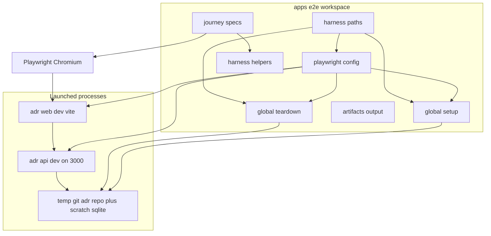

# Design Document: playwright-e2e

## Overview

**Purpose**: This feature delivers browser-level end-to-end (E2E) verification of
the assembled ADR Manager to the team maintaining it. It launches the real web
app and API as separate processes against a temporary git-backed ADR repository,
drives the core user journeys through a real browser, and captures screenshots of
key states.

**Users**: Developers and CI will run the suite to catch regressions in the real
web↔API wiring and rendered UI that unit/component tests cannot see, and to
obtain a visual record of key states.

**Impact**: Adds a new `apps/e2e` workspace (Playwright). The only change to
existing code is a small, declared touchpoint in the API composition root so
that similarity operates offline (via the existing fake embedding provider) when
no embedding API key is configured — which is also what makes the default
offline test mode a genuine runtime behavior rather than a test-only trick.

### Goals
- Auto-launch + tear down API + web + a temporary ADR repo for each run (Req 1).
- Run offline by default; optionally exercise the real embedding provider when a
  key is present, skipping (never failing) those specs otherwise (Req 2).
- Make similarity work offline via the fake provider when no key is set (Req 3).
- Cover the core journeys through the real UI (Req 4) and capture screenshots +
  on-failure traces (Req 5).
- Be single-command, headless/CI-runnable, self-contained, and repeatable (Req 6).

### Non-Goals
- Pixel-baseline visual-regression diffing (`toHaveScreenshot`).
- E2E for non-core panels (history, diff, compare, relations, folder move).
- Authoring a CI workflow file (the suite must be CI-runnable; the workflow is not).
- Changing ADR feature behavior, similarity algorithms, or provider internals.

## Boundary Commitments

### This Spec Owns
- The `apps/e2e` workspace: Playwright config, global setup/teardown, harness
  helpers, spec files, and the artifact output directory.
- Orchestration of the run: launching API + web, provisioning/seeding/cleaning
  the temporary git ADR repository and scratch SQLite location, and mode
  selection via `GEMINI_API_KEY`.
- The E2E assertions over the existing UI `data-testid` contract.

### Out of Boundary
- The ADR feature logic and UI (owned by `adr-manager`); E2E observes them.
- Embedding/similarity internals (`GeminiEmbeddingProvider`,
  `FakeEmbeddingProvider`, `SimilarityService`) — reused as-is.
- The `adr-manager` build/dev scripts themselves — invoked, not modified.
- CI workflow definition and pixel-baseline management.

### Allowed Dependencies
- New external dev dependency: `@playwright/test`.
- Existing workspace dependency `simple-git` for repo seeding (already used by
  `apps/web` tests).
- The existing `apps/api` and `apps/web` dev scripts (`pnpm --filter ... dev`).
- The existing UI `data-testid` selectors and the HTTP API contract.
- The one permitted production touchpoint: `apps/api/src/container.ts` provider
  selection (Req 3) — no other `adr-manager` file is modified.

### Revalidation Triggers
Changes in `adr-manager` that must force this spec to re-validate:
- Any change to the `data-testid` values used by the covered journeys.
- Changes to the HTTP API shape for create/update/tree/search/similarity.
- Changes to the API env contract (`ADR_REPO_PATH`, `SQLITE_PATH`,
  `GEMINI_API_KEY`, `PORT`) or to the Vite `/api` proxy target.
- Changes to the `EmbeddingProvider` port or to how `container.ts` selects a
  provider.
- Changes to the dev scripts (`@adr/api dev`, `@adr/web dev`).

## Architecture

### Existing Architecture Analysis
- pnpm monorepo; packages are `@adr/*`, ESM (`"type":"module"`), Node ≥20.
- API (Fastify) and web (Vite/React) run as independent dev processes; the web
  dev server proxies `/api` → `http://localhost:3000`. The API reads all runtime
  config from environment variables (`apps/api/src/config.ts`).
- The composition root (`container.ts`) is the single place that selects adapters;
  it currently hard-wires `GeminiEmbeddingProvider`. The `EmbeddingProvider` port
  already has a deterministic, network-free implementation (`FakeEmbeddingProvider`).
- Integration point to preserve: the API must listen on port 3000 so the
  browser's relative `/api/...` calls resolve through the Vite proxy.

### Architecture Pattern & Boundary Map



**Architecture Integration**:
- Selected pattern: **test harness orchestrating black-box processes**. The
  suite treats the application as an opaque pair of processes plus a browser; it
  never imports `apps/api`/`apps/web` source (the one production change lives in
  `adr-manager`, not in this workspace).
- Boundaries: orchestration (config + setup/teardown + paths) is separated from
  scenario logic (specs + helpers); the two communicate only through the running
  app and the shared run-scoped temp paths.
- Existing patterns preserved: `@adr/*` ESM workspace conventions; temp-git-repo
  seeding mirrors `App.test.tsx`; per-package test script kept out of `pnpm -r test`.
- New components rationale: each file below has exactly one responsibility (config,
  setup, teardown, paths, helpers, specs) so tasks are independently assignable.

### Dependency Direction

```
paths  →  (config, globalSetup, globalTeardown)
config →  globalSetup / globalTeardown / webServer
helpers → specs
```

- `paths` is the leaf: it computes run-scoped locations and imports nothing from
  the rest of the harness. `config` consumes `paths`. `globalSetup`/`globalTeardown`
  consume `paths`. `specs` consume `helpers`. No module imports "upward"; no spec
  imports config or setup. Helpers never import specs.

### Technology Stack

| Layer | Choice / Version | Role in Feature | Notes |
|-------|------------------|-----------------|-------|
| Test runner / browser | `@playwright/test` ^1.49 | Browser automation, `webServer` launch + readiness + teardown, screenshots, traces, mode gating | Apache-2.0; Node ≥20; Chromium project only |
| Repo seeding | `simple-git` ^3.25 (existing) | git init + initial commit of the temp ADR repo in global setup | Already a workspace dep |
| Runtime | Node ≥20 (container: 22), pnpm 9 | New `@adr/e2e` workspace package | ESM, `"type":"module"` |
| App under test | `@adr/api` dev (Fastify) + `@adr/web` dev (Vite) | Launched as `webServer` child processes | API pinned to `PORT=3000` |

## File Structure Plan

### Directory Structure
```
apps/e2e/
├── package.json                 # @adr/e2e; test:e2e script; @playwright/test + simple-git devDeps
├── playwright.config.ts         # projects, webServer[] (api+web), globalSetup/Teardown, reporter, artifact dir, timeouts
├── tsconfig.json                # extends ../../tsconfig.base.json
├── harness/
│   ├── paths.ts                 # run-scoped temp repo + sqlite paths + artifact dir (computed once); GEMINI key passthrough
│   ├── globalSetup.ts           # mkdir + git init + initial commit (decisions/.gitkeep); browser-binary precheck
│   ├── globalTeardown.ts        # rm -rf the run-scoped temp dir
│   └── helpers.ts               # shot(page,name); requiresGemini(); unique(name); small per-journey action helpers
└── tests/
    ├── adr-lifecycle.spec.ts    # Req 4.1, 4.2 — create→edit→save + 409 conflict recovery
    ├── tree.spec.ts             # Req 4.3 — tree browse + empty folder
    ├── search.spec.ts           # Req 4.4, 4.5 — search match + no-match
    └── similarity.spec.ts       # Req 4.6, 4.7 — ranked (offline via fake) + empty-scope; enabled-mode variant gated
```

### Modified Files
- `apps/api/src/container.ts` — select `FakeEmbeddingProvider` when
  `cfg.gemini.apiKey` is empty, else `GeminiEmbeddingProvider` (Req 3). Single
  expression change at the `embeddingProvider` construction site; no signature or
  interface change.
- `package.json` (root) — add an `e2e` script delegating to the `@adr/e2e`
  package (e.g. `pnpm --filter @adr/e2e test:e2e`). The root `test` script
  (`pnpm -r test`) is **not** changed, so `apps/e2e` must not define a `test`
  script that launches browsers.
- `pnpm-workspace.yaml` — already globs `apps/*`; no change required (noted to
  prevent an unnecessary edit).
- `.gitignore` — ignore the E2E artifact output directory.

## System Flows

### Run lifecycle (setup → mode selection → execute → teardown)

```mermaid
sequenceDiagram
    participant PW as Playwright runner
    participant Paths as harness paths
    participant GS as globalSetup
    participant API as api process
    participant WEB as web process
    participant T as journey specs
    participant GT as globalTeardown

    PW->>Paths: load run scoped paths
    PW->>GS: run global setup
    GS->>GS: mkdir, git init, initial commit, browser precheck
    PW->>API: start with ADR_REPO_PATH SQLITE_PATH GEMINI_API_KEY PORT 3000
    PW->>WEB: start vite, wait for url ready
    Note over API,WEB: bounded readiness wait, abort run on timeout
    PW->>T: run specs against baseURL
    T->>WEB: browser actions
    WEB->>API: proxied api calls
    T->>T: shot at key states; auto shot plus trace on failure
    PW->>GT: run global teardown
    GT->>GT: rm rf run scoped temp dir
```

**Key decisions**:
- **Mode** is decided by `GEMINI_API_KEY` in the harness process env, forwarded
  verbatim to the API child via `webServer.env`. Empty/absent → API uses the
  fake provider (Req 3) and enabled-only specs `test.skip` (Req 2.2, 2.3);
  present → API uses the real provider and enabled specs run (Req 2.2). The
  active mode is logged so results are interpretable (Req 2.5).
- **Readiness/abort**: each `webServer` entry declares a `url` and a bounded
  `timeout`; Playwright waits for readiness before any spec and aborts the run on
  timeout (Req 1.5).
- **Isolation**: one server set + one temp repo per run; specs use unique
  titles/folders (`unique()` helper) so the shared repo has no cross-test
  collisions (Req 6.5).

## Requirements Traceability

| Requirement | Summary | Components | Interfaces/Artifacts | Flows |
|-------------|---------|------------|----------------------|-------|
| 1.1 | Launch API + web before tests | playwright.config (webServer[]) | webServer command/url | Run lifecycle |
| 1.2 | Provision temp repo + scratch db | globalSetup, paths | fs + simple-git | Run lifecycle |
| 1.3 | Route web → API | playwright.config (baseURL), existing Vite proxy | PORT=3000 env | Run lifecycle |
| 1.4 | Tear down services + temp data | playwright.config, globalTeardown | process stop + rm -rf | Run lifecycle |
| 1.5 | Bounded readiness, abort if unready | playwright.config (webServer timeout/url) | readiness probe | Run lifecycle |
| 1.6 | Never touch developer repo/db | paths (os.tmpdir run dir) | run-scoped paths | Run lifecycle |
| 2.1 | Offline default via fake provider | container.ts, webServer.env | EmbeddingProvider | Mode selection |
| 2.2 | Enabled mode when key present | helpers.requiresGemini, webServer.env | test.skip gate | Mode selection |
| 2.3 | Skip (not fail) enabled specs w/o key | helpers.requiresGemini | test.skip | Mode selection |
| 2.4 | No outbound calls offline | container.ts (fake provider) | — | Mode selection |
| 2.5 | Report active mode | globalSetup/helpers (log) | console/reporter | Mode selection |
| 3.1–3.4 | Offline embedding fallback in API | container.ts | EmbeddingProvider selection | Mode selection |
| 4.1 | Create→edit→save persists | adr-lifecycle.spec, helpers | data-testid contract | — |
| 4.2 | Save-conflict surfaced + recovery | adr-lifecycle.spec, helpers | conflict-message/reload | — |
| 4.3 | Tree browse + empty folder | tree.spec | folder-node/adr-node | — |
| 4.4 | Search match shows results | search.spec | search-results | — |
| 4.5 | Search no-match empty state | search.spec | search-no-results | — |
| 4.6 | Ranked similarity (offline) | similarity.spec | similarity-results | — |
| 4.7 | Empty-scope similarity state | similarity.spec | similarity-empty | — |
| 5.1 | Screenshot key states | helpers.shot, all specs | artifact dir | — |
| 5.2 | Auto screenshot + trace on failure | playwright.config (use) | artifact dir | — |
| 5.3 | Artifacts to dedicated dir | playwright.config, paths | artifact dir | — |
| 5.4 | No pixel-baseline pass/fail | playwright.config (no toHaveScreenshot) | — | — |
| 6.1 | Single command runs offline suite | package.json scripts | test:e2e | — |
| 6.2 | Headless/CI-runnable | playwright.config (headless) | — | — |
| 6.3 | Clear failure if no browser runtime | globalSetup precheck | thrown error | Run lifecycle |
| 6.4 | No residual state after run | globalTeardown | rm -rf | Run lifecycle |
| 6.5 | Repeatable / isolated | helpers.unique, paths | unique names | — |

## Components and Interfaces

| Component | Layer | Intent | Req Coverage | Key Dependencies (P0/P1) | Contracts |
|-----------|-------|--------|--------------|--------------------------|-----------|
| playwright.config.ts | Orchestration | Projects, webServer launch, artifacts, timeouts | 1.1,1.3,1.4,1.5,5.2,5.3,5.4,6.2 | paths (P0) | Config |
| harness/paths.ts | Orchestration | Run-scoped temp + artifact locations, key passthrough | 1.2,1.6,5.3,6.4 | node os/path (P0) | State |
| harness/globalSetup.ts | Orchestration | Seed temp git repo; browser precheck; log mode | 1.2,2.5,6.3 | simple-git (P0), paths (P0) | Batch |
| harness/globalTeardown.ts | Orchestration | Remove run-scoped temp dir | 1.4,6.4 | paths (P0) | Batch |
| harness/helpers.ts | Scenario support | shot/requiresGemini/unique + action helpers | 2.2,2.3,5.1,6.5 | @playwright/test (P0) | Service |
| tests/*.spec.ts | Scenario | Drive journeys, assert states, screenshot | 4.1–4.7 | helpers (P0), UI testids (P0) | — |
| container.ts (modified) | API composition (adr-manager touchpoint) | Select provider by key presence | 2.1,2.4,3.1–3.4 | EmbeddingProvider (P0) | Service |

### Orchestration

#### harness/paths.ts

| Field | Detail |
|-------|--------|
| Intent | Compute run-scoped temp repo path, scratch SQLite path, and artifact dir once, plus expose the embedding key passthrough |
| Requirements | 1.2, 1.6, 5.3, 6.4 |

**Responsibilities & Constraints**
- Produce a unique run directory under the OS temp dir (e.g.
  `mkdtemp`-style base) so runs never collide and never touch a developer's
  `./data` repo (Req 1.6).
- Be the single source of truth for `repoPath`, `sqlitePath`, `artifactsDir`,
  imported by both config and setup/teardown so they act on the same locations.
- Pure value module: computes/returns paths and reads `process.env.GEMINI_API_KEY`;
  performs no filesystem mutation (mutation belongs to setup/teardown).

##### State Management
- State model: a frozen object `{ repoPath, sqlitePath, artifactsDir, geminiApiKey }`.
- Persistence & consistency: computed once at module load; identical across all
  importers in the same process.

**Implementation Notes**
- Integration: `sqlitePath` placed inside the run dir so teardown's single
  `rm -rf` removes both repo and index.
- Validation: paths absolute to avoid cwd ambiguity when child processes start.
- Risks: none significant; leaf module.

#### harness/globalSetup.ts

| Field | Detail |
|-------|--------|
| Intent | Provision the temp ADR repo and verify prerequisites before any server/spec runs |
| Requirements | 1.2, 2.5, 6.3 |

**Responsibilities & Constraints**
- Create the run dir; `git init`; set `user.name`/`user.email`; commit an initial
  `decisions/.gitkeep` (mirrors `App.test.tsx`) so the API serves a valid repo
  (Req 1.2).
- Pre-check that the Chromium runtime is installed; if not, throw a clear,
  actionable error so the run fails loudly rather than silently/false-passing
  (Req 6.3). Runs before `webServer` start.
- Log the active mode (offline vs real-provider) derived from `paths.geminiApiKey`
  (Req 2.5).

##### Batch / Job Contract
- Trigger: Playwright `globalSetup` hook (once per run, before webServers).
- Input/validation: `paths` locations; refuses to proceed if browser runtime
  precheck fails.
- Output/destination: a seeded git repo at `paths.repoPath`.
- Idempotency & recovery: operates on a fresh unique dir each run, so it is
  effectively idempotent across runs.

**Implementation Notes**
- Integration: must complete before `webServer` children read the repo; ordering
  guaranteed by Playwright (globalSetup precedes webServer).
- Validation: assert the initial commit exists before returning.
- Risks: git identity must be set or the initial commit fails — set it explicitly.

#### harness/globalTeardown.ts

| Field | Detail |
|-------|--------|
| Intent | Remove the run-scoped temp directory (repo + scratch SQLite) |
| Requirements | 1.4, 6.4 |

**Responsibilities & Constraints**
- `rm -rf` the run dir from `paths`, leaving no residual repo/db (Req 6.4).
- Services themselves are stopped by Playwright's `webServer` lifecycle (Req 1.4).

##### Batch / Job Contract
- Trigger: Playwright `globalTeardown` hook (once per run, after all specs).
- Input: `paths.repoPath`/run dir. Output: removed directory.
- Idempotency & recovery: `force: true` recursive removal; no error if already gone.

#### playwright.config.ts

| Field | Detail |
|-------|--------|
| Intent | Declare projects, launch + wait for API and web, set artifacts/timeouts, wire setup/teardown |
| Requirements | 1.1, 1.3, 1.4, 1.5, 5.2, 5.3, 5.4, 6.2 |

**Responsibilities & Constraints**
- `webServer`: an array of two entries — the API (`pnpm --filter @adr/api dev`,
  `env` = `{ ADR_REPO_PATH, SQLITE_PATH, GEMINI_API_KEY, PORT: "3000" }` from
  `paths`) and the web (`pnpm --filter @adr/web dev`). Each declares a `url` and
  a bounded `timeout`; `reuseExistingServer: false` in CI (Req 1.1, 1.5).
- `baseURL` = the web dev-server URL; the existing Vite proxy forwards `/api` to
  the API on 3000 (Req 1.3).
- `use`: `headless: true` (Req 6.2), `screenshot: "only-on-failure"`,
  `trace: "retain-on-failure"` (Req 5.2). No `expect.toHaveScreenshot`
  configuration / no snapshot pass-fail (Req 5.4).
- `outputDir` and reporter output under `paths.artifactsDir` (Req 5.3).
- `globalSetup`/`globalTeardown` point at the harness modules (Req 1.4).
- Projects: a single Chromium project (scope decision; cross-browser is not a
  requirement).

**Contracts**: Config
- Preconditions: `paths` resolved; ports free (API 3000).
- Postconditions: both servers ready before specs; artifacts under the dir.
- Invariants: API port equals the Vite proxy target (3000).

**Implementation Notes**
- Integration: `webServer.env` is the sole mode channel to the API; do not also
  hard-code a key.
- Risks: if 3000 is occupied the API won't bind — documented run prerequisite.

### Scenario support

#### harness/helpers.ts

| Field | Detail |
|-------|--------|
| Intent | Thin reusable scenario utilities shared by specs |
| Requirements | 2.2, 2.3, 5.1, 6.5 |

**Contracts**: Service

##### Service Interface
```typescript
import type { Page } from "@playwright/test";

/** Save a screenshot of a key state into the configured artifacts dir. */
export function shot(page: Page, name: string): Promise<void>;

/**
 * Gate an enabled-mode (real-provider) test: skips (does not fail) when
 * GEMINI_API_KEY is absent. Call at the top of an enabled-only test/describe.
 */
export function requiresGemini(): void;

/** Produce a per-test unique, filesystem/title-safe suffix for isolation. */
export function unique(prefix: string): string;
```
- Preconditions: `shot` requires a live `Page`; `requiresGemini` runs inside a
  Playwright test/`beforeEach` context (uses `test.skip`).
- Postconditions: `shot` writes one image under `artifactsDir`; `unique` returns
  a value not reused within the run.
- Invariants: helpers never import spec files; no cross-test shared mutable state.

**Implementation Notes**
- Integration: `requiresGemini` reads `process.env.GEMINI_API_KEY` (same channel
  the API received via `webServer.env`), keeping API mode and spec gating in sync.
- Validation: `unique` values must be safe as both ADR titles and folder path
  segments.
- Risks: over-abstraction — keep helpers minimal; per-page flows live in specs.

### Scenario specs (summary-only)

Each spec drives the real UI via stable `data-testid`s and screenshots key
states with `shot()`. They introduce no new boundary.

- **adr-lifecycle.spec.ts** (4.1, 4.2): set author → create (`title-input`,
  `create-button`) → reach `adr-editor-edit` → edit `body-textarea` → `save-button`
  → assert `save-success-message` (shot). Then force a 409 via a concurrent API
  write (direct HTTP through Playwright's request context using the same `/api`
  origin), save again → assert `conflict-message` (shot) → `reload-latest-button`
  → `save-button` → `save-success-message` (shot).
- **tree.spec.ts** (4.3): assert `folder-tree` and seeded nodes render; create a
  uniquely-named folder (`new-folder-path-input`, `create-folder-button`) and
  assert its `folder-node-<path>` renders with no `adr-node-*` child (empty-folder
  state) (shot).
- **search.spec.ts** (4.4, 4.5): create+edit+save an ADR with a unique token
  (search index populates only on save), search it → `search-results` +
  `search-result-<id>` (shot); search a guaranteed-absent token → `search-no-results`
  (shot).
- **similarity.spec.ts** (4.6, 4.7): place two ADRs in one unique folder → open
  similarity tab → `similarity-results` (offline ranked via fake provider) (shot);
  place one ADR alone in a unique folder → `similarity-empty` (shot). An enabled-
  mode variant of the ranked case is guarded by `requiresGemini()`.

### API composition touchpoint

#### container.ts (modified — adr-manager touchpoint)

| Field | Detail |
|-------|--------|
| Intent | Select the embedding provider by API-key presence |
| Requirements | 2.1, 2.4, 3.1, 3.2, 3.3, 3.4 |

**Responsibilities & Constraints**
- When `cfg.gemini.apiKey` is empty, construct `FakeEmbeddingProvider`; otherwise
  construct `GeminiEmbeddingProvider(cfg.gemini.model, cfg.gemini.apiKey)`.
- No change to `ContainerConfig`, `Container`, or any service wiring; the
  selected instance is still assigned to `embeddingProvider` and passed to
  `SimilarityService` exactly as today (Req 3.4).
- The fake provider performs no network I/O, satisfying offline behavior
  (Req 2.4, 3.3).

**Contracts**: Service (internal composition; no public signature change)

**Implementation Notes**
- Integration: this is the single permitted edit outside `apps/e2e`. Because it
  changes a file owned by `adr-manager`, the change is intentionally minimal and
  behavior-preserving when a key *is* present.
- Validation: `apps/api/src/container.test.ts` should gain/extend coverage
  asserting provider selection for empty vs non-empty key.
- Risks: dimension difference (fake 64 vs Gemini 768) is internally consistent
  per run — vectors are computed and cached by the same provider, so cosine
  ranking remains valid offline.

## Error Handling

### Error Strategy
Fail fast and loudly at run boundaries; treat the app's own error states as
*expected assertions*, not harness errors.

### Error Categories and Responses
- **Harness/prerequisite errors**: missing browser runtime → `globalSetup`
  throws an actionable error and the run fails (Req 6.3); server not ready within
  timeout → Playwright aborts before specs (Req 1.5); port 3000 busy → API fails
  to bind (documented prerequisite).
- **Expected application states** (not failures): save conflict
  (`conflict-message`), no-results (`search-no-results`), empty-scope
  (`similarity-empty`) are asserted as success criteria of their journeys.
- **Mode mismatch**: enabled-only specs without a key are skipped, not failed
  (Req 2.3).

### Monitoring
- The Playwright HTML/list reporter plus on-failure screenshots and traces under
  `artifactsDir` are the diagnostic record (Req 5.2, 5.3). Active mode is logged
  at setup (Req 2.5).

## Testing Strategy

This feature *is* a test capability; "testing" it means proving each journey runs
and gates correctly.

### E2E/UI Tests (the deliverable)
- Create→edit→save persists and shows `save-success-message` (4.1).
- Save-conflict surfaces `conflict-message`, and reload→save recovers (4.2).
- Tree renders, and a newly created folder shows as an empty folder node (4.3).
- Keyword search shows ranked results (4.4) and a no-results state (4.5).
- Folder-scoped similarity shows ranked results offline (4.6) and empty-scope
  state (4.7).

### Integration / Mode Tests
- Offline mode: full suite passes with `GEMINI_API_KEY` unset and makes no
  outbound embedding calls (2.1, 2.4).
- Enabled mode: with a key set, the `requiresGemini()`-gated variant runs;
  without a key it reports skipped, not failed (2.2, 2.3).
- Teardown leaves no residual repo/SQLite/process (6.4).

### Unit Tests (touchpoint)
- `container.test.ts`: provider selection is `FakeEmbeddingProvider` when key is
  empty and `GeminiEmbeddingProvider` when set (3.1, 3.2).

### Prerequisite / Runtime
- Missing Chromium → `globalSetup` fails with an actionable message (6.3).
- Single-command offline run via `pnpm --filter @adr/e2e test:e2e` (6.1), headless
  (6.2).

## Security Considerations
- `GEMINI_API_KEY` is read from the environment and forwarded only to the API
  child process via `webServer.env`; it is never written to disk, committed, or
  captured in screenshots/traces. Offline mode requires no secret at all.
